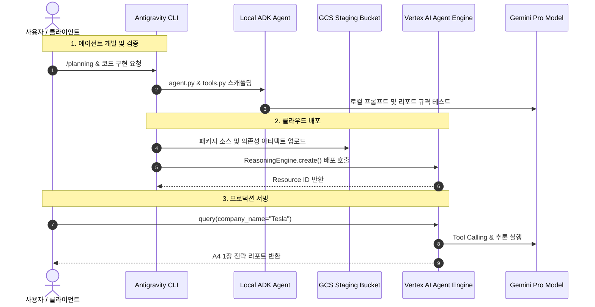

# Antigravity 기반 ADK 에이전트 개발 및 GCP Agent Engine 배포 실습

본 스킬은 **Antigravity CLI**를 활용하여 **Google Cloud ADK (Agent Development Kit)** 기반의 지능형 AI 에이전트를 구축하고, **GCP Vertex AI Agent Engine (Reasoning Engine)**에 패키징·배포 및 서빙 테스트를 수행하는 교육용 실습 Markdown 문서(`.md`)를 생성하기 위한 표준 가이드라인 및 프레임워크를 제공합니다.

---

## 1. 개요 및 학습 목표

- **ADK 기반 에이전트 개발:** 특정 기업명을 입력받아 시장 동향, 경쟁 분석, SWOT 및 실행 제언을 포함하는 **A4 1장 분량의 고품질 비즈니스 전략 리포트**를 생성하는 에이전트를 구현합니다.
- **커스텀 툴(Tools) 및 프롬프트 엔지니어링:** 웹 검색 및 기업 데이터 요약 도구를 바인딩하고 정형화된 출력 포맷(1-Page Executive Summary)을 강제하는 시스템 프롬프트를 설계합니다.
- **GCP Agent Engine (Reasoning Engine) 포팅:** 로컬에서 검증된 ADK 에이전트를 GCP Vertex AI Reasoning Engine 런타임에 안전하게 패키징하고 배포합니다.
- **클라우드 인퍼런스 및 모니터링:** 배포된 클라우드 리소스 ID를 기반으로 원격 질의(Query)를 수행하고 Cloud Logging을 통한 실행 트레이스를 분석합니다.

---

## 2. 사전 준비 사항 (Prerequisites)

- **GCP 계정 및 권한:** Vertex AI Admin, Storage Admin 권한을 보유한 Google Cloud 계정
- **GCP 리소스:** Google Cloud Project ID, Cloud Storage (GCS) Staging 버킷, 지원 리전 (예: `us-central1`, `asia-northeast1`)
- **로컬 환경:** Python 3.10+ 활성화 가상환경, Antigravity CLI 최신 버전, Google Cloud SDK (`gcloud`)
- **API 활성화:**
  - `aiplatform.googleapis.com` (Vertex AI API)
  - `cloudbuild.googleapis.com` (Cloud Build API)
  - `storage.googleapis.com` (Cloud Storage API)
  - `artifactregistry.googleapis.com` (Artifact Registry API)

---

## 3. 실습 문서 표준 구조 (Document Structure Framework)

본 스킬을 통해 생성되는 `agy_agent.md` 문서는 아래의 체계적인 8단계 엔드투엔드(End-to-End) 핸즈온 실습 구조를 준수해야 합니다:

### [1] 비즈니스 시나리오 및 에이전트 설계 (Scenario & Architecture)

- **에이전트 역할:** 기업 비즈니스 전략 수석 애널리스트 (Chief Strategy Analyst)
- **입력:** 대상 기업명 (예: `Google`, `Tesla`, `Samsung Electronics`)
- **출력:** A4 1장(약 800~1,200 단어) 분량의 구조화된 비즈니스 전략 보고서 (Markdown/PDF-Ready)
  - 1. Executive Summary (경영 요약)
  - 2. Market & Industry Trends (시장 및 기술 트렌드)
  - 3. Core Competencies & SWOT (핵심 역량 및 SWOT 분석)
  - 4. Strategic Recommendations & Action Plan (단기/중장기 전략 제언)
- **전체 아키텍처 다이어그램 (Mermaid Sequence Diagram)**

### [2] GCP 환경 설정 및 인증 (GCP Setup & Auth)

- `gcloud auth login` 및 `gcloud auth application-default login`
- GCP 프로젝트 설정 (`gcloud config set project <PROJECT_ID>`)
- 필수 API 활성화 및 Staging용 GCS 버킷 생성 (`gcloud storage buckets create`)

### [3] 프로젝트 스캐폴딩 및 의존성 구성 (Scaffolding & Dependencies)

- 실습 전용 디렉터리 구조 설정 (`src/`, `tests/`, `config/`)
- `requirements.txt` 작성 (`google-adk`, `google-cloud-aiplatform`, `pydantic`, `python-dotenv`)

### [4] ADK 에이전트 핵심 로직 구현 (Agent Implementation)

- **도구 정의 (`tools.py`):** 기업 관련 정보 수집 및 지표 파싱을 위한 커스텀 함수 작성
- **에이전트 클래스 (`agent.py`):**
  - Vertex AI Gemini 모델 초기화 (예: `gemini-1.5-pro` 또는 `gemini-2.0-flash`)
  - A4 1장 규격 준수를 위한 엄격한 System Instruction 정의
  - Reasoning Engine 인터페이스 (`set_up()`, `query(company_name: str)`) 구현

### [5] 로컬 환경 실행 및 응답 검증 (Local Testing)

- Antigravity 세션 내에서 에이전트 인스턴스 로컬 테스트 (`adk run` 또는 테스트 스크립트 실행)
- 실제 기업명 입력 후 A4 1장 규격 리포트 생성 여부 및 서식 검증

### [6] GCP Vertex AI Agent Engine (Reasoning Engine) 배포 (Deployment)

- Vertex AI SDK (`vertexai.preview.reasoning_engines.ReasoningEngine.create`)를 사용한 원격 배포 스크립트(`deploy.py`) 작성
- Staging GCS 버킷 업로드, 의존성 패키징 및 리소스 배포 실행
- 생성된 Resource Name (`projects/.../locations/.../reasoningEngines/...`) 확인

### [7] 프로덕션 서빙 테스트 및 모니터링 (Production Inference & Monitoring)

- 배포된 Remote Reasoning Engine에 `query()` 호출 테스트 (`test_remote.py`)
- GCP Cloud Logging 및 Vertex AI 콘솔에서 Tool Calling 트레이스 및 실행 로그 확인

### [8] 문제 해결 및 모범 사례 (Troubleshooting & Best Practices)

- GCS 버킷 권한(IAM) 문제 해결
- 패키징 의존성 충돌 및 Cloud Build 빌드 실패 해결
- LLM 출력 토큰 한도 초과 및 A4 규격 초과 방지 팁

---

## 4. 실습 단계별 표준 템플릿 및 예시 가이드

````markdown
# Antigravity 기반 ADK 비즈니스 전략 에이전트 개발 및 GCP Agent Engine 배포 실습 (agy_agent)

## 1. 개요

본 실습에서는 Google Cloud ADK를 사용하여 기업명을 입력하면 A4 1장 분량의 비즈니스 전략 리포트를 자동 생성하는 AI 에이전트를 구현하고, 이를 GCP Vertex AI Agent Engine에 배포하여 운영하는 과정을 다룹니다.

## 2. 전체 아키텍처


````

## 3. 핵심 코드 구성 예시

### [1] 에이전트 진입점 (`src/agent.py`)

```python
import vertexai
from vertexai.preview import reasoning_engines
from pydantic import BaseModel, Field

class StrategyReport(BaseModel):
    company_name: str = Field(description="분석 대상 기업명")
    executive_summary: str = Field(description="경영 핵심 요약 (2-3문장)")
    market_trends: str = Field(description="시장 및 기술 환경 트렌드")
    swot_analysis: str = Field(description="강점, 약점, 기회, 위협 요약")
    strategic_recommendations: str = Field(description="단기 및 중장기 실행 제언")

class BusinessStrategyAgent:
    """기업 비즈니스 전략 분석을 수행하는 ADK 기반 에이전트"""

    def __init__(self, model_name: str = "gemini-1.5-pro-002"):
        self.model_name = model_name

    def set_up(self):
        """런타임 초기화 및 모델 연결"""
        import vertexai
        from vertexai.generative_models import GenerativeModel
        self.model = GenerativeModel(
            model_name=self.model_name,
            system_instruction=[
                "당신은 글로벌 톱티어 컨설팅 펌의 수석 비즈니스 전략가입니다.",
                "제시된 기업에 대해 객관적 데이터에 기반하여 A4 1장 분량의 핵심 전략 리포트를 작성하세요.",
                "보고서는 간결하고 명확해야 하며 실행 가능한 인사이트(Actionable Insights)를 제공해야 합니다."
            ]
        )

    def query(self, company_name: str) -> str:
        """기업명을 입력받아 정형화된 비즈니스 전략 리포트를 반환합니다."""
        prompt = f"다음 기업에 대한 A4 1장 비즈니스 전략 리포트를 마크다운으로 작성해주세요: {company_name}"
        response = self.model.generate_content(prompt)
        return response.text
```

### [2] Agent Engine 배포 스크립트 (`deploy.py`)

```python
import vertexai
from vertexai.preview import reasoning_engines
from src.agent import BusinessStrategyAgent

PROJECT_ID = "YOUR_PROJECT_ID"
LOCATION = "us-central1"
STAGING_BUCKET = "gs://your-staging-bucket"

vertexai.init(project=PROJECT_ID, location=LOCATION, staging_bucket=STAGING_BUCKET)

print("Deploying Business Strategy Agent to Vertex AI Agent Engine...")
remote_agent = reasoning_engines.ReasoningEngine.create(
    BusinessStrategyAgent(),
    requirements=[
        "google-cloud-aiplatform>=1.60.0",
        "pydantic>=2.0.0"
    ],
    display_name="business-strategy-agent-demo",
    description="A4 1장 기업 비즈니스 전략 리포트 생성 에이전트"
)

print(f"Deployment Complete! Resource Name: {remote_agent.resource_name}")
```

```

```
