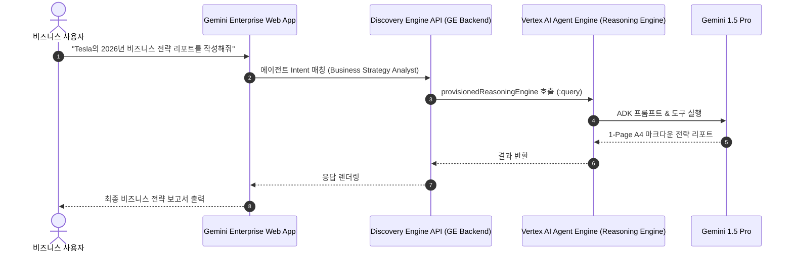

# Antigravity 기반 Agent Engine과 Gemini Enterprise (GE) 등록 실습

본 스킬은 **Antigravity CLI**를 활용하여 `agy_agent` 실습에서 GCP Vertex AI Agent Engine(Reasoning Engine)에 배포한 **ADK 비즈니스 전략 분석 에이전트**를 Google Cloud 공식 **Gemini Enterprise (Discovery Engine API / Console)**의 `adkAgentDefinition` 규격을 통해 네이티브 커스텀 에이전트로 등록하고, 사내 비즈니스 사용자가 Gemini Enterprise 웹 앱에서 직접 활용할 수 있도록 실습 가이드 Markdown 문서(`.md`)를 생성하기 위한 표준 가이드라인 및 프레임워크를 제공합니다.

---

## 1. 개요 및 학습 목표

- **Gemini Enterprise 공식 ADK 에이전트 등록 아키텍처 이해:** Agent Engine(Reasoning Engine)에 배포된 리소스 경로(`projects/.../reasoningEngines/...`)를 Gemini Enterprise의 `adkAgentDefinition.provisionedReasoningEngine` 필드로 직접 매핑하여 연계하는 방식을 학습합니다.
- **Google Cloud 콘솔 및 Discovery Engine REST API 활용:**
  - **콘솔 방식:** Google Cloud Console > Gemini Enterprise > 앱 > 에이전트 추가 > Agent Runtime 커스텀 에이전트 등록
  - **REST API 방식:** Discovery Engine API(`.../assistants/default_assistant/agents`) 호출을 통한 자동화 스크립트 작성
- **승인(Authorization) 리소스 구성 (선택사항):** 에이전트가 사용자를 대신하여 Google Cloud 리소스에 접근할 때 필요한 OAuth 2.0 승인 리소스 생성 및 바인딩 방법을 이해합니다.
- **사내 사용자와 에이전트 공유 및 E2E 테스트:** Gemini Enterprise 웹 앱에서 등록된 비즈니스 전략 에이전트의 동작을 확인하고 A4 1장 보고서 렌더링 결과를 검증합니다.

---

## 2. 사전 준비 사항 (Prerequisites)

- **배포된 Agent Engine 리소스:** `agy_agent` 실습을 통해 Vertex AI Reasoning Engine에 배포 완료된 Resource Name  
  _(예: `projects/<PROJECT_ID>/locations/<REGION>/reasoningEngines/<REASONING_ENGINE_ID>`)_
- **Gemini Enterprise 앱 (App ID):** Google Cloud Discovery Engine / Gemini Enterprise에 생성된 앱 ID (`APP_ID`)
- **GCP 권한:**
  - Discovery Engine Admin 또는 Editor (`roles/discoveryengine.admin` 또는 `roles/discoveryengine.editor`)
  - Vertex AI User (`roles/aiplatform.user`)
- **로컬 개발 도구:** Antigravity CLI, `gcloud` CLI, Python 3.10+ 가상환경, `curl` / `jq`

---

## 3. 실습 문서 표준 구조 (Document Structure Framework)

본 스킬을 통해 생성되는 `agy_ge.md` 문서는 아래의 체계적인 7단계 연동 실습 구조를 준수해야 합니다:

### [1] 공식 연동 개요 및 전체 아키텍처 (Architecture & Overview)

- Gemini Enterprise 어시스턴트와 Agent Runtime(Reasoning Engine)의 네이티브 연결 구조
- 사용자의 프롬프트 ➜ Gemini Enterprise Intent 라우터 ➜ `provisionedReasoningEngine` 호출 ➜ 1-Page A4 전략 리포트 렌더링 흐름
- **Mermaid 시퀀스 다이어그램 (Sequence Diagram)**

### [2] 사전 요구 환경 및 대상 리소스 식별 (Prerequisites & Environment)

- GCP 프로젝트 정보 (`PROJECT_ID`, `PROJECT_NUMBER`, `ENDPOINT_LOCATION`)
- Gemini Enterprise App ID (`APP_ID`) 및 배포된 Reasoning Engine Resource Path 준비

### [3] 승인 리소스 구성 (선택사항: Authorization Resource Setup)

- 사용자 위임(OAuth 2.0) 접근이 필요한 경우 Discovery Engine `authorizations` 생성 방법 안내

### [4] REST API를 통한 ADK 에이전트 등록 (`register_agent.sh` / `register_agent.py`)

- `POST https://{ENDPOINT_LOCATION}-discoveryengine.googleapis.com/v1alpha/projects/{PROJECT_ID}/locations/global/collections/default_collection/engines/{APP_ID}/assistants/default_assistant/agents`
- 페이로드 작성:
  ```json
  {
    "displayName": "Business Strategy Analyst",
    "description": "특정 기업명을 입력받아 A4 1장 분량의 핵심 비즈니스 전략 리포트를 자동 생성하는 ADK 에이전트",
    "icon": {
      "uri": "https://fonts.gstatic.com/s/i/short-term/release/googlex/gemini_sparkle/default/24px.svg"
    },
    "adkAgentDefinition": {
      "provisionedReasoningEngine": {
        "reasoningEngine": "projects/{PROJECT_ID}/locations/{LOCATION}/reasoningEngines/{RESOURCE_ID}"
      }
    }
  }
  ```

### [5] Google Cloud 콘솔 UI를 통한 등록 절차 안내 (Console Walkthrough)

- 콘솔 UI 단계별 스크린샷 가이드: Gemini Enterprise > 에이전트 > 에이전트 추가 > Agent Runtime 커스텀 에이전트

### [6] 등록된 에이전트 조회, 공유 및 E2E 대화형 테스트 (E2E Verification)

- 등록된 에이전트 목록 조회 API (`GET .../assistants/default_assistant/agents`)
- Gemini Enterprise 웹 앱(`https://gemini.google.com/enterprise` 또는 Workspace)에서 대화형 호출 및 A4 1장 보고서 수신 테스트

### [7] 문제 해결 및 모범 사례 (Troubleshooting)

- `400 Bad Request` (스키마 불일치, Reasoning Engine 경로 오류)
- `403 PermissionDenied` (Discovery Engine API 권한, 서비스 계정 IAM 누락)

---

## 4. 실습 단계별 표준 템플릿 및 예시 가이드

````markdown
# Antigravity 기반 Agent Engine과 Gemini Enterprise (GE) 등록 실습 (agy_ge)

## 1. 개요

GCP Vertex AI Agent Engine에 배포된 ADK 비즈니스 전략 에이전트를 Discovery Engine API 규격을 사용하여 Gemini Enterprise에 등록하고 비즈니스 사용자에게 서비스하는 과정을 실습합니다.

## 2. 연동 아키텍처


````

## 3. 핵심 등록 스크립트 예시 (`register_agent.sh`)

```bash
#!/bin/bash
set -e

PROJECT_ID="your-project-id"
PROJECT_NUMBER=$(gcloud projects describe $PROJECT_ID --format="value(projectNumber)")
ENDPOINT_LOCATION="global"  # 또는 us, eu
LOCATION="us-central1"
APP_ID="your-gemini-enterprise-app-id"
RESOURCE_ID="your-reasoning-engine-id"

ACCESS_TOKEN=$(gcloud auth print-access-token)

curl -X POST \
  -H "Authorization: Bearer ${ACCESS_TOKEN}" \
  -H "Content-Type: application/json" \
  -H "X-Goog-User-Project: ${PROJECT_ID}" \
  "https://${ENDPOINT_LOCATION}-discoveryengine.googleapis.com/v1alpha/projects/${PROJECT_ID}/locations/global/collections/default_collection/engines/${APP_ID}/assistants/default_assistant/agents" \
  -d '{
    "displayName": "Business Strategy Analyst",
    "description": "특정 기업에 대한 시장 동향, SWOT 분석 및 전략 제언이 담긴 A4 1장 비즈니스 전략 리포트를 작성하는 AI 에이전트",
    "icon": {
      "uri": "https://fonts.gstatic.com/s/i/short-term/release/googlex/gemini_sparkle/default/24px.svg"
    },
    "adkAgentDefinition": {
      "provisionedReasoningEngine": {
        "reasoningEngine": "projects/'"${PROJECT_ID}"'/locations/'"${LOCATION}"'/reasoningEngines/'"${RESOURCE_ID}"'"
      }
    }
  }'
```

```

```
