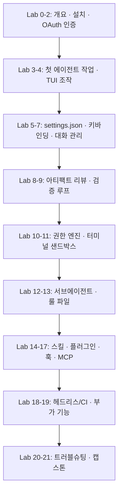
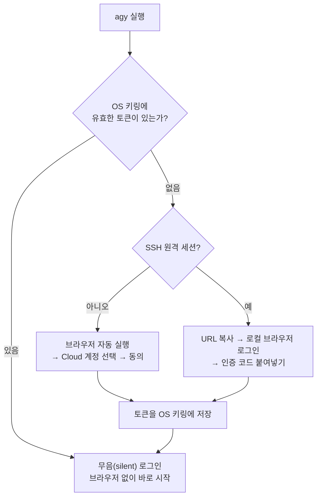
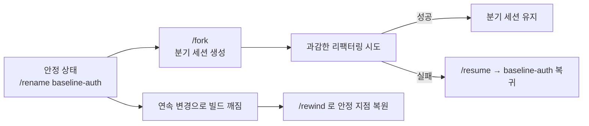
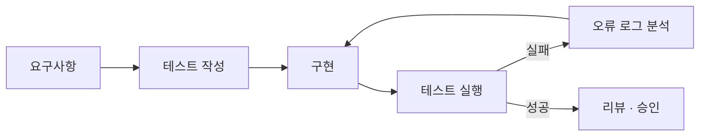
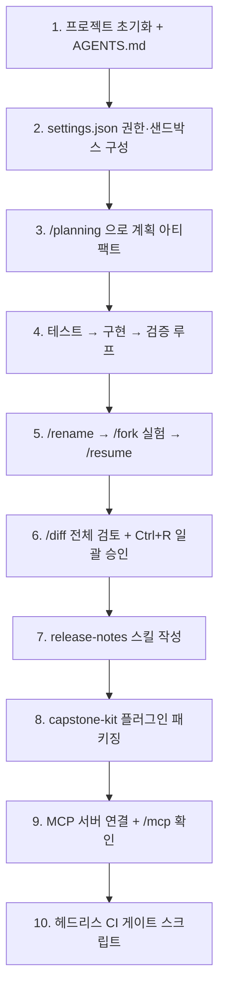

# Antigravity CLI(`agy`) 개발자 핸즈온 랩 (agy_lab)

> [!IMPORTANT]
> **OS별 표기 규칙**
>
> 이 문서의 모든 실행 예제는 아래 세 가지 표기 중 하나를 따릅니다. 자신의 환경에 해당하는 블록만 실행하세요.
>
> | 표기                     | 의미                                                       |
> | ------------------------ | ---------------------------------------------------------- |
> | **macOS / Linux**        | macOS(zsh) 및 Linux(bash) 터미널에서 실행                  |
> | **Windows (PowerShell)** | Windows PowerShell 5.1+ 또는 PowerShell 7.x 에서 실행      |
> | **모든 OS 동일**         | agy TUI 내부 입력·프롬프트·파일 내용 등 OS와 무관하게 동일 |
>
> - **WSL2 / Git Bash** 사용자는 `macOS / Linux` 블록을 그대로 사용하세요.
> - Windows에서는 `python3` → `python`, `curl` → `curl.exe`, `/` → `\` 로 바뀌는 점에 유의하세요.

> **기준 버전:** Antigravity CLI **v1.2.0** (공식 문서 `antigravity.google/docs/cli/*` 2026-09 스냅샷)
> **대상:** Antigravity CLI를 처음 접하는 개발자부터 CI/CD 자동화까지 적용하려는 시니어 엔지니어
> **소요 시간:** 전체 완주 기준 약 6~8시간 (Lab 0~9 기본 과정 3시간, Lab 10~18 심화 3시간, Lab 21 캡스톤 2시간)

Antigravity CLI는 백그라운드 자동 업데이트가 동작합니다. 문서의 명령/단축키가 다르게 동작하면 **가장 먼저 `?` 또는 `/help`로 현재 버전의 실제 동작을 확인**하세요.

---

## 0. 이 문서 사용법

### 0-1. 문서 구성 규칙

모든 Lab은 동일한 4단계 패턴으로 구성되어 있습니다.

| 섹션                | 의미                                                   |
| ------------------- | ------------------------------------------------------ |
| 🎯 **목표**         | 이 Lab을 끝내면 할 수 있게 되는 것                     |
| 🧪 **실습**         | 그대로 복사해 실행할 수 있는 명령/설정 예제            |
| ✅ **확인**         | 다음 Lab으로 넘어가기 전 반드시 통과해야 할 체크리스트 |
| 💡 **팁 / ⚠️ 주의** | 현업 적용 노하우, 흔히 겪는 함정                       |

> [!IMPORTANT]
> 명령어, 설정 키, 파일 경로, 단축키 이름은 **번역하지 말고 원문 그대로** 입력해야 합니다. 한글로 바꾸면 동작하지 않습니다.

### 0-2. 학습 로드맵



### 0-3. 목차

| Lab                                           | 주제                                          | 핵심 산출물               | 난이도 |
| --------------------------------------------- | --------------------------------------------- | ------------------------- | ------ |
| [0](#lab-0-antigravity-cli-개요)              | Antigravity CLI 개요                          | 도구 선택 기준            | ★      |
| [1](#lab-1-설치)                              | 설치                                          | `agy` 바이너리            | ★      |
| [2](#lab-2-인증-cloud-계정-oauth-로그인)      | 인증 (Cloud 계정 OAuth)                       | 로그인된 조직 계정 세션   | ★      |
| [3](#lab-3-첫-번째-에이전트-작업)             | 첫 번째 에이전트 작업                         | `agy-demo/main.py`        | ★      |
| [4](#lab-4-tui-기본-조작)                     | TUI 기본 조작                                 | 프롬프트 조작 숙련        | ★      |
| [5](#lab-5-설정-settingsjson)                 | 설정(settings.json)                           | 개인화 설정 파일          | ★★     |
| [6](#lab-6-키바인딩)                          | 키바인딩                                      | `keybindings.json`        | ★★     |
| [7](#lab-7-대화-관리)                         | 대화 관리                                     | rewind / fork / resume    | ★★     |
| [8](#lab-8-아티팩트-리뷰와-diff)              | 아티팩트 리뷰와 Diff                          | 검토·승인 워크플로        | ★★     |
| [9](#lab-9-탐색--계획--실행-그리고-검증-루프) | 탐색→계획→실행 / 검증 루프                    | 테스트 주도 에이전트 작업 | ★★     |
| [10](#lab-10-권한permissions-엔진)            | 권한 엔진                                     | allow / ask / deny 정책   | ★★★    |
| [11](#lab-11-터미널-샌드박스)                 | 터미널 샌드박스                               | OS 수준 격리              | ★★★    |
| [12](#lab-12-서브에이전트와-백그라운드-작업)  | 서브에이전트 · 백그라운드 작업                | 병렬 작업 운영            | ★★★    |
| [13](#lab-13-룰-파일-geminimd--agentsmd)      | 룰 파일                                       | 프로젝트 규칙             | ★★     |
| [14](#lab-14-스킬-커스텀-슬래시-명령)         | 스킬                                          | 커스텀 슬래시 명령        | ★★     |
| [15](#lab-15-플러그인)                        | 플러그인                                      | 배포 가능한 번들          | ★★★    |
| [16](#lab-16-훅hooks)                         | 훅(Hooks)                                     | 사전/사후 자동화          | ★★★    |
| [17](#lab-17-mcp-서버-연결)                   | MCP 서버 연결                                 | 외부 도구 연동            | ★★★    |
| [18](#lab-18-헤드리스-모드와-ci)              | 헤드리스 모드와 CI                            | 파이프라인 연동           | ★★★★   |
| [19](#lab-19-부가-기능)                       | 부가 기능                                     | 작업 환경 개선            | ★      |
| [20](#lab-20-문제-해결-런북)                  | 문제 해결                                     | 트러블슈팅 런북           | ★★     |
| [21](#lab-21-캡스톤-실습)                     | 캡스톤 실습                                   | 종합 과제                 | ★★★★   |
| [부록 A~D](#부록-a-슬래시-명령-전체-레퍼런스) | 레퍼런스 / 경로 지도 / 문서 불일치 / 치트시트 | —                         | —      |

### 0-4. 사전 준비물

**macOS / Linux**

```bash
# 이 랩을 진행하기 전 아래 도구가 설치되어 있는지 확인합니다.
git --version        # 2.30 이상 권장
python3 --version    # 3.10 이상 권장
jq --version         # 헤드리스(Lab 18) 실습에 필수  → macOS: brew install jq
curl --version
```

**Windows (PowerShell)**

```powershell
# 이 랩을 진행하기 전 아래 도구가 설치되어 있는지 확인합니다.
git --version        # 2.30 이상 권장
python --version    # 3.10 이상 권장
jq --version         # 헤드리스(Lab 18) 실습에 필수  → Windows: winget install jqlang.jq
curl.exe --version
```

| 항목          | 요구사항                                                          |
| ------------- | ----------------------------------------------------------------- |
| OS            | macOS 12+, Linux(glibc 2.31+), Windows 10/11                      |
| 터미널        | iTerm2 / Ghostty / Windows Terminal 권장 (트루컬러 + OSC 52 지원) |
| 계정          | 조직 Google Cloud 계정 (Gemini Enterprise 사용 권한 할당 필요)    |
| 실습 디렉터리 | 이 저장소에서는 `lab/` 하위에 실습 산출물을 생성합니다            |

---

## Lab 0. Antigravity CLI 개요

🎯 **목표:** CLI가 무엇이고, 언제 Antigravity 2.0(데스크톱)을 대신 사용해야 하는지 판단할 수 있다.

Antigravity CLI(`agy`)는 Antigravity의 경량 **TUI(Terminal User Interface)** 입니다. Antigravity 2.0 데스크톱과 **동일한 에이전트 하네스(agent harness)** 를 사용하므로 다단계 추론, 다중 파일 편집, 도구 호출, 대화 이력 기능이 100% 동일하게 제공됩니다.

### 0-1. CLI vs 데스크톱 비교

| 항목          | Antigravity CLI (`agy`)               | Antigravity 2.0 (Desktop)             |
| ------------- | ------------------------------------- | ------------------------------------- |
| 주 인터페이스 | 키보드 중심 TUI                       | 비주얼 데스크톱 에디터/IDE            |
| 성능 오버헤드 | 거의 없음, 매우 가벼움                | 일반 데스크톱 IDE 수준                |
| 워크플로 초점 | 빠른 로컬 반복, SSH, 헤드리스 자동화  | 전체 프로젝트 관리, 시각적 작업공간   |
| 탐색 방식     | 범용 키보드 단축키                    | 마우스 + 멀티 패널                    |
| 원격 사용성   | SSH, tmux 등 멀티플렉서 네이티브 지원 | 로컬 작업공간 또는 원격 개발 컨테이너 |
| CI/CD 통합    | ⭐ 헤드리스 모드로 네이티브 지원      | 제한적                                |

### 0-2. 두 제품 간 연동

- **공유 에이전트 하네스**: 추론·도구 사용 개선이 양쪽에 동시 반영됩니다.
- **설정 동기화**: 환경설정·권한·보안 설정이 자동 동기화됩니다. 한쪽에서 권한 규칙을 바꾸면 다른 쪽에도 즉시 반영됩니다.
- **대화 내보내기**: 터미널 세션이 복잡해지면 대화를 Antigravity 2.0으로 넘겨 시각적 편집기에서 이어갈 수 있습니다.

### 0-3. Gemini CLI 사용자라면

첫 실행 온보딩 화면에서 기존 **Gemini CLI의 확장·스킬·설정을 1회 자동 가져오기**할 수 있습니다. 가져오기 이력은 `~/.gemini/antigravity-cli/import_manifest.json` (Windows: `%USERPROFILE%\.gemini\antigravity-cli\import_manifest.json`)에 기록됩니다.

✅ **확인**

- [ ] "SSH로 접속한 원격 서버에서 에이전트를 돌려야 한다면?" → **CLI** 라고 답할 수 있다.
- [ ] "GitHub Actions에서 PR 리뷰를 자동화한다면?" → **CLI 헤드리스 모드** 라고 답할 수 있다.

---

## Lab 1. 설치

🎯 **목표:** OS별로 `agy`를 설치하고 PATH에서 실행되는지 확인한다.

### 1-1. macOS / Linux

기본 설치 경로는 `~/.local/bin/agy` 입니다.

**macOS / Linux**

```bash
curl -fsSL https://antigravity.google/cli/install.sh | bash
```

**Windows (PowerShell)**

```powershell
irm https://antigravity.google/cli/install.ps1 | iex
```

설치 로그 마지막에 PATH 추가 안내가 출력됩니다. 새 터미널을 열어 적용하세요.

**macOS / Linux**

```bash
# 현재 셸에 즉시 반영 (zsh 기준)
source ~/.zshrc
```

**Windows (PowerShell)**

```powershell
# 현재 셸에 즉시 반영 (zsh 기준)
# Windows 터미널을 재시작하거나 $env:Path 를 갱신합니다.
```

### 1-2. Windows

기본 설치 경로는 `C:\Users\<username>\AppData\Local\agy\bin` 입니다.

PowerShell:

```powershell
irm https://antigravity.google/cli/install.ps1 | iex
```

명령 프롬프트(CMD):

```powershell
curl -fsSL https://antigravity.google/cli/install.cmd -o install.cmd && install.cmd && del install.cmd
```

### 1-3. 설치 플래그

| 플래그           | 효과                                                            |
| ---------------- | --------------------------------------------------------------- |
| `--skip-aliases` | 셸 프로필의 기존 `agy`/`antigravity` 별칭을 정리·갱신하지 않음  |
| `--skip-path`    | 셸 프로필에 `PATH` 추가를 하지 않음 (PATH를 직접 관리하는 경우) |

파이프 설치 시 플래그를 전달하려면 `bash -s --` 를 사용합니다.

**macOS / Linux**

```bash
curl -fsSL https://antigravity.google/cli/install.sh | bash -s -- --skip-path
```

**Windows (PowerShell)**

```powershell
$env:AGY_CLI_SKIP_PATH="1"
irm https://antigravity.google/cli/install.ps1 | iex
```

### 1-4. 설치 확인

**macOS / Linux**

```bash
which agy          # Windows: where agy
agy --help
agy --version      # 버전 확인
```

**Windows (PowerShell)**

```powershell
which agy          # Windows: where agy
agy --help
agy --version      # 버전 확인
```

출력 예시:

**모든 OS 동일**

```text
/Users/<username>/.local/bin/agy
```

`agy: command not found`가 나오면 → [Lab 20-1. PATH 설정](#20-1-path-설정)으로 이동합니다.

### 1-5. 자동 업데이트 제어

CLI에는 백그라운드 자가 업데이터가 내장되어 있습니다(15분 디바운스). **버전 고정이 필요한 CI 환경에서는 반드시 비활성화**하세요.

**macOS / Linux**

```bash
# 일회성
export AGY_CLI_DISABLE_AUTO_UPDATE=true

# 영구 적용
echo 'export AGY_CLI_DISABLE_AUTO_UPDATE=true' >> ~/.zshrc
```

**Windows (PowerShell)**

```powershell
# 일회성
$env:AGY_CLI_DISABLE_AUTO_UPDATE="true"

# 영구 적용
# Windows에서는 시스템 환경 변수에 영구 등록하거나 $PROFILE 에 추가합니다.
```

✅ **확인**

- [ ] 새 터미널을 열어도 `agy --help`가 정상 실행된다.
- [ ] `which agy` 결과 경로를 메모해 두었다.

---

## Lab 2. 인증 (Cloud 계정 OAuth 로그인)

🎯 **목표:** 조직의 Google Cloud 계정으로 OAuth 로그인하고, 세션 상태를 확인하고, 필요할 때 계정을 전환·해제한다.

> [!NOTE]
> Antigravity CLI는 **브라우저 OAuth 로그인 한 가지 방식**만으로 인증합니다. 별도의 키 발급이나 설정 파일 수정이 필요 없습니다. 조직 계정에 Gemini Enterprise 사용 권한(라이선스)이 할당되어 있어야 하며, 할당 여부는 Google Cloud 관리자에게 확인하세요.

### 2-1. 로그인 흐름



토큰은 OS 키링에 안전하게 저장되므로, 두 번째 실행부터는 로그인 과정 없이 즉시 시작됩니다.

| OS      | 토큰 저장소                                     |
| ------- | ----------------------------------------------- |
| macOS   | Apple Keychain                                  |
| Linux   | Secret Service / D-Bus (GNOME Keyring, KWallet) |
| Windows | Credential Manager                              |

### 2-2. 로컬 PC에서 로그인

**macOS / Linux**

```bash
agy
```

**Windows (PowerShell)**

```powershell
agy
```

1. 브라우저가 자동으로 열립니다.
2. **조직 Cloud 계정**(`your-name@your-company.com`)을 선택합니다.
3. 권한 동의 화면에서 **허용**을 클릭합니다.
4. 터미널로 돌아오면 인증이 완료되어 TUI가 시작됩니다.

> [!TIP]
> 브라우저에 개인 Gmail 세션이 남아 있으면 그 계정이 자동 선택될 수 있습니다. 계정 선택 화면에서 **반드시 회사 계정을 고르세요.**

**로그인 확인**

TUI 헤더에 조직 계정 이메일이 표시되면 성공입니다.

**모든 OS 동일**

```text
/usage       # 조직 플랜의 모델 쿼터가 보이면 정상 인증된 상태입니다
```

### 2-3. 원격 SSH 서버에서 로그인

SSH 환경은 자동 감지되어 **브라우저 없이 인증 코드를 주고받는 방식**으로 전환됩니다.

**macOS / Linux**

```bash
ssh developer@remote-server
agy
```

**Windows (PowerShell)**

```powershell
ssh developer@remote-server
agy
```

1. 원격 터미널에 출력된 **인증 URL을 복사**합니다.
2. **로컬 PC 브라우저**에 붙여넣고 조직 Cloud 계정으로 로그인합니다.
3. 브라우저에 표시된 **영숫자 인증 코드를 복사**합니다.
4. 원격 터미널 프롬프트에 붙여넣으면 인증이 완료됩니다.

### 2-4. 로그아웃 및 계정 전환

**모든 OS 동일**

```text
/logout
```

키링에 저장된 인증 프로필이 삭제됩니다. 다시 `agy`를 실행하면 로그인 화면부터 시작합니다.

**다른 계정으로 전환하려면**

1. `/logout` 실행
2. 브라우저에서 기존 Google 세션 로그아웃 (또는 시크릿 창 사용)
3. `agy` 재실행 후 원하는 계정 선택

### 2-5. 트러블슈팅

| 증상                             | 원인                                      | 해결                                           |
| -------------------------------- | ----------------------------------------- | ---------------------------------------------- |
| 개인 Gmail 계정으로 로그인됨     | 브라우저의 기존 세션이 자동 선택됨        | `/logout` 후 재로그인하며 계정 전환            |
| "관리자가 승인하지 않은 앱" 표시 | 조직 OAuth 앱 승인 목록에 미등록          | 관리자에게 Antigravity CLI 승인 요청           |
| `403 PERMISSION_DENIED`          | 계정에 Gemini Enterprise 사용 권한 미할당 | 관리자에게 라이선스 할당 요청                  |
| `reauthentication required`      | 조직 세션 수명 정책으로 토큰 만료         | `/logout` 후 재로그인                          |
| 키링 잠김 / D-Bus 오류로 멈춤    | 헤드리스 환경에서 키링 미기동             | [Lab 20-2](#20-2-키링-권한)                    |
| SSH에서 브라우저가 열리지 않음   | 정상 동작 (수동 코드 방식)                | [2-3](#2-3-원격-ssh-서버에서-로그인) 절차 사용 |

✅ **확인**

- [ ] TUI 헤더에 **조직 Cloud 계정 이메일**이 표시된다.
- [ ] `/usage`에서 조직 플랜의 모델 쿼터가 조회된다.
- [ ] CLI를 껐다 켜도 로그인 과정 없이 바로 시작된다(키링 무음 로그인).
- [ ] `/logout` 후 재로그인까지 성공했다.

---

## Lab 3. 첫 번째 에이전트 작업

🎯 **목표:** 에이전트에게 코드를 생성시키고 **리뷰 → 승인 → 실행 → 종료** 전체 사이클을 1회 완주한다.

### 3-1. 작업공간 생성 및 실행

**macOS / Linux**

```bash
mkdir -p ~/antigravity-lab/agy-demo && cd ~/antigravity-lab/agy-demo
agy
```

**Windows (PowerShell)**

```powershell
New-Item -ItemType Directory -Force -Path "$HOME\antigravity-lab\agy-demo" | Out-Null; Set-Location "$HOME\antigravity-lab\agy-demo"
agy
```

### 3-2. 첫 프롬프트

프롬프트 박스에 입력 후 `Enter`:

**모든 OS 동일**

```text
Write a simple python script to fetch web page text
```

에이전트가 작업공간을 읽고(비어 있음) → 스크립트 생성 계획을 세우는 과정이 실시간으로 표시됩니다.

### 3-3. 아티팩트 리뷰

생성 완료 알림이 뜨면 `Ctrl+R` → **Artifact Review** 화면이 열립니다.

| 키        | 동작                            |
| --------- | ------------------------------- |
| `↑` / `↓` | 파일 목록 이동 (`main.py` 선택) |
| —         | 전체 내용과 diff 확인           |
| `y`       | 생성 승인                       |
| `n`       | 거절                            |
| `A`       | 전체 아티팩트 일괄 승인         |
| `Esc`     | 패널 닫기                       |

### 3-4. 실행 검증

**모든 OS 동일**

```text
Run the python script and show me the output
```

에이전트가 `python3 main.py` 실행을 제안하면 `y` → 출력이 터미널에 스트리밍됩니다.

### 3-5. 종료

- `Ctrl+D` (프롬프트가 비어 있을 때) 또는 `/exit`
- 종료 시 **이 세션을 재개하는 정확한 명령**이 출력됩니다. 반드시 메모해 두세요.

**모든 OS 동일**

```text
# 출력 예시
To resume this conversation, run:
  agy --conversation 0f3c1a7e-...
```

✅ **확인**

- [ ] `~/antigravity-lab/agy-demo/main.py`가 존재한다.
- [ ] 스크립트 실행 결과를 터미널에서 확인했다.
- [ ] 종료 시 출력된 재개 명령을 저장했다.

---

## Lab 4. TUI 기본 조작

🎯 **목표:** 프롬프트 입력의 생산성 기능을 손에 익힌다.

### 4-1. 필수 조작 12선

| 기능                       | 방법                                 | 실습 예제                        |
| -------------------------- | ------------------------------------ | -------------------------------- |
| 파일 경로 자동완성         | `@` 입력 → 경로 제안 오버레이        | `@main.py 에 예외처리 추가해줘`  |
| 셸 명령 직접 실행          | 프롬프트 맨 앞에 `!`                 | `!ls -la`                        |
| 도움말/명령 목록           | `?` 또는 `/help`                     | —                                |
| 슬래시 명령 자동완성       | `/` 입력 후 `Tab`                    | `/re` + `Tab` → `/resume`        |
| 여러 줄 입력               | `Shift+Enter`, `Ctrl+J`, `Alt+Enter` | 요구사항을 줄 단위로 작성        |
| 외부 에디터로 작성         | `Ctrl+G` (`$EDITOR` 실행)            | 긴 프롬프트 작성                 |
| 이미지/미디어 붙여넣기     | `Ctrl+V`                             | UI 버그 스크린샷 첨부            |
| 프롬프트 비우기            | `Esc` `Esc` (스트리밍 중이 아닐 때)  | —                                |
| 진행 중인 턴 중단          | `Esc`                                | 에이전트가 엉뚱한 방향일 때 즉시 |
| 도구 추론 상세 펼치기/접기 | `Ctrl+O`                             | —                                |
| 화면 정리                  | `Ctrl+L`                             | —                                |
| 마지막 응답 복사           | `/copy`                              | —                                |

### 4-2. 컨텍스트 관리 명령

| 명령                         | 용도                                  | 실습                                 |
| ---------------------------- | ------------------------------------- | ------------------------------------ |
| `/context`                   | 컨텍스트 사용량 시각화                | 긴 세션 후 실행해 보기               |
| `/btw <질문>`                | 메인 대화를 방해하지 않는 곁가지 질문 | `/btw 이 프로젝트 파이썬 버전 뭐야?` |
| `/open <path>`               | 파일을 외부 에디터로 열기             | `/open main.py`                      |
| `/add-dir <path>`            | 작업공간에 디렉터리 추가              | 모노레포의 다른 패키지 추가          |
| `/config` → `verbosity: low` | 도구 호출 출력 줄이기                 | —                                    |

### 4-3. 실습 시나리오

**모든 OS 동일**

```text
# 1) 셸 명령으로 현재 파일 확인
!ls -la

# 2) @ 로 파일 지정해 개선 요청
@main.py 에 timeout 파라미터와 예외처리를 추가해줘

# 3) 응답 도중 방향이 틀리면 Esc 로 중단

# 4) 곁가지 질문
/btw requests 와 httpx 중 어느 쪽이 더 가벼워?

# 5) 컨텍스트 사용량 확인
/context
```

💡 **팁:** `Ctrl+O`로 도구 추론 로그를 펼쳐 두면 에이전트가 **어떤 파일을 왜 읽었는지** 보입니다. 잘못된 파일을 읽고 있다면 `Esc`로 즉시 멈추고 `@`로 정확한 경로를 지정하세요.

✅ **확인**

- [ ] `@`로 파일을 지정해 봤다.
- [ ] `!`로 셸 명령을 실행해 봤다.
- [ ] `Esc`로 진행 중인 턴을 중단해 봤다.
- [ ] `/context`로 컨텍스트 사용량을 확인했다.

---

## Lab 5. 설정 (settings.json)

🎯 **목표:** 설정 파일 구조와 우선순위를 이해하고 나만의 설정을 구성한다.

### 5-1. 설정 위치와 편집 방법

| 방법           | 설명                                                                                 |
| -------------- | ------------------------------------------------------------------------------------ |
| 파일 직접 편집 | `~/.gemini/antigravity-cli/settings.json` (Windows: `%USERPROFILE%\.gemini\antigravity-cli\settings.json`) (평문 JSON)                                |
| UI 편집        | `/config` 또는 `/settings` → 전체 화면 오버레이. 항목 선택 시 **즉시 디스크에 저장** |

> [!NOTE]
> **실행 플래그가 설정보다 우선합니다.** `--sandbox`, `--dangerously-skip-permissions` 같은 플래그로 실행하면 설정 화면에 `Sandbox Mode on overridden by --sandbox` 처럼 출처가 표시되며, 디스크 설정을 바꿔도 **재시작 전까지는 플래그가 적용**됩니다.

### 5-2. 설정 키 전체 목록

| 키                        | 타입    | 기본값              | 값 / 설명                                                                                                                                |
| ------------------------- | ------- | ------------------- | ---------------------------------------------------------------------------------------------------------------------------------------- |
| `colorScheme`             | string  | `"terminal"`        | `light`, `solarized light`, `colorblind-friendly light`, `dark`, `solarized dark`, `colorblind-friendly dark`, `tokyo night`, `terminal` |
| `altScreenMode`           | string  | `"default"`         | `default`(자동), `always`(대체 화면 강제), `never`(인라인 강제)                                                                          |
| `toolPermission`          | string  | `"request-review"`  | `request-review`, `proceed-in-sandbox`, `always-proceed`, `strict` → [Lab 10](#lab-10-권한permissions-엔진)                              |
| `artifactReviewPolicy`    | string  | `"asks-for-review"` | `asks-for-review`, `agent-decides`, `always-proceed` → [Lab 8](#lab-8-아티팩트-리뷰와-diff)                                              |
| `notifications`           | boolean | `false`             | 작업 완료 시 데스크톱 알림 + 터미널 벨                                                                                                   |
| `showTips`                | boolean | `true`              | 생성 중 팁 표시                                                                                                                          |
| `showFeedbackSurvey`      | boolean | `true`              | 주기적 피드백 설문                                                                                                                       |
| `editor`                  | string  | `"auto"`            | 외부 에디터: `auto`(`$EDITOR`), `vim`, `emacs`, 사용자 지정                                                                              |
| `editorMode`              | string  | `"default"`         | 프롬프트 편집 방식: `default` 또는 `vim`(모달 편집)                                                                                      |
| `vimInsertFirst`          | boolean | `false`             | Vim 모드를 Insert로 시작, `Enter`로 제출. `editorMode: vim` 필요                                                                         |
| `allowNonWorkspaceAccess` | boolean | `false`             | 파일 도구가 Git/작업공간 루트 밖에 접근 허용                                                                                             |
| `enableTerminalSandbox`   | boolean | `false`             | 에이전트 명령을 OS 격리 환경에서 실행 → [Lab 11](#lab-11-터미널-샌드박스)                                                                |
| `useG1Credits`            | boolean | `false`             | (외부 빌드 전용) 플랜 쿼터 소진 시 개인 AI 크레딧 사용                                                                                   |
| `enableTelemetry`         | boolean | `true`              | 지표·크래시 로그 전송                                                                                                                    |
| `verbosity`               | string  | `"high"`            | `high`(생각·도구 출력 전체), `low`(최소 진행 표시)                                                                                       |
| `runningLightSpeed`       | string  | `"medium"`          | 진행 애니메이션: `fast`, `medium`, `slow`, `off`                                                                                         |
| `modelProvider`           | string  | (없음)              | (고급) `gemini` 지정 시 계정 세션 대신 API 키/게이트웨이 사용. 이 랩에서는 사용하지 않음                                                 |
| `permissions`             | object  | (없음)              | 세분화된 allow/ask/deny 규칙 → [Lab 10](#lab-10-권한permissions-엔진)                                                                    |

### 5-3. 실습: 권장 시작 설정

**macOS / Linux**

```bash
# 백업 후 적용
cp ~/.gemini/antigravity-cli/settings.json ~/.gemini/antigravity-cli/settings.json.bak 2>/dev/null

cat > ~/.gemini/antigravity-cli/settings.json <<'EOF'
{
    "colorScheme": "tokyo night",
    "altScreenMode": "always",
    "toolPermission": "request-review",
    "artifactReviewPolicy": "asks-for-review",
    "notifications": true,
    "enableTerminalSandbox": true,
    "verbosity": "high",
    "runningLightSpeed": "medium"
}
EOF

cat ~/.gemini/antigravity-cli/settings.json
```

**Windows (PowerShell)**

```powershell
# 백업 후 적용
cp $HOME/.gemini/antigravity-cli/settings.json $HOME/.gemini/antigravity-cli/settings.json.bak 2>/dev/null

@'
{
    "colorScheme": "tokyo night",
    "altScreenMode": "always",
    "toolPermission": "request-review",
    "artifactReviewPolicy": "asks-for-review",
    "notifications": true,
    "enableTerminalSandbox": true,
    "verbosity": "high",
    "runningLightSpeed": "medium"
}
'@ | Set-Content -Encoding UTF8 $HOME\.gemini\antigravity-cli\settings.json

Get-Content $HOME\.gemini\antigravity-cli\settings.json
```

### 5-4. 모델 선택

**모든 OS 동일**

```text
/model            # TUI에서 기본 추론 모델 선택 (세션 간 유지)
```

**macOS / Linux**

```bash
agy models        # 셸에서 사용 가능한 모델 슬러그 목록 확인
```

**Windows (PowerShell)**

```powershell
agy models        # 셸에서 사용 가능한 모델 슬러그 목록 확인
```

✅ **확인**

- [ ] `/config`에서 `colorScheme`을 바꾸고 `cat`으로 파일에 반영된 것을 확인했다.
- [ ] `agy models` 출력에서 실제 모델 슬러그를 확인했다.

---

## Lab 6. 키바인딩

🎯 **목표:** 기본 단축키를 익히고 하나 이상 재정의한다.

### 6-1. 기본 규칙

| 항목           | 내용                                                   |
| -------------- | ------------------------------------------------------ |
| 파일           | `~/.gemini/antigravity-cli/keybindings.json` (Windows: `%USERPROFILE%\.gemini\antigravity-cli\keybindings.json`)           |
| 대화형 편집    | `/keybindings`                                         |
| 초기화         | `keybindings.json` 삭제                                |
| 다중 매핑      | 한 액션에 여러 키 매핑 가능                            |
| 비활성화       | 빈 배열 `[]`                                           |
| 부분 손상 허용 | 파일 일부가 깨져도 유효한 부분만 적용, 나머지는 기본값 |
| 비활성화 불가  | `cli.exit`, `cli.enter`                                |

### 6-2. 실습: 단축키 재정의

**macOS / Linux**

```bash
cat > ~/.gemini/antigravity-cli/keybindings.json <<'EOF'
{
    "prompt.open_review": ["ctrl+r", "f2"],
    "prompt.toggle_trajectory": ["ctrl+o"],
    "cli.clear_screen": ["ctrl+l"]
}
EOF
```

**Windows (PowerShell)**

```powershell
@'
{
    "prompt.open_review": ["ctrl+r", "f2"],
    "prompt.toggle_trajectory": ["ctrl+o"],
    "cli.clear_screen": ["ctrl+l"]
}
'@ | Set-Content -Encoding UTF8 $HOME\.gemini\antigravity-cli\keybindings.json
```

`agy` 재실행 후 `F2`로도 아티팩트 리뷰 패널이 열리는지 확인합니다.

### 6-3. 원복

**macOS / Linux**

```bash
rm ~/.gemini/antigravity-cli/keybindings.json
```

**Windows (PowerShell)**

```powershell
Remove-Item $HOME\.gemini\antigravity-cli\keybindings.json
```

전역 / 프롬프트 / 탐색 / 확인 키 전체 표는 **[부록 B. 기본 키바인딩](#부록-b-기본-키바인딩)** 을 참조하세요.

✅ **확인**

- [ ] `/keybindings`로 단축키 하나를 바꾸고 동작을 확인했다.
- [ ] 파일을 삭제해 기본값으로 되돌렸다.

---

## Lab 7. 대화 관리

🎯 **목표:** 실패한 시도를 버리지 않고 되감고, 분기하고, 복귀하는 흐름을 익힌다.

### 7-1. 명령 요약

| 명령             | 별칭                       | 용도                                                      |
| ---------------- | -------------------------- | --------------------------------------------------------- |
| `/rewind`        | `/undo`                    | 대화 이력을 이전 체크포인트로 되감기                      |
| `/fork`          | `/branch`                  | 현재 대화를 별도 작업공간의 병렬 세션으로 복제            |
| `/resume`        | `/switch`, `/conversation` | 대화 선택기로 이전 세션 재개/전환 (`←`/`→`로 페이지 이동) |
| `/rename <name>` | —                          | 현재 대화 이름 변경                                       |
| `/clear`         | `/new`                     | 화면·컨텍스트 초기화, 새 대화 시작                        |

### 7-2. 실습 시나리오: 안전한 실험



**모든 OS 동일**

```text
# 1) 안정적인 상태에서 이름 지정
/rename baseline-auth

# 2) 분기 생성
/fork

# 3) 분기 세션에서 과감한 실험
인증 로직을 JWT 기반으로 전면 리팩터링해줘

# 4) 실패 시 원래 세션으로 복귀
/resume     → baseline-auth 선택

# 5) 원래 세션에서 빌드가 깨졌다면
/rewind     → 안정 지점 선택
```

### 7-3. 종료 후 재개

CLI 종료 시 해당 세션을 재개하는 명령이 자동 출력됩니다. 헤드리스에서는 `--continue` 또는 `--conversation <ID>`를 사용합니다([Lab 18-5](#18-5-대화-이어가기)).

✅ **확인**

- [ ] `/rename`으로 대화 이름을 지정했다.
- [ ] fork한 세션과 원래 세션을 `/resume`으로 오갔다.
- [ ] `/rewind`로 이전 체크포인트에 복귀했다.

---

## Lab 8. 아티팩트 리뷰와 Diff

🎯 **목표:** "투명성을 통한 신뢰" 모델 — 에이전트의 계획·변경을 검토하고 승인한다.

### 8-1. 리뷰 도구

| 도구                 | 진입                      | 기능                                        |
| -------------------- | ------------------------- | ------------------------------------------- |
| Artifact Review 패널 | `Ctrl+R` 또는 `/artifact` | `y` 승인, `n` 거절, `A` 전체 일괄 승인      |
| 대화형 Diff 뷰어     | `/diff`                   | 변경사항·턴·커밋 단위 확인 및 에이전트 조향 |
| 외부 에디터 열기     | `/open <path>`            | 결과 파일을 선호 에디터로 바로 열기         |

### 8-2. 리뷰 정책 (`artifactReviewPolicy`)

| 값                       | 동작                     | 권장 상황                |
| ------------------------ | ------------------------ | ------------------------ |
| `asks-for-review` (기본) | 코드 작성 전 항상 확인   | 학습, 중요한 코드베이스  |
| `agent-decides`          | 에이전트가 동적으로 판단 | 익숙한 저위험 작업       |
| `always-proceed`         | 확인 없이 진행           | 일회성 스크래치 프로젝트 |

**macOS / Linux**

```bash
# 설정 예시
python3 - <<'EOF'
import json, pathlib
p = pathlib.Path.home()/".gemini/antigravity-cli/settings.json"
cfg = json.loads(p.read_text()) if p.exists() else {}
cfg["artifactReviewPolicy"] = "asks-for-review"
p.write_text(json.dumps(cfg, indent=4))
print(p.read_text())
EOF
```

**Windows (PowerShell)**

```powershell
# 설정 예시
python -c @'
import json, pathlib
p = pathlib.Path.home()/".gemini/antigravity-cli/settings.json"
cfg = json.loads(p.read_text()) if p.exists() else {}
cfg["artifactReviewPolicy"] = "asks-for-review"
p.write_text(json.dumps(cfg, indent=4))
print(p.read_text())
'@
```

### 8-3. 실습: 거절 → 피드백 → 재승인

**모든 OS 동일**

```text
# 1) 변경 요청
@main.py 를 비동기(async) 방식으로 리팩터링해줘

# 2) Ctrl+R 로 리뷰 패널 진입 → n 으로 거절

# 3) 거절 이유를 프롬프트로 전달
asyncio 대신 httpx.AsyncClient 를 쓰고, 기존 동기 함수도 호환되게 남겨줘

# 4) 수정본을 Ctrl+R → y 로 승인

# 5) 전체 변경 검토
/diff
```

✅ **확인**

- [ ] 하나의 변경을 `n`으로 거절하고 이유를 전달해 수정본을 받아 `y`로 승인했다.
- [ ] `/diff`로 턴 단위 변경 이력을 확인했다.

---

## Lab 9. 탐색 → 계획 → 실행, 그리고 검증 루프

🎯 **목표:** 에이전트 정확도를 가장 크게 끌어올리는 두 가지 습관을 실습한다.

### 9-1. 검증 루프 (가장 효과적인 단일 기법)

에이전트에게 **스스로 확인할 수단**(테스트, 빌드, 린터, 포매터)을 주면 정확도가 극적으로 올라갑니다.



**절차**

1. 테스트 스위트가 있는지 확인한다.
2. 없으면 **테스트부터** 작성시킨다.
3. 구현 후 로컬 테스트 명령을 실행하도록 지시한다.
4. 에이전트가 결과를 보고 자동으로 반복 수정하는 것을 지켜본다.

**프롬프트 예제**
**모든 OS 동일**

```text
Implement feature X in main.py. Run `pytest -q` afterward to verify, and fix until all tests pass.
```

**모든 OS 동일**

```text
tests/test_fetcher.py 를 먼저 작성해줘. fetch_text() 가 200/404/timeout 세 경우를 처리하는지 검증해야 해.
테스트가 실패하는 걸 확인한 뒤에 구현하고, 마지막에 `python -m pytest -q` 를 실행해서 결과를 보여줘.
```

### 9-2. 탐색 → 계획 → 실행

| 단계              | 지시 내용                                                       |
| ----------------- | --------------------------------------------------------------- |
| **탐색(Explore)** | 코드 변경 전에 구조·정의 위치를 설명하게 한다                   |
| **계획(Plan)**    | 대상 파일·의존성·변경 로직을 담은 구현 계획 아티팩트를 요청한다 |
| **실행(Execute)** | 계획을 승인한 뒤 편집을 적용시킨다                              |

**모든 OS 동일**

```text
# 1단계: 탐색
Explore how our router resolves `/docs/:page`. 관련 파일과 함수 정의 위치를 정리해줘. 아직 코드는 수정하지 마.

# 2단계: 계획
`/docs/best-practices` 라우트를 추가하는 구현 계획을 아티팩트로 작성해줘.
대상 파일, 의존성, 변경 로직, 테스트 전략을 포함해.

# 3단계: 실행 (계획 승인 후)
계획대로 구현하고 `npm test` 로 검증해줘.
```

### 9-3. 작업 난이도별 모드 선택

| 명령                                          | 용도                                                 | 사용 시점                                     |
| --------------------------------------------- | ---------------------------------------------------- | --------------------------------------------- |
| `/planning`                                   | 복잡한 엔지니어링 작업을 위한 다중 턴 계획 생성 모드 | 신규 기능 설계, 대규모 리팩터링               |
| `/fast`                                       | 추론 계획을 건너뛰는 빠른 모드                       | 오타 수정, 단순 치환                          |
| `/boost <task>`                               | 다중 에이전트 심층 추론                              | 까다로운 버그, 레이스 컨디션, 알고리즘 최적화 |
| `/teamwork-preview <task>` (별칭 `/teamwork`) | 장기 프로젝트용 협업 에이전트 팀 (유료 플랜)         | 다중 모듈 동시 개발                           |
| `/codesearch`                                 | 코드 검색                                            | 심볼·사용처 추적                              |

### 9-4. 실습 시나리오 (전체 루프)

**macOS / Linux**

```bash
mkdir -p ~/antigravity-lab/verify-loop && cd ~/antigravity-lab/verify-loop
python3 -m venv .venv && source .venv/bin/activate
pip install pytest
agy
```

**Windows (PowerShell)**

```powershell
New-Item -ItemType Directory -Force -Path "$HOME\antigravity-lab\verify-loop" | Out-Null; Set-Location "$HOME\antigravity-lab\verify-loop"
python -m venv .venv && source .venv/bin/activate
pip install pytest
agy
```

**모든 OS 동일**

```text
/planning
할 일(todo) 항목을 추가/조회/완료 처리하는 TodoStore 클래스를 만들려고 해.
1) tests/test_todo_store.py 를 먼저 작성하고
2) todo_store.py 를 구현한 뒤
3) `python -m pytest -q` 로 검증해줘. 실패하면 통과할 때까지 수정해.
```

💡 **팁:** 프롬프트에 **정확한 검증 명령**(`pytest -q`, `npm run lint`, `go test ./...`)을 문자열 그대로 넣어주세요. 에이전트가 명령을 추측하느라 낭비하는 턴이 사라집니다.

✅ **확인**

- [ ] 테스트 없는 함수에 대해 "테스트 먼저 → 구현 → 테스트 실행" 흐름을 끝까지 돌렸다.
- [ ] `/planning` 모드로 계획 아티팩트를 받아 승인했다.
- [ ] `/fast`와 `/boost`의 응답 속도/깊이 차이를 체감했다.

---

## Lab 10. 권한(Permissions) 엔진

🎯 **목표:** 자율성과 안전 사이의 균형을 정책으로 설계한다.

### 10-1. 전역 프리셋 (`toolPermission` 또는 `/permissions`)

| 프리셋                  | 동작                                                     | 권장 상황                 |
| ----------------------- | -------------------------------------------------------- | ------------------------- |
| `request-review` (기본) | 쓰기·bash·웹 도구 실행 전 확인                           | 일반 개발                 |
| `proceed-in-sandbox`    | 샌드박스 안에서 자동 진행, 위험 명령만 확인              | 반복 작업 자동화          |
| `always-proceed`        | 확인 없음 (`--dangerously-skip-permissions`와 동일 효과) | 격리된 일회성 컨테이너    |
| `strict`                | 읽기가 아닌 모든 작업마다 확인                           | 프로덕션 코드베이스, 학습 |

**모든 OS 동일**

```text
/permissions      # TUI에서 프리셋 전환
```

### 10-2. 세분화 규칙: `action(target)`

`settings.json`의 `permissions` 아래 세 목록으로 평가합니다.

> [!IMPORTANT]
> **우선순위: Deny > Ask > Allow**
> 예: `ask`에 `command(*)`, `allow`에 `command(git)`이 있으면 **ask가 이겨서** git도 매번 확인합니다.

| 액션          | 대상 형식                      | 매칭 방식                                                         | 기본값                          |
| ------------- | ------------------------------ | ----------------------------------------------------------------- | ------------------------------- |
| `read_file`   | `/path`, `dir`, `*`            | 절대경로 또는 작업공간 기준 상대경로, 하위 재귀                   | Ask (작업공간 내부는 자동 허용) |
| `write_file`  | `/path`, `*`                   | read_file과 동일, 같은 경로의 read 권한 포함                      | Ask (작업공간 내부는 자동 허용) |
| `read_url`    | `domain`, `*`                  | 호스트 + 서브도메인 (`google.com` ⊃ `mail.google.com`), 경로 무시 | Ask                             |
| `execute_url` | `domain`, `*`                  | 웹 요소 조작(클릭·입력), 브라우저 워크플로                        | Ask                             |
| `command`     | `prefix`, `regex:pattern`, `*` | 기본은 단어 단위 접두사 리터럴 매칭                               | Ask                             |
| `unsandboxed` | `prefix`, `regex:pattern`, `*` | 샌드박스 켜진 상태에서 격리 밖 실행 허용                          | Ask                             |
| `mcp`         | `server/tool`, `server/*`, `*` | 특정 MCP 도구 또는 서버 전체                                      | Ask                             |

**암묵 규칙**

- Write 허용 ⇒ 같은 경로 Read 허용
- Read 거부 ⇒ 같은 경로 Write 거부

**크로스 플랫폼 주의**

- Windows 경로는 평가 전에 드라이브 문자 제거 + `\` → `/` 로 정규화됩니다.
- PowerShell/CMD에서 단어 분리가 어려운 명령은 기본적으로 완전 일치가 필요합니다. 하위 명령까지 허용하려면 `command(regex:git .*)` 형태를 사용하세요.

### 10-3. 실습 정책

**macOS / Linux**

```bash
python3 - <<'PYEOF'
import json, pathlib
p = pathlib.Path.home()/".gemini/antigravity-cli/settings.json"
cfg = json.loads(p.read_text()) if p.exists() else {}
cfg["permissions"] = {
    "allow": [
        "command(git)",
        "command(regex:npm run (build|lint|test))",
        "command(regex:python -m pytest.*)",
        "unsandboxed(git push)",
        "read_file(/var/log/app)",
        "write_file(src/)",
        "read_url(google.com)",
        "mcp(linter/*)"
    ],
    "deny": [
        "command(rm -rf)",
        "command(regex:curl .*)",
        "command(sudo)",
        "write_file(.git/)",
        "write_file(/home/user/.ssh)"
    ],
    "ask": [
        "command(*)",
        "execute_url(aws.amazon.com)",
        "mcp(sql/execute_mutation)"
    ]
}
p.write_text(json.dumps(cfg, indent=4))
print(p.read_text())
PYEOF
```

**Windows (PowerShell)**

```powershell
python -c @'
import json, pathlib
p = pathlib.Path.home()/".gemini/antigravity-cli/settings.json"
cfg = json.loads(p.read_text()) if p.exists() else {}
cfg["permissions"] = {
    "allow": [
        "command(git)",
        "command(regex:npm run (build|lint|test))",
        "command(regex:python -m pytest.*)",
        "unsandboxed(git push)",
        "read_file(/var/log/app)",
        "write_file(src/)",
        "read_url(google.com)",
        "mcp(linter/*)"
    ],
    "deny": [
        "command(rm -rf)",
        "command(regex:curl .*)",
        "command(sudo)",
        "write_file(.git/)",
        "write_file(/home/user/.ssh)"
    ],
    "ask": [
        "command(*)",
        "execute_url(aws.amazon.com)",
        "mcp(sql/execute_mutation)"
    ]
}
p.write_text(json.dumps(cfg, indent=4))
print(p.read_text())
'@
```

> [!TIP]
> 위 예시는 `ask`에 `command(*)`가 있으므로 우선순위 규칙상 `command(git)` allow도 **결국 확인을 요청**합니다. 실습에서 이 동작을 직접 관찰한 뒤, git을 무확인으로 돌리고 싶다면 `ask`에서 `command(*)`를 제거해 보세요.

### 10-4. 대화형 승인 시 범위 확장

파일·URL·MCP 권한 확인 카드에서 **Allow 전에 대상 문자열을 직접 편집**해 범위를 넓힐 수 있습니다.

**모든 OS 동일**

```text
/project/file.txt   →   /project      (해당 턴 동안 디렉터리 전체 허용)
```

터미널 명령은 범위 편집이 불가능합니다(대신 `e`로 명령 자체를 수정 가능).

### 10-5. 검증 실습

**모든 OS 동일**

```text
# deny 규칙이 동작하는지 확인
sudo 로 시스템 패키지를 설치해줘      → 차단되어야 함

# allow 규칙 확인
git status 를 실행해줘                → (ask에 command(*)가 있으면 확인 요청)

# 위험 명령 차단 확인
프로젝트 루트에서 rm -rf 로 빌드 산출물 정리해줘   → 차단되어야 함
```

✅ **확인**

- [ ] `command(sudo)`를 deny에 넣고 sudo 작업을 시켜 차단되는 것을 확인했다.
- [ ] `ask`의 `command(*)`를 제거한 전후로 git 명령 확인 여부가 달라지는 것을 관찰했다.
- [ ] 권한 카드에서 대상 문자열을 편집해 범위를 확장해 봤다.

---

## Lab 11. 터미널 샌드박스

🎯 **목표:** 에이전트의 셸 명령을 OS 네이티브 기능으로 격리한다.

### 11-1. 동작 원리

VM/컨테이너 없이 OS 기능을 사용하므로 **시작 오버헤드가 없습니다.**

| OS      | 격리 메커니즘  |
| ------- | -------------- |
| Linux   | `nsjail`       |
| macOS   | `sandbox-exec` |
| Windows | `AppContainer` |

파괴적 파일 조작과 무단 외부 네트워크 요청으로부터 호스트를 보호합니다.

### 11-2. 활성화

**모든 OS 동일**

```json
{ "enableTerminalSandbox": true }
```

또는 1회성 실행:

**macOS / Linux**

```bash
agy --sandbox
```

**Windows (PowerShell)**

```powershell
agy --sandbox
```

### 11-3. 확인 프롬프트의 변화

| 샌드박스 상태 | 확인 카드에 나타나는 추가 옵션              | 의미                           |
| ------------- | ------------------------------------------- | ------------------------------ |
| **켜짐**      | `Yes, and run without sandbox restrictions` | 신뢰하는 단일 명령만 격리 해제 |
| **꺼짐**      | `Yes, and run in sandbox`                   | 위험해 보이는 명령만 격리 실행 |

### 11-4. 권장 조합

**모든 OS 동일**

```json
{
  "toolPermission": "proceed-in-sandbox",
  "enableTerminalSandbox": true,
  "permissions": {
    "allow": ["unsandboxed(git push)", "unsandboxed(npm publish)"],
    "deny": ["command(sudo)", "command(rm -rf)"]
  }
}
```

> 샌드박스 안에서는 자동 진행하되, **네트워크 푸시처럼 격리 밖이 필요한 명령만** `unsandboxed(...)`로 화이트리스트에 올립니다.

### 11-5. 검증 실습

**macOS / Linux**

```bash
agy --sandbox
```

**Windows (PowerShell)**

```powershell
agy --sandbox
```

**모든 OS 동일**

```text
# 샌드박스 내부에서 홈 디렉터리 밖 파일에 쓰기를 시도시켜 차단을 확인
/etc/hosts 파일 끝에 주석 한 줄 추가해줘
```

✅ **확인**

- [ ] 샌드박스를 켜고 확인 프롬프트에 `run without sandbox restrictions` 옵션이 나타나는 것을 봤다.
- [ ] `--sandbox` 플래그가 `settings.json`보다 우선 적용되는 것을 `/config`에서 확인했다.

---

## Lab 12. 서브에이전트와 백그라운드 작업

🎯 **목표:** 메인 대화를 막지 않고 병렬 작업을 운영한다.

### 12-1. 개념

- **서브에이전트**: 메인 에이전트가 문서 조사, 빌드, 수정 검증 같은 작업을 위해 자동 생성하는 **독립·동시 세션**입니다. 코드 검색, 파일 편집, 터미널, 웹 검색 도구를 사용할 수 있으며, **어떤 도구·권한(MCP 사용 여부, 파일 쓰기 여부)을 줄지는 메인 에이전트가 결정**합니다.

| 명령      | 기능                                                                                                                                                                 |
| --------- | -------------------------------------------------------------------------------------------------------------------------------------------------------------------- |
| `/agents` | 에이전트 관리 패널 — 실행 중/완료 서브에이전트 상태(running, done, killed)와 현재 단계. 항목 선택 시 전체 대화·생각·도구 로그 상세 뷰. 커스텀 에이전트 전환도 여기서 |
| `/tasks`  | 백그라운드 셸 작업 모니터링, 로그 보기, 종료                                                                                                                         |

### 12-2. 승인 처리 두 가지 경로

| 경로               | 방법                                                    | 설명                                                                                                                                                |
| ------------------ | ------------------------------------------------------- | --------------------------------------------------------------------------------------------------------------------------------------------------- |
| **상세 뷰 승인**   | `/agents` → 서브에이전트 선택 → 대기 목록에서 승인/거부 | 승인 대기 중인 다음 서브에이전트로 바로 이동(텔레포트)하는 키가 있습니다. 문서에 따라 `Ctrl+J` 또는 `Alt+J` → [부록 C](#부록-c-공식-문서-간-불일치) |
| **Fast Path 알림** | 프롬프트 위 알림에서 `Ctrl+K`                           | 메인 대화를 떠나지 않고 즉시 승인                                                                                                                   |

### 12-3. 실습: 팬아웃(fan-out) 조사

**모든 OS 동일**

```text
src/ 아래 모든 모듈의 deprecated API 사용처를 병렬 서브에이전트로 나눠 조사하고,
결과를 모듈별 표(파일 / 라인 / 사용 중인 deprecated 심볼 / 대체 API)로 합쳐줘.
```

실행 중 `/agents`를 열어 서브에이전트가 병렬로 뜨는 것을 관찰합니다.

### 12-4. 실습: 백그라운드 작업 관리

**모든 OS 동일**

```text
# 오래 걸리는 빌드를 백그라운드로 실행시킨 뒤
전체 테스트 스위트를 백그라운드로 돌리고, 끝나면 실패 케이스만 요약해줘

# 진행 상황 확인
/tasks
```

### 12-5. 커스텀 서브에이전트 정의

이 저장소에는 이미 `.agents/agents/code-reviewer.md` 같은 커스텀 에이전트가 정의되어 있습니다.

**macOS / Linux**

```bash
ls ~/Documents/my_project/antigravity_lab/.agents/agents/
```

**Windows (PowerShell)**

```powershell
Get-ChildItem $HOME\Documents\my_project\antigravity_lab\.agents\agents\
```

**macOS / Linux**

```bash
agy agents                      # 사용 가능한 에이전트 목록
agy --agent code-reviewer       # 특정 에이전트를 메인으로 지정해 실행
```

**Windows (PowerShell)**

```powershell
agy agents                      # 사용 가능한 에이전트 목록
agy --agent code-reviewer       # 특정 에이전트를 메인으로 지정해 실행
```

✅ **확인**

- [ ] `/agents`에서 서브에이전트 하나의 상세 로그를 열어봤다.
- [ ] `/tasks`로 백그라운드 작업 로그를 확인했다.
- [ ] `agy agents`로 정의된 커스텀 에이전트를 확인했다.

---

## Lab 13. 룰 파일 (GEMINI.md / AGENTS.md)

🎯 **목표:** 프로젝트 규칙을 에이전트에게 영구적으로 주입한다.

### 13-1. 동작 방식

작업공간 루트에 `GEMINI.md` 또는 `AGENTS.md`를 만들면 에이전트가 **세션 시작 시 자동으로 읽고** 변경 제안 전에 참고합니다.

| 위치                                       | 범위                                                 |
| ------------------------------------------ | ---------------------------------------------------- |
| `<repo>/GEMINI.md` 또는 `<repo>/AGENTS.md` | 해당 작업공간                                        |
| `<repo>/.agents/rules/*.md`                | 작업공간 (주제별 분리 가능)                          |
| 플러그인의 `rules/` 디렉터리               | 플러그인 설치 대상 전체 → [Lab 15](#lab-15-플러그인) |

### 13-2. 실습: 룰 파일 작성

**macOS / Linux**

```bash
cd ~/antigravity-lab/verify-loop
cat > AGENTS.md <<'MDEOF'
# 프로젝트 규칙

## 구조
- 소스는 `src/`, 테스트는 `tests/` 에 둔다.
- 진입점은 `main.py` 하나만 유지한다.

## 스타일
- Python은 `black` + `ruff` 규칙을 따른다.
- 모든 public 함수에 타입 힌트와 docstring을 작성한다.

## 검증
- 코드 변경 후 반드시 `python -m pytest -q` 를 실행한다.
- 린트는 `ruff check .` 로 확인한다.

## 오류 처리
- 예외를 빈 블록으로 삼키지 않는다 (`except Exception: pass` 금지).
- 항상 컨텍스트(파일, 함수명, 원인)를 포함해 로깅하거나 재발생시킨다.
- 가능한 한 구체적인 예외 타입(`ValueError`, `KeyError`)을 사용한다.

## 금지/폐기
- `utils/legacy_http.py` 는 deprecated. 새 코드에서 import 금지.

## 커밋
- Conventional Commits 형식을 따른다: `<type>(<scope>): <subject>`
- 허용 타입: feat, fix, docs, style, refactor, test, chore
MDEOF
```

**Windows (PowerShell)**

```powershell
Set-Location "$HOME\antigravity-lab\verify-loop"
@'
# 프로젝트 규칙

## 구조
- 소스는 `src/`, 테스트는 `tests/` 에 둔다.
- 진입점은 `main.py` 하나만 유지한다.

## 스타일
- Python은 `black` + `ruff` 규칙을 따른다.
- 모든 public 함수에 타입 힌트와 docstring을 작성한다.

## 검증
- 코드 변경 후 반드시 `python -m pytest -q` 를 실행한다.
- 린트는 `ruff check .` 로 확인한다.

## 오류 처리
- 예외를 빈 블록으로 삼키지 않는다 (`except Exception: pass` 금지).
- 항상 컨텍스트(파일, 함수명, 원인)를 포함해 로깅하거나 재발생시킨다.
- 가능한 한 구체적인 예외 타입(`ValueError`, `KeyError`)을 사용한다.

## 금지/폐기
- `utils/legacy_http.py` 는 deprecated. 새 코드에서 import 금지.

## 커밋
- Conventional Commits 형식을 따른다: `<type>(<scope>): <subject>`
- 허용 타입: feat, fix, docs, style, refactor, test, chore
'@ | Set-Content -Encoding UTF8 AGENTS.md
```

### 13-3. 검증

**macOS / Linux**

```bash
agy
```

**Windows (PowerShell)**

```powershell
agy
```

**모든 OS 동일**

```text
이 프로젝트에서 테스트는 어떻게 돌려?
```

→ 에이전트가 `python -m pytest -q` 라고 답하면 룰 파일이 정상 로드된 것입니다.

💡 **팁:** 이 저장소는 규칙을 주제별로 분리해 `.agents/rules/` 에 두고 있습니다(`commit-convention.md`, `error-handling.md`). 규칙이 길어지면 이 방식이 유지보수에 유리합니다.

✅ **확인**

- [ ] 룰 파일 작성 후 새 세션에서 규칙대로 답하는지 확인했다.
- [ ] 룰을 위반하는 코드를 요청했을 때 에이전트가 규칙을 근거로 거절/수정하는지 확인했다.

---

## Lab 14. 스킬 (커스텀 슬래시 명령)

🎯 **목표:** 반복 작업을 마크다운 스킬로 만들어 `/명령`으로 호출한다.

스킬은 **지시 프로토콜·스크립트·대상 리소스를 기술한 마크다운 파일**이며, 등록되면 **자동으로 슬래시 명령이 됩니다.**

### 14-1. 작업공간 스킬 (저장소와 함께 버전 관리)

**macOS / Linux**

```bash
cd ~/antigravity-lab/verify-loop
mkdir -p .agents/skills

cat > .agents/skills/format-tests.md <<'MDEOF'
---
name: format-tests
description: Standardize and re-format Python unittest assertions
---

tests/ 아래 모든 unittest 파일에 대해 다음을 수행한다.

1. `assertEquals` → `assertEqual` 로 교체한다.
2. `assertTrue(a == b)` 형태는 `assertEqual(a, b)` 로 바꾼다.
3. `assertTrue(x is None)` 형태는 `assertIsNone(x)` 로 바꾼다.
4. 변경 후 `python -m pytest -q` 로 검증하고 결과를 요약한다.
5. 변경된 파일 목록과 치환 건수를 표로 보고한다.
MDEOF
```

**Windows (PowerShell)**

```powershell
Set-Location "$HOME\antigravity-lab\verify-loop"
New-Item -ItemType Directory -Force -Path ".agents\skills" | Out-Null

@'
---
name: format-tests
description: Standardize and re-format Python unittest assertions
---

tests/ 아래 모든 unittest 파일에 대해 다음을 수행한다.

1. `assertEquals` → `assertEqual` 로 교체한다.
2. `assertTrue(a == b)` 형태는 `assertEqual(a, b)` 로 바꾼다.
3. `assertTrue(x is None)` 형태는 `assertIsNone(x)` 로 바꾼다.
4. 변경 후 `python -m pytest -q` 로 검증하고 결과를 요약한다.
5. 변경된 파일 목록과 치환 건수를 표로 보고한다.
'@ | Set-Content -Encoding UTF8 .agents\skills\format-tests.md
```

이 디렉터리에서 `agy`를 실행하면 `/format-tests` 를 사용할 수 있습니다.

### 14-2. 전역 스킬 (모든 작업공간 공유)

**macOS / Linux**

```bash
mkdir -p ~/.gemini/antigravity-cli/skills

cat > ~/.gemini/antigravity-cli/skills/pr-summary.md <<'MDEOF'
---
name: pr-summary
description: 현재 브랜치의 변경사항으로 PR 설명을 생성한다
---

1. `git diff origin/main...HEAD --stat` 와 `git log origin/main..HEAD --oneline` 을 실행한다.
2. 아래 형식으로 PR 설명을 작성한다.

## 요약
(한 문단)

## 변경 사항
- (파일/모듈 단위 불릿)

## 테스트
- (실행한 검증 명령과 결과)

## 리스크
- (롤백 방법 포함)

3. Conventional Commits 규칙에 맞는 PR 제목도 함께 제안한다.
MDEOF
```

**Windows (PowerShell)**

```powershell
New-Item -ItemType Directory -Force -Path "$HOME\.gemini\antigravity-cli\skills" | Out-Null

@'
---
name: pr-summary
description: 현재 브랜치의 변경사항으로 PR 설명을 생성한다
---

1. `git diff origin/main...HEAD --stat` 와 `git log origin/main..HEAD --oneline` 을 실행한다.
2. 아래 형식으로 PR 설명을 작성한다.

## 요약
(한 문단)

## 변경 사항
- (파일/모듈 단위 불릿)

## 테스트
- (실행한 검증 명령과 결과)

## 리스크
- (롤백 방법 포함)

3. Conventional Commits 규칙에 맞는 PR 제목도 함께 제안한다.
'@ | Set-Content -Encoding UTF8 $HOME\.gemini\antigravity-cli\skills\pr-summary.md
```

### 14-3. 확인

**모든 OS 동일**

```text
/skills           # 로드된 로컬·전역 스킬 목록
/format-tests     # 작업공간 스킬 실행
/pr-summary       # 전역 스킬 실행
```

### 14-4. 스킬 작성 베스트 프랙티스

| 원칙                          | 설명                                                    |
| ----------------------------- | ------------------------------------------------------- |
| **명령을 문자열 그대로 적기** | `python -m pytest -q` 처럼 정확히 기입                  |
| **출력 형식 지정**            | 표/불릿/JSON 등 결과 포맷을 명시하면 재현성이 올라감    |
| **검증 단계 포함**            | 마지막에 반드시 검증 명령을 실행하도록 지시             |
| **frontmatter 필수**          | `name`, `description` 이 있어야 슬래시 명령 목록에 노출 |
| **1 스킬 1 목적**             | 너무 큰 스킬은 쪼갠다                                   |

✅ **확인**

- [ ] `/format-tests`가 `/` 자동완성에 나타나고 실행된다.
- [ ] 전역 스킬이 다른 디렉터리에서도 호출된다.
- [ ] `/skills` 목록에 로컬/전역 스킬이 구분되어 보인다.

---

## Lab 15. 플러그인

🎯 **목표:** 스킬·에이전트·룰·MCP·훅을 하나의 배포 단위로 패키징한다.

### 15-1. 구조

설치 시 `~/.gemini/antigravity-cli/plugins/<plugin_name>/` (Windows: `%USERPROFILE%\.gemini\antigravity-cli\plugins\<plugin_name>\`)에 스테이징되고 에이전트가 자동 탐색·로드합니다.

**모든 OS 동일**

```text
~/.gemini/antigravity-cli/
├── plugins/
│   └── <plugin_name>/
│       ├── plugin.json         # 필수 마커 파일
│       ├── mcp_config.json     # 선택: MCP 서버 정의
│       ├── hooks.json          # 선택: 이벤트 훅
│       ├── skills/             # 선택: 스킬
│       ├── agents/             # 선택: 서브에이전트 정의
│       └── rules/              # 선택: 규칙
└── import_manifest.json        # 가져오기 추적 매니페스트
```

### 15-2. 매니페스트 `plugin.json`

**모든 OS 동일**

```json
{
  "$schema": "https://antigravity.google/schemas/v1/plugin.json",
  "name": "my-plugin",
  "description": "A brief description of what my plugin does."
}
```

| 필드          | 필수   | 규칙                                                                        |
| ------------- | ------ | --------------------------------------------------------------------------- |
| `name`        | 예     | 영숫자·하이픈·언더스코어만 (`^[a-zA-Z0-9-_]+$`). CLI 명령에서 참조하는 이름 |
| `description` | 아니오 | 목록에 표시되는 설명                                                        |

> [!WARNING]
> 스키마가 `additionalProperties: false` 이므로 **정의되지 않은 필드를 넣으면 검증에 실패**합니다. `$schema`를 넣어두면 VS Code/WebStorm에서 자동완성·검증이 동작합니다.

### 15-3. 관리 명령 (`plugin` 또는 `plugins`)

**macOS / Linux**

```bash
agy plugin list                          # 설치된 플러그인과 로드된 구성요소
agy plugin install /path/to/local/plugin # 스테이징 설치
agy plugin disable <plugin_name>         # 자산은 유지, 도구만 중지
agy plugin enable <plugin_name>
agy plugin uninstall <plugin_name>       # 디렉터리 삭제 + 레지스트리 정리
```

**Windows (PowerShell)**

```powershell
agy plugin list                          # 설치된 플러그인과 로드된 구성요소
agy plugin install /path/to/local/plugin # 스테이징 설치
agy plugin disable <plugin_name>         # 자산은 유지, 도구만 중지
agy plugin enable <plugin_name>
agy plugin uninstall <plugin_name>       # 디렉터리 삭제 + 레지스트리 정리
```

### 15-4. 실습: 팀 공용 플러그인 만들기

**macOS / Linux**

```bash
# 1) 디렉터리 구조 생성
mkdir -p ~/antigravity-lab/team-kit/{skills,rules,agents}

# 2) 매니페스트 작성
cat > ~/antigravity-lab/team-kit/plugin.json <<'JSONEOF'
{
    "$schema": "https://antigravity.google/schemas/v1/plugin.json",
    "name": "team-kit",
    "description": "팀 공용 스킬과 코딩 규칙 번들"
}
JSONEOF

# 3) 스킬 복사
cp ~/antigravity-lab/verify-loop/.agents/skills/format-tests.md ~/antigravity-lab/team-kit/skills/
cp ~/.gemini/antigravity-cli/skills/pr-summary.md ~/antigravity-lab/team-kit/skills/

# 4) 공용 규칙 추가
cat > ~/antigravity-lab/team-kit/rules/commit-convention.md <<'MDEOF'
# 커밋 메시지 규칙
- 형식: `<type>(<scope>): <subject>`
- 허용 타입: feat, fix, docs, style, refactor, test, chore
- subject 는 영어 소문자 명령형으로 작성한다.
MDEOF

# 5) 설치 및 확인
agy plugin install ~/antigravity-lab/team-kit
agy plugin list
```

**Windows (PowerShell)**

```powershell
# 1) 디렉터리 구조 생성
New-Item -ItemType Directory -Force -Path "$HOME\antigravity-lab\team-kit\skills" | Out-Null; New-Item -ItemType Directory -Force -Path "$HOME\antigravity-lab\team-kit\rules" | Out-Null; New-Item -ItemType Directory -Force -Path "$HOME\antigravity-lab\team-kit\agents" | Out-Null

# 2) 매니페스트 작성
@'
{
    "$schema": "https://antigravity.google/schemas/v1/plugin.json",
    "name": "team-kit",
    "description": "팀 공용 스킬과 코딩 규칙 번들"
}
'@ | Set-Content -Encoding UTF8 $HOME\antigravity-lab\team-kit\plugin.json

# 3) 스킬 복사
Copy-Item $HOME\antigravity-lab\verify-loop\.agents\skills\format-tests.md $HOME\antigravity-lab\team-kit\skills\
Copy-Item $HOME\.gemini\antigravity-cli\skills\pr-summary.md $HOME\antigravity-lab\team-kit\skills\

# 4) 공용 규칙 추가
@'
# 커밋 메시지 규칙
- 형식: `<type>(<scope>): <subject>`
- 허용 타입: feat, fix, docs, style, refactor, test, chore
- subject 는 영어 소문자 명령형으로 작성한다.
'@ | Set-Content -Encoding UTF8 $HOME\antigravity-lab\team-kit\rules\commit-convention.md

# 5) 설치 및 확인
agy plugin install $HOME/antigravity-lab/team-kit
agy plugin list
```

### 15-5. 활성/비활성 토글

**macOS / Linux**

```bash
agy plugin disable team-kit
agy plugin list        # 비활성 상태 확인

agy plugin enable team-kit
agy plugin list
```

**Windows (PowerShell)**

```powershell
agy plugin disable team-kit
agy plugin list        # 비활성 상태 확인

agy plugin enable team-kit
agy plugin list
```

### 15-6. 검증

**macOS / Linux**

```bash
cd ~   # 플러그인은 전역이므로 아무 디렉터리에서나
agy
```

**Windows (PowerShell)**

```powershell
Set-Location "$HOME   # 플러그인은 전역이므로 아무 디렉터리에서나"
agy
```

**모든 OS 동일**

```text
/skills      # team-kit 의 스킬이 목록에 있어야 함
```

✅ **확인**

- [ ] `agy plugin list`에 `team-kit`이 보인다.
- [ ] disable/enable 토글 후 `/skills` 목록이 달라지는 것을 확인했다.
- [ ] `plugin.json`에 임의 필드를 추가하면 설치가 실패하는 것을 확인했다.

---

## Lab 16. 훅(Hooks)

🎯 **목표:** 에이전트 동작 직전/직후에 자동 스크립트를 끼워 넣는다.

### 16-1. 개념

| 항목      | 내용                                                                                    |
| --------- | --------------------------------------------------------------------------------------- |
| 용도      | 사전 점검(pre-flight), 사후 포맷팅(예: 파일 작성 후 `prettier`/`black` 실행), 감사 로깅 |
| 정의 위치 | 플러그인의 `hooks.json` 또는 기본 `settings.json`                                       |
| 확인      | `/hooks` → 로드된 활성 훅 목록                                                          |

> [!NOTE]
> CLI 문서에는 `hooks.json`의 상세 스키마가 포함되어 있지 않습니다. 스키마는 Antigravity 공통 Hooks 문서(`antigravity.google/docs/hooks`)를 참조하고, **작성 후 반드시 `/hooks`로 로드 여부를 확인**하세요.

### 16-2. 활용 아이디어

| 시점         | 훅 예시                                  |
| ------------ | ---------------------------------------- |
| 파일 쓰기 후 | `black .` / `prettier --write` 자동 실행 |
| 명령 실행 전 | 위험 명령 패턴 사전 검사 및 로깅         |
| 세션 시작 시 | 가상환경 활성화 상태 점검                |
| 세션 종료 시 | 변경 파일 목록을 감사 로그로 적재        |

### 16-3. 실습

**macOS / Linux**

```bash
# 플러그인에 훅 파일을 추가
touch ~/antigravity-lab/team-kit/hooks.json
# (스키마에 맞춰 작성 후)
agy plugin install ~/antigravity-lab/team-kit
```

**Windows (PowerShell)**

```powershell
# 플러그인에 훅 파일을 추가
touch $HOME/antigravity-lab/team-kit/hooks.json
# (스키마에 맞춰 작성 후)
agy plugin install $HOME/antigravity-lab/team-kit
```

**모든 OS 동일**

```text
/hooks       # 로드된 훅 확인
```

✅ **확인**

- [ ] `/hooks`를 열어 현재 로드된 훅 목록을 확인했다.

---

## Lab 17. MCP 서버 연결

🎯 **목표:** 외부 DB·API·도구를 에이전트에 연결한다.

### 17-1. 관리 방법

| 방법                | 설명                                                                                       |
| ------------------- | ------------------------------------------------------------------------------------------ |
| `/mcp`              | **MCP Manager 오버레이** — 서버별 상태(활성/연결 끊김/로딩), 설정 재로드, 실시간 연결 로그 |
| 설정 파일 직접 편집 | 아래 3개 위치                                                                              |

| 범위     | 경로                               |
| -------- | ---------------------------------- |
| 전역     | `~/.gemini/config/mcp_config.json` (Windows: `%USERPROFILE%\.gemini\config\mcp_config.json`) |
| 작업공간 | `<repo>/.agents/mcp_config.json`   |
| 플러그인 | `<plugin>/mcp_config.json`         |

### 17-2. 설정 구조

**모든 OS 동일**

```json
{
  "mcpServers": {
    "sqlite-explorer": {
      "command": "node",
      "args": ["/usr/local/bin/sqlite-mcp-server.js"],
      "env": { "SQLITE_DB_PATH": "/var/data/app.db" }
    },
    "my-remote-server": {
      "serverUrl": "https://api.example.com/mcp/",
      "headers": { "Authorization": "Bearer YOUR_API_TOKEN" }
    }
  }
}
```

| 속성               | 설명                                                                                           |
| ------------------ | ---------------------------------------------------------------------------------------------- |
| `command`          | (전송 방식 택1) `stdio` 실행 파일 경로                                                         |
| `serverUrl`        | (전송 방식 택1) 원격 Streamable HTTP / SSE URL. **`url`, `httpUrl` 같은 레거시 필드는 미지원** |
| `args`             | stdio 인자 배열                                                                                |
| `env`              | stdio 프로세스 환경변수                                                                        |
| `cwd`              | stdio 작업 디렉터리                                                                            |
| `headers`          | 원격 서버용 HTTP 헤더                                                                          |
| `authProviderType` | `"google_credentials"` → Google ADC 사용                                                       |
| `oauth`            | `clientId`, `clientSecret` 수동 지정                                                           |
| `disabled`         | 설정을 유지한 채 일시 비활성화                                                                 |
| `disabledTools`    | 모델에 숨길 도구 이름 배열                                                                     |

### 17-3. 인증

**Google ADC 방식**

**모든 OS 동일**

```json
{
  "mcpServers": {
    "my-gcp-service": {
      "serverUrl": "https://example.googleapis.com/mcp/",
      "authProviderType": "google_credentials"
    }
  }
}
```

**macOS / Linux**

```bash
gcloud auth application-default login
gcloud auth application-default set-quota-project {QUOTA_PROJECT}
```

**Windows (PowerShell)**

```powershell
gcloud auth application-default login
gcloud auth application-default set-quota-project {QUOTA_PROJECT}
```

**OAuth 방식**

- 동적 클라이언트 등록(DCR) 지원 서버는 `serverUrl`만 있으면 자동 처리됩니다.
- 미지원 서버는 `oauth.clientId` / `oauth.clientSecret`을 넣고, 리디렉트 URI `https://antigravity.google/oauth-callback`을 제공자에 등록합니다.
- 토큰은 `~/.gemini/antigravity/mcp_oauth_tokens.json` (Windows: `%USERPROFILE%\.gemini\antigravity\mcp_oauth_tokens.json`)에 저장되며 만료 시 자동 갱신됩니다.

**커스텀 헤더 방식** — `headers` 객체에 API 키/Bearer 토큰을 넣습니다.

> [!CAUTION]
> 토큰이 들어간 `mcp_config.json`은 절대 커밋하지 마세요. 환경변수 치환이 어렵다면 해당 파일을 `.gitignore`에 등록하고 템플릿(`mcp_config.example.json`)만 버전 관리하세요.

### 17-4. MCP 권한

미설정 MCP 도구는 기본 **Ask** 입니다. 신뢰하는 서버만 allow로 올립니다.

**모든 OS 동일**

```json
{
  "permissions": {
    "allow": ["mcp(github/*)"],
    "ask": ["mcp(sql/execute_mutation)"],
    "deny": ["mcp(prod-db/*)"]
  }
}
```

### 17-5. 실습: 작업공간 MCP 서버 추가

**macOS / Linux**

```bash
cd ~/antigravity-lab/verify-loop
mkdir -p .agents

cat > .agents/mcp_config.json <<'JSONEOF'
{
  "mcpServers": {
    "sequential-thinking": {
      "command": "npx",
      "args": ["-y", "@modelcontextprotocol/server-sequential-thinking"]
    }
  }
}
JSONEOF

agy
```

**Windows (PowerShell)**

```powershell
Set-Location "$HOME\antigravity-lab\verify-loop"
New-Item -ItemType Directory -Force -Path ".agents" | Out-Null

@'
{
  "mcpServers": {
    "sequential-thinking": {
      "command": "npx",
      "args": ["-y", "@modelcontextprotocol/server-sequential-thinking"]
    }
  }
}
'@ | Set-Content -Encoding UTF8 .agents\mcp_config.json

agy
```

**모든 OS 동일**

```text
/mcp        # sequential-thinking 서버가 활성(Active) 상태인지 확인
```

### 17-6. 대표 지원 서버 (MCP Store)

| 분류              | 서버                                                                                                                                               |
| ----------------- | -------------------------------------------------------------------------------------------------------------------------------------------------- |
| DB/스토리지       | AlloyDB, BigQuery, Bigtable, ClickHouse, Cloud SQL, Dataplex, MCP Toolbox for Databases, MongoDB, Neon, Pinecone, Prisma, Redis, Spanner, Supabase |
| 개발도구/CI·CD    | Apigee, Atlassian, Cloud CLI Execution, GitHub, GitLab Orbit, GKE, Harness, Heroku, Linear, Netlify, Postman, SonarQube                            |
| 프런트엔드/디자인 | Chrome DevTools, Dart, Figma Dev Mode, Locofy, Lovable, Mobbin                                                                                     |
| 분석/AI/클라우드  | Firebase, Looker, Notion, PostHog, Sequential Thinking, Splunk, Stripe                                                                             |

✅ **확인**

- [ ] `.agents/mcp_config.json`에 서버 하나를 추가하고 `/mcp`에서 활성 상태를 확인했다.
- [ ] `disabledTools`로 특정 도구를 숨겨 봤다.
- [ ] MCP 권한을 `allow`로 올린 전후 확인 프롬프트 차이를 관찰했다.

---

## Lab 18. 헤드리스 모드와 CI

🎯 **목표:** `agy`를 스크립트·파이프라인의 부품으로 사용한다.

> [!IMPORTANT]
> **사전 조건:** 헤드리스는 **키링에 캐시된 인증 세션**을 사용합니다. 실행 전에 대화형 `agy`로 한 번 OAuth 로그인해 두세요([Lab 2](#lab-2-인증-cloud-계정-oauth-로그인)). 미인증 상태의 비대화형 환경에서는 멈추지 않고 `authentication required`로 종료합니다.

### 18-1. 단발 실행

**macOS / Linux**

```bash
# -p = --print = --prompt
agy -p "In one sentence, what is a git rebase?"

# 결과를 셸 변수로 받기
answer=$(agy -p "Name three popular version control systems, comma-separated.")
echo "$answer"

# 작업 디렉터리 지정
agy -p "Review this git diff and draft a conventional commit message" --cwd "$(pwd)"
```

**Windows (PowerShell)**

```powershell
# -p = --print = --prompt
agy -p "In one sentence, what is a git rebase?"

# 결과를 PowerShell 변수로 받기
$answer = agy -p "Name three popular version control systems, comma-separated."
Write-Host $answer

# 작업 디렉터리 지정
agy -p "Review this git diff and draft a conventional commit message" --cwd (Get-Location).Path

```

> 응답은 `stdout`, 진단(오류·인증·진행·권한 알림)은 `stderr`로 분리됩니다. 파이프로 넘길 때 진단이 섞이지 않습니다.

### 18-2. 출력 형식 `--output-format`

| 형식          | stdout                | 용도                         |
| ------------- | --------------------- | ---------------------------- |
| `text` (기본) | 응답 텍스트           | 사람이 읽기, 간단한 스크립트 |
| `json`        | 완료 시 JSON 객체 1개 | 결과 + 메타데이터 수집       |
| `stream-json` | NDJSON 이벤트 스트림  | 진행·도구·토큰 실시간 관찰   |

**`json` 봉투 필드**

| 필드                                | 설명                                                                                    |
| ----------------------------------- | --------------------------------------------------------------------------------------- |
| `conversation_id`                   | 대화 ID (이어가기에 사용)                                                               |
| `status`                            | `SUCCESS`, `ERROR`, `CANCELED`, `INTERRUPTED`, `INVALID`, `WAITING`, `RUNNING`          |
| `response`                          | 응답 텍스트                                                                             |
| `error`                             | 실패 시 오류 메시지                                                                     |
| `duration_seconds`                  | 세션 누적 소요 시간                                                                     |
| `num_turns`                         | 세션 누적 턴 수                                                                         |
| `structured_output` / `json_schema` | 스키마 사용 시                                                                          |
| `usage`                             | `input_tokens`, `output_tokens`, `thinking_tokens`, `cache_read_tokens`, `total_tokens` |

**macOS / Linux**

```bash
agy -p "Explain git bisect in two sentences." --output-format json | jq .
```

**Windows (PowerShell)**

```powershell
agy -p "Explain git bisect in two sentences." --output-format json | jq .

```

### 18-3. 구조화 출력 `--json-schema`

스키마 문자열, `.json` 파일 경로, 또는 원시 타입명(`string`, `number`, `integer`, `boolean`)을 받습니다.

**macOS / Linux**

```bash
agy -p "Parse the semantic version string v2.14.3 into an object with integer fields major, minor, and patch." \
  --output-format json \
  --json-schema '{"type":"object","properties":{"major":{"type":"integer"},"minor":{"type":"integer"},"patch":{"type":"integer"}},"required":["major","minor","patch"]}' \
  | jq '.structured_output'
```

**Windows (PowerShell)**

```powershell
agy -p "Parse the semantic version string v2.14.3 into an object with integer fields major, minor, and patch." `
  --output-format json `
  --json-schema '{"type":"object","properties":{"major":{"type":"integer"},"minor":{"type":"integer"},"patch":{"type":"integer"}},"required":["major","minor","patch"]}' `
  | jq '.structured_output'

```

출력 예시:
**모든 OS 동일**

```json
{
  "major": 2,
  "minor": 14,
  "patch": 3
}
```

스키마를 파일로 분리:

**macOS / Linux**

```bash
cat > /tmp/version-schema.json <<'JSONEOF'
{
  "type": "object",
  "properties": {
    "major": { "type": "integer" },
    "minor": { "type": "integer" },
    "patch": { "type": "integer" }
  },
  "required": ["major", "minor", "patch"]
}
JSONEOF

agy -p "Parse v3.1.0." --output-format json --json-schema /tmp/version-schema.json | jq '.structured_output'
```

**Windows (PowerShell)**

```powershell
@'
{
  "type": "object",
  "properties": {
    "major": { "type": "integer" },
    "minor": { "type": "integer" },
    "patch": { "type": "integer" }
  },
  "required": ["major", "minor", "patch"]
}
'@ | Set-Content -Encoding UTF8 \tmp\version-schema.json

agy -p "Parse v3.1.0." --output-format json --json-schema /tmp/version-schema.json | jq '.structured_output'
```

원시 타입:

**macOS / Linux**

```bash
agy -p "How many test files are under tests/? Answer with a number only." \
  --output-format json --json-schema integer | jq '.structured_output'
```

**Windows (PowerShell)**

```powershell
agy -p "How many test files are under tests/? Answer with a number only." `
  --output-format json --json-schema integer | jq '.structured_output'
```

### 18-4. stream-json 이벤트

이벤트 순서: `init`(1회) → `step_update`(여러 번) → `result`(1회, `json`과 같은 형태)

| 이벤트        | 주요 필드                                                                                                                                                                                                            |
| ------------- | -------------------------------------------------------------------------------------------------------------------------------------------------------------------------------------------------------------------- |
| `init`        | `cwd`, `tools`, `permission_mode`, (지정 시 `model`, `agent`, `json_schema`)                                                                                                                                         |
| `step_update` | `step_index`, `state`(`ACTIVE`/`DONE`), `step_type`(`user_input`, `agent_response`, `tool`, `checkpoint`), `tool_name`, `text_delta`, `usage`, `tool_info`(`name`, `parameters`, `output`, `error`), `subagent_info` |
| `result`      | `json` 봉투와 동일                                                                                                                                                                                                   |

**jq 레시피**

**macOS / Linux**

```bash
# 응답 텍스트만
agy -p "Summarize the repo structure." --output-format json | jq -r '.response'

# 스트리밍 텍스트 이어붙이기 (-j 로 개행 방지)
agy -p "Explain dependency injection." --output-format stream-json \
  | jq -j 'select(.event=="step_update") | .step_update.text_delta // empty'

# 최종 토큰 사용량
agy -p "Explain dependency injection." --output-format stream-json \
  | jq 'select(.event=="result") | .result.usage'

# 사용된 도구 이름만 추출
agy -p "Run the tests and report failures." --output-format stream-json \
  | jq -r 'select(.event=="step_update") | .step_update.tool_name // empty' | sort -u
```

**Windows (PowerShell)**

```powershell
# 응답 텍스트만
agy -p "Summarize the repo structure." --output-format json | jq -r '.response'

# 스트리밍 텍스트 이어붙이기 (-j 로 개행 방지)
agy -p "Explain dependency injection." --output-format stream-json `
  | jq -j 'select(.event=="step_update") | .step_update.text_delta // empty'

# 최종 토큰 사용량
agy -p "Explain dependency injection." --output-format stream-json `
  | jq 'select(.event=="result") | .result.usage'

# 사용된 도구 이름만 추출
agy -p "Run the tests and report failures." --output-format stream-json `
  | jq -r 'select(.event=="step_update") | .step_update.tool_name // empty' | Sort-Object -Unique

```

### 18-5. 대화 이어가기

헤드리스는 기본적으로 **상태가 없습니다(stateless).**

**macOS / Linux**

```bash
# 직전 대화 이어가기
agy -p "Now explain your previous answer in more detail" --continue   # 또는 -c

# 특정 대화 ID 지정
agy -p "Summarize what we discussed" --conversation <conversation_id>
```

**Windows (PowerShell)**

```powershell
# 직전 대화 이어가기
agy -p "Now explain your previous answer in more detail" --continue   # 또는 -c

# 특정 대화 ID 지정
agy -p "Summarize what we discussed" --conversation <conversation_id>
```

**macOS / Linux**

```bash
# conversation_id 를 받아서 이어가는 패턴
cid=$(agy -p "List three git commands." --output-format json | jq -r '.conversation_id')
agy -p "Explain the second one." --conversation "$cid"
```

**Windows (PowerShell)**

```powershell
# conversation_id 를 받아서 이어가는 패턴
$cid = agy -p "List three git commands." --output-format json | jq -r '.conversation_id'
agy -p "Explain the second one." --conversation $cid

```

### 18-6. stdin 스트리밍 (한 프로세스에서 다중 턴)

> [!IMPORTANT]
> `--input-format stream-json`은 **반드시** `--output-format stream-json`과 함께 사용합니다. 프로세스가 한 번만 뜨므로 `--continue` 반복보다 훨씬 빠릅니다.

**macOS / Linux**

```bash
printf '%s\n' \
  '{"event":"user","message":{"content":"Reply with exactly: one"}}' \
  '{"event":"user","message":{"content":"Reply with exactly: two"}}' \
  | agy --input-format stream-json --output-format stream-json \
  | jq -r 'select(.event=="result") | "\(.result.num_turns): \(.result.response)"'
```

**Windows (PowerShell)**

```powershell
printf '%s\n' `
  '{"event":"user","message":{"content":"Reply with exactly: one"}}' `
  '{"event":"user","message":{"content":"Reply with exactly: two"}}' `
  | agy --input-format stream-json --output-format stream-json `
  | jq -r 'select(.event=="result") | "\(.result.num_turns): `(.result.response)"'
```

`content`는 문자열 또는 `[{"type":"text","text":"..."}]` 배열입니다. **`text` 외 블록 타입은 세션 오류로 종료**됩니다.

**Python으로 대화형 제어**

**모든 OS 동일**

```python
import json
import subprocess

proc = subprocess.Popen(
    ["agy", "--input-format", "stream-json", "--output-format", "stream-json"],
    stdin=subprocess.PIPE,
    stdout=subprocess.PIPE,
    text=True,
    bufsize=1,
)


def ask(prompt: str) -> str:
    """한 턴을 보내고 result 이벤트의 response 를 반환한다."""
    if proc.stdin is None or proc.stdout is None:
        raise RuntimeError("agy 프로세스의 stdin/stdout 파이프가 열려 있지 않습니다.")

    proc.stdin.write(json.dumps({"event": "user", "message": {"content": prompt}}) + "\n")
    proc.stdin.flush()

    for line in proc.stdout:
        event = json.loads(line)
        if event.get("event") == "result":
            result = event["result"]
            if result.get("status") != "SUCCESS":
                raise RuntimeError(f"agy 턴 실패: status={result.get('status')} error={result.get('error')}")
            return result["response"]

    raise RuntimeError("result 이벤트를 받지 못한 채 stdout 이 종료되었습니다.")


first = ask("Name one popular version control system. Answer with one word.")
print(ask(f"Name a competitor to {first.strip()}. Answer with one word."))

proc.stdin.close()   # stdin 닫기 = 세션 정상 종료 (exit 0)
proc.wait()
```

**입력 이상 처리**

| 입력 이상                                        | 결과                       | 종료코드 |
| ------------------------------------------------ | -------------------------- | -------- |
| 알 수 없는 `event` 이름                          | 경고 후 건너뜀 (상위 호환) | —        |
| `control_request` / `control_response`           | ERROR, 세션 종료           | 2        |
| CLI 자체 처리 슬래시 명령(`/model`, `/usage`)    | ERROR, 세션 종료           | 2        |
| `event` 필드 없음 / 잘못된 JSON / `text` 외 블록 | ERROR, 세션 종료           | 1        |

**흔한 실수**

> [!WARNING]
>
> - `json`/`text` 출력과 조합 → 마지막 턴 외 전부 유실. 항상 `stream-json`을 사용하세요.
> - `-p`로 프롬프트 전달 → 무시됩니다. stdin의 `user` 메시지로 보내세요.
> - `num_turns`/`usage`/`duration_seconds`를 턴 단위로 착각 → **세션 누적값**입니다. 현재 턴 텍스트는 `response`.
> - 프로세스 종료를 기다린 뒤 stdout 읽기 → stdin을 닫기 전엔 끝나지 않아 멈춥니다. **줄 단위로 읽으세요.**

### 18-7. 모델·추론 강도·에이전트 지정

**macOS / Linux**

```bash
agy models                 # 모델 슬러그 목록
agy agents                 # 에이전트 목록

agy -p "Reverse the string antigravity." --model <slug>
agy -p "Outline a plan to add caching to this service." --effort high   # low | medium | high
agy -p "Review this function for edge cases." --agent code-reviewer
```

**Windows (PowerShell)**

```powershell
agy models                 # 모델 슬러그 목록
agy agents                 # 에이전트 목록

agy -p "Reverse the string antigravity." --model <slug>
agy -p "Outline a plan to add caching to this service." --effort high   # low | medium | high
agy -p "Review this function for edge cases." --agent code-reviewer
```

> 대화형 UI와 달리 헤드리스는 **알 수 없는 모델에 대해 폴백하지 않고** `exit 1` + `ERROR`로 실패합니다(파이프라인이 조용히 다른 모델로 돌지 않도록).

### 18-8. 헤드리스 권한

확인 프롬프트를 띄울 수 없으므로 정책으로 처리됩니다.

| 상황                    | 동작                                                                |
| ----------------------- | ------------------------------------------------------------------- |
| 승인이 필요한 도구      | **soft-deny** — 실행은 계속되고 `exit 0`, `stderr`에 허용 방법 안내 |
| 작업공간 파일 읽기/쓰기 | 자동 허용                                                           |
| 셸 명령                 | 기본 Ask → soft-deny                                                |

- **권장:** `permissions.allow`에 필요한 것만 사전 허용
- **최후 수단:** `--dangerously-skip-permissions` (모든 도구 자동 승인 — 신뢰 가능한 프롬프트·격리 환경에서만). `--sandbox`와 함께 쓰는 것을 권장합니다.

**macOS / Linux**

```bash
agy -p "Run the test suite and summarize failures." --sandbox --dangerously-skip-permissions
```

**Windows (PowerShell)**

```powershell
agy -p "Run the test suite and summarize failures." --sandbox --dangerously-skip-permissions
```

### 18-9. 종료 코드와 타임아웃

| 항목           | 내용                                                                           |
| -------------- | ------------------------------------------------------------------------------ |
| 성공           | `0`                                                                            |
| 실패           | 0이 아님, `stderr`에 사유                                                      |
| `status` 값    | `SUCCESS`, `ERROR`, `CANCELED`, `INTERRUPTED`, `INVALID`, `WAITING`, `RUNNING` |
| 기본 대기 한도 | 5분 → `--print-timeout 15m`로 조정                                             |

### 18-10. CI 스크립트 예제

**macOS / Linux**

```bash
#!/usr/bin/env bash
set -euo pipefail

result=$(agy -p "Name three popular version control systems, comma-separated." \
  --output-format json \
  --print-timeout 10m)

status=$(echo "$result" | jq -r '.status')
if [[ "$status" != "SUCCESS" ]]; then
  echo "Agent run failed: $(echo "$result" | jq -r '.error')" >&2
  exit 1
fi

echo "$result" | jq -r '.response' > result.txt
echo "토큰 사용량: $(echo "$result" | jq -c '.usage')"
```

**Windows (PowerShell)**

```powershell
$result_json = agy -p "Name three popular version control systems, comma-separated." `
  --output-format json `
  --print-timeout 10m
$result = $result_json | ConvertFrom-Json

if ($result.status -ne "SUCCESS") {
    Write-Error "Agent run failed: $($result.error)"
    exit 1
}

$result.response | Out-File -Encoding UTF8 result.txt
Write-Host "토큰 사용량: $(ConvertTo-Json $result.usage -Compress)"

```

**GitHub Actions 예시**

> [!IMPORTANT]
> CI 러너는 브라우저 OAuth 로그인([Lab 2](#lab-2-인증-cloud-계정-oauth-로그인))을 수행할 수 없습니다. 아래 예시는 **조직이 API 키 방식을 허용하는 경우**의 참고용이며, 실제 CI 인증 수단은 Google Cloud 관리자에게 확인한 뒤 적용하세요.

**모든 OS 동일**

```yaml
name: agy-review
on: [pull_request]

jobs:
  review:
    runs-on: ubuntu-latest
    env:
      GEMINI_API_KEY: ${{ secrets.GEMINI_API_KEY }}
      AGY_CLI_DISABLE_AUTO_UPDATE: "true"
    steps:
      - uses: actions/checkout@v4
        with:
          fetch-depth: 0

      - name: Install agy
        run: |
          curl -fsSL https://antigravity.google/cli/install.sh | bash
          echo "$HOME/.local/bin" >> "$GITHUB_PATH"

      - name: Configure provider
        run: |
          mkdir -p ~/.gemini/antigravity-cli
          echo '{"modelProvider":"gemini"}' > ~/.gemini/antigravity-cli/settings.json

      - name: Review diff
        run: |
          git diff origin/${{ github.base_ref }}...HEAD > /tmp/pr.diff
          agy -p "다음 diff를 리뷰하고 버그 위험, 성능, 스타일 관점으로 요약해줘:
          $(cat /tmp/pr.diff)" \
            --output-format json --print-timeout 10m | jq -r '.response' > review.md
          cat review.md
```

### 18-11. git 훅 실습 (prepare-commit-msg)

#### macOS / Linux

```bash
cat > .git/hooks/prepare-commit-msg <<'HOOKEOF'
#!/usr/bin/env bash
set -euo pipefail

# -m 등으로 메시지가 이미 지정된 경우 건너뜀
[ -n "${2:-}" ] && exit 0

diff_text=$(git diff --cached)
if [ -z "$diff_text" ]; then
  exit 0
fi

msg=$(agy -p "Draft a Conventional Commits message for the staged diff below.
Format: <type>(<scope>): <subject>
Allowed types: feat, fix, docs, style, refactor, test, chore
Output only the message.

$diff_text" --output-format json --print-timeout 3m | jq -r '.response')

printf '%s\n' "$msg" > "$1"
HOOKEOF

chmod +x .git/hooks/prepare-commit-msg
```

#### Windows (PowerShell)

git 훅은 **Git for Windows에 내장된 bash**가 실행하므로, 훅 파일 자체는 bash 스크립트로 두고 생성만 PowerShell로 합니다. (`chmod` 는 필요 없습니다.)

```powershell
@'
#!/usr/bin/env bash
set -euo pipefail

# -m 등으로 메시지가 이미 지정된 경우 건너뜀
[ -n "${2:-}" ] && exit 0

diff_text=$(git diff --cached)
if [ -z "$diff_text" ]; then
  exit 0
fi

msg=$(agy -p "Draft a Conventional Commits message for the staged diff below.
Format: <type>(<scope>): <subject>
Allowed types: feat, fix, docs, style, refactor, test, chore
Output only the message.

$diff_text" --output-format json --print-timeout 3m | jq -r '.response')

printf '%s\n' "$msg" > "$1"
'@ | Set-Content -Encoding UTF8 .git\hooks\prepare-commit-msg
```

> [!NOTE]
> Windows에서 `jq` 가 없다면 `winget install jqlang.jq` 로 설치하세요.
> Git for Windows가 없다면 이 훅은 동작하지 않습니다.

> [!NOTE]
> stdin 파이프 + `-p` 조합으로 diff가 컨텍스트에 전달되는지는 버전별로 다를 수 있습니다. 위 예제처럼 **프롬프트 문자열에 diff를 직접 포함**하는 방식이 가장 안정적입니다.

✅ **확인**

- [ ] `agy -p`로 단발 질의를 실행했다.
- [ ] `--output-format json | jq '.response'`로 응답만 추출했다.
- [ ] `--json-schema`로 구조화 출력을 받았다.
- [ ] stdin 스트리밍으로 한 프로세스에서 2턴 이상 대화했다.
- [ ] CI 스크립트가 성공 시 `result.txt`를 만들고, 잘못된 `--model`에서 exit 1로 실패하는 것을 확인했다.

---

## Lab 19. 부가 기능

🎯 **목표:** 작업 환경을 개인화하고 사용량을 관리한다.

| 기능           | 명령                            | 내용                                                                                                                      |
| -------------- | ------------------------------- | ------------------------------------------------------------------------------------------------------------------------- |
| 상태 표시줄    | `/statusline`                   | 상태 바 지표 사용자 지정. CWD·모델·토큰·상태 등 JSON 메타데이터를 **사용자 셸 스크립트로 파이프**해 동적 상태줄 생성 가능 |
| 터미널 창 제목 | `/title [on/off]`               | 창 제목 자동 갱신 토글/설정. 상태줄과 같은 방식으로 스크립트 연동 가능                                                    |
| 음성 받아쓰기  | `/voice` (별칭 `/record`), `F5` | 마이크로 프롬프트 받아쓰기 시작/중지                                                                                      |
| 모델 쿼터      | `/usage` (별칭 `/quota`)        | 모델 쿼터 사용량 확인                                                                                                     |
| AI 크레딧      | `/credits`                      | 남은 크레딧과 구매 링크. `useG1Credits: true`면 쿼터 소진 후 개인 크레딧 사용                                             |
| Vim 편집       | `editorMode: "vim"`             | 프롬프트 모달 편집 (`vimInsertFirst`로 Insert 시작)                                                                       |
| 피드백         | `/feedback`                     | 피드백 제출 패널                                                                                                          |
| 일시 중단      | `Ctrl+Z`                        | CLI를 터미널 백그라운드로 (`fg`로 복귀) → [부록 C](#부록-c-공식-문서-간-불일치)                                           |

> [!NOTE]
> 위 슬래시 명령은 모두 agy TUI 내부에서 실행하므로 **모든 OS 동일**합니다.
> 단, `Ctrl+Z` 로 백그라운드 전환 후 `fg` 로 복귀하는 동작은 **macOS / Linux 셸 전용**입니다. Windows PowerShell에는 job control이 없으므로, 창을 하나 더 열거나 Windows Terminal의 새 탭을 사용하세요.

**Vim 모드 활성화 예시**

**모든 OS 동일** (파일 내용)

```json
{
  "editorMode": "vim",
  "vimInsertFirst": true
}
```

설정 파일 위치는 OS별로 다릅니다.

**macOS / Linux**

```bash
$EDITOR ~/.gemini/antigravity-cli/settings.json
```

**Windows (PowerShell)**

```powershell
notepad "$HOME\.gemini\antigravity-cli\settings.json"
```

✅ **확인**

- [ ] `/usage`로 쿼터를 확인했다.
- [ ] `/statusline`을 열어 상태줄 옵션을 확인했다.

---

## Lab 20. 문제 해결 런북

🎯 **목표:** 자주 발생하는 오류를 증상 기반으로 빠르게 해결한다.

### 20-0. 증상 매핑 표

| 증상                                                                           | 원인                                        | 해결                                                                           |
| ------------------------------------------------------------------------------ | ------------------------------------------- | ------------------------------------------------------------------------------ |
| `agy: command not found`                                                       | 설치 경로가 PATH에 없음                     | [20-1](#20-1-path-설정)                                                        |
| `Error: failed to retrieve token: secret keyring is locked` / DBUS 경고 / 멈춤 | 키링 잠김 또는 헤드리스                     | [20-2](#20-2-키링-권한)                                                        |
| SSH에서 `Ctrl+V` 붙여넣기 실패 (`local pasteboard is empty or unreachable`)    | SSH가 그래픽 클립보드를 전달하지 않음       | [20-3](#20-3-ssh-클립보드)                                                     |
| `another background updater process is already active (update.lock)`           | 업데이터 잠금 잔존/권한 문제                | [20-4](#20-4-자가-업데이터-잠금)                                               |
| `403 PERMISSION_DENIED`                                                        | 계정에 Gemini Enterprise 사용 권한 미할당   | [Lab 2-5](#2-5-트러블슈팅)                                                     |
| 개인 Gmail 계정으로 로그인됨 / 승인되지 않은 앱                                | 브라우저 세션 자동 선택, 조직 OAuth 미승인  | [Lab 2-5](#2-5-트러블슈팅)                                                     |
| 헤드리스에서 명령이 실행 안 됨 (exit 0)                                        | soft-deny                                   | [Lab 18-8](#18-8-헤드리스-권한)                                                |
| 헤드리스 `authentication required`                                             | 캐시된 인증 세션 없음                       | 대화형 `agy`로 1회 OAuth 로그인 ([Lab 2](#lab-2-인증-cloud-계정-oauth-로그인)) |
| MCP 원격 서버 연결 안 됨                                                       | `url`/`httpUrl` 레거시 필드 사용            | `serverUrl`로 변경 ([Lab 17-2](#17-2-설정-구조))                               |
| 플러그인 설치 실패                                                             | `plugin.json` 누락/이름 규칙 위반/추가 필드 | [Lab 15-2](#15-2-매니페스트-pluginjson)                                        |
| 설정을 바꿨는데 반영 안 됨                                                     | 실행 플래그가 오버라이드 중                 | `/config`에서 출처 확인 후 CLI 재시작 ([Lab 5-1](#5-1-설정-위치와-편집-방법))  |
| allow에 넣었는데도 매번 확인 요청                                              | `ask`의 와일드카드가 우선                   | Deny > Ask > Allow 규칙 확인 ([Lab 10-2](#10-2-세분화-규칙-actiontarget))      |

### 20-1. PATH 설정

#### macOS / Linux

`~/.zshrc` 또는 `~/.bashrc` 끝에 추가:

```bash
export PATH="$HOME/.local/bin:$PATH"
```

```bash
source ~/.zshrc
```

> [!WARNING]
> 공식 문서는 `"~/.local/bin:$PATH"`로 표기하지만, **큰따옴표 안의 `~`는 확장되지 않아** zsh 등에서 동작하지 않을 수 있습니다. `$HOME`을 사용하세요.

확인:

```bash
which agy
echo "$PATH"
```

#### Windows (PowerShell)

설치 경로에 맞춰 사용자 PATH에 추가한 뒤 터미널을 재시작합니다.

```powershell
[System.Environment]::SetEnvironmentVariable("Path", [System.Environment]::GetEnvironmentVariable("Path", "User") + ";$env:LOCALAPPDATA\agy\bin", "User")
```

> 문제 해결 문서는 `C:\Program Files\Google\antigravity-cli`를 예시로 들지만, 설치 스크립트 기본 경로는 `%LOCALAPPDATA%\agy\bin`입니다. 실제 `agy.exe` 위치를 `Get-ChildItem`으로 확인한 뒤 그 경로를 넣으세요.

```powershell
Get-ChildItem -Path $env:LOCALAPPDATA -Filter agy.exe -Recurse -ErrorAction SilentlyContinue
```

확인:

```powershell
where.exe agy
$env:Path -split ';'
```

### 20-2. 키링 권한

#### macOS / Linux

**macOS** — 키체인 접근 앱 → `Antigravity CLI` 항목 → 정보 가져오기 → 접근 제어 탭에서 `agy` 허용 확인. 헤드리스 SSH라면:

```bash
security unlock-keychain -p "your_keychain_password" login.keychain
```

**Linux** — GNOME Keyring/KWallet 잠금 해제 확인. 헤드리스/SSH에선 D-Bus 세션 시작:

```bash
export $(dbus-launch)
```

#### Windows (PowerShell)

Windows는 **자격 증명 관리자(Credential Manager)** 를 사용하므로 키링 잠금 문제가 거의 없습니다. 토큰이 깨진 경우 항목을 확인하고 삭제한 뒤 다시 로그인합니다.

```powershell
cmdkey /list | Select-String -Pattern "antigravity|gemini"

# 필요 시 해당 TARGET 삭제 후 재로그인
# cmdkey /delete:<TARGET>
agy
```

**대안 (모든 OS 동일)** — 키링 문제가 반복되는 서버에서는 D-Bus 세션을 유지한 상태로 로그인하거나, 조직에서 허용한 별도 인증 수단을 관리자에게 문의합니다.

### 20-3. SSH 클립보드

#### macOS / Linux

1. iTerm2 또는 Ghostty 사용
2. iTerm2: 환경설정(`Cmd+,`) → General → Selection → `Applications in terminal may access clipboard` 체크 (OSC 52)
3. tmux 설정:

   **모든 OS 동일** (파일 내용)

   ```text
   set -s set-clipboard on
   ```

#### Windows (PowerShell)

1. **Windows Terminal** 사용 (OSC 52 지원)
2. 설정 → 상호 작용 → `애플리케이션이 클립보드에 쓰도록 허용` 활성화
3. PuTTY를 쓴다면 Windows Terminal + OpenSSH(`ssh` 내장 명령)로 교체하는 편이 안정적입니다.

```powershell
# Windows에 내장된 OpenSSH 클라이언트로 접속
ssh user@remote-host
```

### 20-4. 자가 업데이터 잠금

업데이터는 `~/.gemini/antigravity-cli/updater/`(Windows는 `%USERPROFILE%\.gemini\antigravity-cli\updater\`)의 `last_check.timestamp`(15분 TTL)와 `update.lock`을 사용합니다.

#### macOS / Linux

```bash
rm -f ~/.gemini/antigravity-cli/updater/update.lock   # 잠금 해제
export AGY_CLI_DISABLE_AUTO_UPDATE=true               # 자동 업데이트 끄기
```

설치 디렉터리(`~/.local/bin/`)에 사용자 쓰기 권한이 있는지 확인합니다.

```bash
ls -ld ~/.local/bin
```

#### Windows (PowerShell)

```powershell
Remove-Item -Force "$HOME\.gemini\antigravity-cli\updater\update.lock" -ErrorAction SilentlyContinue

# 현재 세션에만 적용
$env:AGY_CLI_DISABLE_AUTO_UPDATE = "true"

# 영구 적용
[System.Environment]::SetEnvironmentVariable("AGY_CLI_DISABLE_AUTO_UPDATE", "true", "User")
```

설치 디렉터리(`%LOCALAPPDATA%\agy\bin`)에 쓰기 권한이 있는지 확인합니다.

```powershell
Get-Acl "$env:LOCALAPPDATA\agy\bin" | Format-List
```

### 20-5. 진단 정보 수집 체크리스트

#### macOS / Linux

```bash
agy --version
which agy
echo "$PATH"
cat ~/.gemini/antigravity-cli/settings.json
ls -la ~/.gemini/antigravity-cli/
env | grep -E 'GEMINI|GOOGLE|AGY'
```

#### Windows (PowerShell)

```powershell
agy --version
where.exe agy
$env:Path -split ';'
Get-Content "$HOME\.gemini\antigravity-cli\settings.json"
Get-ChildItem "$HOME\.gemini\antigravity-cli\"
Get-ChildItem Env: | Where-Object { $_.Name -match 'GEMINI|GOOGLE|AGY' }
```

✅ **확인**

- [ ] 증상 매핑 표에서 최소 한 가지 항목을 실제로 재현하고 해결해 봤다.

---

## Lab 21. 캡스톤 실습

🎯 **목표:** 지금까지 배운 모든 기능을 하나의 프로젝트에서 종합 적용한다.

### 21-1. 과제 개요

작은 **Python Todo CLI 프로젝트**에 대해 아래 10단계를 모두 수행합니다.



### 21-2. 단계별 실행

**1) 프로젝트 초기화 + 룰 파일**

**macOS / Linux**

```bash
mkdir -p ~/antigravity-lab/capstone && cd ~/antigravity-lab/capstone
git init
python3 -m venv .venv && source .venv/bin/activate
pip install pytest

cat > AGENTS.md <<'MDEOF'
# Capstone 프로젝트 규칙

## 구조
- 소스: `src/todo/`, 테스트: `tests/`
- CLI 진입점: `src/todo/cli.py`

## 스타일
- 타입 힌트 필수, public 함수에 docstring 작성

## 검증
- 변경 후 반드시 `python -m pytest -q` 실행

## 오류 처리
- `except Exception: pass` 금지. 구체적 예외 타입 + 컨텍스트 로깅

## 커밋
- Conventional Commits: `<type>(<scope>): <subject>`
MDEOF
```

**Windows (PowerShell)**

```powershell
New-Item -ItemType Directory -Force -Path "$HOME\antigravity-lab\capstone" | Out-Null
Set-Location "$HOME\antigravity-lab\capstone"
git init
python -m venv .venv
.\.venv\Scripts\Activate.ps1
pip install pytest

@'
# Capstone 프로젝트 규칙

## 구조
- 소스: `src/todo/`, 테스트: `tests/`
- CLI 진입점: `src/todo/cli.py`

## 스타일
- 타입 힌트 필수, public 함수에 docstring 작성

## 검증
- 변경 후 반드시 `python -m pytest -q` 실행

## 오류 처리
- `except Exception: pass` 금지. 구체적 예외 타입 + 컨텍스트 로깅

## 커밋
- Conventional Commits: `<type>(<scope>): <subject>`
'@ | Set-Content -Encoding UTF8 AGENTS.md
```

> [!NOTE]
> `AGENTS.md` 의 **내용은 모든 OS 동일**합니다. 생성 명령만 OS별로 다릅니다.

**2) 권한·샌드박스 구성**

Python 스크립트 본문은 **모든 OS 동일**이며, 실행 방법만 다릅니다.

**macOS / Linux**

```bash
python3 - <<'PYEOF'
import json, pathlib
p = pathlib.Path.home()/".gemini/antigravity-cli/settings.json"
cfg = json.loads(p.read_text()) if p.exists() else {}
cfg.update({
    "toolPermission": "proceed-in-sandbox",
    "enableTerminalSandbox": True,
    "artifactReviewPolicy": "asks-for-review",
})
cfg["permissions"] = {
    "allow": [
        "command(git)",
        "command(regex:python -m pytest.*)",
        "command(regex:python -m pip install.*)",
    ],
    "deny": [
        "command(sudo)",
        "command(rm -rf)",
        "write_file(.git/)",
    ],
    "ask": [],
}
p.write_text(json.dumps(cfg, indent=4))
print(p.read_text())
PYEOF
```

**Windows (PowerShell)**

PowerShell에는 heredoc이 없으므로 스크립트를 파일로 저장한 뒤 실행합니다.

```powershell
@'
import json, pathlib
p = pathlib.Path.home()/".gemini/antigravity-cli/settings.json"
p.parent.mkdir(parents=True, exist_ok=True)
cfg = json.loads(p.read_text()) if p.exists() else {}
cfg.update({
    "toolPermission": "proceed-in-sandbox",
    "enableTerminalSandbox": True,
    "artifactReviewPolicy": "asks-for-review",
})
cfg["permissions"] = {
    "allow": [
        "command(git)",
        "command(regex:python -m pytest.*)",
        "command(regex:python -m pip install.*)",
    ],
    "deny": [
        "command(sudo)",
        "command(rm -rf)",
        "write_file(.git/)",
    ],
    "ask": [],
}
p.write_text(json.dumps(cfg, indent=4))
print(p.read_text())
'@ | Set-Content -Encoding UTF8 setup_permissions.py

python setup_permissions.py
```

**3) 계획 수립**

**macOS / Linux**

```bash
agy
```

**Windows (PowerShell)**

```powershell
agy
```

**모든 OS 동일** (agy TUI 내부 입력)

```text
/planning
할 일(todo) 관리 CLI 를 만들려고 해.
기능: add / list / done / remove, JSON 파일 저장, `todo` 명령으로 실행.
구현 계획을 아티팩트로 작성해줘. 대상 파일, 데이터 모델, 테스트 전략 포함.
```

→ 계획 아티팩트를 `Ctrl+R`로 검토 후 승인합니다.

**4) 테스트 주도 구현**

**모든 OS 동일** (agy TUI 내부 입력)

```text
계획대로 진행하되, tests/ 의 테스트를 먼저 작성하고 실패를 확인한 뒤 구현해줘.
마지막에 `python -m pytest -q` 로 검증하고, 실패하면 통과할 때까지 수정해.
```

**5) 분기 실험**

**모든 OS 동일** (agy TUI 내부 입력)

```text
/rename capstone-main
/fork
저장소를 JSON 파일 대신 SQLite 로 바꾸는 버전을 실험해줘.
```

**모든 OS 동일** (agy TUI 내부 입력)

```text
# 비교 후 원하는 쪽 선택
/resume    → capstone-main 또는 fork 세션
```

**6) 전체 검토**

**모든 OS 동일** (agy TUI 내부 입력)

```text
/diff              # 턴/커밋 단위 변경 검토
Ctrl+R  → A        # 남은 아티팩트 일괄 승인
```

**7) release-notes 스킬 작성**

**macOS / Linux**

```bash
mkdir -p .agents/skills
cat > .agents/skills/release-notes.md <<'MDEOF'
---
name: release-notes
description: 최근 변경사항으로 릴리스 노트를 생성한다
---

1. `git log --oneline -n 30` 과 `git diff --stat HEAD~1` 을 실행한다.
2. 아래 형식으로 릴리스 노트를 작성한다.

## Added
## Changed
## Fixed
## Breaking Changes

3. Conventional Commits 타입을 기준으로 항목을 분류한다.
4. 결과를 `RELEASE_NOTES.md` 에 저장한다.
MDEOF
```

**Windows (PowerShell)**

```powershell
New-Item -ItemType Directory -Force -Path ".agents\skills" | Out-Null
@'
---
name: release-notes
description: 최근 변경사항으로 릴리스 노트를 생성한다
---

1. `git log --oneline -n 30` 과 `git diff --stat HEAD~1` 을 실행한다.
2. 아래 형식으로 릴리스 노트를 작성한다.

## Added
## Changed
## Fixed
## Breaking Changes

3. Conventional Commits 타입을 기준으로 항목을 분류한다.
4. 결과를 `RELEASE_NOTES.md` 에 저장한다.
'@ | Set-Content -Encoding UTF8 ".agents\skills\release-notes.md"
```

**모든 OS 동일** (agy TUI 내부 입력)

```text
/release-notes
```

**8) 플러그인 패키징**

**macOS / Linux**

```bash
mkdir -p ~/antigravity-lab/capstone-kit/{skills,rules}
cat > ~/antigravity-lab/capstone-kit/plugin.json <<'JSONEOF'
{
    "$schema": "https://antigravity.google/schemas/v1/plugin.json",
    "name": "capstone-kit",
    "description": "캡스톤 실습용 스킬과 규칙 번들"
}
JSONEOF

cp ~/antigravity-lab/capstone/.agents/skills/release-notes.md ~/antigravity-lab/capstone-kit/skills/
cp ~/antigravity-lab/capstone/AGENTS.md ~/antigravity-lab/capstone-kit/rules/capstone-rules.md

agy plugin install ~/antigravity-lab/capstone-kit
agy plugin list
```

**Windows (PowerShell)**

```powershell
"skills", "rules" | ForEach-Object {
    New-Item -ItemType Directory -Force -Path "$HOME\antigravity-lab\capstone-kit\$_" | Out-Null
}

@'
{
    "$schema": "https://antigravity.google/schemas/v1/plugin.json",
    "name": "capstone-kit",
    "description": "캡스톤 실습용 스킬과 규칙 번들"
}
'@ | Set-Content -Encoding UTF8 "$HOME\antigravity-lab\capstone-kit\plugin.json"

Copy-Item "$HOME\antigravity-lab\capstone\.agents\skills\release-notes.md" "$HOME\antigravity-lab\capstone-kit\skills\"
Copy-Item "$HOME\antigravity-lab\capstone\AGENTS.md" "$HOME\antigravity-lab\capstone-kit\rules\capstone-rules.md"

agy plugin install "$HOME\antigravity-lab\capstone-kit"
agy plugin list
```

**9) MCP 서버 연결**

**macOS / Linux**

```bash
mkdir -p .agents
cat > .agents/mcp_config.json <<'JSONEOF'
{
  "mcpServers": {
    "sequential-thinking": {
      "command": "npx",
      "args": ["-y", "@modelcontextprotocol/server-sequential-thinking"]
    }
  }
}
JSONEOF
```

**Windows (PowerShell)**

Windows에서는 실행 파일이 `npx.cmd` 입니다.

```powershell
New-Item -ItemType Directory -Force -Path ".agents" | Out-Null
@'
{
  "mcpServers": {
    "sequential-thinking": {
      "command": "npx.cmd",
      "args": ["-y", "@modelcontextprotocol/server-sequential-thinking"]
    }
  }
}
'@ | Set-Content -Encoding UTF8 ".agents\mcp_config.json"
```

**모든 OS 동일** (agy TUI 내부 입력)

```text
/mcp       # 활성 상태 확인
```

**10) 헤드리스 CI 게이트**

**macOS / Linux**

```bash
cat > ci_gate.sh <<'SHEOF'
#!/usr/bin/env bash
set -euo pipefail

result=$(agy -p "Run \`python -m pytest -q\` in this repository and report ONLY the number of failing tests as an integer." \
  --output-format json \
  --json-schema integer \
  --print-timeout 10m \
  --sandbox)

status=$(echo "$result" | jq -r '.status')
if [[ "$status" != "SUCCESS" ]]; then
  echo "Agent run failed: $(echo "$result" | jq -r '.error')" >&2
  exit 1
fi

failures=$(echo "$result" | jq -r '.structured_output')
echo "failing tests: $failures"

if [[ "$failures" != "0" ]]; then
  echo "테스트 실패가 있어 파이프라인을 중단합니다." >&2
  exit 1
fi

echo "✅ 모든 테스트 통과"
SHEOF

chmod +x ci_gate.sh
./ci_gate.sh
```

**Windows (PowerShell)**

```powershell
@'
$ErrorActionPreference = "Stop"

$result = agy -p "Run ``python -m pytest -q`` in this repository and report ONLY the number of failing tests as an integer." `
  --output-format json `
  --json-schema integer `
  --print-timeout 10m `
  --sandbox | ConvertFrom-Json

if ($result.status -ne "SUCCESS") {
    Write-Error "Agent run failed: $($result.error)"
    exit 1
}

$failures = $result.structured_output
Write-Host "failing tests: $failures"

if ("$failures" -ne "0") {
    Write-Error "테스트 실패가 있어 파이프라인을 중단합니다."
    exit 1
}

Write-Host "✅ 모든 테스트 통과"
'@ | Set-Content -Encoding UTF8 ci_gate.ps1

# 실행 (현재 세션에만 실행 정책 허용)
powershell -ExecutionPolicy Bypass -File .\ci_gate.ps1
```

> [!NOTE]
> PowerShell은 `jq` 없이 `ConvertFrom-Json` 으로 JSON을 바로 객체화할 수 있습니다.
> WSL2 / Git Bash를 쓰는 Windows 사용자라면 위 `macOS / Linux` 의 `ci_gate.sh` 를 그대로 사용해도 됩니다.

### 21-3. 평가 체크리스트

- [ ] 모든 쓰기/명령이 정책대로 허용·확인·차단되었다
- [ ] `python -m pytest -q` 가 전부 통과한다
- [ ] fork/resume 흐름을 설명할 수 있다
- [ ] `/release-notes` 가 동작하고 `RELEASE_NOTES.md` 가 생성되었다
- [ ] `agy plugin list` 에 `capstone-kit` 이 있다
- [ ] `/mcp` 에서 서버가 Active 상태다
- [ ] `ci_gate.sh` 가 성공/실패를 올바르게 판정한다
- [ ] 커밋 메시지가 Conventional Commits 규칙을 따른다

---

## 부록 A. 슬래시 명령 전체 레퍼런스

| 명령                       | 분류      | 별칭                       | 용도                                                             |
| -------------------------- | --------- | -------------------------- | ---------------------------------------------------------------- |
| `/add-dir <path>`          | 유틸      | —                          | 작업공간에 디렉터리 추가                                         |
| `/agents`                  | 도구·작업 | —                          | 에이전트 관리 패널 (커스텀 에이전트 전환, 서브에이전트 모니터링) |
| `/artifact`                | 도구·작업 | —                          | 아티팩트 리뷰 패널                                               |
| `/boost <task>`            | 추론      | —                          | 다중 에이전트 심층 추론                                          |
| `/btw <query>`             | 유틸      | —                          | 메인 대화를 방해하지 않는 곁가지 질문                            |
| `/clear`                   | 유틸      | `/new`                     | 화면·대화 컨텍스트 초기화                                        |
| `/codesearch`              | 유틸      | —                          | 코드 검색                                                        |
| `/config`                  | 설정      | `/settings`                | 설정 편집 오버레이                                               |
| `/context`                 | 유틸      | —                          | 컨텍스트 사용량 시각화                                           |
| `/copy`                    | 유틸      | —                          | 마지막 응답 클립보드 복사                                        |
| `/credits`                 | 계정      | —                          | 남은 크레딧·구매 링크                                            |
| `/diff`                    | 유틸      | —                          | 대화형 Diff 뷰어                                                 |
| `/exit`                    | 코어      | `/quit`                    | TUI 종료                                                         |
| `/fast`                    | 설정      | —                          | 빠른 모드 (추론 계획 생략)                                       |
| `/feedback`                | 유틸      | —                          | 피드백 패널                                                      |
| `/fork`                    | 대화      | `/branch`                  | 대화를 병렬 세션으로 복제                                        |
| `/help`                    | 유틸      | —                          | 명령·단축키 도움말 (`?`도 동일)                                  |
| `/hooks`                   | 도구·작업 | —                          | 활성 훅 목록                                                     |
| `/keybindings`             | 설정      | —                          | 단축키 편집기                                                    |
| `/logout`                  | 계정      | —                          | 로그아웃, 키링 토큰 삭제                                         |
| `/mcp`                     | 도구·작업 | —                          | MCP 서버 관리자                                                  |
| `/model`                   | 설정      | —                          | 기본 추론 모델 선택 (유지됨)                                     |
| `/open <path>`             | 유틸      | —                          | 기본 에디터로 파일 열기                                          |
| `/permissions`             | 설정      | —                          | 도구 권한 관리 패널                                              |
| `/planning`                | 설정      | —                          | 다중 턴 계획 생성 모드                                           |
| `/rename <name>`           | 대화      | —                          | 대화 이름 변경                                                   |
| `/resume`                  | 대화      | `/switch`, `/conversation` | 대화 선택기                                                      |
| `/rewind`                  | 대화      | `/undo`                    | 이전 메시지로 되감기                                             |
| `/skills`                  | 도구·작업 | —                          | 로컬·전역 스킬 목록                                              |
| `/statusline`              | 설정      | —                          | 상태 바 사용자 지정                                              |
| `/tasks`                   | 도구·작업 | —                          | 백그라운드 셸 작업 관리                                          |
| `/teamwork-preview <task>` | 추론      | `/teamwork`                | 협업 에이전트 팀 (유료 플랜)                                     |
| `/title [on/off]`          | 설정      | —                          | 창 제목 갱신 토글                                                |
| `/usage`                   | 유틸      | `/quota`                   | 모델 쿼터 사용량                                                 |
| `/voice`                   | 유틸      | `/record`                  | 음성 받아쓰기                                                    |
| `/<skill-name>`            | 스킬      | —                          | 등록된 스킬 실행                                                 |

---

## 부록 B. 기본 키바인딩

### B-1. 전역

| 키       | 명령 ID            | 동작                                     |
| -------- | ------------------ | ---------------------------------------- |
| `Esc`    | `cli.escape`       | 패널 닫기, 스트림 중단, 빈 프롬프트 정리 |
| `Ctrl+C` | `cli.exit`         | 종료 (에이전트 작업 중이면 확인)         |
| `Ctrl+D` | `cli.exit`         | 종료 (프롬프트가 비었을 때만)            |
| `Ctrl+L` | `cli.clear_screen` | 화면 버퍼 정리                           |

### B-2. 프롬프트

| 키                                     | 명령 ID                                     | 동작                                       |
| -------------------------------------- | ------------------------------------------- | ------------------------------------------ |
| `Enter`                                | `prompt.submit`                             | 제출                                       |
| `Shift+Enter` / `Ctrl+J` / `Alt+Enter` | `prompt.newline`                            | 줄바꿈                                     |
| `Ctrl+V`                               | `prompt.paste`                              | 텍스트/미디어 붙여넣기                     |
| `Ctrl+O`                               | `prompt.toggle_trajectory`                  | 도구 추론 상세 펼치기/접기                 |
| `Ctrl+R`                               | `prompt.open_review`                        | 아티팩트 리뷰 패널                         |
| `Ctrl+G`                               | `prompt.external_editor`                    | `$EDITOR`로 프롬프트 작성                  |
| `Alt+J`                                | `prompt.teleport_agent`                     | 승인 대기 중인 다음 서브에이전트로 이동    |
| `Ctrl+K`                               | `prompt.fast_approve`                       | 대기 중인 서브에이전트 작업 즉시 승인      |
| `Ctrl+A` / `Ctrl+E`                    | `prompt.cursor_start` / `prompt.cursor_end` | 줄 처음/끝                                 |
| `Ctrl+Z`                               | `prompt.undo_text`                          | 텍스트 편집 취소                           |
| `Ctrl+Shift+Z`                         | `prompt.redo_text`                          | 다시 실행                                  |
| `Ctrl+Y`                               | —                                           | 선택 텍스트 복사(yank)                     |
| `Ctrl+D`                               | —                                           | 앞 글자 삭제 (프롬프트가 비어있지 않을 때) |
| `F5`                                   | `voice.start_dictation`                     | 음성 받아쓰기 시작/중지                    |

### B-3. 탐색

| 키                                     | 동작                                                 |
| -------------------------------------- | ---------------------------------------------------- |
| `↑` / `↓`                              | 목록 항목 이동                                       |
| `PgUp` / `Shift+↑`, `PgDn` / `Shift+↓` | 페이지 스크롤                                        |
| `Ctrl+Home` / `Ctrl+End`               | 맨 위 / 맨 아래                                      |
| `←` / `→`                              | 커서 이동, 다중 페이지 구조(세션 선택기) 페이지 전환 |
| `Tab`                                  | 슬래시 명령 자동완성 확정, 포커스 전환               |

### B-4. 도구 확인

| 키  | 동작                                |
| --- | ----------------------------------- |
| `y` | 승인                                |
| `n` | 거절                                |
| `e` | 제안된 터미널 명령을 에디터로 수정  |
| `A` | (리뷰 패널) 전체 아티팩트 일괄 승인 |

---

## 부록 C. 공식 문서 간 불일치

같은 v1.2.0 문서 안에서도 페이지별로 기술이 다른 항목이 있습니다. 아래 항목은 **실제 환경에서 `/help`나 `/keybindings`로 확인**하세요.

| 항목                     | 페이지 A                                               | 페이지 B                                                   | 권장                                            |
| ------------------------ | ------------------------------------------------------ | ---------------------------------------------------------- | ----------------------------------------------- |
| 서브에이전트 텔레포트 키 | Features: `Ctrl+J`                                     | Reference: `Alt+J` (`Ctrl+J`는 줄바꿈)                     | `/keybindings`에서 `prompt.teleport_agent` 확인 |
| `Ctrl+C`                 | Using: Escape/Cancel                                   | Reference: `cli.exit` (작업 중이면 확인)                   | 중단 목적이면 `Esc` 사용                        |
| `Ctrl+Z`                 | Using: CLI 일시 중단(백그라운드)                       | Reference: 텍스트 편집 취소                                | 포커스 상태에 따라 다를 수 있음, 직접 확인      |
| 텍스트 undo              | Using: `Ctrl+_`, `Ctrl+Shift+-`                        | Reference: `Ctrl+Z`                                        | 둘 다 시도                                      |
| `/usage`                 | Features: 인라인 도움말 매뉴얼                         | Reference: 모델 쿼터 사용량 (`/quota`)                     | 쿼터 확인 용도로 사용, 도움말은 `/help`         |
| `/permissions` 선택지    | Features: `request-review`, `always-proceed`, `strict` | Reference: `proceed-in-sandbox` 포함 4종                   | 4종 기준                                        |
| Windows PATH 경로        | Install: `%LOCALAPPDATA%\agy\bin`                      | Troubleshooting: `C:\Program Files\Google\antigravity-cli` | 실제 설치 위치 확인 후 설정                     |
| PATH 예시                | Troubleshooting: `"~/.local/bin:$PATH"`                | —                                                          | `$HOME/.local/bin` 사용 권장                    |
| `--model` 예시 슬러그    | Headless: `gemini-3.5-flash-medium`                    | `agy models` 출력 예시에 없음                              | 반드시 `agy models`로 실제 슬러그 확인          |

---

## 부록 D. 치트시트

### D-1. 셸 명령·플래그 요약

| 명령/플래그                                        | 용도                        |
| -------------------------------------------------- | --------------------------- |
| `agy`                                              | TUI 실행                    |
| `agy models` / `agy agents`                        | 모델 슬러그 / 에이전트 목록 |
| `agy plugin list/install/enable/disable/uninstall` | 플러그인 관리               |
| `-p`, `--print`, `--prompt`                        | 헤드리스 단발 실행          |
| `--output-format text\|json\|stream-json`          | 출력 형식                   |
| `--input-format text\|stream-json`                 | stdin 입력 형식             |
| `--json-schema`                                    | 구조화 출력 스키마          |
| `--model`, `--effort low\|medium\|high`, `--agent` | 모델 / 추론 강도 / 에이전트 |
| `--continue`, `-c` / `--conversation <id>`         | 대화 이어가기               |
| `--dangerously-skip-permissions`                   | 모든 도구 자동 승인         |
| `--sandbox`                                        | 터미널 샌드박스 강제        |
| `--print-timeout`                                  | 응답 대기 한도 (기본 5m)    |
| `--cwd`                                            | 작업 디렉터리 지정          |

### D-2. 환경 변수

| 변수                          | 용도                                       |
| ----------------------------- | ------------------------------------------ |
| `GEMINI_API_KEY`              | API 키 인증 (`modelProvider: gemini` 필수) |
| `GOOGLE_GEMINI_BASE_URL`      | Gemini 호환 커스텀 엔드포인트              |
| `AGY_CLI_DISABLE_AUTO_UPDATE` | `true`로 자동 업데이트 비활성화            |
| `EDITOR`                      | `Ctrl+G`, `editor: auto`가 사용하는 에디터 |

### D-3. 파일·경로 지도

| 경로                                             | 용도                                             |
| ------------------------------------------------ | ------------------------------------------------ |
| `~/.local/bin/agy` / `%LOCALAPPDATA%\agy\bin`    | 바이너리                                         |
| `~/.gemini/antigravity-cli/settings.json` (Windows: `%USERPROFILE%\.gemini\antigravity-cli\settings.json`)        | 설정·권한                                        |
| `~/.gemini/antigravity-cli/keybindings.json` (Windows: `%USERPROFILE%\.gemini\antigravity-cli\keybindings.json`)     | 키바인딩                                         |
| `~/.gemini/antigravity-cli/skills/` (Windows: `%USERPROFILE%\.gemini\antigravity-cli\skills\`)              | 전역 스킬                                        |
| `~/.gemini/antigravity-cli/plugins/<name>/` (Windows: `%USERPROFILE%\.gemini\antigravity-cli\plugins\<name>\`)      | 설치된 플러그인                                  |
| `~/.gemini/antigravity-cli/import_manifest.json` (Windows: `%USERPROFILE%\.gemini\antigravity-cli\import_manifest.json`) | 가져오기 추적                                    |
| `~/.gemini/antigravity-cli/updater/` (Windows: `%USERPROFILE%\.gemini\antigravity-cli\updater\`)             | 업데이터 (`update.lock`, `last_check.timestamp`) |
| `~/.gemini/config/mcp_config.json` (Windows: `%USERPROFILE%\.gemini\config\mcp_config.json`)               | 전역 MCP 서버                                    |
| `~/.gemini/antigravity/mcp_oauth_tokens.json` (Windows: `%USERPROFILE%\.gemini\antigravity\mcp_oauth_tokens.json`)    | MCP OAuth 토큰                                   |
| `<repo>/GEMINI.md` 또는 `<repo>/AGENTS.md`       | 프로젝트 규칙                                    |
| `<repo>/.agents/rules/*.md`                      | 주제별 프로젝트 규칙                             |
| `<repo>/.agents/skills/*.md`                     | 작업공간 스킬                                    |
| `<repo>/.agents/agents/*.md`                     | 작업공간 서브에이전트 정의                       |
| `<repo>/.agents/mcp_config.json`                 | 작업공간 MCP 서버                                |

### D-4. 30초 요약

**macOS / Linux**

```text
설치      curl -fsSL https://antigravity.google/cli/install.sh | bash
실행      agy
도움말    ?  또는  /help
파일참조  @path/to/file
셸실행    !command
리뷰      Ctrl+R  (y 승인 / n 거절 / A 전체승인)
중단      Esc
설정      /config
권한      /permissions
대화      /rename  /fork  /resume  /rewind
확장      /skills  /mcp  /hooks  /agents
헤드리스  agy -p "..." --output-format json | jq -r '.response'
```

**Windows (PowerShell)**

```text
설치      irm https://antigravity.google/cli/install.ps1 | iex
실행      agy
도움말    ?  또는  /help
파일참조  @path\to\file
셸실행    !command
리뷰      Ctrl+R  (y 승인 / n 거절 / A 전체승인)
중단      Esc
설정      /config
권한      /permissions
대화      /rename  /fork  /resume  /rewind
확장      /skills  /mcp  /hooks  /agents
헤드리스  agy -p "..." --output-format json | jq -r '.response'
```

---

## 참고 문서

- 개요: https://antigravity.google/docs/cli/overview/
- 설치·인증: https://antigravity.google/docs/cli/install/
- 튜토리얼: https://antigravity.google/docs/cli/tutorial/
- 사용법: https://antigravity.google/docs/cli/using/
- 기능: https://antigravity.google/docs/cli/features/
- 베스트 프랙티스: https://antigravity.google/docs/cli/best-practices/
- 문제 해결: https://antigravity.google/docs/cli/troubleshooting/
- 레퍼런스: https://antigravity.google/docs/cli/reference/
- 보조 문서: headless / permissions / plugins / mcp (동일 경로 하위)
