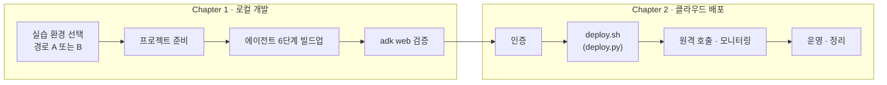
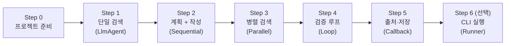
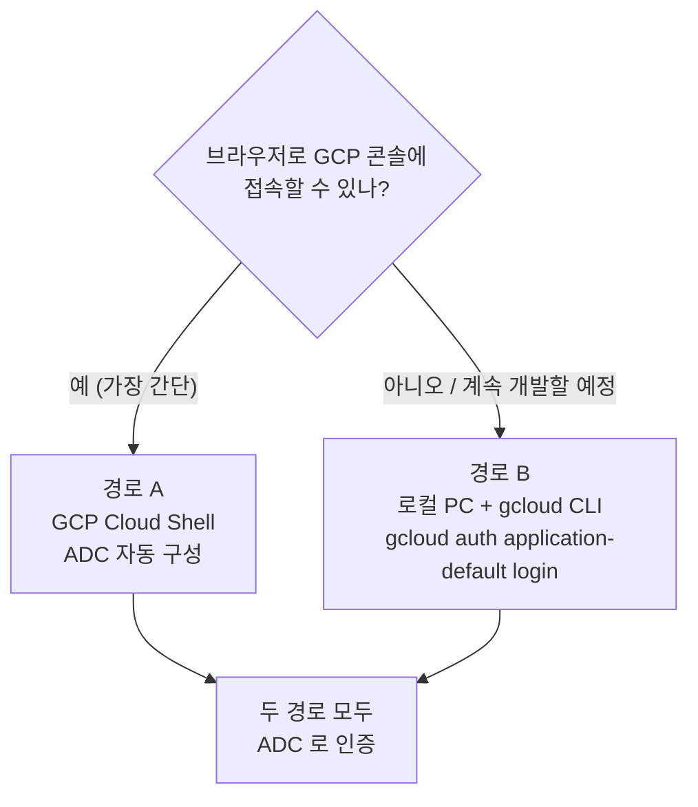
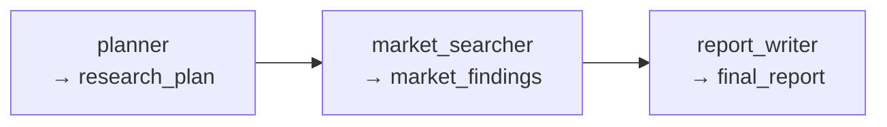
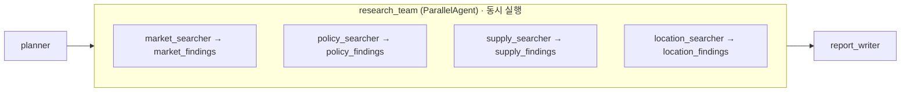
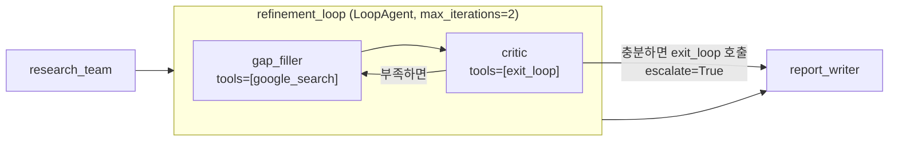
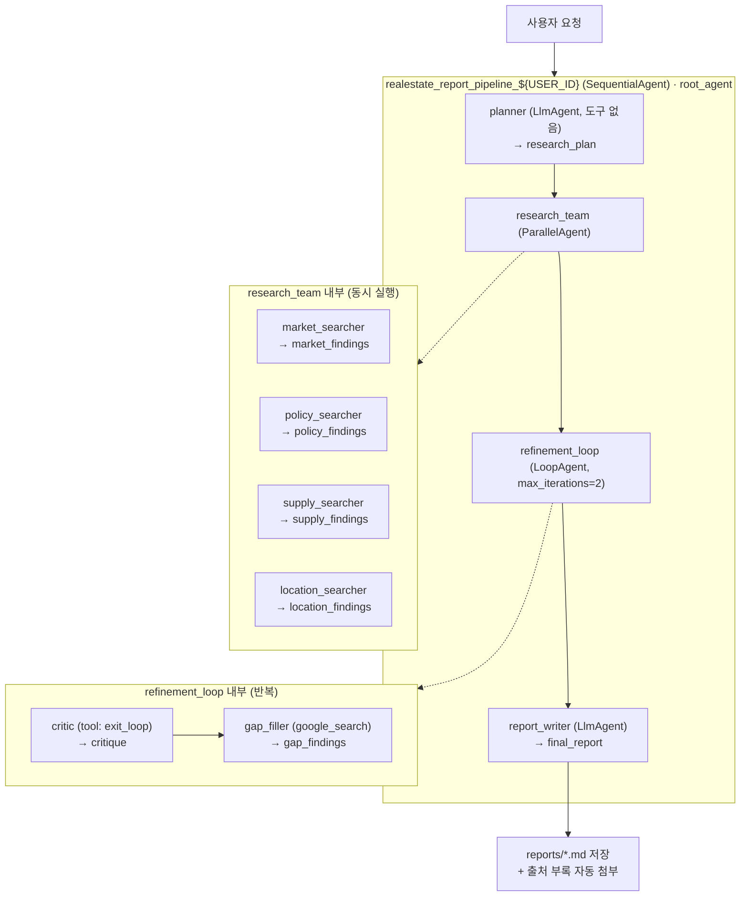
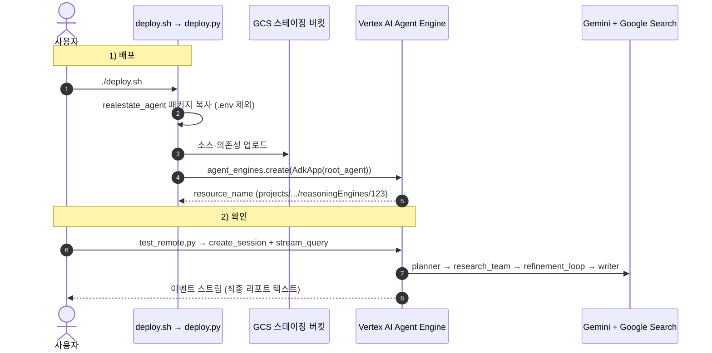
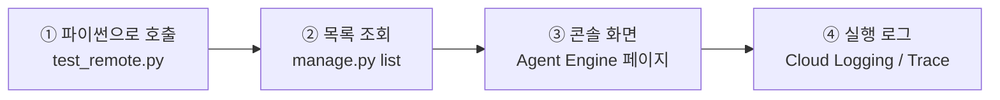
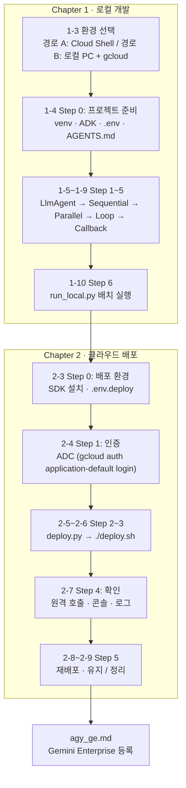

# Antigravity + ADK 커스텀 에이전트 개발·배포 실습 가이드 (build_agent)

본 문서는 **Antigravity CLI(`agy`)** 와 **Google ADK(Agent Development Kit, Python)** 를 사용하여
**부동산 리포트 멀티 에이전트**를 직접 만들고(Chapter 1), 이를 **GCP Vertex AI Agent Engine** 에 배포(Chapter 2)하는
엔드투엔드 핸즈온 실습 가이드입니다.

> **전제 조건:** [agy_setup.md](../agy_basic/agy_setup.md) 의 Antigravity CLI 설치·로그인 완료

---

## 0. 이 문서의 구성

### 0.1 두 개의 Chapter

| Chapter                                                                       | 내용                                                        | 결과물                                    |
| :---------------------------------------------------------------------------- | :---------------------------------------------------------- | :---------------------------------------- |
| **[Chapter 1. 로컬 개발](#chapter-1-로컬에서-멀티-에이전트-개발하기)**        | ADK 멀티 에이전트를 단계적으로 만들고 `adk web` 으로 검증   | 내 PC(또는 Cloud Shell)에서 도는 에이전트 |
| **[Chapter 2. 클라우드 배포](#chapter-2-vertex-ai-agent-engine-에-배포하기)** | 같은 에이전트를 Agent Engine 에 배포하고 원격 호출·모니터링 | 서버리스로 상시 서빙되는 에이전트         |



> [!IMPORTANT]
> **Step 번호는 Chapter 안에서만 유효합니다.**
> Chapter 1 의 `Step 0~6` 과 Chapter 2 의 `Step 0~5` 는 서로 다른 단계입니다.
> 절 번호는 `1-4`, `2-3` 처럼 **`<Chapter>-<절>`** 형식이므로 이것으로 위치를 구분하세요.

### 0.2 이 문서 읽는 법 — 각 절 제목의 아이콘을 먼저 보세요

| 아이콘 | 의미                                                                                  |
| :----- | :------------------------------------------------------------------------------------ |
| ✍️     | **직접 입력합니다.** 터미널에 명령을 그대로 실행하세요.                               |
| 💬     | **agy에 붙여넣습니다.** 코드 블록 내용을 agy 프롬프트 창에 그대로 붙여넣으세요.       |
| 👀     | **확인만 합니다.** agy가 만들어 준 결과물을 눈으로 비교할 뿐, 직접 작성하지 않습니다. |
| 🌐     | **브라우저에서 클릭합니다.** GCP 콘솔 화면에서 수행합니다.                            |

즉, **이 실습에서 사람이 손으로 파이썬 코드를 작성하는 부분은 없습니다.**
코드는 전부 agy가 만들고, 여러분은 프롬프트를 주고 결과를 확인합니다.

> [!IMPORTANT]
> **생성된 코드가 예시와 100% 일치하지 않아도 괜찮습니다!**
> agy는 LLM(인공지능)을 기반으로 코드를 작성하므로, 프롬프트 실행 결과가 본 문서의 참고 예시 코드와 변수명, 줄 바꿈, 세부 구현 방식 등에서 **정확하게 글자 하나하나 일치하지 않을 수 있습니다.**
> **핵심 요구사항(에이전트 이름, 도구, state 키, 파이프라인 구조 등)이 대략적으로 비슷하다면 정상 동작하므로, 굳이 코드를 똑같이 맞추려 하지 말고 안심하고 다음 단계(실행 및 확인)로 넘어가세요.**
> 문법 에러(SyntaxError)가 나거나 에이전트 실행 자체가 실패할 때만 agy에게 오류 로그를 주고 수정을 요청하면 됩니다.

### 0.3 OS별 표기 규칙

| 표기                            | 의미                                                       |
| :------------------------------ | :--------------------------------------------------------- |
| **macOS / Linux / Cloud Shell** | macOS(zsh) 및 Linux(bash) 터미널 및 Cloud Shell에서 실행   |
| **Windows (PowerShell)**        | Windows PowerShell 5.1+ 또는 PowerShell 7.x 에서 실행      |
| **모든 OS 동일**                | agy TUI 내부 입력·프롬프트·파일 내용 등 OS와 무관하게 동일 |

- **WSL2 / Git Bash** 사용자도 `macOS / Linux / Cloud Shell` 블록을 그대로 사용하세요.
- Windows에서는 `python3` → `python`, `curl` → `curl.exe`, `/` → `\` 로 바뀌는 점에 유의하세요.

### 0.4 다중 사용자 및 교육 환경 식별자 규칙 (USER_ID)

> [!IMPORTANT]
> **공용 GCP 프로젝트 환경에서의 자원 충돌 방지**
> 여러 개발자 또는 교육생이 동일한 GCP 프로젝트(`PROJECT_ID`)를 공유하는 교육/워크숍 환경에서는 동일한 이름의 에이전트, Cloud Storage 버킷, 세션 ID를 사용하면 자원이 덮어써지거나 배포 충돌이 발생할 수 있습니다.
>
> - 본 실습에서는 각 개발자별 고유 식별자 **`USER_ID`**(예: `user001`, `user002`, 또는 본인의 영문 이니셜)를 정의하여 모든 자원 명명에 접미사로 사용합니다.
> - **에이전트 이름**: `realestate_report_pipeline_${USER_ID}` (예: `realestate_report_pipeline_user001`)
> - **배포 디스플레이명**: `realestate-report-agent-${USER_ID}` (예: `realestate-report-agent-user001`)
> - **GCS 버킷명**: `gs://${PROJECT_ID}-${USER_ID}-agent-staging`
> - **세션 사용자 ID**: `user_id = os.getenv("USER_ID", "user001")`
> - **환경변수 설정**: `.env` 및 `.env.deploy` 파일에 `USER_ID=<YOUR_USER_ID>` (예: `user001`)를 지정해 두면 스크립트와 배포 도구가 자동으로 이를 반영합니다.

---

# Chapter 1. 로컬에서 멀티 에이전트 개발하기

> 🎯 **이 Chapter 의 목표**
> `"서울 강남구 역삼동 전용 84㎡ 매매 리포트 써줘"` 한 줄로
> **출처가 붙은 Markdown 리포트 파일**이 생성되는 멀티 에이전트를 완성합니다.

---

## 1-1. 개요 및 단계적 빌드업 로드맵

사용자가 `"서울 강남구 역삼동 전용 84㎡ 매매 리포트 써줘"` 라고 입력하면, 여러 에이전트가 **역할을 나눠** 조사·검증한 뒤 **출처가 붙은 Markdown 리포트 파일**을 자동 생성합니다.

한 번에 전부 구현하지 않고, **각 Step마다 `adk web` 으로 동작을 확인하며 점진적으로 빌드업**합니다.



| Step       | 구현하는 기능                            | 핵심 ADK 개념                                  |
| :--------- | :--------------------------------------- | :--------------------------------------------- |
| **Step 0** | 가상환경 · ADK 설치 · 패키지 뼈대        | `root_agent` 규칙, `adk web`                   |
| **Step 1** | 단일 검색 에이전트                       | `LlmAgent`, `google_search`, `thinking_level`  |
| **Step 2** | 2단계 파이프라인 (계획 → 작성)           | `SequentialAgent`, `output_key`, `{state}`     |
| **Step 3** | 4개 분야 동시 검색 (시세·학군·교통·호재) | `ParallelAgent`                                |
| **Step 4** | 리포트 품질 검수 및 재작성 루프          | `LoopAgent`, function tool, `escalate`         |
| **Step 5** | 검색 출처 자동 수집 및 파일 저장         | `after_model_callback`, `after_agent_callback` |
| **Step 6** | 터미널 한 줄 배치 실행 (선택)            | `Runner`, `SessionService`                     |

> [!NOTE]
> 전체 아키텍처 다이어그램은 **[1-9.4 여기까지 완성된 전체 구조](#1-94--여기까지-완성된-전체-구조)** 에서 확인할 수 있습니다.

---

## 1-2. 사전 준비 사항 (Prerequisites)

### 1-2.1 요구사항

| 구분            | 요구사항                                                        | 비고                                                    |
| :-------------- | :-------------------------------------------------------------- | :------------------------------------------------------ |
| **실행 환경**   | 로컬 PC(macOS · Linux · Windows 10/11) **또는** GCP Cloud Shell | **[1-3](#1-3-실습-환경-선택-경로-a--경로-b) 에서 선택** |
| **Python**      | 3.10 이상                                                       | 3.11 / 3.12 권장 (Cloud Shell 은 기본 제공)             |
| **Antigravity** | `agy` 설치 및 로그인 완료                                       | [agy_setup.md](../agy_basic/agy_setup.md)               |
| **인증**        | GCP 프로젝트 + **ADC** (경로 A·B 공통)                          | API 키는 사용하지 않음 → 1-3 참조                       |
| **필수 패키지** | `google-adk`, `google-genai`, `python-dotenv`                   | Step 0에서 설치                                         |
| **브라우저**    | Chrome 등 최신 브라우저                                         | `adk web` UI 확인용                                     |

### 1-2.2 알아 둘 용어 4개

지금은 **이 4개만** 알면 됩니다. 나머지는 해당 Step에서 그때그때 설명합니다.

| 용어                       | 한 줄 설명                                                                                                           |
| :------------------------- | :------------------------------------------------------------------------------------------------------------------- |
| **`LlmAgent`**             | LLM 하나 + 지시문(instruction) + 도구(tools) 로 이루어진 **기본 일꾼**                                               |
| **워크플로 에이전트**      | `SequentialAgent`(차례로) / `ParallelAgent`(동시에) / `LoopAgent`(반복). **순서를 코드로 고정**                      |
| **`output_key` / `{key}`** | 에이전트가 결과를 `output_key` 에 저장하면, 다음 에이전트가 instruction 안 `{key}` 로 **꺼내 쓰는** 데이터 전달 방식 |
| **콜백(callback)**         | 에이전트 실행 전후·모델 응답 후에 끼어드는 **내 파이썬 함수**                                                        |

---

## 1-3. 실습 환경 선택 (경로 A / 경로 B)

🎯 **목표:** 이후 모든 실습을 어디서 실행할지 **지금 하나를 골라** 끝까지 그 경로로 진행한다.

### 1-3.0 어떤 경로를 고를까

**설치 없이 바로 시작하려면 경로 A(Cloud Shell)** 를 고르세요. 이 문서의 기본 경로입니다.

| 항목             | **경로 A — GCP Cloud Shell (기본)**           | **경로 B — 로컬 PC + gcloud CLI**       |
| :--------------- | :-------------------------------------------- | :-------------------------------------- |
| 설치 작업        | **없음** (브라우저만 있으면 됨)               | Python · agy · gcloud CLI 직접 설치     |
| gcloud           | **이미 설치되어 있음**                        | 직접 설치                               |
| GCP 인증(ADC)    | 대부분 **자동 구성**                          | `gcloud auth application-default login` |
| `adk web` 접속   | **웹 미리보기** (포트 8000)                   | `http://localhost:8000`                 |
| 파일 보관        | `$HOME` 5GB (일정 기간 미사용 시 삭제)        | 내 디스크 (영구)                        |
| 제한             | 세션 타임아웃(약 20분 유휴), 주간 사용량 한도 | 없음                                    |
| 리포트 파일 확인 | Cloud Shell 편집기 또는 다운로드              | 탐색기/파인더에서 바로 열기             |
| 추천 대상        | 설치가 막혀 있거나 빠르게 체험할 사람         | 설치 권한이 있고 계속 개발할 사람       |



> [!TIP]
> **개발을 계속 이어갈 계획이라면 경로 B(로컬 PC)** 가 편합니다.
> Cloud Shell 은 세션이 끊기거나 장기 미사용 시 파일이 사라질 수 있습니다.
> 반대로 **오늘 실습만 해 보는 것이 목적이라면 경로 A** 가 압도적으로 빠릅니다.

> [!IMPORTANT]
> **경로 A(Cloud Shell)를 고른 사람은 이 문서의 `macOS / Linux` 블록을 그대로 사용**하세요.
> Cloud Shell 은 리눅스(bash) 환경입니다. `Windows (PowerShell)` 블록은 무시합니다.

---

### 1-3.1 경로 A: GCP Cloud Shell 사용 (기본)

<details open>
<summary><b>경로 A를 선택한 경우에만 펼쳐서 진행하세요</b></summary>

Cloud Shell 은 브라우저에서 바로 쓰는 리눅스 개발 환경입니다.
**`gcloud`, `python3`, `git` 이 이미 설치되어 있고 GCP 인증도 대부분 자동**이라, 설치 단계를 통째로 건너뛸 수 있습니다.

#### 🌐 1) Cloud Shell 접속

```text
https://shell.cloud.google.com
```

또는 GCP 콘솔 우측 상단의 **터미널 아이콘(>\_)** 을 클릭합니다.
처음 접속하면 프로비저닝에 30초~1분 정도 걸립니다.

#### ✍️ 2) 프로젝트 지정 및 인증 확인

```bash
gcloud config set project <YOUR_PROJECT_ID>
gcloud config get-value project

# ADC 확인 — 대부분 이미 구성되어 있습니다.
gcloud auth application-default print-access-token > /dev/null && echo "ADC OK"
```

`ADC OK` 가 나오지 않으면 아래 명령어를 한 번만 실행합니다.

```bash
gcloud auth application-default login
```

> [!NOTE]
> Cloud Shell 에서는 브라우저 팝업 대신 **인증 URL과 코드 붙여넣기** 방식으로 진행될 수 있습니다.
> 출력된 URL을 새 탭에서 열고, 발급된 코드를 터미널에 붙여넣으세요.

#### ✍️ 3) Antigravity CLI 확인

Cloud Shell 에서의 `agy` 설치·로그인은 [agy_setup.md](../agy_basic/agy_setup.md) 의 **Step 1-B / Step 3 / Step 4** 를 따릅니다.

```bash
agy --version
```

#### 🌐 4) `adk web` 을 여는 방법 — 웹 미리보기

Cloud Shell 에는 `localhost` 로 직접 접속할 수 없습니다. **웹 미리보기(Web Preview)** 를 사용합니다.

1. 터미널에서 `adk web` 을 실행합니다. (Cloud Shell 에서는 웹 미리보기 도메인 접속을 허용하기 위해 **`--allow_origins "*"`** 옵션을 붙입니다.)

   ```bash
   cd ~/antigravity-lab/custom_agent
   adk web --allow_origins "*"
   ```

2. 위 명령어 실행 후 터미널에 표시된 `http://127.0.0.1:8000` 링크를 클릭(또는 상단 웹 미리보기 포트 8000 열기)하면 새 브라우저 탭에 ADK Web UI가 열립니다.
   현재는 아직 에이전트 코드를 구현하기 전이므로 목록에 에이전트가 표시되지 않는 것이 정상입니다.

> [!TIP]
> Cloud Shell 은 브라우저가 `*.cloudshell.dev` 도메인으로 접속하므로,
> 보안 미들웨어에 의해 세션 생성 요청이 차단(`403 Forbidden`)되지 않도록 **`--allow_origins "*"`** 옵션이 필요합니다.
> 브라우저 주소창에 `localhost` 대신 상단의 **웹 미리보기(포트 8000)** 로 접속하면 됩니다.

> [!WARNING]
> **Cloud Shell 제약 사항**
>
> - 약 20분간 입력이 없으면 **세션이 종료**됩니다. 종료되면 다시 접속해 가상환경을 재활성화하세요.
> - `$HOME` 디렉터리(5GB)만 영구 보존됩니다. 그 외 경로의 파일은 사라집니다.
> - 장시간 미사용 시 홈 디렉터리가 삭제될 수 있으니, 중요한 결과물은 다운로드해 두세요.
> - 주간 사용 시간 한도가 있습니다.

✅ **경로 A 확인**

- [ ] Cloud Shell 터미널이 열렸다.
- [ ] `gcloud config get-value project` 가 내 프로젝트 ID를 출력한다.
- [ ] `ADC OK` 가 출력된다.
- [ ] `agy --version` 이 정상 출력된다.

</details>

---

### 1-3.2 경로 B: 로컬 PC + gcloud CLI 설치

<details>
<summary><b>경로 B를 선택한 경우에만 펼쳐서 진행하세요</b></summary>

#### ✍️ 1) gcloud CLI 설치

**macOS / Linux** — 공식 설치 스크립트

```bash
curl -sSL https://sdk.cloud.google.com | bash
exec -l $SHELL
gcloud version
```

> [!TIP]
> macOS에서 Homebrew를 쓴다면 `brew install --cask google-cloud-sdk` 도 가능합니다.
> Debian/Ubuntu는 `sudo apt-get install google-cloud-cli` (Google APT 저장소 등록 후)를 사용할 수 있습니다.

**Windows (PowerShell)** — winget 또는 공식 설치 파일

```powershell
winget install --id Google.CloudSDK -e

# winget 을 쓸 수 없으면 설치 파일을 내려받아 실행합니다.
# (New-Object Net.WebClient).DownloadFile("https://dl.google.com/dl/cloudsdk/channels/rapid/GoogleCloudSDKInstaller.exe", "$env:Temp\GoogleCloudSDKInstaller.exe")
# & "$env:Temp\GoogleCloudSDKInstaller.exe"

gcloud version
```

> [!WARNING]
> 설치 직후 `gcloud: command not found` (또는 `인식되지 않습니다`)가 나오면 **터미널을 새로 열어** PATH를 다시 읽게 하세요.

#### ✍️ 2) 로그인 및 프로젝트 지정

**모든 OS 동일**

```bash
gcloud auth login
gcloud config set project <YOUR_PROJECT_ID>
gcloud config get-value project
```

브라우저가 열리면 실습용 계정으로 로그인하고 권한을 승인합니다.

#### ✍️ 3) ADC(Application Default Credentials) 설정

`agy` 로그인과는 **별개**입니다. 파이썬 SDK(ADK)가 사용하는 인증입니다.

**모든 OS 동일**

```bash
gcloud auth application-default login
```

확인 (토큰 값은 출력하지 않습니다)

**macOS / Linux**

```bash
gcloud auth application-default print-access-token > /dev/null && echo "ADC OK"
```

**Windows (PowerShell)**

```powershell
if (gcloud auth application-default print-access-token) { "ADC OK" }
```

#### ✍️ 4) 필요한 API 활성화

**모든 OS 동일**

```bash
gcloud services enable aiplatform.googleapis.com storage.googleapis.com
gcloud services list --enabled --filter="aiplatform OR storage" --format="value(config.name)"
```

✅ **경로 B 확인**

- [ ] `gcloud version` 이 정상 출력된다.
- [ ] `gcloud config get-value project` 가 내 프로젝트 ID를 출력한다.
- [ ] `ADC OK` 가 출력된다.
- [ ] `aiplatform.googleapis.com` 이 활성화 목록에 있다.

</details>

---

## 1-4. Step 0: 프로젝트 준비

### 1-4.1 ✍️ 작업 디렉터리 생성

[agy_setup.md](../agy_basic/agy_setup.md) 에서 만든 워크스페이스 루트(`~/antigravity-lab`) 아래에 이번 실습 폴더를 만듭니다.

**macOS / Linux**

```bash
mkdir -p ~/antigravity-lab/custom_agent
cd ~/antigravity-lab/custom_agent
pwd
```

**Windows (PowerShell)**

```powershell
New-Item -ItemType Directory -Force -Path "$HOME\antigravity-lab\custom_agent" | Out-Null
Set-Location "$HOME\antigravity-lab\custom_agent"
Get-Location
```

### 1-4.2 ✍️ 가상환경 생성 및 ADK 설치

**macOS / Linux**

```bash
cd ~/antigravity-lab/custom_agent
python3 -m venv .venv
source .venv/bin/activate

python -m pip install -U pip
pip install -U google-adk google-genai python-dotenv

adk --version
```

**Windows (PowerShell)**

```powershell
Set-Location "$HOME\antigravity-lab\custom_agent"
python -m venv .venv
.\.venv\Scripts\Activate.ps1

python -m pip install -U pip
pip install -U google-adk google-genai python-dotenv

adk --version
```

> [!WARNING]
> Windows에서 `이 시스템에서 스크립트를 실행할 수 없으므로...` 오류가 나면 현재 세션만 정책을 완화합니다.
>
> ```powershell
> Set-ExecutionPolicy -Scope Process -ExecutionPolicy Bypass
> .\.venv\Scripts\Activate.ps1
> ```

> [!NOTE]
> 프롬프트 앞에 `(.venv)` 가 보여야 정상입니다. **이후 모든 명령은 가상환경이 활성화된 상태**에서 실행하세요.
> 터미널을 새로 열면 활성화 명령을 다시 실행해야 합니다.

### 1-4.3 ✍️ 패키지 뼈대 생성

ADK는 **패키지 폴더 안의 `root_agent`** 를 탐색합니다. 아래와 같은 구조를 먼저 구성합니다.

먼저 작업 디렉터리로 이동합니다:

```bash
cd ~/antigravity-lab/custom_agent/
```

Antigravity CLI(`agy`) 프롬프트 창에 다음과 같이 요청하여 디렉터리와 패키지 기본 뼈대 생성을 지시할 수 있습니다:

```text
~/antigravity-lab/custom_agent/ 디렉터리 내에 아래와 같은 구조의 디렉터리와 파일을 만들어줘.
이미 있는 파일은 그대로 유지해줘.

├── .venv/
├── realestate_agent/                   ← 에이전트 패키지
│   ├── __init__.py
│   ├── agent.py                        ← root_agent 정의
│   ├── prompts.py                      ← 긴 instruction 분리 (Step 2부터)
│   └── .env                            ← 인증 정보 (Git 커밋 금지)
├── reports/                            ← 리포트 저장 위치 (Step 5에서 자동 생성)
└── .gitignore
```

터미널에서 쉘 명령어로 직접 패키지 뼈대를 생성할 경우 아래와 같이 실행합니다:

**macOS / Linux**

```bash
cd ~/antigravity-lab/custom_agent
mkdir -p realestate_agent
printf 'from . import agent\n' > realestate_agent/__init__.py
ls -la realestate_agent
```

**Windows (PowerShell)**

```powershell
Set-Location "$HOME\antigravity-lab\custom_agent"
New-Item -ItemType Directory -Force -Path "realestate_agent" | Out-Null
Set-Content -Encoding ascii -Path "realestate_agent\__init__.py" -Value "from . import agent"
Get-ChildItem realestate_agent
```

> [!IMPORTANT]
> `__init__.py` 의 `from . import agent` 한 줄이 없으면 `adk web` 목록에 에이전트가 나타나지 않습니다.

### 1-4.4 ✍️ 인증 설정 (`.env`)

**경로 A(Cloud Shell)와 경로 B(로컬 PC) 모두 동일합니다.**
[1-3](#1-3-실습-환경-선택-경로-a--경로-b) 에서 만든 **ADC** 를 그대로 사용하므로 API 키는 필요 없습니다.

**macOS / Linux** (Cloud Shell 포함)

```bash
cd ~/antigravity-lab/custom_agent
cat > realestate_agent/.env <<'EOF'
GOOGLE_GENAI_USE_VERTEXAI=TRUE
GOOGLE_CLOUD_PROJECT=<YOUR_PROJECT_ID>
GOOGLE_CLOUD_LOCATION=global
REPORT_MODEL=gemini-3.8-flash
USER_ID=<YOUR_USER_ID>
EOF

cat realestate_agent/.env
```

**Windows (PowerShell)**

```powershell
Set-Location "$HOME\antigravity-lab\custom_agent"
@"
GOOGLE_GENAI_USE_VERTEXAI=TRUE
GOOGLE_CLOUD_PROJECT=<YOUR_PROJECT_ID>
GOOGLE_CLOUD_LOCATION=global
REPORT_MODEL=gemini-3.8-flash
USER_ID=<YOUR_USER_ID>
"@ | Set-Content -Encoding ascii realestate_agent\.env

Get-Content realestate_agent\.env
```

`<YOUR_PROJECT_ID>` 를 자신의 GCP 프로젝트 ID로, `<YOUR_USER_ID>` 는 본인에게 할당된 식별자(예: `user001`, `user002`, 본인 이니셜 등)로 변경합니다. 그리고 ADC가 설정되어 있는지 확인합니다.

**macOS / Linux / Cloud Shell**

```bash
cd ~/antigravity-lab/custom_agent
gcloud config get-value project
gcloud auth application-default print-access-token > /dev/null && echo "ADC OK"
```

**Windows (PowerShell)**

```powershell
Set-Location "$HOME\antigravity-lab\custom_agent"
gcloud config get-value project
if (gcloud auth application-default print-access-token) { "ADC OK" }
```

`ADC OK` 가 나오지 않으면:

```bash
cd ~/antigravity-lab/custom_agent
gcloud auth application-default login
```

> [!NOTE]
> `GOOGLE_GENAI_USE_VERTEXAI=TRUE` 가 **Vertex AI(=ADC) 를 쓰겠다는 선언**입니다.
> 이 값이 `FALSE` 면 API 키를 찾으므로, 반드시 `TRUE` 로 두세요.

> [!NOTE]
> PowerShell에서 `Set-Content -Encoding UTF8` 을 쓰면 PowerShell 5.1은 파일 앞에 **BOM**을 넣어 `.env` 첫 줄 파싱이 깨질 수 있습니다.
> `.env` 는 ASCII 문자만 쓰므로 위처럼 **`-Encoding ascii`** 를 사용하는 것이 안전합니다.

### 1-4.5 ✍️ Antigravity CLI 실행

**macOS / Linux / Cloud Shell**

```bash
cd ~/antigravity-lab/custom_agent
agy
```

**Windows (PowerShell)**

```powershell
Set-Location "$HOME\antigravity-lab\custom_agent"
agy
```

워크스페이스 신뢰 프롬프트가 나오면 `Yes, I trust this folder` 를 선택합니다.

> [!NOTE]
> 여기서부터는 터미널을 **두 개** 씁니다.
> **터미널 ①** = `agy` 를 띄워 두는 창, **터미널 ②** = `adk web` 을 실행할 창입니다.

### 1-4.6 💬 규칙 파일과 `.gitignore` 만들기

이 실습에서 **처음으로 agy에게 일을 시키는 단계**입니다.
아래 내용을 **터미널 ①의 agy 프롬프트 창에 그대로 붙여넣습니다.** (**모든 OS 동일**)

```text
/fast
이 프로젝트 루트에 아래 3가지를 만들어줘.

1) AGENTS.md — 내용은 아래 그대로:

# ADK 로컬 에이전트 실습 규칙

## 모델 설정 (필수)
- 모델 ID는 gemini-3.8-flash 를 os.getenv("REPORT_MODEL", "gemini-3.8-flash") 로 읽는다.
- temperature, top_p, top_k, candidate_count 를 절대 설정하지 않는다.
- 추론량은 thinking_budget 이 아니라 types.ThinkingConfig(thinking_level=...) 로 제어한다.
- thinking_level 값은 LOW / MEDIUM / HIGH 만 사용한다. MINIMAL 은 금지.

## ADK 설계 규칙
- google_search 를 가진 에이전트는 tools=[google_search] 하나만 갖는다. 다른 도구와 섞지 않는다.
- 흐름 제어는 LlmAgent 라우팅 대신 SequentialAgent / ParallelAgent / LoopAgent 로 고정한다.
- 모든 LlmAgent 에 고유한 output_key 를 준다. ParallelAgent 하위 에이전트는 키가 겹치면 안 된다.
- instruction 에서 state 는 {key}, 없어도 되는 값은 {key?} 로 읽는다. 리터럴 중괄호는 쓰지 않는다.
- 긴 instruction 은 prompts.py 로 분리한다.

## 오류 처리
- 예외를 빈 블록으로 삼키지 않는다 (except Exception: pass 금지).
- 구체적인 예외 타입을 쓰고, 실패 원인을 로그로 남긴다.

## 보안
- API 키, 프로젝트 ID 를 코드에 하드코딩하지 않는다. 반드시 .env 와 os.getenv 를 쓴다.
- .env 파일을 Git 에 커밋하지 않는다.

2) .gitignore — .venv/, __pycache__/, *.pyc, .env, **/.env, reports/ 를 포함한다.

3) realestate_agent/.env.example — realestate_agent/.env 와 같은 키를 두되
   값은 모두 <YOUR_PROJECT_ID>, <YOUR_USER_ID> 같은 placeholder 로 비워 둔다. 실제 값은 절대 넣지 마.
```

> [!CAUTION]
> `.env` 에는 프로젝트 ID 같은 환경 정보가 들어갑니다. **절대 Git에 커밋하지 마세요.**
> 공유가 필요하면 값을 비운 `.env.example` 만 커밋합니다.

> [!IMPORTANT]
> **이 실습에서 반드시 지킬 3가지 규칙** (어기면 바로 오류가 납니다)
> 위 `AGENTS.md` 가 agy에게 강제하는 내용이기도 합니다.
>
> 1. **`google_search` 를 가진 에이전트는 다른 도구를 갖지 않는다.**
>    섞으면 `400 INVALID_ARGUMENT (Multiple tools are supported only when they are all search tools)` 가 발생합니다.
> 2. **`gemini-3.8-flash` 에는 `temperature` / `top_p` / `top_k` 를 설정하지 않는다.**
>    추론량은 `thinking_level` (`LOW` / `MEDIUM` / `HIGH`) 로 제어합니다. **`MINIMAL` 은 검증 오류**가 납니다.
> 3. **`ParallelAgent` 의 하위 에이전트는 서로 다른 `output_key` 를 쓴다.** 같은 키면 덮어쓰기 경합이 발생합니다.

✅ **Step 0 확인**

- [ ] `(.venv)` 가 프롬프트에 보인다.
- [ ] `adk --version` 이 정상 출력된다.
- [ ] `realestate_agent/__init__.py` 에 `from . import agent` 가 있다.
- [ ] `realestate_agent/.env` 가 생성되었다.
- [ ] 프로젝트 루트에 `AGENTS.md` 와 `.gitignore` 가 생성되었고, `.gitignore` 에 `.env` 가 있다.

---

## 1-5. Step 1: 단일 검색 에이전트 만들기

🎯 **목표:** `google_search` 도구 하나를 가진 가장 단순한 에이전트를 만들고 `adk web` 으로 동작을 확인한다.

### 1-5.1 💬 agy에 붙여넣기

아래 내용을 **agy 프롬프트 창에 그대로 붙여넣습니다.** (**모든 OS 동일**)

```text
@AGENTS.md 규칙을 지켜서 realestate_agent/agent.py 를 만들어줘.

- google_search 도구 하나만 가진 LlmAgent 를 root_agent 라는 이름으로 정의한다.
- 이름은 market_searcher, 역할은 한국 부동산 시세·거래 동향 검색.
- 모델은 .env 의 REPORT_MODEL 을 읽고, 기본값은 gemini-3.8-flash.
- 사용자 ID는 .env 의 USER_ID 를 읽고, 기본값은 user001.
- generate_content_config 는 ThinkingConfig(thinking_level="MEDIUM") 만 설정한다.
- instruction 에는 다음 규칙을 넣는다:
  · google_search 를 최소 3회, 서로 다른 키워드로 사용할 것
  · 모든 수치에 [기준일, 출처 기관·매체명] 을 붙일 것
  · 실거래가와 호가를 구분해 (실거래) / (호가) 로 표기할 것
  · 확인하지 못한 것은 "확인 불가" 로 남기고 추측하지 말 것
  · 출력은 불릿 25줄 이내

코드만 만들고 실행은 아직 하지 마.
```

### 1-5.2 👀 생성된 코드 확인 (직접 작성하지 않습니다)

> [!NOTE]
> **여기서는 아무것도 직접 입력하지 않습니다.** 아래 코드는 앞의 프롬프트를 받은 **agy가 만든 결과물을 확인하기 위한 참고 예시**입니다.

> [!TIP]
> **핵심 포인트:** LLM 특성상 agy가 생성한 코드가 아래 예시와 **100% 정확하게 일치하지 않을 수 있습니다.**
> 에이전트 이름(`realestate_agent`), 도구(`google_search`), 모델 등이 **대략적으로 비슷하면 정상**이므로 코드를 억지로 똑같이 고치려 하지 말고 **그대로 다음 단계(1-5.3 ✍️ 실행 및 확인)로 넘어가세요.**
> _(이후 모든 Step의 `X.2` 절도 동일한 확인 방식입니다.)_

`realestate_agent/agent.py` — **모든 OS 동일**

```python
import os

from google.adk.agents import LlmAgent
from google.adk.tools import google_search
from google.genai import types

MODEL = os.getenv("REPORT_MODEL", "gemini-3.8-flash")
USER_ID = os.getenv("USER_ID", "user001")

MARKET_INSTRUCTION = """
당신은 한국 부동산 시세·거래 동향 조사 담당자다.

규칙:
- 반드시 google_search를 여러 번(최소 3회, 서로 다른 키워드) 사용한다.
- 모든 수치에는 [기준일/기간, 출처 기관·매체명]을 붙인다. 출처 없는 수치는 쓰지 않는다.
- 실거래가와 호가(매물가)를 절대 섞지 않는다. 구분 표기: (실거래) / (호가).
- 실거래가는 신고 기한(계약 후 30일) 때문에 최근 1개월 데이터가 불완전함을 감안한다.
- 우선 출처: 국토교통부 실거래가 공개시스템, 한국부동산원(R-ONE), KB부동산,
  한국은행, 국토교통부·지자체 보도자료, 주요 언론. 블로그·카페 글은 보조로만.
- 확인 못 한 것은 "확인 불가"로 남긴다. 추측으로 메우지 않는다.
- 출력: 불릿 요약(최대 25줄) + 각 불릿 끝에 출처 표기.
"""

root_agent = LlmAgent(
    name="market_searcher",
    model=MODEL,
    description="한국 부동산 시세·거래 동향을 검색해 정리하는 에이전트",
    instruction=MARKET_INSTRUCTION,
    tools=[google_search],  # 검색 도구 단독 (다른 도구와 섞지 않는다)
    generate_content_config=types.GenerateContentConfig(
        thinking_config=types.ThinkingConfig(thinking_level="MEDIUM")
    ),
)
```

### 1-5.3 ✍️ 실행 및 확인

> [!IMPORTANT]
> `adk web` 은 **패키지 폴더의 부모**(= `~/antigravity-lab/custom_agent`)에서 실행해야 합니다.
> `realestate_agent` 폴더 안에서 실행하면 에이전트를 찾지 못합니다.

**macOS / Linux** — 새 터미널 ②

```bash
cd ~/antigravity-lab/custom_agent
source .venv/bin/activate
adk web
```

**경로 A — Cloud Shell** — 새 탭(+ 버튼)으로 터미널 ② 열기

```bash
cd ~/antigravity-lab/custom_agent
source .venv/bin/activate
adk web --allow_origins "*"
```

**Windows (PowerShell)** — 새 터미널 ②

```powershell
Set-Location "$HOME\antigravity-lab\custom_agent"
.\.venv\Scripts\Activate.ps1
adk web
```

출력 예시 (**모든 환경 동일**)

```text
INFO:     Started server process [12345]
INFO:     Uvicorn running on http://127.0.0.1:8000 (Press CTRL+C to quit)
```

> [!NOTE]
> 8000 포트가 이미 사용 중이면 `adk web --port 8081` 처럼 다른 포트를 지정하세요.

> [!IMPORTANT]
> **환경별 접속 방법:**
>
> - **경로 B (로컬 PC)**: 브라우저 주소창에서 `http://localhost:8000` 접속
> - **경로 A (Cloud Shell)**: 주소창 대신 Cloud Shell 창 우측 상단 **웹 미리보기(👁) → [포트 변경] → 8000 입력 → [변경 및 미리보기]** 클릭
>   _(Cloud Shell 에서는 웹 미리보기 도메인 허용을 위해 반드시 `--allow_origins "*"` 로 실행해야 세션 생성 시 `403 Forbidden` 에러가 발생하지 않습니다.)_

브라우저(또는 웹 미리보기 탭)에서 ADK UI를 열고:

1. 좌측 상단 드롭다운에서 **`realestate_agent`** 를 선택합니다.
2. 입력창에 아래 **테스트 권장 질의**를 넣고 전송합니다.

**테스트 권장 질의 (추천 질문)**

```text
서울 강남구 역삼동 전용 84㎡ 아파트의 최근 실거래가와 호가 동향을 조사해줘.
```

_(다른 지역 테스트 예시)_

```text
서울 마포구 아현동 전용 84㎡ 아파트의 최근 실거래가와 매매 시세 동향을 조사해줘.
```

✅ **Step 1 확인**

- [ ] 드롭다운에 `realestate_agent` 가 보인다.
- [ ] 답변이 생성된다.
- [ ] **Events 탭**에서 `google_search` 도구 호출이 **3회 이상** 보인다.
- [ ] 각 수치 뒤에 기준일·출처가 붙어 있다.

> [!TIP]
> **핵심 포인트 — 왜 검색 도구를 격리하나?**
> Gemini의 내장 검색은 다른 function tool과 한 에이전트에 섞이면
> `Multiple tools are supported only when they are all search tools` 오류가 납니다.
> 그래서 이 실습 내내 **"검색 에이전트는 `tools=[google_search]` 만"** 규칙을 지킵니다.

---

## 1-6. Step 2: 계획 → 작성 파이프라인 (SequentialAgent)

🎯 **목표:** 조사 계획을 세우는 `planner` 와 리포트를 쓰는 `report_writer` 를 추가하고,
**`output_key` → `{key}`** 로 데이터를 넘기는 방법을 익힌다.



### 1-6.1 💬 agy에 붙여넣기

아래 내용을 **agy 프롬프트 창에 그대로 붙여넣습니다.** (**모든 OS 동일**)

```text
@AGENTS.md 규칙을 지켜서 다음과 같이 확장해줘.

1) realestate_agent/prompts.py 를 새로 만들고, 아래 3개의 프롬프트 상수를 정의한다.
   - PLANNER : 조사 계획만 세우는 총괄. 검색은 하지 않는다. {today} 를 사용.
     출력 형식은 "## 대상 / ## 핵심 질문 (3~6개) / ## 영역별 검색 키워드 / ## 조사 기간".
   - MARKET  : 지금 agent.py 에 있는 시세 검색 지시문을 옮기되,
     맨 앞에 "오늘 날짜: {today}" 와 "조사 계획:\n{research_plan}" 을 넣는다.
   - WRITER  : {today}, {research_plan}, {market_findings} 를 받아 한국어 Markdown 리포트를 쓴다.
     새로운 수치를 창작하지 말고 근거 자료에 있는 내용만 사용한다.
     URL 은 쓰지 않는다.

2) realestate_agent/agent.py 를 수정한다.
   - prompts 모듈을 import 한다.
   - gen_cfg(level) 헬퍼 함수를 만들어 ThinkingConfig 를 생성한다.
   - before_agent_callback 으로 state["today"] 에 오늘 날짜(ISO 형식)를 넣는 init_state 함수를 만든다.
   - planner(LlmAgent, 도구 없음, output_key="research_plan", thinking_level HIGH)
   - market_searcher(google_search 단독, output_key="market_findings", thinking_level MEDIUM)
   - report_writer(LlmAgent, 도구 없음, output_key="final_report", thinking_level HIGH)
   - root_agent 를 SequentialAgent 로 바꾸고 위 3개를 순서대로 sub_agents 에 넣는다.
     이름은 realestate_report_pipeline_${USER_ID} (예: .env 의 USER_ID 를 읽어 realestate_report_pipeline_user001 로 명명), before_agent_callback=init_state.
```

### 1-6.2 👀 생성된 코드 확인 (직접 작성하지 않습니다)

> [!NOTE]
> **여기서는 아무것도 직접 입력하지 않습니다.** 아래는 이해를 돕기 위한 **참고 예시 코드**입니다.
>
> > [!TIP]
> > **핵심 포인트:** agy가 생성한 코드가 아래 예시와 **완전히 똑같지 않아도 괜찮습니다.**
> > `PLANNER`/`WRITER` 프롬프트의 골격과 `SequentialAgent` 파이프라인 구조가 **대략적으로 비슷하면 정상**이므로 안심하고 다음 단계(1-6.3 ✍️ 실행 및 확인)로 넘어가세요.

`realestate_agent/prompts.py` — **모든 OS 동일**

```python
PLANNER = """
당신은 한국 부동산 리서치 총괄이다. 오늘 날짜: {today}

사용자 요청을 분석해 아래 형식의 조사 계획만 출력하라. 검색은 하지 않는다.

## 대상
- 지역/단지명/평형(전용㎡)/용도(매매·전세·월세·재건축 투자 등): 요청에서 명시된 것만.
  불명확하면 "미지정"이라 적고 합리적 가정을 [가정]으로 표시.
## 핵심 질문 (3~6개)
## 영역별 검색 키워드 (한국어, 각 3~5개)
- 시세/거래: ...
- 정책/금리/규제: ...
- 공급/개발/정비사업: ...
- 입지(교통·학군·생활인프라): ...
## 조사 기간
- 기본: 최근 12개월 + 최근 3개월 집중
"""

SEARCHER_COMMON = """
오늘 날짜: {today}
조사 계획:
{research_plan}

규칙:
- 반드시 google_search를 여러 번(최소 3회, 다른 키워드) 사용한다.
- 모든 수치에는 [기준일/기간, 출처 기관·매체명]을 붙인다. 출처 없는 수치는 쓰지 않는다.
- 실거래가와 호가(매물가)를 절대 섞지 않는다. 구분 표기: (실거래) / (호가).
- 실거래가는 신고 기한(계약 후 30일) 때문에 최근 1개월 데이터가 불완전함을 감안한다.
- 우선 출처: 국토교통부 실거래가 공개시스템, 한국부동산원(R-ONE), KB부동산, 한국은행,
  국토교통부·지자체 보도자료, 주요 언론. 블로그·카페 글은 보조로만.
- 상충되는 수치는 둘 다 기록하고 차이를 명시한다.
- 확인 못 한 것은 "확인 불가"로 남긴다. 추측으로 메우지 않는다.
- 출력: 불릿 요약(최대 25줄) + 각 불릿 끝에 출처 표기.
"""

MARKET = SEARCHER_COMMON + """
담당 영역: 시세·거래 동향.
대상 단지/인근 비교 단지의 최근 실거래(가격, 층, 전용면적, 계약월), 호가 범위,
전세가율, 거래량 추이, 지역 매매가격지수 변동률.
"""

WRITER = """
당신은 한국어 부동산 리서치 리포트 작성자다. 오늘 날짜: {today}

조사 계획:
{research_plan}

근거 자료(이 자료에 있는 내용만 사용, 새 수치 창작 금지):
[시세] {market_findings}

아래 구조의 Markdown 리포트를 작성하라.

# <대상> 부동산 리포트 (작성일: {today})
## 1. 핵심 요약 — 결론 3줄 + 핵심 수치 표
## 2. 대상 개요
## 3. 시세·거래 동향 — 실거래/호가 구분 표, 전세가율, 거래량
## 4. 리스크 요인 — 최소 3개, 발생 조건과 영향 방향
## 5. 데이터 한계 — "확인 불가" 항목, 상충 수치
## 6. 고지 — 본 리포트는 공개 자료 기반 분석이며 투자 권유나 법률·세무 자문이 아님

작성 규칙:
- 모든 수치 옆에 (기준일, 출처)를 괄호로 유지한다.
- 1평 = 3.3058㎡. 면적은 전용㎡ 기준, 필요 시 평 환산 병기.
- 금액은 "억 원" 단위, 소수 첫째 자리까지.
- URL은 쓰지 마라(출처 부록은 시스템이 자동 첨부한다).
"""
```

`realestate_agent/agent.py` — **모든 OS 동일**

```python
import os
from datetime import date

from google.adk.agents import LlmAgent, SequentialAgent
from google.adk.agents.callback_context import CallbackContext
from google.adk.tools import google_search
from google.genai import types

from . import prompts

MODEL = os.getenv("REPORT_MODEL", "gemini-3.8-flash")
USER_ID = os.getenv("USER_ID", "user001")


def gen_cfg(level: str) -> types.GenerateContentConfig:
    """Gemini 3.8 Flash: temperature/top_p/top_k 설정 금지, thinking_level 사용."""
    return types.GenerateContentConfig(
        thinking_config=types.ThinkingConfig(thinking_level=level)
    )


def init_state(callback_context: CallbackContext):
    """파이프라인 시작 시 오늘 날짜를 state에 주입한다."""
    callback_context.state["today"] = date.today().isoformat()
    return None


planner = LlmAgent(
    name="planner",
    model=MODEL,
    description="사용자 요청을 분석해 조사 계획을 세운다",
    instruction=prompts.PLANNER,
    generate_content_config=gen_cfg("HIGH"),
    output_key="research_plan",
)

market_searcher = LlmAgent(
    name="market_searcher",
    model=MODEL,
    description="시세·거래 동향 수집용 검색 에이전트",
    instruction=prompts.MARKET,
    tools=[google_search],
    generate_content_config=gen_cfg("MEDIUM"),
    output_key="market_findings",
)

report_writer = LlmAgent(
    name="report_writer",
    model=MODEL,
    description="수집 자료를 바탕으로 최종 리포트를 작성한다",
    instruction=prompts.WRITER,
    generate_content_config=gen_cfg("HIGH"),
    output_key="final_report",
)

root_agent = SequentialAgent(
    name=f"realestate_report_pipeline_{USER_ID}",
    description="부동산 리포트를 조사·작성하는 파이프라인",
    sub_agents=[planner, market_searcher, report_writer],
    before_agent_callback=init_state,
)
```

### 1-6.3 ✍️ 실행 및 확인

터미널 ②에서 `Ctrl+C` 로 이전 서버를 종료한 뒤, `adk web` 을 **재시작**합니다.

**macOS / Linux**

```bash
cd ~/antigravity-lab/custom_agent
source .venv/bin/activate
adk web
```

**경로 A — Cloud Shell**

```bash
cd ~/antigravity-lab/custom_agent
source .venv/bin/activate
adk web --allow_origins "*"
```

**Windows (PowerShell)**

```powershell
Set-Location "$HOME\antigravity-lab\custom_agent"
.\.venv\Scripts\Activate.ps1
adk web
```

> [!TIP]
> **Cloud Shell 리마인더:** Cloud Shell 에서는 브라우저 교차 출처 세션 차단(`403 Forbidden`)을 방지하기 위해 매번 **`--allow_origins "*"`** 플래그를 붙여 실행하세요.

브라우저 ADK Web UI 좌측 상단 드롭다운에서 **`realestate_report_pipeline_user001`** (또는 `.env` 에 설정한 본인의 USER_ID 가 붙은 에이전트명)을 선택하고, 아래 질문을 전송합니다.

**테스트 권장 질의 (추천 질문)**

```text
서울 강남구 역삼동 전용 84㎡ 아파트의 최근 매매 동향과 주요 단지 시세를 종합 리포트로 작성해줘.
```

_(다른 지역 테스트 예시)_

```text
서울 송파구 잠실동 전용 84㎡ 아파트 최근 실거래가와 매매 동향 리포트를 써줘.
```

✅ **Step 2 확인**

- [ ] State 탭에 `today` → `research_plan` → `market_findings` → `final_report` 가 **순서대로** 채워진다.
- [ ] Events 탭에서 `planner` → `market_searcher` → `report_writer` 순으로 실행된다.
- [ ] 최종 답변이 Markdown 리포트 형식이다.

> [!TIP]
> **핵심 포인트 — state 데이터 흐름**
> `planner` 가 `output_key="research_plan"` 으로 결과를 저장하면,
> 다음 에이전트의 instruction 안에 있는 `{research_plan}` 이 그 값으로 **치환**됩니다.
> instruction에 **리터럴 중괄호 `{}` 를 쓰면 안 됩니다.** 치환 대상으로 오해받아 오류가 납니다.

---

## 1-7. Step 3: 병렬 검색 (ParallelAgent)

🎯 **목표:** 검색 에이전트를 4개로 늘려 **동시에** 조사하게 한다. 전체 소요 시간이 크게 줄어듭니다.



### 1-7.1 💬 agy에 붙여넣기

아래 내용을 **agy 프롬프트 창에 그대로 붙여넣습니다.** (**모든 OS 동일**)

```text
@realestate_agent/prompts.py @realestate_agent/agent.py 를 다음과 같이 확장해줘.

1) prompts.py 에 SEARCHER_COMMON 을 재사용하는 프롬프트 3개를 추가한다.
   - POLICY   : 기준금리/주담대 금리 추이, 대출 규제(DSR 등), 규제지역·토지거래허가구역 여부,
                세제(취득세·양도세·종부세) 변경, 최근 정부 부동산 대책
   - SUPPLY   : 향후 2~3년 입주 물량, 분양 일정, 재건축·재개발 진행 단계,
                교통·개발 호재의 확정 여부(계획/착공/개통 단계 구분)
   - LOCATION : 지하철역·도로 접근성(도보 분), 학군, 생활 인프라,
                주변 혐오·위험 시설, 단지 특성(세대수, 준공연도, 시공사, 주차)

2) WRITER 프롬프트의 근거 자료 부분에 [정책] {policy_findings}, [공급] {supply_findings},
   [입지] {location_findings} 를 추가하고, 리포트 목차에 "정책·금리 환경", "수급", "입지 분석",
   "시나리오" 섹션을 추가한다.

3) agent.py 에 make_searcher(name, instruction, output_key) 헬퍼 함수를 만들어
   검색 에이전트 생성을 공통화한다.

4) 검색 에이전트 4개를 ParallelAgent(name="research_team") 로 묶고,
   root_agent 의 sub_agents 를 [planner, research_team, report_writer] 로 바꾸며 기존 root_agent 이름(realestate_report_pipeline_${USER_ID})을 유지한다.

주의: ParallelAgent 하위 에이전트의 output_key 는 절대 겹치면 안 된다.
```

### 1-7.2 👀 생성된 코드 확인 (직접 작성하지 않습니다)

> [!NOTE]
> **여기서는 아무것도 직접 입력하지 않습니다.** 아래는 이해를 돕기 위한 **참고 예시 코드**입니다.
>
> > [!TIP]
> > **핵심 포인트:** agy가 생성한 코드가 아래 예시와 **완벽히 일치하지 않아도 무방합니다.**
> > 4개의 검색 에이전트(`market`, `policy`, `supply`, `location`)와 고유한 `output_key`, 그리고 `ParallelAgent` 구성이 **대략적으로 맞다면 정상**이므로 다음 단계(1-7.3 ✍️ 실행 및 확인)로 바로 넘어가셔도 됩니다.

`prompts.py` 에 추가 — **모든 OS 동일**

```python
POLICY = SEARCHER_COMMON + """
담당 영역: 정책·금리·규제.
기준금리/주담대 금리 추이, 대출 규제(DSR 등), 규제지역·토지거래허가구역 여부,
세제(취득세·양도세·종부세) 변경, 최근 정부 부동산 대책.
"""

SUPPLY = SEARCHER_COMMON + """
담당 영역: 공급·개발.
대상 지역 향후 2~3년 입주 물량, 분양 일정, 재건축·재개발 진행 단계,
교통·개발 호재의 확정 여부(계획/착공/개통 단계 구분).
"""

LOCATION = SEARCHER_COMMON + """
담당 영역: 입지.
지하철역·도로 접근성(도보 분), 학군(배정 학교, 학원가), 생활 인프라,
주변 혐오·위험 시설, 단지 자체 특성(세대수, 준공연도, 시공사, 주차).
"""
```

`agent.py` 의 검색 에이전트 부분을 아래로 교체 — **모든 OS 동일**

```python
from google.adk.agents import LlmAgent, SequentialAgent, ParallelAgent


def make_searcher(name: str, instruction: str, output_key: str) -> LlmAgent:
    """google_search 단독 검색 에이전트를 생성한다."""
    return LlmAgent(
        name=name,
        model=MODEL,
        description=f"{output_key} 수집용 검색 에이전트",
        instruction=instruction,
        tools=[google_search],  # 검색 도구 단독
        generate_content_config=gen_cfg("MEDIUM"),
        output_key=output_key,
    )


research_team = ParallelAgent(
    name="research_team",
    description="4개 영역을 동시에 조사하는 리서치 팀",
    sub_agents=[
        make_searcher("market_searcher", prompts.MARKET, "market_findings"),
        make_searcher("policy_searcher", prompts.POLICY, "policy_findings"),
        make_searcher("supply_searcher", prompts.SUPPLY, "supply_findings"),
        make_searcher("location_searcher", prompts.LOCATION, "location_findings"),
    ],
)

root_agent = SequentialAgent(
    name=f"realestate_report_pipeline_{USER_ID}",
    description="부동산 리포트를 조사·작성하는 파이프라인",
    sub_agents=[planner, research_team, report_writer],
    before_agent_callback=init_state,
)
```

### 1-7.3 ✍️ 실행 및 확인

터미널 ②에서 `Ctrl+C` 로 중단한 뒤, 4개 병렬 검색 에이전트가 반영되도록 `adk web` 을 **재시작**합니다.

**macOS / Linux**

```bash
cd ~/antigravity-lab/custom_agent
source .venv/bin/activate
adk web
```

**경로 A — Cloud Shell**

```bash
cd ~/antigravity-lab/custom_agent
source .venv/bin/activate
adk web --allow_origins "*"
```

**Windows (PowerShell)**

```powershell
Set-Location "$HOME\antigravity-lab\custom_agent"
.\.venv\Scripts\Activate.ps1
adk web
```

> [!TIP]
> **Cloud Shell 리마인더:** Cloud Shell 에서는 세션 생성 차단(`403 Forbidden`) 방지를 위해 반드시 **`--allow_origins "*"`** 옵션을 유지하세요.

**테스트 권장 질의 (추천 질문)**
시세 · 정책 · 공급 · 입지 4개 분야를 고루 자극할 수 있는 포괄적인 질문을 입력합니다.

```text
서울 강남구 역삼동 전용 84㎡ 매매 시장의 실거래가, 대출 규제 정책, 신규 입주 공급 물량, 교통·학군 입지 여건을 종합 분석해줘.
```

_(다른 지역 테스트 예시)_

```text
서울 마포구 아현동 전용 84㎡ 아파트의 최근 실거래가, 재개발 정책, 주변 입주 공급 물량, 교통 호재를 모두 포함한 종합 리포트를 작성해줘.
```

✅ **Step 3 확인**

- [ ] State 탭에 `market_findings`, `policy_findings`, `supply_findings`, `location_findings` **4개가 모두** 채워진다.
- [ ] Events 탭에서 4개 검색 에이전트가 **거의 동시에(동일한 초에)** 시작된다.
- [ ] 최종 리포트에 정책·공급·입지 섹션이 포함된다.

> [!TIP]
> **핵심 포인트 — 병렬 실행(ParallelAgent)이 맞는지 눈으로 확인하는 방법**
>
> 1. **Events 탭의 시작 타임스탬프**: ADK UI의 **Events 탭**을 펼치면 `market_searcher`, `policy_searcher`, `supply_searcher`, `location_searcher` 4개의 에이전트 시작 시각이 **거의 동일한 초(sec)** 에 일괄 기동된 것을 볼 수 있습니다. (만약 순차 실행이라면 이전 검색이 끝날 때까지 5~10초씩 밀려서 시작합니다.)
> 2. **비동기 완료 순서**: 각 에이전트가 검색을 마치는 속도에 따라 완료 시점은 제각각이며, 먼저 끝난 순서대로 state의 고유 `output_key` 에 기록됩니다.
> 3. **ADK 내부 동작**: ADK의 `ParallelAgent` 는 Python 3.11+ 환경에서 `asyncio.TaskGroup` (3.10은 `asyncio.create_task`)을 통해 모든 `sub_agents` 를 독립된 비동기 코루틴으로 동시에 실행합니다.

> [!WARNING]
> 4개 에이전트가 동시에 검색하므로 **API 호출량이 4배**가 됩니다.
> 쿼터 오류(`429 RESOURCE_EXHAUSTED`)가 나면 검색 에이전트를 2개로 줄이거나
> `thinking_level` 을 `"LOW"` 로 낮추세요.

---

## 1-8. Step 4: 검증 루프 (LoopAgent)

🎯 **목표:** 수집한 자료가 부족하면 **자동으로 보완 검색**을 돌리고, 충분하면 즉시 빠져나오게 한다.



### 1-8.1 💬 agy에 붙여넣기

아래 내용을 **agy 프롬프트 창에 그대로 붙여넣습니다.** (**모든 OS 동일**)

```text
@realestate_agent/prompts.py @realestate_agent/agent.py 에 검증 루프를 추가해줘.

1) prompts.py 에 CRITIC, GAP_FILLER 프롬프트를 추가한다.
   - CRITIC: {today}, {research_plan}, 4개 findings, 그리고 선택값 {gap_findings?} 를 받아
     아래 4가지 기준으로 평가한다.
       1. 조사 계획의 핵심 질문에 모두 답할 근거가 있는가
       2. 핵심 수치(최근 실거래가, 전세가율, 금리, 입주 물량)에 기준일과 출처가 있는가
       3. 6개월 이상 지난 데이터가 "최신"처럼 쓰이지 않았는가
       4. 수치 간 모순이 해결되었는가
     충분하면 exit_loop 도구를 호출하고 아무것도 출력하지 않는다.
     부족하면 exit_loop 를 호출하지 말고 보완 항목 최대 5개를
     "무엇이 부족한지 + 추천 검색어" 형식으로 출력한다.
   - GAP_FILLER: {today}, {critique}, {gap_findings?} 를 받아
     보완 요청 항목만 google_search 로 조사하고, 이전 결과에 이어붙여 출력한다.

2) agent.py 에 exit_loop function tool 을 추가한다.
   - tool_context.actions.escalate = True 와 skip_summarization = True 를 설정하고 {} 를 반환한다.
   - docstring 은 "수집 자료가 리포트 작성에 충분할 때 호출하여 보완 루프를 종료한다" 로 쓴다.
     (LLM 이 이 docstring 을 보고 호출 시점을 판단하므로 중요하다)

3) critic 은 tools=[exit_loop] 만 갖는 LlmAgent (output_key="critique", thinking_level HIGH).
   gap_filler 는 make_searcher 로 만들고 output_key="gap_findings".
   두 에이전트를 LoopAgent(name="refinement_loop", max_iterations=2) 로 묶는다.

4) root_agent 의 sub_agents 를 [planner, research_team, refinement_loop, report_writer] 로 바꾸며 기존 root_agent 이름(realestate_report_pipeline_${USER_ID})을 유지한다.
5) WRITER 프롬프트 근거 자료에 [보완] {gap_findings?} 를 추가한다.

주의: critic 은 google_search 를 갖지 않는다. 검색 도구와 function tool 을 섞으면 안 된다.
```

### 1-8.2 👀 생성된 코드 확인 (직접 작성하지 않습니다)

> [!NOTE]
> **여기서는 아무것도 직접 입력하지 않습니다.** 아래는 이해를 돕기 위한 **참고 예시 코드**입니다.
>
> > [!TIP]
> > **핵심 포인트:** 검증 루프 구현 코드 역시 세부 표현이 **완전히 똑같지 않아도 됩니다.**
> > `CRITIC` 의 판정 로직, `exit_loop` 함수(tools) 및 `LoopAgent` 구조가 **대략적으로 비슷하면 정상**이므로 코드를 그대로 두고 다음 단계(1-8.3 ✍️ 실행 및 확인)로 진행하세요.

`prompts.py` 에 추가 — **모든 OS 동일**

```python
CRITIC = """
당신은 까다로운 부동산 리포트 검수자다. 오늘 날짜: {today}

조사 계획:
{research_plan}

수집 자료:
[시세] {market_findings}
[정책] {policy_findings}
[공급] {supply_findings}
[입지] {location_findings}
[보완] {gap_findings?}

평가 기준:
1. 조사 계획의 핵심 질문에 모두 답할 근거가 있는가
2. 핵심 수치(최근 실거래가, 전세가율, 금리, 입주 물량)에 기준일과 출처가 있는가
3. 6개월 이상 지난 데이터가 "최신"처럼 쓰이지 않았는가
4. 수치 간 모순이 해결되었는가

판단:
- 충분하면 exit_loop 도구를 호출하고 아무것도 출력하지 마라.
- 부족하면 exit_loop를 호출하지 말고, 보완이 필요한 항목을 최대 5개,
  각각 "무엇이 부족한지 + 추천 검색어"로 출력하라.
"""

GAP_FILLER = """
오늘 날짜: {today}
검수자의 보완 요청:
{critique}

이전 보완 결과(있다면 유지하고 추가하라):
{gap_findings?}

google_search로 보완 요청 항목만 조사하라.
SEARCHER 규칙과 동일하게 모든 수치에 기준일·출처를 붙인다.
출력: 이전 보완 결과 + 이번에 새로 확인한 내용을 합친 불릿 목록.
"""
```

`agent.py` 에 추가 — **모든 OS 동일**

```python
from google.adk.agents import LlmAgent, SequentialAgent, ParallelAgent, LoopAgent
from google.adk.tools import google_search, ToolContext


def exit_loop(tool_context: ToolContext) -> dict:
    """수집 자료가 리포트 작성에 충분할 때 호출하여 보완 루프를 종료한다."""
    tool_context.actions.escalate = True
    tool_context.actions.skip_summarization = True
    return {}


critic = LlmAgent(
    name="critic",
    model=MODEL,
    description="수집 자료의 충분성을 검수한다",
    instruction=prompts.CRITIC,
    tools=[exit_loop],  # function tool 단독 (검색과 분리)
    generate_content_config=gen_cfg("HIGH"),
    output_key="critique",
)

gap_filler = make_searcher("gap_filler", prompts.GAP_FILLER, "gap_findings")

refinement_loop = LoopAgent(
    name="refinement_loop",
    description="부족한 자료를 보완하는 검증 루프",
    sub_agents=[critic, gap_filler],
    max_iterations=2,  # 비용 상한. 3 이상은 효용 대비 비쌈
)

root_agent = SequentialAgent(
    name=f"realestate_report_pipeline_{USER_ID}",
    description="부동산 리포트를 조사·검증·작성하는 파이프라인",
    sub_agents=[planner, research_team, refinement_loop, report_writer],
    before_agent_callback=init_state,
)
```

### 1-8.3 ✍️ 실행 및 확인

터미널 ②에서 `Ctrl+C` 로 중단한 뒤, 검증 루프가 반영되도록 `adk web` 을 **재시작**합니다.

**macOS / Linux**

```bash
cd ~/antigravity-lab/custom_agent
source .venv/bin/activate
adk web
```

**경로 A — Cloud Shell**

```bash
cd ~/antigravity-lab/custom_agent
source .venv/bin/activate
adk web --allow_origins "*"
```

**Windows (PowerShell)**

```powershell
Set-Location "$HOME\antigravity-lab\custom_agent"
.\.venv\Scripts\Activate.ps1
adk web
```

> [!TIP]
> **Cloud Shell 리마인더:** Cloud Shell 세션 오류(`403 Forbidden`)를 방지하기 위해 **`--allow_origins "*"`** 플래그를 잊지 마세요.

**테스트 권장 질의 (추천 질문)**
검증 루프(`critic` → `gap_filler`)가 동작하는지 확인하기 위해 구체적인 검증 기준을 포함하거나 까다로운 수치를 요구하는 질의를 입력합니다.

```text
서울 강남구 역삼동 전용 84㎡ 아파트 매매 리포트를 작성하되, 최근 6개월 실거래가 최고/최저가, 전세가율, 재건축·정비사업 추진 현황을 구체적 수치와 출처로 포함해줘.
```

_(다른 지역 테스트 예시)_

```text
서울 마포구 아현동 전용 84㎡ 아파트의 실거래가 추이와 인근 북아현 뉴타운 입주 공급 계획, 학군 여건을 검증하여 리포트로 작성해줘.
```

✅ **Step 4 확인**

- [ ] Events 탭에 `critic` 이 나타난다.
- [ ] `critic` 이 **`exit_loop` 를 호출**했거나, 보완 항목을 출력하고 **`gap_filler` 가 실행**된다.
- [ ] 루프가 **최대 2회**에서 반드시 멈춘다.

> [!TIP]
> **핵심 포인트 — `exit_loop` 는 어떻게 동작하나?**
> `tool_context.actions.escalate = True` 를 설정하면 ADK가 **현재 루프를 즉시 종료**합니다.
> LLM은 함수의 **docstring** 을 보고 호출 시점을 판단하므로, docstring을 명확히 쓰는 것이 중요합니다.
>
> 루프가 항상 2회 다 돈다면 `critic` 의 평가 기준이 너무 엄격한 것입니다.
> 필수 항목을 "핵심 수치 4종"으로 완화해 보세요.

---

## 1-9. Step 5: 출처 자동 수집 + 파일 저장 (Callback)

🎯 **목표:** LLM이 URL을 지어내지 못하게 하고, **실제 검색 결과(grounding metadata)** 에서 출처를 코드로 수집한다.
완성된 리포트는 `reports/` 폴더에 파일로 저장한다.

### 1-9.1 💬 agy에 붙여넣기

아래 내용을 **agy 프롬프트 창에 그대로 붙여넣습니다.** (**모든 OS 동일**)

```text
@realestate_agent/agent.py 에 출처 수집과 파일 저장 기능을 추가해줘.

1) collect_sources(callback_context, llm_response) 함수를 만든다.
   - llm_response.grounding_metadata.grounding_chunks 를 읽어
     web.title 과 web.uri 를 {"title": ..., "uri": ...} 형태로 모은다.
   - state 키는 f"sources_{callback_context.agent_name}" 로 에이전트별로 분리한다.
   - 이미 있는 uri 는 중복 추가하지 않는다.
   - grounding_metadata 가 없으면 아무것도 하지 않고 None 을 반환한다.
   - 응답 자체는 수정하지 않으므로 항상 None 을 반환한다.

2) make_searcher 에 after_model_callback=collect_sources 를 추가한다.

3) save_report(callback_context) 함수를 만든다.
   - state 에서 final_report 를 읽고, 없으면 아무것도 하지 않는다.
   - "sources_" 로 시작하는 모든 state 키를 모아 중복 uri 를 제거하고
     "## 부록: 검색 출처 (자동 수집)" 섹션을 만들어 리포트 뒤에 붙인다.
   - 리포트 첫 줄(제목)에서 파일명을 만들되, 한글과 영숫자만 남기고 60자로 자른다.
   - 저장 위치는 os.getenv("REPORT_DIR", "reports") 이고, 없으면 만든다.
   - 파일명은 <slug>_<YYYYMMDD_HHMM>.md, 인코딩은 utf-8.
   - 저장 경로를 state["report_path"] 에 넣는다.

4) report_writer 에 after_agent_callback=save_report 를 추가한다.
```

### 1-9.2 👀 생성된 코드 확인 (직접 작성하지 않습니다)

> [!NOTE]
> **여기서는 아무것도 직접 입력하지 않습니다.** 아래는 이해를 돕기 위한 **참고 예시 코드**입니다.
>
> > [!TIP]
> > **핵심 포인트:** 콜백 함수(`collect_sources`, `save_report`) 구현 세부사항이 아래 예시와 **완전히 일치하지 않아도 괜찮습니다.**
> > `grounding_metadata` 에서 출처를 뽑아 state에 넣고, `reports/` 폴더에 리포트를 파일로 저장하는 흐름이 **대략적으로 맞다면 정상**이므로 다음 단계(1-9.3 ✍️ 실행 및 확인)로 바로 넘어가세요.

`agent.py` 상단 import 및 상수 — **모든 OS 동일**

```python
import os
import re
import pathlib
from datetime import date, datetime

from google.adk.models import LlmResponse

REPORT_DIR = pathlib.Path(os.getenv("REPORT_DIR", "reports"))
```

콜백 함수 추가 — **모든 OS 동일**

```python
def collect_sources(callback_context: CallbackContext, llm_response: LlmResponse):
    """google_search grounding 결과에서 출처를 수집해 에이전트별 state 키에 누적."""
    gm = getattr(llm_response, "grounding_metadata", None)
    if not gm or not gm.grounding_chunks:
        return None

    key = f"sources_{callback_context.agent_name}"
    sources = list(callback_context.state.get(key, []))
    for chunk in gm.grounding_chunks:
        web = getattr(chunk, "web", None)
        if web and web.uri:
            item = {"title": web.title or "", "uri": web.uri}
            if item not in sources:
                sources.append(item)
    callback_context.state[key] = sources
    return None  # 응답은 수정하지 않음


def save_report(callback_context: CallbackContext):
    """최종 리포트 + 출처 부록을 reports/ 에 저장."""
    state = callback_context.state.to_dict()
    report = state.get("final_report", "")
    if not report:
        return None

    lines, seen = [], set()
    for k, v in state.items():
        if k.startswith("sources_"):
            for s in v:
                if s["uri"] not in seen:
                    seen.add(s["uri"])
                    lines.append(f"- [{k.removeprefix('sources_')}] {s['title']} — {s['uri']}")
    appendix = "\n\n---\n## 부록: 검색 출처 (자동 수집)\n" + ("\n".join(lines) or "- 없음")

    title = report.splitlines()[0].lstrip("# ").strip() or "report"
    slug = re.sub(r"[^\w가-힣]+", "_", title)[:60]
    REPORT_DIR.mkdir(parents=True, exist_ok=True)
    path = REPORT_DIR / f"{slug}_{datetime.now():%Y%m%d_%H%M}.md"
    path.write_text(report + appendix, encoding="utf-8")
    callback_context.state["report_path"] = str(path)
    return None
```

`make_searcher` 와 `report_writer` 에 콜백 연결 — **모든 OS 동일**

```python
def make_searcher(name: str, instruction: str, output_key: str) -> LlmAgent:
    return LlmAgent(
        name=name,
        model=MODEL,
        description=f"{output_key} 수집용 검색 에이전트",
        instruction=instruction,
        tools=[google_search],
        generate_content_config=gen_cfg("MEDIUM"),
        after_model_callback=collect_sources,   # ← 추가
        output_key=output_key,
    )


report_writer = LlmAgent(
    name="report_writer",
    model=MODEL,
    description="수집 자료를 바탕으로 최종 리포트를 작성한다",
    instruction=prompts.WRITER,
    generate_content_config=gen_cfg("HIGH"),
    output_key="final_report",
    after_agent_callback=save_report,           # ← 추가
)
```

### 1-9.3 ✍️ 실행 및 확인

#### 1) 터미널 ②에서 `adk web` 재시작

콜백 코드가 반영되도록 `Ctrl+C` 로 중단한 후 재시작합니다.

**macOS / Linux**

```bash
cd ~/antigravity-lab/custom_agent
source .venv/bin/activate
adk web
```

**경로 A — Cloud Shell**

```bash
cd ~/antigravity-lab/custom_agent
source .venv/bin/activate
adk web --allow_origins "*"
```

**Windows (PowerShell)**

```powershell
Set-Location "$HOME\antigravity-lab\custom_agent"
.\.venv\Scripts\Activate.ps1
adk web
```

> [!TIP]
> **Cloud Shell 리마인더:** Cloud Shell 에서는 `403 Forbidden` 방지를 위해 반드시 **`--allow_origins "*"`** 플래그를 붙여 실행하세요.

#### 2) 브라우저 Web UI에서 테스트 질문 전송

**테스트 권장 질의 (추천 질문)**

```text
서울 강남구 역삼동 전용 84㎡ 아파트 매매 리포트 써줘.
```

_(다른 지역 테스트 예시)_

```text
서울 마포구 아현동 전용 84㎡ 매매 리포트 써줘.
```

#### 3) 터미널 ③에서 자동 저장된 Markdown 리포트 파일 확인

리포트 생성이 완료되면 `reports/` 디렉터리에 출처 부록이 포함된 Markdown 파일이 생성되었는지 확인합니다.

**macOS / Linux / Cloud Shell** — 터미널 ③

```bash
cd ~/antigravity-lab/custom_agent
ls -la reports/
cat "$(ls -t reports/*.md | head -1)"
```

**Windows (PowerShell)** — 터미널 ③

```powershell
Set-Location "$HOME\antigravity-lab\custom_agent"
Get-ChildItem reports\
Get-Content (Get-ChildItem reports\*.md | Sort-Object LastWriteTime -Descending | Select-Object -First 1)
```

✅ **Step 5 확인**

- [ ] State 탭에 `sources_market_searcher` 같은 키가 쌓여 있다.
- [ ] State 탭에 `report_path` 가 있다.
- [ ] `reports/` 폴더에 `.md` 파일이 생성되었다.
- [ ] 파일 맨 아래에 **"부록: 검색 출처 (자동 수집)"** 목록이 있다.

> [!TIP]
> **핵심 포인트 — 왜 출처를 콜백으로 수집하나?**
> LLM에게 "URL을 적어라"고 하면 **없는 주소를 지어내는(hallucination)** 경우가 많습니다.
> `grounding_metadata` 는 모델이 **실제로 참조한 검색 결과**이므로 신뢰할 수 있습니다.
> 그래서 WRITER 프롬프트에는 `URL은 쓰지 마라` 를 넣고, 출처는 시스템이 붙입니다.
>
> grounding URI가 `vertexaisearch.cloud.google.com/...` 형태의 **리다이렉트 URL** 로 보이는 것은 정상입니다.

### 1-9.4 👀 여기까지 완성된 전체 구조

Step 5까지 오면 아래 구조가 완성됩니다. 지금 만든 것이 무엇인지 한 번 훑어보세요.



---

## 1-10. Step 6: (선택) 터미널에서 한 줄로 실행

🎯 **목표:** `adk web` 없이 스크립트로 리포트를 생성한다. 배치 작업이나 자동화에 유용합니다.

### 1-10.1 💬 agy에 붙여넣기

아래 내용을 **agy 프롬프트 창에 그대로 붙여넣습니다.** (**모든 OS 동일**)

```text
프로젝트 루트에 run_local.py 를 만들어줘.

- dotenv 로 realestate_agent/.env 를 로드한다.
- user_id 는 .env 의 USER_ID(기본값 user001)를 읽어 세션을 생성하고 실행한다.
- google.adk.runners.Runner 와 InMemorySessionService 를 사용한다.
- 명령행 인자를 합쳐 질의로 쓰고, 인자가 없으면 기본 질의를 사용한다.
- runner.run_async 로 이벤트를 순회하며 최종 응답만 [에이전트명] 접두어와 함께 앞 400자를 출력한다.
- 끝나면 세션 state 에서 report_path 를 읽어 저장 위치를 출력한다.
```

### 1-10.2 👀 생성된 코드 확인 (직접 작성하지 않습니다)

> [!NOTE]
> **여기서는 아무것도 직접 입력하지 않습니다.** 아래 코드는 이해를 돕기 위한 **참고 예시 코드**입니다.
>
> > [!TIP]
> > **핵심 포인트:** agy가 작성한 `run_local.py` 코드가 아래 예시와 **완전히 똑같지 않아도 됩니다.**
> > `InMemorySessionService`, `Runner` 생성, 질의 실행 및 `report_path` 출력 흐름이 **대략적으로 비슷하면 정상**이므로 그대로 실행(1-10.3 ✍️ 실행)으로 넘어가세요.

`run_local.py` — **모든 OS 동일**

```python
import asyncio
import os
import sys

from dotenv import load_dotenv

load_dotenv("realestate_agent/.env")

from google.adk.runners import Runner
from google.adk.sessions import InMemorySessionService
from google.genai import types

from realestate_agent.agent import root_agent

APP = "realestate_report"


async def main(query: str) -> None:
    user_id = os.getenv("USER_ID", "user001")
    svc = InMemorySessionService()
    runner = Runner(agent=root_agent, app_name=APP, session_service=svc)
    session = await svc.create_session(app_name=APP, user_id=user_id)
    msg = types.Content(role="user", parts=[types.Part(text=query)])

    async for ev in runner.run_async(
        user_id=user_id, session_id=session.id, new_message=msg
    ):
        if ev.is_final_response() and ev.content and ev.content.parts:
            text = ev.content.parts[0].text or ""
            print(f"\n[{ev.author}] {text[:400]}")

    final = await svc.get_session(app_name=APP, user_id=user_id, session_id=session.id)
    print("\n저장 위치:", final.state.get("report_path"))


if __name__ == "__main__":
    asyncio.run(
        main(
            " ".join(sys.argv[1:])
            or "서울 강남구 역삼동 대단지 아파트 전용 84㎡ 매매 시장 리포트"
        )
    )
```

### 1-10.3 ✍️ 실행

**macOS / Linux**

```bash
cd ~/antigravity-lab/custom_agent
source .venv/bin/activate
python run_local.py "마포구 아현동 재개발 구역 투자 리포트"
```

**Windows (PowerShell)**

```powershell
Set-Location "$HOME\antigravity-lab\custom_agent"
.\.venv\Scripts\Activate.ps1
python run_local.py "마포구 아현동 재개발 구역 투자 리포트"
```

✅ **Step 6 확인**

- [ ] 각 에이전트의 응답이 순서대로 출력된다.
- [ ] 마지막에 `저장 위치: reports/....md` 가 출력된다.

---

## 1-11. 문제 해결 (Troubleshooting)

### 1-11.1 ADK · 모델 관련

| 증상                                                               | 원인 / 조치                                                                                                      |
| :----------------------------------------------------------------- | :--------------------------------------------------------------------------------------------------------------- |
| `Multiple tools are supported only when they are all search tools` | `google_search` 와 다른 도구가 한 에이전트에 있음. **검색 에이전트를 분리**하고, 흐름은 워크플로 에이전트로 고정 |
| `thinking_level` 검증 오류                                         | `MINIMAL` 사용 금지 (`LOW`/`MEDIUM`/`HIGH`만). 그래도 안 되면 `pip install -U google-genai google-adk`           |
| instruction에 `{market_findings}` 가 그대로 남음                   | 앞선 에이전트가 아직 그 키를 쓰지 않음. 실행 **순서 확인**, 선택 값은 `{key?}` 로 변경                           |
| `KeyError` 발생                                                    | instruction 안의 **리터럴 중괄호** 때문. 중괄호는 state 키 치환에만 사용                                         |
| 출처 부록이 비어 있음                                              | 모델이 검색을 안 함 → instruction의 "최소 3회 검색" 강제 확인. grounding URI가 리다이렉트 형태인 것은 정상       |
| 리포트에 근거 없는 수치                                            | WRITER의 "근거 자료에 있는 내용만" 규칙 강화, CRITIC 기준에 "출처 없는 수치 목록화" 추가                         |
| 루프가 항상 2회 다 돔                                              | `critic` 기준이 너무 엄격. 핵심 수치 4종만 필수로 완화                                                           |
| `429 RESOURCE_EXHAUSTED`                                           | 병렬 검색 4개로 호출량 급증. 검색 에이전트 수를 줄이거나 `thinking_level` 을 `"LOW"` 로 조정                     |

### 1-11.2 실행 환경 관련 (OS · 경로별)

| 증상                                          | 환경            | 원인 / 조치                                                                                           |
| :-------------------------------------------- | :-------------- | :---------------------------------------------------------------------------------------------------- |
| `adk web` 목록에 에이전트가 안 보임           | 공통            | `__init__.py` 의 `from . import agent` 누락, 또는 **패키지 폴더 안에서 실행**함. 부모 폴더에서 실행   |
| `adk: command not found`                      | macOS / Linux   | 가상환경 미활성화. `source .venv/bin/activate`                                                        |
| `adk : 용어가 cmdlet ... 인식되지 않습니다`   | Windows         | 가상환경 미활성화. `.\.venv\Scripts\Activate.ps1`                                                     |
| `이 시스템에서 스크립트를 실행할 수 없으므로` | Windows         | `Set-ExecutionPolicy -Scope Process -ExecutionPolicy Bypass` 후 재시도                                |
| `.env` 의 첫 줄이 인식되지 않음               | Windows         | `Set-Content -Encoding UTF8` 이 넣은 **BOM** 문제. `-Encoding ascii` 로 다시 생성                     |
| `Address already in use` (8000 포트)          | 공통            | `adk web --port 8081` 등으로 포트 변경                                                                |
| `DefaultCredentialsError` / `401`             | 공통            | ADC 미설정. 1-3 절의 경로 A/B 재확인 후 `gcloud auth application-default login`                       |
| `403 PERMISSION_DENIED (aiplatform)`          | 공통            | Vertex AI API 미활성화. `gcloud services enable aiplatform.googleapis.com` (또는 콘솔에서 활성화)     |
| `ModuleNotFoundError: google.adk`             | 공통            | 가상환경 밖에서 실행. 활성화 후 `pip install -U google-adk`                                           |
| 한글이 깨짐                                   | Windows         | `chcp 65001` 및 `[Console]::OutputEncoding = [System.Text.Encoding]::UTF8`                            |
| 브라우저에서 `localhost:8000` 이 안 열림      | **Cloud Shell** | Cloud Shell 은 localhost 접속 불가. **웹 미리보기(👁) → [포트 변경] → 8000** 사용                      |
| `POST ... /sessions 403 Forbidden`            | **Cloud Shell** | 웹 미리보기 도메인(`*.cloudshell.dev`) 차단. `adk web --allow_origins "*"` 로 실행                    |
| 작업 도중 터미널이 끊김                       | **Cloud Shell** | 약 20분 유휴 시 세션 종료. 재접속 후 `cd ~/antigravity-lab/custom_agent && source .venv/bin/activate` |
| 며칠 뒤 접속하니 파일이 사라짐                | **Cloud Shell** | 장기 미사용 시 홈 디렉터리 삭제. 중요한 결과물은 미리 다운로드하거나 Git에 올릴 것                    |
| `gcloud: command not found`                   | 로컬 PC         | 경로 B의 gcloud 설치 미완료 또는 PATH 미반영. 터미널을 새로 열거나 1-3.2 재수행                       |

> [!TIP]
> **가장 빠른 디버깅 방법**
> 오류 메시지(스택 트레이스 전체)를 복사해 `agy` 프롬프트에 **그대로 붙여넣고** 수정을 요청하세요.
> 파일을 지정하면 더 정확합니다: `@realestate_agent/agent.py 아래 오류를 고쳐줘. <오류 전문>`

---

## 1-12. Chapter 1 마무리 → Chapter 2 로

여기까지 오면 **내 환경에서 도는 멀티 에이전트**가 완성된 것입니다.
지금부터는 이 에이전트를 **클라우드에 올려 상시 서빙**합니다.

| 항목            | Chapter 1 (지금까지)           | Chapter 2 (앞으로)                |
| :-------------- | :----------------------------- | :-------------------------------- |
| 실행 위치       | 내 PC / Cloud Shell            | Vertex AI Agent Engine (서버리스) |
| 실행 방법       | `adk web` · `run_local.py`     | `stream_query()` 원격 호출        |
| 세션            | 메모리 (프로세스 종료 시 소멸) | 관리형 세션 (영속)                |
| 터미널을 닫으면 | 중단됨                         | 계속 서비스됨                     |
| 모니터링        | 터미널 로그                    | Cloud Logging · Cloud Trace       |

> [!IMPORTANT]
> **Chapter 2로 넘어가기 전 반드시 확인하세요.**
>
> - [ ] `adk web` 에서 리포트가 **끝까지** 생성된다 (Chapter 1 Step 5 완료)
> - [ ] `reports/*.md` 파일이 만들어지고 출처 부록이 붙는다
> - [ ] 오류 없이 2~3회 연속 실행된다
>
> 로컬에서 불안정한 에이전트는 배포해도 똑같이 실패합니다.
> **디버깅은 반복 주기가 짧은 로컬에서 끝내는 것이 훨씬 빠릅니다.**

> [!TIP]
> 여기서 실습을 멈춰도 됩니다. Chapter 2는 GCP 프로젝트와 결제 계정이 필요하므로,
> 조건이 갖춰졌을 때 이어서 진행하세요. Chapter 1 결과물은 그대로 재사용됩니다.

---

## 1-A. 부록: 최종 전체 코드

Step 5까지 완료한 상태의 전체 코드입니다. 중간에 꼬였다면 이 내용으로 덮어쓰세요.

<details>
<summary><b>realestate_agent/prompts.py</b> (클릭해서 펼치기)</summary>

```python
PLANNER = """
당신은 한국 부동산 리서치 총괄이다. 오늘 날짜: {today}

사용자 요청을 분석해 아래 형식의 조사 계획만 출력하라. 검색은 하지 않는다.

## 대상
- 지역/단지명/평형(전용㎡)/용도(매매·전세·월세·재건축 투자 등): 요청에서 명시된 것만.
  불명확하면 "미지정"이라 적고 합리적 가정을 [가정]으로 표시.
## 핵심 질문 (3~6개)
## 영역별 검색 키워드 (한국어, 각 3~5개)
- 시세/거래: ...
- 정책/금리/규제: ...
- 공급/개발/정비사업: ...
- 입지(교통·학군·생활인프라): ...
## 조사 기간
- 기본: 최근 12개월 + 최근 3개월 집중
"""

SEARCHER_COMMON = """
오늘 날짜: {today}
조사 계획:
{research_plan}

규칙:
- 반드시 google_search를 여러 번(최소 3회, 다른 키워드) 사용한다.
- 모든 수치에는 [기준일/기간, 출처 기관·매체명]을 붙인다. 출처 없는 수치는 쓰지 않는다.
- 실거래가와 호가(매물가)를 절대 섞지 않는다. 구분 표기: (실거래) / (호가).
- 실거래가는 신고 기한(계약 후 30일) 때문에 최근 1개월 데이터가 불완전함을 감안한다.
- 우선 출처: 국토교통부 실거래가 공개시스템, 한국부동산원(R-ONE), KB부동산, 한국은행,
  국토교통부·지자체 보도자료, 주요 언론. 블로그·카페 글은 보조로만.
- 상충되는 수치는 둘 다 기록하고 차이를 명시한다.
- 확인 못 한 것은 "확인 불가"로 남긴다. 추측으로 메우지 않는다.
- 출력: 불릿 요약(최대 25줄) + 각 불릿 끝에 출처 표기.
"""

MARKET = SEARCHER_COMMON + """
담당 영역: 시세·거래 동향.
대상 단지/인근 비교 단지의 최근 실거래(가격, 층, 전용면적, 계약월), 호가 범위,
전세가율, 거래량 추이, 지역 매매가격지수 변동률.
"""

POLICY = SEARCHER_COMMON + """
담당 영역: 정책·금리·규제.
기준금리/주담대 금리 추이, 대출 규제(DSR 등), 규제지역·토지거래허가구역 여부,
세제(취득세·양도세·종부세) 변경, 최근 정부 부동산 대책.
"""

SUPPLY = SEARCHER_COMMON + """
담당 영역: 공급·개발.
대상 지역 향후 2~3년 입주 물량, 분양 일정, 재건축·재개발 진행 단계,
교통·개발 호재의 확정 여부(계획/착공/개통 단계 구분).
"""

LOCATION = SEARCHER_COMMON + """
담당 영역: 입지.
지하철역·도로 접근성(도보 분), 학군(배정 학교, 학원가), 생활 인프라,
주변 혐오·위험 시설, 단지 자체 특성(세대수, 준공연도, 시공사, 주차).
"""

CRITIC = """
당신은 까다로운 부동산 리포트 검수자다. 오늘 날짜: {today}

조사 계획:
{research_plan}

수집 자료:
[시세] {market_findings}
[정책] {policy_findings}
[공급] {supply_findings}
[입지] {location_findings}
[보완] {gap_findings?}

평가 기준:
1. 조사 계획의 핵심 질문에 모두 답할 근거가 있는가
2. 핵심 수치(최근 실거래가, 전세가율, 금리, 입주 물량)에 기준일과 출처가 있는가
3. 6개월 이상 지난 데이터가 "최신"처럼 쓰이지 않았는가
4. 수치 간 모순이 해결되었는가

판단:
- 충분하면 exit_loop 도구를 호출하고 아무것도 출력하지 마라.
- 부족하면 exit_loop를 호출하지 말고, 보완이 필요한 항목을 최대 5개,
  각각 "무엇이 부족한지 + 추천 검색어"로 출력하라.
"""

GAP_FILLER = """
오늘 날짜: {today}
검수자의 보완 요청:
{critique}

이전 보완 결과(있다면 유지하고 추가하라):
{gap_findings?}

google_search로 보완 요청 항목만 조사하라.
SEARCHER 규칙과 동일하게 모든 수치에 기준일·출처를 붙인다.
출력: 이전 보완 결과 + 이번에 새로 확인한 내용을 합친 불릿 목록.
"""

WRITER = """
당신은 한국어 부동산 리서치 리포트 작성자다. 오늘 날짜: {today}

조사 계획:
{research_plan}

근거 자료(이 자료에 있는 내용만 사용, 새 수치 창작 금지):
[시세] {market_findings}
[정책] {policy_findings}
[공급] {supply_findings}
[입지] {location_findings}
[보완] {gap_findings?}

아래 구조의 Markdown 리포트를 작성하라.

# <대상> 부동산 리포트 (작성일: {today})
## 1. 핵심 요약 — 결론 3줄 + 핵심 수치 표
## 2. 대상 개요 — 단지/지역 기본 정보
## 3. 시세·거래 동향 — 실거래/호가 구분 표, 전세가율, 거래량
## 4. 정책·금리 환경
## 5. 수급 — 입주 물량, 정비사업, 개발 호재(단계 표기)
## 6. 입지 분석
## 7. 리스크 요인 — 최소 3개, 발생 조건과 영향 방향
## 8. 시나리오 — 강세/기본/약세, 각 시나리오의 전제 조건
## 9. 데이터 한계 — "확인 불가" 항목, 상충 수치
## 10. 고지 — 본 리포트는 공개 자료 기반 분석이며 투자 권유나 법률·세무 자문이 아님

작성 규칙:
- 모든 수치 옆에 (기준일, 출처)를 괄호로 유지한다.
- 1평 = 3.3058㎡. 면적은 전용㎡ 기준, 필요 시 평 환산 병기.
- 금액은 "억 원" 단위, 소수 첫째 자리까지.
- 결론은 근거에서 도출 가능한 만큼만 단정적으로 쓰고, 근거가 약하면 그렇다고 밝힌다.
- URL은 쓰지 마라(출처 부록은 시스템이 자동 첨부한다).
"""
```

</details>

<details>
<summary><b>realestate_agent/agent.py</b> (클릭해서 펼치기)</summary>

```python
import os
import re
import pathlib
from datetime import date, datetime

from google.adk.agents import LlmAgent, SequentialAgent, ParallelAgent, LoopAgent
from google.adk.agents.callback_context import CallbackContext
from google.adk.models import LlmResponse
from google.adk.tools import google_search, ToolContext
from google.genai import types

from . import prompts

MODEL = os.getenv("REPORT_MODEL", "gemini-3.8-flash")
USER_ID = os.getenv("USER_ID", "user001")
REPORT_DIR = pathlib.Path(os.getenv("REPORT_DIR", "reports"))


def gen_cfg(level: str) -> types.GenerateContentConfig:
    """Gemini 3.8 Flash: temperature/top_p/top_k 설정 금지, thinking_level 사용."""
    return types.GenerateContentConfig(
        thinking_config=types.ThinkingConfig(thinking_level=level)
    )


# ---------- callbacks ----------
def init_state(callback_context: CallbackContext):
    """파이프라인 시작 시 오늘 날짜를 state에 주입한다."""
    callback_context.state["today"] = date.today().isoformat()
    return None


def collect_sources(callback_context: CallbackContext, llm_response: LlmResponse):
    """google_search grounding 결과에서 출처를 수집해 에이전트별 state 키에 누적."""
    gm = getattr(llm_response, "grounding_metadata", None)
    if not gm or not gm.grounding_chunks:
        return None

    key = f"sources_{callback_context.agent_name}"
    sources = list(callback_context.state.get(key, []))
    for chunk in gm.grounding_chunks:
        web = getattr(chunk, "web", None)
        if web and web.uri:
            item = {"title": web.title or "", "uri": web.uri}
            if item not in sources:
                sources.append(item)
    callback_context.state[key] = sources
    return None  # 응답은 수정하지 않음


def save_report(callback_context: CallbackContext):
    """최종 리포트 + 출처 부록을 reports/ 에 저장."""
    state = callback_context.state.to_dict()
    report = state.get("final_report", "")
    if not report:
        return None

    lines, seen = [], set()
    for k, v in state.items():
        if k.startswith("sources_"):
            for s in v:
                if s["uri"] not in seen:
                    seen.add(s["uri"])
                    lines.append(f"- [{k.removeprefix('sources_')}] {s['title']} — {s['uri']}")
    appendix = "\n\n---\n## 부록: 검색 출처 (자동 수집)\n" + ("\n".join(lines) or "- 없음")

    title = report.splitlines()[0].lstrip("# ").strip() or "report"
    slug = re.sub(r"[^\w가-힣]+", "_", title)[:60]
    REPORT_DIR.mkdir(parents=True, exist_ok=True)
    path = REPORT_DIR / f"{slug}_{datetime.now():%Y%m%d_%H%M}.md"
    path.write_text(report + appendix, encoding="utf-8")
    callback_context.state["report_path"] = str(path)
    return None


# ---------- tools ----------
def exit_loop(tool_context: ToolContext) -> dict:
    """수집 자료가 리포트 작성에 충분할 때 호출하여 보완 루프를 종료한다."""
    tool_context.actions.escalate = True
    tool_context.actions.skip_summarization = True
    return {}


# ---------- agents ----------
def make_searcher(name: str, instruction: str, output_key: str) -> LlmAgent:
    """google_search 단독 검색 에이전트를 생성한다."""
    return LlmAgent(
        name=name,
        model=MODEL,
        description=f"{output_key} 수집용 검색 에이전트",
        instruction=instruction,
        tools=[google_search],  # 검색 도구 단독
        generate_content_config=gen_cfg("MEDIUM"),
        after_model_callback=collect_sources,
        output_key=output_key,
    )


planner = LlmAgent(
    name="planner",
    model=MODEL,
    description="사용자 요청을 분석해 조사 계획을 세운다",
    instruction=prompts.PLANNER,
    generate_content_config=gen_cfg("HIGH"),
    output_key="research_plan",
)

research_team = ParallelAgent(
    name="research_team",
    description="4개 영역을 동시에 조사하는 리서치 팀",
    sub_agents=[
        make_searcher("market_searcher", prompts.MARKET, "market_findings"),
        make_searcher("policy_searcher", prompts.POLICY, "policy_findings"),
        make_searcher("supply_searcher", prompts.SUPPLY, "supply_findings"),
        make_searcher("location_searcher", prompts.LOCATION, "location_findings"),
    ],
)

critic = LlmAgent(
    name="critic",
    model=MODEL,
    description="수집 자료의 충분성을 검수한다",
    instruction=prompts.CRITIC,
    tools=[exit_loop],  # function tool 단독 (검색과 분리)
    generate_content_config=gen_cfg("HIGH"),
    output_key="critique",
)

gap_filler = make_searcher("gap_filler", prompts.GAP_FILLER, "gap_findings")

refinement_loop = LoopAgent(
    name="refinement_loop",
    description="부족한 자료를 보완하는 검증 루프",
    sub_agents=[critic, gap_filler],
    max_iterations=2,  # 비용 상한. 3 이상은 효용 대비 비쌈
)

report_writer = LlmAgent(
    name="report_writer",
    model=MODEL,
    description="수집 자료를 바탕으로 최종 리포트를 작성한다",
    instruction=prompts.WRITER,
    generate_content_config=gen_cfg("HIGH"),
    output_key="final_report",
    after_agent_callback=save_report,
)

root_agent = SequentialAgent(
    name=f"realestate_report_pipeline_{USER_ID}",
    description="부동산 리포트를 조사·검증·작성하는 파이프라인",
    sub_agents=[planner, research_team, refinement_loop, report_writer],
    before_agent_callback=init_state,
)
```

</details>

---

## 1-B. 부록: 확장 패턴 (필요할 때만)

| 필요                                         | 방법                                                                                                                                                                        |
| :------------------------------------------- | :-------------------------------------------------------------------------------------------------------------------------------------------------------------------------- |
| 한 에이전트에서 검색 + 계산 도구를 같이 쓰기 | 검색 에이전트를 `AgentTool(agent=search_agent)` 로 감싸 `tools=[AgentTool(...), calc_fn]` 으로 사용. 또는 ADK ≥ 1.16 에서 `GoogleSearchTool(bypass_multi_tools_limit=True)` |
| 공공데이터 API(국토부 실거래가 등) 연동      | 별도 function tool 에이전트로 만들어 `ParallelAgent` 에 추가. 결과는 고유 `output_key` 에 저장. API 키는 `.env` 에 보관                                                     |
| 리포트 생성 후 대화형 Q&A                    | 바깥에 `LlmAgent` 를 두고 `AgentTool(agent=root_agent)` 로 파이프라인을 호출. **`sub_agents` 라우팅으로 연결하지 말 것**                                                    |
| 여러 단지 비교 리포트                        | searcher를 동적 생성하기보다, 한 searcher에 "비교 표 형식" 지시를 주는 편이 안정적                                                                                          |
| 비용 절감                                    | searcher를 `"LOW"` 로, writer만 `"HIGH"` 로. 또는 `refinement_loop` 제거                                                                                                    |
| 세션 영속화 (대화 이어가기)                  | `InMemorySessionService` → `DatabaseSessionService(db_url="sqlite:///sessions.db")`                                                                                         |
| 다른 도메인으로 바꾸기                       | `prompts.py` 의 영역별 프롬프트 4개와 WRITER 목차만 교체하면 구조는 그대로 재사용 가능 (예: 채용 시장 리포트, 경쟁사 분석 리포트)                                           |

# Chapter 2. Vertex AI Agent Engine 에 배포하기

> 🎯 **이 Chapter 의 목표**
> Chapter 1에서 만든 `realestate_agent` 패키지를 그대로 **관리형 런타임에 올리고**,
> `./deploy.sh` 한 줄로 배포한 뒤 원격 호출·모니터링까지 확인합니다.

---

## 2-1. 개요 및 학습 목표

### 2-1.1 무엇을 하나

로컬에서만 돌던 에이전트를 **API로 호출 가능한 서버리스 런타임**에 올립니다.
**에이전트 코드는 한 줄도 고치지 않습니다.** 배포용 스크립트만 추가합니다.



### 2-1.2 학습 목표

| 목표      | 내용                                                       |
| :-------- | :--------------------------------------------------------- |
| 인증      | 선택한 경로(A/B/C)에 맞는 ADC 구성                         |
| 패키징    | `extra_packages` 로 에이전트 패키지 업로드, `.env` 는 제외 |
| 배포      | `AdkApp` + `vertexai.agent_engines.create()`               |
| 원격 호출 | `create_session()` → `stream_query()` 이벤트 스트림 처리   |
| 운영      | 목록 조회 · 콘솔 확인 · 로그 확인 · 업데이트 · 삭제        |

### 2-1.3 배포 후 생기는 리소스

| 리소스                | 이름 예시                                                     | 비용         |
| :-------------------- | :------------------------------------------------------------ | :----------- |
| Agent Engine 인스턴스 | `projects/<PN>/locations/us-central1/reasoningEngines/123...` | 사용량 과금  |
| GCS 스테이징 객체     | `gs://<bucket>/agent_engine/...`                              | 수 MB, 소액  |
| Cloud Logging 로그    | `resource.type="aiplatform.googleapis.com/ReasoningEngine"`   | 무료 한도 내 |

> [!IMPORTANT]
> 이 배포본은 다음 실습 [agy_ge.md](agy_ge.md) 에서 **Gemini Enterprise 에 연결할 때 그대로 사용**합니다.
> 따라서 실습 직후에는 **삭제하지 마세요.** 다만 배포된 상태로 오래 두면 비용이 발생할 수 있으니,
> 전체 과정을 마친 뒤 **[2-9. 배포본 유지 / 정리](#2-9-배포본-유지--정리)** 의 안내에 따라 정리하세요.

---

## 2-2. 사전 준비 사항

### 2-2.1 필요한 것

| 구분             | 요구사항                                                           |
| :--------------- | :----------------------------------------------------------------- |
| **Chapter 1**    | Step 5까지 완료 (`realestate_agent/` 패키지가 정상 동작)           |
| **Python**       | 3.10 이상 (Chapter 1과 **같은 `.venv`** 사용)                      |
| **GCP 프로젝트** | 결제(Billing)가 활성화된 프로젝트                                  |
| **GCP 권한**     | 아래 2-2.2 표의 역할                                               |
| **실행 환경**    | Chapter 1에서 고른 경로 A(Cloud Shell) 또는 경로 B(로컬 PC) 그대로 |
| **브라우저**     | GCP 콘솔 확인용                                                    |

> [!NOTE]
> **인증은 ADC 한 가지로 통일합니다.**
> 경로 A(Cloud Shell)와 경로 B(로컬 PC) 모두 `gcloud auth application-default login` 으로 만든 ADC를 사용하며,
> 배포 자체는 **파이썬 SDK** 가 수행합니다. 자세한 내용은 [2-4. 인증](#2-4-step-1-인증-adc-확인) 참조.
> `docker` 는 필요 없습니다. 컨테이너 빌드는 GCP가 서버 쪽에서 처리합니다.

### 2-2.2 필요한 IAM 역할

본인 계정에 아래 역할이 부여되어 있어야 합니다. (교육 및 실습 환경에서는 사전에 일괄 부여되어 있는 것이 일반적입니다. 혹시 권한 부족 오류가 발생하면 **프로젝트 관리자에게 문의**하세요.)

| 역할                 | ID                                        | 용도                      |
| :------------------- | :---------------------------------------- | :------------------------ |
| Vertex AI 사용자     | `roles/aiplatform.user`                   | 배포 · 호출               |
| 스토리지 관리자      | `roles/storage.admin`                     | 스테이징 버킷 생성·업로드 |
| 서비스 사용량 소비자 | `roles/serviceusage.serviceUsageConsumer` | API 호출                  |

> [!TIP]
> 삭제(`agent_engines.delete`)까지 하려면 `roles/aiplatform.admin` 이 있으면 편합니다.

### 2-2.3 배포 리전 (us-central1 고정) 및 모델 엔드포인트 위치

| 구분                           | 환경변수명              | 설정값                   | 설명                                                     |
| :----------------------------- | :---------------------- | :----------------------- | :------------------------------------------------------- |
| **Agent Engine 호스팅 리전**   | `AGENT_ENGINE_LOCATION` | **`us-central1`** (고정) | 컨테이너 및 세션 인프라가 배포되는 위치 (`global` 불가)  |
| **Gemini 모델 API 엔드포인트** | `GOOGLE_CLOUD_LOCATION` | **`global`**             | 에이전트가 `gemini-3.8-flash` 모델을 호출하는 엔드포인트 |
| 한국 리전 참고                 | -                       | `asia-northeast3` (서울) | GCP 서울 리전 표기 참고                                  |

> [!NOTE]
> **인프라 위치와 모델 호출 위치의 분리 (핵심 설계)**
>
> 1. **Agent Engine 인프라**: Google Cloud의 한국 리전은 **`asia-northeast3` (서울)** 이지만, Vertex AI Agent Engine의 최신 기능 지원 및 안정적인 배포 환경을 위해 인프라 배포 리전은 **`us-central1` 로 고정**합니다. (`global` 리전은 인프라 배포를 지원하지 않습니다.)
> 2. **Gemini 모델 호출**: 컨테이너 안에서 동작하는 에이전트가 로컬과 동일하게 최신 `gemini-3.8-flash` 모델을 사용하려면 모델 호출 엔드포인트(`GOOGLE_CLOUD_LOCATION`)를 **`global`** 로 지정하여 컨테이너 환경변수에 주입해야 합니다.

> [!WARNING]
> `.env.deploy` 에서 `AGENT_ENGINE_LOCATION=global` 을 쓰면 배포 자체가 실패합니다.
> Agent Engine 인프라 리전은 반드시 **`us-central1`** 을 사용하고, 모델 엔드포인트(`GOOGLE_CLOUD_LOCATION`)에만 **`global`** 을 사용하세요.

---

## 2-3. Step 0: 배포 환경 준비

작업 위치는 로컬 실습과 **같은 프로젝트 루트**입니다. (`realestate_agent/` 패키지를 그대로 재사용)

### 2-3.1 ✍️ 패키지 설치

**macOS / Linux / Cloud Shell**

```bash
cd ~/antigravity-lab/custom_agent
source .venv/bin/activate

pip install -U "google-cloud-aiplatform[adk,agent-engines]" google-cloud-storage python-dotenv

python -c "import vertexai; from vertexai import agent_engines; print('SDK OK', vertexai.__version__)"
```

**Windows (PowerShell)**

```powershell
Set-Location "$HOME\antigravity-lab\custom_agent"
.\.venv\Scripts\Activate.ps1

pip install -U "google-cloud-aiplatform[adk,agent-engines]" google-cloud-storage python-dotenv

python -c "import vertexai; from vertexai import agent_engines; print('SDK OK', vertexai.__version__)"
```

> [!NOTE]
> `google-cloud-aiplatform[adk,agent-engines]` 의 대괄호 안이 **Agent Engine 배포에 필요한 extras** 입니다.
> PowerShell 에서는 따옴표로 감싸야 대괄호가 정상 전달됩니다.

### 2-3.2 ✍️ 배포 설정 파일 `.env.deploy` 만들기

로컬 실행용 `realestate_agent/.env` 와 **분리**합니다. (리전 값이 다르기 때문)

**macOS / Linux / Cloud Shell**

```bash
cd ~/antigravity-lab/custom_agent
cat > .env.deploy <<'EOF'
GOOGLE_CLOUD_PROJECT=<YOUR_PROJECT_ID>
AGENT_ENGINE_LOCATION=us-central1
GOOGLE_CLOUD_LOCATION=global
USER_ID=<YOUR_USER_ID>
STAGING_BUCKET=gs://<YOUR_PROJECT_ID>-<YOUR_USER_ID>-agent-staging
AGENT_DISPLAY_NAME=realestate-report-agent-<YOUR_USER_ID>
REPORT_MODEL=gemini-3.8-flash
EOF

cat .env.deploy
```

**Windows (PowerShell)**

```powershell
Set-Location "$HOME\antigravity-lab\custom_agent"
@"
GOOGLE_CLOUD_PROJECT=<YOUR_PROJECT_ID>
AGENT_ENGINE_LOCATION=us-central1
GOOGLE_CLOUD_LOCATION=global
USER_ID=<YOUR_USER_ID>
STAGING_BUCKET=gs://<YOUR_PROJECT_ID>-<YOUR_USER_ID>-agent-staging
AGENT_DISPLAY_NAME=realestate-report-agent-<YOUR_USER_ID>
REPORT_MODEL=gemini-3.8-flash
"@ | Set-Content -Encoding ascii .env.deploy

Get-Content .env.deploy
```

`<YOUR_PROJECT_ID>` 를 실제 프로젝트 ID로, `<YOUR_USER_ID>` 는 본인의 식별자(예: `user001`, `user002`, 본인 이니셜 등)로 변경합니다. `STAGING_BUCKET` 과 `AGENT_DISPLAY_NAME` 의 `<YOUR_USER_ID>` 부분도 동일하게 맞춰주면 다른 교육생/개발자와 자원이 충돌하지 않습니다. **버킷은 미리 만들지 않아도 됩니다** — `deploy.py` 가 없으면 만들어 줍니다.

> [!CAUTION]
> `.env.deploy` 에는 프로젝트 ID가 들어갑니다. **`.gitignore` 에 반드시 추가**하세요. (3.3에서 처리)

### 2-3.3 💬 `.gitignore` 보강 (agy에 붙여넣기)

```text
/fast
.gitignore 에 아래 항목을 추가해줘. 이미 있으면 중복 추가하지 마.

.env.deploy
.deploy_build/
deployed_agent.txt
*-sa-key.json
service-account*.json

그리고 프로젝트 루트에 .env.deploy.example 을 만들어줘.
.env.deploy 와 같은 키를 두되 값은 <YOUR_PROJECT_ID>, <YOUR_USER_ID> 같은 placeholder 로만 채운다.
실제 프로젝트 ID 나 사용자 식별자는 절대 넣지 마.
```

✅ **Step 0 확인**

- [ ] `(.venv)` 활성화 상태에서 `SDK OK <버전>` 이 출력된다.
- [ ] 프로젝트 루트에 `.env.deploy` 가 있고 리전이 `global` 이 **아니다**.
- [ ] `.gitignore` 에 `.env.deploy` 가 포함되어 있다.

---

## 2-4. Step 1: 인증 (ADC 확인)

Agent Engine SDK는 **ADC(Application Default Credentials)** 로 인증합니다.
**경로 A(Cloud Shell)든 경로 B(로컬 PC)든 동일하게 ADC 한 가지만** 사용합니다.

| Chapter 1에서 고른 경로  | 여기서 할 일                                    |
| :----------------------- | :---------------------------------------------- |
| **경로 A** (Cloud Shell) | 대부분 자동 구성되어 있으므로 **확인만** 합니다 |
| **경로 B** (로컬 PC)     | 1-3.2 에서 만든 ADC를 **확인만** 합니다         |

### 2-4.1 ✍️ ADC 확인

**macOS / Linux / Cloud Shell**

```bash
cd ~/antigravity-lab/custom_agent
gcloud config get-value project
gcloud auth application-default print-access-token > /dev/null && echo "ADC OK"
```

**Windows (PowerShell)**

```powershell
Set-Location "$HOME\antigravity-lab\custom_agent"
gcloud config get-value project
if (gcloud auth application-default print-access-token) { "ADC OK" }
```

`ADC OK` 가 나오지 않으면 한 번만 실행합니다.

```bash
cd ~/antigravity-lab/custom_agent
gcloud auth application-default login
```

### 2-4.2 ✍️ 쿼터 프로젝트 지정

ADC를 처음 만들면 **쿼터 프로젝트(quota project)** 가 비어 있어 배포 중 경고나 `403` 이 날 수 있습니다.
미리 한 번 지정해 둡니다.

**macOS / Linux / Cloud Shell**

```bash
cd ~/antigravity-lab/custom_agent
gcloud auth application-default set-quota-project <YOUR_PROJECT_ID>
```

**Windows (PowerShell)**

```powershell
Set-Location "$HOME\antigravity-lab\custom_agent"
gcloud auth application-default set-quota-project <YOUR_PROJECT_ID>
```

> [!TIP]
> **ADC는 `agy` 로그인과 별개입니다.** `agy` 는 자체 OAuth로 로그인하고,
> ADC는 파이썬 SDK(ADK · Vertex AI)가 사용하는 인증입니다. 둘 다 있어야 배포가 됩니다.

> [!WARNING]
>
> - **경로 A(Cloud Shell)**: 세션이 끊기면 재접속 후 가상환경을 다시 활성화해야 합니다.
>   `cd ~/antigravity-lab/custom_agent && source .venv/bin/activate`
> - **경로 B(로컬 PC)**: 토큰이 만료되면 `gcloud auth application-default login` 을 다시 실행하세요.

### 2-4.3 💬 인증 점검 스크립트 만들기 (agy에 붙여넣기)

배포 전에 **한 번에 검증**합니다.

```text
프로젝트 루트에 check_auth.py 를 만들어줘.

- python-dotenv 로 .env.deploy 를 로드한다.
- google.auth.default(scopes=["https://www.googleapis.com/auth/cloud-platform"]) 로
  자격증명과 프로젝트를 가져온다.
- 자격증명 클래스 이름, .env.deploy 의 GOOGLE_CLOUD_PROJECT, ADC 가 인식한 project 를 출력한다.
- credentials.refresh(google.auth.transport.requests.Request()) 를 호출해 토큰 발급 가능 여부만 확인한다.
  토큰 값은 절대 출력하지 말고 "토큰 발급 성공 (길이 N)" 형태로만 출력한다.
- google.cloud.storage 클라이언트로 버킷 목록을 1개만 조회해 스토리지 권한을 확인한다.
- DefaultCredentialsError 는 잡아서 "ADC 미설정: gcloud auth application-default login 을 실행하세요" 메시지와 함께 다시 발생(re-raise)시킨다.
- 다른 예외도 삼키지 말고 원인을 출력한 뒤 다시 발생(re-raise)시킨다.
```

### 2-4.4 ✍️ 인증 확인

**macOS / Linux / Cloud Shell**

```bash
cd ~/antigravity-lab/custom_agent
source .venv/bin/activate
python check_auth.py
```

**Windows (PowerShell)**

```powershell
Set-Location "$HOME\antigravity-lab\custom_agent"
.\.venv\Scripts\Activate.ps1
python check_auth.py
```

출력 예시

```text
자격증명 종류 : google.oauth2.credentials.Credentials
설정 프로젝트 : my-gcp-project
ADC 프로젝트  : my-gcp-project
토큰 발급 성공 (길이 1024)
스토리지 접근 OK
```

✅ **Step 1 확인**

- [ ] `check_auth.py` 가 오류 없이 끝난다.
- [ ] 설정 프로젝트와 ADC 프로젝트가 **같다**.
- [ ] 화면에 토큰 값이 **출력되지 않는다**.

---

## 2-5. Step 2: 배포 스크립트 만들기

### 2-5.1 💬 agy에 붙여넣기

아래 내용을 **agy 프롬프트 창에 그대로 붙여넣습니다.** (**모든 OS 동일**)

```text
@AGENTS.md 규칙을 지켜서 프로젝트 루트에 deploy.py 를 만들어줘.
로컬에서 검증된 realestate_agent 패키지를 Vertex AI Agent Engine 에 배포하는 스크립트다.

1) 설정 로드
   - python-dotenv 로 .env.deploy 를 로드한다.
   - USER_ID 기본값 user001.
   - GOOGLE_CLOUD_PROJECT 는 필수. 없으면 ValueError 를 raise 한다.
   - STAGING_BUCKET 기본값 gs://<PROJECT_ID>-<USER_ID>-agent-staging (환경변수에 있으면 그것을 사용).
   - AGENT_ENGINE_LOCATION 기본값 us-central1, 값이 "global" 이면 ValueError 를 raise 한다.
     (Agent Engine 인프라는 리전만 지원)
   - GOOGLE_CLOUD_LOCATION 기본값 global (원격 컨테이너 내부 모델 호출용)
   - AGENT_DISPLAY_NAME 기본값 realestate-report-agent-<USER_ID>.

2) 스테이징 버킷 보장
   - google.cloud.storage 로 버킷 존재를 확인하고, NotFound 면 리전에 생성한다.
   - Forbidden 이면 권한 문제임을 알리는 PermissionError 를 raise 한다.

3) 패키지 스테이징 (비밀정보 차단)
   - .deploy_build/ 를 지우고 다시 만든 뒤 realestate_agent 를 그 안으로 복사한다.
   - 복사 시 .env, *.env, __pycache__, *.pyc, .DS_Store, reports 는 제외한다.
   - 복사 후 .deploy_build 안에 .env 가 하나라도 있으면 RuntimeError 를 raise 한다.

4) 배포
   - vertexai.init(project, location, staging_bucket) 호출.
   - from vertexai.agent_engines import AdkApp 로 AdkApp(agent=root_agent, enable_tracing=True) 생성.
   - from vertexai import agent_engines 를 임포트하고, os.chdir(".deploy_build") 후 agent_engines.create(
       app,
       requirements=["google-cloud-aiplatform[adk,agent-engines]>=1.112.0", "google-adk>=1.0.0"],
       extra_packages=["realestate_agent"],
       env_vars={"USER_ID": user_id, "REPORT_MODEL": model, "GOOGLE_CLOUD_LOCATION": model_location, "REPORT_DIR": "/tmp/reports"},
       display_name=..., description=...)
     를 호출한다.
   - GOOGLE_CLOUD_LOCATION 은 .env.deploy 의 값(기본값 global)을 env_vars 로 컨테이너에 전달하여 원격에서도 gemini-3.8-flash 모델을 정상 호출할 수 있게 한다.

5) 결과 출력
   - resource_name 을 프로젝트 루트 deployed_agent.txt 에 저장한다.
   - 콘솔 확인 URL 과 다음 단계(test_remote.py) 안내를 출력한다.
   - 배포에 5~10분 걸린다는 안내를 시작 시점에 출력한다.

주의:
- 예외를 빈 블록으로 삼키지 않는다. 구체적 예외 타입과 원인을 남긴다.
- 프로젝트 ID 같은 값을 하드코딩하지 않는다. 전부 .env.deploy 에서 읽는다.
```

### 2-5.2 👀 생성된 코드 확인 (직접 작성하지 않습니다)

> [!NOTE]
> **여기서는 아무것도 직접 입력하지 않습니다.** 아래 코드는 이해를 돕기 위한 **참고 예시 코드**입니다.
>
> > [!TIP]
> > **핵심 포인트:** agy가 작성한 `deploy.py` 코드가 아래 예시와 **완전히 똑같지 않아도 됩니다.**
> > `agent_engines.create` 호출, 패키지 복사(빌드 격리), `.env.deploy` 로드 및 `deployed_agent.txt` 저장 흐름이 **대략적으로 비슷하면 정상**이므로 그대로 실행(2-6 절)으로 넘어가세요.

`deploy.py` — **모든 OS 동일**

```python
"""로컬 검증이 끝난 ADK 에이전트를 Vertex AI Agent Engine 에 배포한다."""

import os
import pathlib
import shutil
import sys

from dotenv import load_dotenv

ROOT = pathlib.Path(__file__).resolve().parent
load_dotenv(ROOT / ".env.deploy")

# .env.deploy 를 먼저 로드한 뒤 에이전트를 import 해야 REPORT_MODEL 이 반영된다.
from realestate_agent.agent import root_agent  # noqa: E402

PACKAGE = "realestate_agent"
BUILD_DIR = ROOT / ".deploy_build"
IGNORE = shutil.ignore_patterns(".env", "*.env", "__pycache__", "*.pyc", ".DS_Store", "reports")

REQUIREMENTS = [
    "google-cloud-aiplatform[adk,agent-engines]>=1.112.0",
    "google-adk>=1.0.0",
]


def require(name: str) -> str:
    """.env.deploy 의 필수 값을 읽는다. 없으면 즉시 실패한다."""
    value = os.getenv(name, "").strip()
    if not value:
        raise ValueError(f"{name} 이(가) .env.deploy 에 없습니다. 2-3.2 절을 확인하세요.")
    return value


def resolve_location() -> str:
    location = os.getenv("AGENT_ENGINE_LOCATION", "us-central1").strip()
    if location == "global":
        raise ValueError(
            "Agent Engine 은 'global' 리전을 지원하지 않습니다. "
            "us-central1 을 사용하세요."
        )
    return location


def ensure_bucket(project_id: str, bucket_uri: str, location: str) -> None:
    """스테이징 버킷이 없으면 만든다."""
    from google.api_core import exceptions as gexc
    from google.cloud import storage

    bucket_name = bucket_uri.removeprefix("gs://").split("/")[0]
    client = storage.Client(project=project_id)
    try:
        client.get_bucket(bucket_name)
        print(f"[1/4] 스테이징 버킷 확인    : gs://{bucket_name}")
    except gexc.NotFound:
        client.create_bucket(bucket_name, location=location)
        print(f"[1/4] 스테이징 버킷 생성    : gs://{bucket_name} ({location})")
    except gexc.Forbidden as exc:
        raise PermissionError(
            f"gs://{bucket_name} 접근 권한이 없습니다. roles/storage.admin 을 확인하세요."
        ) from exc


def stage_package() -> None:
    """에이전트 패키지를 빌드 폴더로 복사한다. .env 는 절대 포함하지 않는다."""
    source = ROOT / PACKAGE
    if not source.is_dir():
        raise FileNotFoundError(f"{source} 가 없습니다. Chapter 1 실습 폴더에서 실행하세요.")

    if BUILD_DIR.exists():
        shutil.rmtree(BUILD_DIR)
    BUILD_DIR.mkdir(parents=True)
    shutil.copytree(source, BUILD_DIR / PACKAGE, ignore=IGNORE)

    leaked = [str(p) for p in BUILD_DIR.rglob("*.env")] + [
        str(p) for p in BUILD_DIR.rglob(".env")
    ]
    if leaked:
        raise RuntimeError(f"업로드 대상에 비밀 파일이 포함되었습니다: {leaked}")
    print(f"[2/4] 패키지 스테이징 완료  : {BUILD_DIR / PACKAGE} (.env 제외)")


def main() -> None:
    import vertexai
    from vertexai import agent_engines
    from vertexai.agent_engines import AdkApp

    user_id = os.getenv("USER_ID", "user001").strip()
    project_id = require("GOOGLE_CLOUD_PROJECT")
    bucket_uri = os.getenv("STAGING_BUCKET", f"gs://{project_id}-{user_id}-agent-staging").strip()
    location = resolve_location()
    display_name = os.getenv("AGENT_DISPLAY_NAME", f"realestate-report-agent-{user_id}")
    model = os.getenv("REPORT_MODEL", "gemini-3.8-flash")
    model_location = os.getenv("GOOGLE_CLOUD_LOCATION", "global")

    print("=" * 70)
    print(f"사용자 ID : {user_id}")
    print(f"프로젝트 : {project_id}")
    print(f"인프라리전: {location}")
    print(f"모델위치 : {model_location} ({model})")
    print(f"버킷     : {bucket_uri}")
    print(f"표시이름 : {display_name}")
    print("배포에는 보통 5~10분이 걸립니다. 터미널을 닫지 마세요.")
    print("=" * 70)

    ensure_bucket(project_id, bucket_uri, location)
    stage_package()

    vertexai.init(project=project_id, location=location, staging_bucket=bucket_uri)
    app = AdkApp(agent=root_agent, enable_tracing=True)

    print("[3/4] 업로드 및 빌드 시작...")
    os.chdir(BUILD_DIR)  # extra_packages 는 현재 작업 디렉터리 기준 상대 경로
    remote_agent = agent_engines.create(
        app,
        requirements=REQUIREMENTS,
        extra_packages=[PACKAGE],
        env_vars={
            "USER_ID": user_id,
            "REPORT_MODEL": model,
            "GOOGLE_CLOUD_LOCATION": model_location,  # 컨테이너 내 global 모델 호출용
            "REPORT_DIR": "/tmp/reports",  # Agent Engine 은 /tmp 만 쓰기 가능
        },
        display_name=display_name,
        description="부동산 리포트를 조사·검증·작성하는 ADK 멀티 에이전트",
    )
    os.chdir(ROOT)

    resource_name = remote_agent.resource_name
    (ROOT / "deployed_agent.txt").write_text(resource_name, encoding="utf-8")

    print("[4/4] 배포 완료")
    print("-" * 70)
    print(f"resource_name : {resource_name}")
    print(f"저장 위치     : {ROOT / 'deployed_agent.txt'}")
    print(
        "콘솔 확인     : "
        f"https://console.cloud.google.com/vertex-ai/agents/agent-engines?project={project_id}"
    )
    print("다음 단계     : python test_remote.py \"서울 강남구 역삼동 전용 84㎡ 매매 리포트\"")
    print("-" * 70)


if __name__ == "__main__":
    try:
        main()
    except Exception as exc:  # 원인을 남기고 종료 코드를 분리한다
        print(f"\n[배포 실패] {type(exc).__name__}: {exc}", file=sys.stderr)
        raise
```

> [!IMPORTANT]
> **코드에서 꼭 볼 3가지**
>
> 1. **`extra_packages=["realestate_agent"]`** — 이 폴더가 통째로 업로드되어 런타임에서 import 됩니다.
>    그래서 `.deploy_build` 로 **`.env` 를 제외한 사본**을 만든 뒤 그 폴더에서 배포합니다.
> 2. **`env_vars`** — `.env` 를 올리지 않는 대신 필요한 값만 런타임 환경변수로 전달합니다.
>    `GOOGLE_CLOUD_PROJECT` 는 **런타임이 자동 주입**하지만, `GOOGLE_CLOUD_LOCATION=global` 은 **`us-central1` 에 배포된 컨테이너 내부에서 `global` 엔드포인트의 `gemini-3.8-flash` 모델을 호출하기 위해 명시적으로 전달**합니다.
> 3. **`REPORT_DIR=/tmp/reports`** — 컨테이너에서 쓰기 가능한 경로는 `/tmp` 뿐입니다.
>    원격 리포트 파일은 휘발되므로, **최종 리포트는 응답 스트림으로 받아 로컬에 저장**합니다(Step 4).

---

## 2-6. Step 3: `deploy.sh` 로 배포 실행

### 2-6.1 💬 실행 스크립트 만들기 (agy에 붙여넣기)

```text
프로젝트 루트에 deploy.sh (bash) 와 deploy.ps1 (PowerShell) 을 만들어줘.

공통 동작:
1. 스크립트가 있는 폴더로 이동한다.
2. .venv 가 없으면 안내 메시지를 출력하고 종료 코드 1로 종료한다.
3. 가상환경을 활성화한다.
4. .env.deploy 가 없으면 안내 후 종료 코드 1.
5. gcloud auth application-default print-access-token 으로 ADC 유효성만 확인한다.
   실패하면 "ADC가 없습니다. gcloud auth application-default login 을 실행하세요" 를 출력하고 종료 코드 1.
   성공하면 "[인증] ADC 사용" 한 줄만 출력한다. 토큰 값은 절대 출력하지 않는다.
6. 필요한 패키지를 조용히 설치한다
   (google-cloud-aiplatform[adk,agent-engines], google-cloud-storage, python-dotenv).
7. python deploy.py 를 실행하고, 전달받은 인자를 그대로 넘긴다.
8. bash 버전은 set -euo pipefail 을 사용하고,
   PowerShell 버전은 $ErrorActionPreference = "Stop" 을 사용한다.
```

### 2-6.2 👀 생성된 스크립트 확인

`deploy.sh` — **macOS / Linux / Cloud Shell**

```bash
#!/usr/bin/env bash
set -euo pipefail

cd "$(dirname "$0")"

if [ ! -d ".venv" ]; then
  echo "[오류] .venv 가 없습니다. Chapter 1 실습 폴더에서 실행하세요." >&2
  exit 1
fi
# shellcheck disable=SC1091
source .venv/bin/activate

if [ ! -f ".env.deploy" ]; then
  echo "[오류] .env.deploy 가 없습니다. build_agent.md 2-3.2 절을 참고하세요." >&2
  exit 1
fi

if ! gcloud auth application-default print-access-token > /dev/null 2>&1; then
  echo "[오류] ADC가 없습니다. 먼저 'gcloud auth application-default login' 을 실행하세요." >&2
  exit 1
fi
echo "[인증] ADC 사용"

echo "[준비] 의존성 확인 중..."
python -m pip install -q -U \
  "google-cloud-aiplatform[adk,agent-engines]" \
  google-cloud-storage \
  python-dotenv

python deploy.py "$@"
```

`deploy.ps1` — **Windows (PowerShell)**

```powershell
$ErrorActionPreference = "Stop"
Set-Location $PSScriptRoot

if (-not (Test-Path ".venv")) {
    Write-Error "[오류] .venv 가 없습니다. Chapter 1 실습 폴더에서 실행하세요."
    exit 1
}
. .\.venv\Scripts\Activate.ps1

if (-not (Test-Path ".env.deploy")) {
    Write-Error "[오류] .env.deploy 가 없습니다. build_agent.md 2-3.2 절을 참고하세요."
    exit 1
}

gcloud auth application-default print-access-token *> $null
if ($LASTEXITCODE -ne 0) {
    Write-Error "[오류] ADC가 없습니다. 먼저 'gcloud auth application-default login' 을 실행하세요."
    exit 1
}
Write-Host "[인증] ADC 사용"

Write-Host "[준비] 의존성 확인 중..."
python -m pip install -q -U "google-cloud-aiplatform[adk,agent-engines]" google-cloud-storage python-dotenv

python deploy.py @args
```

### 2-6.3 ✍️ 실행

**macOS / Linux / Cloud Shell**

```bash
cd ~/antigravity-lab/custom_agent
chmod +x deploy.sh
./deploy.sh
```

**Windows (PowerShell)**

```powershell
Set-Location "$HOME\antigravity-lab\custom_agent"
.\deploy.ps1
```

출력 예시 (**모든 OS 동일**)

```text
======================================================================
사용자 ID : user001
프로젝트 : my-gcp-project
인프라리전: us-central1
모델위치 : global (gemini-3.8-flash)
버킷     : gs://my-gcp-project-user001-agent-staging
표시이름 : realestate-report-agent-user001
배포에는 보통 5~10분이 걸립니다. 터미널을 닫지 마세요.
======================================================================
[1/4] 스테이징 버킷 생성    : gs://my-gcp-project-user001-agent-staging (us-central1)
[2/4] 패키지 스테이징 완료  : .../.deploy_build/realestate_agent (.env 제외)
[3/4] 업로드 및 빌드 시작...
Identified the following requirements: ...
Creating AgentEngine
Create AgentEngine backing LRO: projects/123.../operations/456...
AgentEngine created. Resource name: projects/123.../locations/us-central1/reasoningEngines/789...
[4/4] 배포 완료
----------------------------------------------------------------------
resource_name : projects/123.../locations/us-central1/reasoningEngines/789...
저장 위치     : /Users/me/antigravity-lab/custom_agent/deployed_agent.txt
콘솔 확인     : https://console.cloud.google.com/vertex-ai/agents/agent-engines?project=my-gcp-project
다음 단계     : python test_remote.py "서울 강남구 역삼동 전용 84㎡ 매매 리포트"
----------------------------------------------------------------------
```

> [!NOTE]
> `Creating AgentEngine` 이후 **수 분간 출력이 멈춘 것처럼 보이는 것은 정상**입니다.
> GCP가 컨테이너를 빌드하는 시간입니다. 중간에 `Ctrl+C` 로 끊지 마세요.

✅ **Step 3 확인**

- [ ] `resource_name` 이 출력되었다.
- [ ] `deployed_agent.txt` 파일이 생성되었다.
- [ ] `.deploy_build/realestate_agent/` 안에 `.env` 가 **없다**.

---

## 2-7. Step 4: 배포 확인하기

배포가 끝났다면 **4가지 방법**으로 확인합니다. 하나씩 따라 하세요.



### 2-7.1 ① 원격 호출 테스트 — 💬 agy에 붙여넣기

```text
프로젝트 루트에 test_remote.py 를 만들어줘. 배포된 Agent Engine 을 호출하는 스크립트다.

1) python-dotenv 로 .env.deploy 를 로드하고 vertexai.init(project, location) 을 호출한다.
   (배포가 아니므로 staging_bucket 은 필요 없다)
2) 리소스 이름은 환경변수 AGENT_ENGINE_RESOURCE_NAME 을 먼저 보고,
   없으면 deployed_agent.txt 를 읽는다. 둘 다 없으면 FileNotFoundError 를 raise 한다.
3) from vertexai import agent_engines 로 명시적 임포트하고 agent_engines.get(resource_name) 으로 원격 에이전트를 가져온다.
   (주의: vertexai 최상위 모듈은 agent_engines 를 자동 노출하지 않으므로 반드시 from vertexai import agent_engines 로 임포트한다)
4) user_id = os.getenv("USER_ID", "user001") 로 사용자 식별자를 읽고, remote.create_session(user_id=user_id) 로 세션을 만든다.
   반환값이 dict 면 session["id"], 객체면 session.id 를 쓰도록 헬퍼로 처리한다.
5) remote.stream_query(user_id=user_id, session_id=..., message=질의) 로 이벤트를 순회한다.
   - event 에 error_message 가 있으면 즉시 "[원격 오류] <error_code>: <error_message>" 를 출력한다.
   - content = event.get("content") or {} 로 안전하게 꺼낸 뒤 parts 안의 text 를 추출한다.
   - author 가 바뀔 때마다 "── <author> ──" 구분선을 출력하고 텍스트는 앞 300자만 출력한다.
   - author 가 report_writer 인 텍스트는 전부 모아 최종 리포트로 보관한다.
6) 최종 리포트를 reports_remote/<타임스탬프>.md 로 저장하고 경로를 출력한다.
   (원격 컨테이너의 /tmp 파일은 휘발되므로 로컬에 저장한다)
7) 질의는 명령행 인자를 합쳐서 쓰고, 없으면 기본 질의를 사용한다.
8) 예외는 삼키지 말고 타입과 메시지를 출력한 뒤 다시 발생(re-raise)시킨다.
```

### 2-7.2 👀 생성된 코드 확인 (직접 작성하지 않습니다)

> [!NOTE]
> **여기서는 아무것도 직접 입력하지 않습니다.** 아래 코드는 이해를 돕기 위한 **참고 예시 코드**입니다.
>
> > [!TIP]
> > **핵심 포인트:** agy가 작성한 `test_remote.py` 코드가 아래 예시와 **완전히 똑같지 않아도 됩니다.**
> > 단, `vertexai` 패키지는 `agent_engines` 서브모듈을 최상위 네임스페이스에서 자동 노출하지 않으므로, **`from vertexai import agent_engines` 명시적 임포트**가 포함되어 있어야 `AttributeError` 가 발생하지 않습니다.
> > 배포된 리소스 이름 조회(`deployed_agent.txt`), 원격 세션 생성(`create_session`), 스트리밍 질의(`stream_query`), 결과 파일 저장 흐름이 **대략적으로 비슷하면 정상**이므로 코드를 억지로 똑같이 수정하려 하지 말고 **그대로 실행(2-7.3 절)으로 넘어가세요.**

`test_remote.py` — **모든 OS 동일**

```python
"""배포된 Agent Engine 에 질의하고 최종 리포트를 로컬에 저장한다."""

import os
import pathlib
import sys
from datetime import datetime

from dotenv import load_dotenv

ROOT = pathlib.Path(__file__).resolve().parent
load_dotenv(ROOT / ".env.deploy")

DEFAULT_QUERY = "서울 강남구 역삼동 대단지 아파트 전용 84㎡ 매매 시장 리포트"
OUT_DIR = ROOT / "reports_remote"


def resolve_resource_name() -> str:
    name = os.getenv("AGENT_ENGINE_RESOURCE_NAME", "").strip()
    if name:
        return name
    marker = ROOT / "deployed_agent.txt"
    if not marker.exists():
        raise FileNotFoundError(
            "deployed_agent.txt 가 없습니다. 먼저 ./deploy.sh 로 배포하세요."
        )
    return marker.read_text(encoding="utf-8").strip()


def session_id_of(session) -> str:
    """create_session 반환값이 dict 인 경우와 객체인 경우를 모두 처리한다."""
    if isinstance(session, dict):
        return session["id"]
    return session.id


def main(query: str) -> None:
    import vertexai
    from vertexai import agent_engines

    project_id = os.environ["GOOGLE_CLOUD_PROJECT"]
    location = os.getenv("AGENT_ENGINE_LOCATION", "us-central1")
    vertexai.init(project=project_id, location=location)

    resource_name = resolve_resource_name()
    user_id = os.getenv("USER_ID", "user001")
    print(f"대상   : {resource_name}")
    print(f"사용자 : {user_id}")
    print(f"질의   : {query}\n")

    remote = agent_engines.get(resource_name)
    session = remote.create_session(user_id=user_id)
    sid = session_id_of(session)
    print(f"세션   : {sid}\n")

    report_parts: list[str] = []
    last_author = None

    for event in remote.stream_query(user_id=user_id, session_id=sid, message=query):
        if event.get("error_message"):
            print(f"\n[원격 오류] {event.get('error_code')}: {event.get('error_message')}")
        author = event.get("author", "unknown")
        content = event.get("content") or {}
        for part in content.get("parts", []):
            text = part.get("text")
            if not text:
                continue
            if author != last_author:
                print(f"\n── {author} " + "─" * 40)
                last_author = author
            print(text[:300])
            if author == "report_writer":
                report_parts.append(text)

    if not report_parts:
        raise RuntimeError("report_writer 응답이 없습니다. Cloud Logging 에서 원인을 확인하세요.")

    OUT_DIR.mkdir(parents=True, exist_ok=True)
    path = OUT_DIR / f"remote_report_{datetime.now():%Y%m%d_%H%M%S}.md"
    path.write_text("\n".join(report_parts), encoding="utf-8")
    print(f"\n저장 위치: {path}")


if __name__ == "__main__":
    try:
        main(" ".join(sys.argv[1:]) or DEFAULT_QUERY)
    except Exception as exc:
        print(f"\n[호출 실패] {type(exc).__name__}: {exc}", file=sys.stderr)
        raise
```

### 2-7.3 ✍️ 실행

**macOS / Linux / Cloud Shell**

```bash
cd ~/antigravity-lab/custom_agent
source .venv/bin/activate
python test_remote.py "마포구 아현동 전용 84㎡ 매매 리포트"
```

**Windows (PowerShell)**

```powershell
Set-Location "$HOME\antigravity-lab\custom_agent"
.\.venv\Scripts\Activate.ps1
python test_remote.py "마포구 아현동 전용 84㎡ 매매 리포트"
```

출력 예시

```text
대상   : projects/123.../locations/us-central1/reasoningEngines/789...
사용자 : user001
질의   : 마포구 아현동 전용 84㎡ 매매 리포트

세션   : 4e1f...

── planner ────────────────────────────────
## 대상
- 지역: 서울 마포구 아현동 ...

── market_searcher ────────────────────────
- 아현동 A단지 전용 84㎡ (실거래) 14.2억 원 [2025-08, 국토교통부 실거래가] ...

── report_writer ──────────────────────────
# 마포구 아현동 전용 84㎡ 부동산 리포트 (작성일: 2025-09-20) ...

저장 위치: /Users/me/antigravity-lab/custom_agent/reports_remote/remote_report_20250920_1031.md
```

✅ **확인 ①**

- [ ] 로컬과 **같은 순서**(`planner` → 검색 4종 → `critic` → `report_writer`)로 author 가 나타난다.
- [ ] `reports_remote/*.md` 파일이 생성되었다.

### 2-7.4 ② 배포 목록 조회 — 💬 agy에 붙여넣기

```text
프로젝트 루트에 manage.py 를 만들어줘. 배포된 Agent Engine 을 관리하는 간단한 CLI 다.

- python-dotenv 로 .env.deploy 를 로드하고 vertexai.init(project, location) 을 호출한다.
- from vertexai import agent_engines 로 임포트한다. (vertexai 최상위 모듈이 agent_engines 를 자동 노출하지 않으므로 명시적 임포트)
- 서브커맨드 3개를 argparse 로 만든다.
  · list   : agent_engines.list() 로 표시이름, 리소스명, 생성시각을 표로 출력
  · info   : deployed_agent.txt(또는 --name 인자)의 에이전트를 agent_engines.get(...) 해서
             display_name, resource_name, create_time, operation_schemas 의 메서드 이름 목록 출력
  · delete : --name 이 없으면 deployed_agent.txt 를 사용하고,
             삭제 전에 리소스명을 보여준 뒤 "DELETE" 를 그대로 입력받아야만 진행한다.
             force=True 로 삭제하고, 성공 시 deployed_agent.txt 를 지운다.
- 예외는 삼키지 말고 타입과 메시지를 출력한 뒤 다시 발생(re-raise)시킨다.
```

**✍️ 실행**

**macOS / Linux / Cloud Shell**

```bash
cd ~/antigravity-lab/custom_agent
source .venv/bin/activate
python manage.py list
python manage.py info
```

**Windows (PowerShell)**

```powershell
Set-Location "$HOME\antigravity-lab\custom_agent"
.\.venv\Scripts\Activate.ps1
python manage.py list
python manage.py info
```

출력 예시

```text
DISPLAY NAME                    RESOURCE NAME                                          CREATED
realestate-report-agent-user001 projects/123.../reasoningEngines/789...                2025-09-20 10:05
```

`info` 출력에서 **사용 가능한 원격 메서드**를 확인할 수 있습니다.

```text
사용 가능한 메서드: create_session, delete_session, get_session, list_sessions, stream_query, streaming_agent_run_with_events
```

✅ **확인 ②**

- [ ] `list` 에 방금 배포한 에이전트가 보인다.
- [ ] `info` 에 `stream_query` 와 `create_session` 이 보인다.

### 2-7.5 ③ 🌐 GCP 콘솔에서 확인

브라우저에서 아래 주소를 엽니다. (`<YOUR_PROJECT_ID>` 치환)

```text
https://console.cloud.google.com/vertex-ai/agents/agent-engines?project=<YOUR_PROJECT_ID>
```

| 보이는 것 | 의미                                     |
| :-------- | :--------------------------------------- |
| 표시 이름 | `.env.deploy` 의 `AGENT_DISPLAY_NAME`    |
| 리전      | `us-central1`                            |
| 상태      | `ACTIVE` 면 정상                         |
| 리소스 ID | `deployed_agent.txt` 의 뒤쪽 숫자와 동일 |

에이전트 이름을 클릭하면 **세션(Sessions)** 목록에서 `test_remote.py` 가 만든 세션도 볼 수 있습니다.

✅ **확인 ③**

- [ ] 콘솔에 에이전트가 보이고 상태가 정상이다.
- [ ] 리소스 ID가 `deployed_agent.txt` 와 일치한다.

### 2-7.6 ④ 🌐 실행 로그 · 트레이스 확인

**Cloud Logging** — 아래 주소를 열고 쿼리 창에 붙여넣습니다.

```text
https://console.cloud.google.com/logs/query?project=<YOUR_PROJECT_ID>
```

```text
resource.type="aiplatform.googleapis.com/ReasoningEngine"
```

| 로그에서 확인할 것        | 의미                              |
| :------------------------ | :-------------------------------- |
| `stream_query` 요청 기록  | 원격 호출이 실제로 도달했다       |
| 파이썬 예외 스택 트레이스 | 런타임 오류 원인 (import 실패 등) |
| `429` / `403`             | 쿼터·권한 문제                    |

**Cloud Trace** — `AdkApp(enable_tracing=True)` 로 배포했으므로 에이전트별 소요 시간을 볼 수 있습니다.

```text
https://console.cloud.google.com/traces/list?project=<YOUR_PROJECT_ID>
```

✅ **확인 ④**

- [ ] Logging 에 방금 호출한 시각의 로그가 있다.
- [ ] Trace 에서 `planner` / `research_team` / `report_writer` 구간 소요 시간을 볼 수 있다.

---

## 2-8. Step 5: (선택) 코드 수정 후 재배포

에이전트 코드를 고쳤다면 **새로 배포**하거나 **기존 것을 업데이트**할 수 있습니다.

| 방법          | 명령                        | 특징                                             |
| :------------ | :-------------------------- | :----------------------------------------------- |
| 새로 배포     | `./deploy.sh`               | 새 리소스가 생성됨. 이전 것은 **직접 삭제** 필요 |
| 기존 업데이트 | `agent_engines.update(...)` | 리소스명 유지. 세션도 유지                       |

> [!IMPORTANT]
> **다음 실습([agy_ge.md](agy_ge.md))까지 이어서 진행한다면 `update` 방식을 권장합니다.**
> Gemini Enterprise 는 `projects/.../reasoningEngines/<ID>` **경로로 바인딩**하므로,
> 새로 배포해서 ID가 바뀌면 Gemini Enterprise 쪽 등록도 다시 해야 합니다.
>
> `deploy.sh` 를 그냥 다시 실행하면 새 리소스가 만들어지고 `deployed_agent.txt` 가 덮어써집니다.
> 이 경우 **이전 리소스는 자동으로 지워지지 않으므로**, `python manage.py list` 로 확인해
> 쓰지 않는 배포본은 `python manage.py delete --name <이전 리소스명>` 으로 정리하세요.

업데이트 방식을 쓰고 싶다면 agy에 다음과 같이 요청합니다.

```text
deploy.py 에 --update 옵션을 추가해줘.
--update 가 주어지면 deployed_agent.txt 의 resource_name 을 읽어
agent_engines.update(resource_name, agent_engine=app, requirements=..., extra_packages=..., env_vars=...)
를 호출하고, 없으면 기존처럼 create 를 호출한다.
```

---

## 2-9. 배포본 유지 / 정리

> [!IMPORTANT]
> **이 실습의 배포본은 삭제하지 말고 그대로 두세요.**
> 다음 실습 [agy_ge.md](agy_ge.md) 에서 **이 Agent Engine 리소스를 Gemini Enterprise 에 바인딩**합니다.
> 삭제하면 처음부터 다시 배포(5~10분)해야 합니다.

### 2-9.1 ✍️ 다음 실습에 넘길 값 확인하기

`agy_ge.md` 는 리소스 경로를 **프로젝트 ID / 리전 / 엔진 ID** 세 조각으로 나눠 사용합니다.

```text
projects/<GCP_PROJECT_ID>/locations/<GCP_REGION>/reasoningEngines/<REASONING_ENGINE_ID>
```

`deployed_agent.txt` 에 저장된 전체 경로에서 값을 꺼내 메모해 둡니다.

**macOS / Linux / Cloud Shell**

```bash
cd ~/antigravity-lab/custom_agent
cat deployed_agent.txt
awk -F'/' '{print "PROJECT_NUMBER      =", $2; print "GCP_REGION          =", $4; print "REASONING_ENGINE_ID =", $6}' deployed_agent.txt
grep GOOGLE_CLOUD_PROJECT .env.deploy
```

**Windows (PowerShell)**

```powershell
Set-Location "$HOME\antigravity-lab\custom_agent"
$parts = (Get-Content deployed_agent.txt).Trim() -split '/'
"PROJECT_NUMBER      = $($parts[1])"
"GCP_REGION          = $($parts[3])"
"REASONING_ENGINE_ID = $($parts[5])"
Select-String GOOGLE_CLOUD_PROJECT .env.deploy
```

출력 예시

```text
PROJECT_NUMBER      = 123456789012
GCP_REGION          = us-central1
REASONING_ENGINE_ID = 789...
GOOGLE_CLOUD_PROJECT=my-gcp-project
```

> [!IMPORTANT]
> SDK가 돌려주는 리소스 경로의 두 번째 조각은 **프로젝트 ID가 아니라 프로젝트 번호**(숫자)입니다.
> 두 표기 모두 같은 프로젝트를 가리키지만, `agy_ge.md` 의 `GCP_PROJECT_ID` 에는
> **`.env.deploy` 의 `GOOGLE_CLOUD_PROJECT` 값(문자 ID)** 을 사용하세요.
>
> | 다음 실습 변수        | 사용할 값                                       |
> | :-------------------- | :---------------------------------------------- |
> | `GCP_PROJECT_ID`      | `.env.deploy` 의 `GOOGLE_CLOUD_PROJECT`         |
> | `GCP_REGION`          | 경로의 `locations/` 다음 값 (예: `us-central1`) |
> | `REASONING_ENGINE_ID` | 경로 맨 뒤 숫자 ID                              |

> [!TIP]
> `python manage.py list` 로도 언제든 다시 확인할 수 있으므로, `deployed_agent.txt` 를 지우지 마세요.
> (단, 이 파일은 `.gitignore` 대상입니다. Git 에 커밋하지 마세요.)

### 2-9.2 유지할 때의 비용 관리

> [!WARNING]
> Agent Engine 은 배포된 상태로 두면 **호출하지 않아도** 인스턴스 유지 비용이 발생할 수 있습니다.
> 며칠 이상 방치하지 말고, 실습 과정이 끝나면 2-9.3 절로 정리하세요.

| 상황                                | 권장 조치                                                              |
| :---------------------------------- | :--------------------------------------------------------------------- |
| 바로 `agy_ge.md` 로 이어서 진행     | **그대로 유지** (아무것도 하지 않음)                                   |
| 며칠 뒤에 이어서 진행               | 유지하되, 비용이 걱정되면 삭제 후 나중에 `./deploy.sh` 로 재배포       |
| 여기서 실습을 끝냄                  | 2-9.3 절로 삭제                                                        |
| 배포를 여러 번 반복해 리소스가 쌓임 | `python manage.py list` 로 확인 후 **현재 쓰는 것 하나만 남기고** 삭제 |

<details>
<summary><b>비용을 더 줄이고 싶다면 — 최소 인스턴스 0 으로 재배포 (선택)</b></summary>

`deploy.py` 의 `agent_engines.create(...)` 에 `min_instances=0` 을 추가하면 유휴 시 인스턴스를 유지하지 않습니다.
대신 첫 호출에 **콜드 스타트 지연**이 생깁니다.

```text
deploy.py 의 agent_engines.create 호출에 min_instances=0, max_instances=1 을 추가해줘.
두 값은 .env.deploy 의 MIN_INSTANCES, MAX_INSTANCES 에서 읽고 기본값은 각각 0, 1 로 한다.
```

</details>

### 2-9.3 정리 (모든 실습을 끝낸 뒤에만)

> [!CAUTION]
> **삭제는 되돌릴 수 없습니다.** 삭제하면 `agy_ge.md` 의 Gemini Enterprise 바인딩도 함께 깨집니다.
> 삭제 전에 `reports_remote/` 의 리포트가 잘 저장됐는지 확인하세요.

<details>
<summary><b>여기서 실습을 끝내는 경우 — 삭제 절차 (클릭해서 펼치기)</b></summary>

**✍️ 에이전트 삭제**

**macOS / Linux / Cloud Shell**

```bash
cd ~/antigravity-lab/custom_agent
source .venv/bin/activate
python manage.py delete
```

**Windows (PowerShell)**

```powershell
Set-Location "$HOME\antigravity-lab\custom_agent"
.\.venv\Scripts\Activate.ps1
python manage.py delete
```

```text
삭제 대상: projects/123.../locations/us-central1/reasoningEngines/789...
정말 삭제하려면 DELETE 를 입력하세요: DELETE
삭제 완료.
```

**🌐 스테이징 버킷 정리 (선택)**

```text
https://console.cloud.google.com/storage/browser?project=<YOUR_PROJECT_ID>
```

`<PROJECT_ID>-<USER_ID>-agent-staging` (예: `<PROJECT_ID>-user001-agent-staging`) 버킷의 `agent_engine/` 폴더를 삭제하거나 버킷 자체를 삭제합니다.

✅ **정리 확인**

- [ ] `python manage.py list` 결과가 비어 있다.
- [ ] 콘솔의 Agent Engine 목록이 비어 있다.

</details>

✅ **Step 유지 확인 (다음 실습으로 가는 경우)**

- [ ] `python manage.py list` 에 에이전트가 **1개** 보인다 (중복 배포본은 정리했다).
- [ ] `GCP_PROJECT_ID` / `GCP_REGION` / `REASONING_ENGINE_ID` 세 값을 메모했다.
- [ ] `deployed_agent.txt` 를 삭제하지 않았다.

---

## 2-10. 문제 해결 (Troubleshooting)

### 2-10.1 인증 · 권한

| 증상                                                                     | 원인 / 조치                                                                                           |
| :----------------------------------------------------------------------- | :---------------------------------------------------------------------------------------------------- |
| `DefaultCredentialsError: Could not automatically determine credentials` | ADC 없음. `gcloud auth application-default login` 실행 (2-4 절)                                       |
| `403 PERMISSION_DENIED (aiplatform.googleapis.com)`                      | API 미활성화 또는 `roles/aiplatform.user` 없음. 2-2.2 확인                                            |
| `403` on `storage.buckets.create`                                        | `roles/storage.admin` 없음. 관리자에게 버킷을 대신 만들어 달라고 요청 후 `.env.deploy` 에 이름만 기입 |
| `Your default credentials has no project`                                | `.env.deploy` 의 `GOOGLE_CLOUD_PROJECT` 오타 확인. 또는 `gcloud config set project <ID>` 후 재시도    |
| `Reauthentication is needed` / `invalid_grant`                           | ADC 토큰 만료. `gcloud auth application-default login` 을 다시 실행                                   |
| `quota project ... not set` 경고                                         | `gcloud auth application-default set-quota-project <YOUR_PROJECT_ID>`                                 |

### 2-10.2 배포 단계

| 증상                                                | 원인 / 조치                                                                                                                                                                          |
| :-------------------------------------------------- | :----------------------------------------------------------------------------------------------------------------------------------------------------------------------------------- |
| `Location 'global' is not supported`                | Agent Engine 인프라는 `global` 에 생성할 수 없음. `.env.deploy` 의 `AGENT_ENGINE_LOCATION` 은 `us-central1` 로 설정하고, 모델 엔드포인트(`GOOGLE_CLOUD_LOCATION`)만 `global` 로 사용 |
| `ModuleNotFoundError: realestate_agent` (배포 로그) | `extra_packages` 누락 또는 `.deploy_build` 경로에서 실행되지 않음. `deploy.py` 의 `os.chdir(BUILD_DIR)` 확인                                                                         |
| `업로드 대상에 비밀 파일이 포함되었습니다`          | 의도된 안전장치입니다. `realestate_agent/` 안의 `.env` 를 제외하도록 `IGNORE` 패턴 확인                                                                                              |
| `Failed to create AgentEngine` + Cloud Build 오류   | `cloudbuild.googleapis.com`, `artifactregistry.googleapis.com` 를 콘솔에서 추가 활성화                                                                                               |
| 의존성 해석이 오래 걸리거나 충돌                    | `REQUIREMENTS` 를 최소화. 로컬 `pip freeze` 전체를 넣지 말 것                                                                                                                        |
| 배포가 10분 넘게 진행 중                            | 정상일 수 있음. 콘솔 Agent Engine 목록에서 생성 중인지 확인                                                                                                                          |

### 2-10.3 호출 단계

| 증상                                                                 | 원인 / 조치                                                                                                                                                      |
| :------------------------------------------------------------------- | :--------------------------------------------------------------------------------------------------------------------------------------------------------------- |
| `AttributeError: module 'vertexai' has no attribute 'agent_engines'` | `vertexai` 패키지에서 `agent_engines` 서브모듈이 자동 임포트되지 않음. `from vertexai import agent_engines` 로 명시적 임포트 후 `agent_engines.get(...)` 사용    |
| `report_writer 응답이 없습니다`                                      | Cloud Logging 에서 런타임 예외 확인. 대개 import 오류 또는 모델 접근 권한 문제                                                                                   |
| `404 Publisher Model ... not found`                                  | 모델 엔드포인트 위치 오류. `.env.deploy` 에 `GOOGLE_CLOUD_LOCATION=global` 이 설정되어 있고 `deploy.py` 의 `env_vars` 로 전달되는지 확인 후 재배포               |
| `429 RESOURCE_EXHAUSTED`                                             | 병렬 검색 4개로 호출량 급증. 검색 에이전트 수를 줄이거나 `thinking_level` 하향 후 재배포                                                                         |
| 출처 부록이 응답에 없음                                              | 정상입니다. 부록은 `save_report` 콜백이 **파일**에 붙이는데 원격은 `/tmp` 라 휘발됩니다. 필요하면 출처를 `final_report` 텍스트에 포함하도록 콜백을 수정해 재배포 |
| `stream_query` 가 중간에 끊김                                        | 네트워크 타임아웃. 다시 실행. 반복되면 `thinking_level` 을 낮춰 응답 시간 단축                                                                                   |
| 한글 깨짐 (Windows)                                                  | `chcp 65001` 및 `[Console]::OutputEncoding = [System.Text.Encoding]::UTF8`                                                                                       |

> [!TIP]
> **가장 빠른 디버깅 방법**
> 오류 메시지(스택 트레이스 전체)를 복사해 `agy` 프롬프트에 **그대로 붙여넣고** 수정을 요청하세요.
> 파일을 지정하면 더 정확합니다: `@deploy.py 아래 오류를 고쳐줘. <오류 전문>`
> 단, **오류 로그에 프로젝트 ID 외의 자격증명 값이 있으면 지우고** 붙여넣으세요.

---

## 2-11. 실습 완료 체크리스트

**환경 · 보안**

- [ ] `gcloud auth application-default login` 으로 ADC를 구성했고 `check_auth.py` 가 통과한다
- [ ] `.env.deploy` 와 `deployed_agent.txt` 가 `.gitignore` 에 있다
- [ ] 업로드 패키지(`.deploy_build/`)에 `.env` 가 포함되지 않았다
- [ ] 터미널·문서에 토큰이나 키 값이 출력되지 않았다

**배포**

- [ ] `./deploy.sh` 한 번으로 배포가 끝났다
- [ ] `resource_name` 이 `deployed_agent.txt` 에 저장되었다
- [ ] 리전이 `global` 이 아닌 실제 리전이다

**확인**

- [ ] `test_remote.py` 로 원격 리포트를 받아 `reports_remote/` 에 저장했다
- [ ] `manage.py list` / `info` 가 동작한다
- [ ] 콘솔 Agent Engine 목록에서 확인했다
- [ ] Cloud Logging / Cloud Trace 에서 실행 흔적을 확인했다

**다음 실습 인계 (기본)**

- [ ] 배포본을 **삭제하지 않고 유지**했다
- [ ] `GCP_PROJECT_ID` / `GCP_REGION` / `REASONING_ENGINE_ID` 세 값을 메모했다 (2-9.1 절)
- [ ] `manage.py list` 에 남아 있는 배포본이 **필요한 것 하나뿐**이다

**정리 (전체 과정을 끝낸 경우에만)**

- [ ] `manage.py delete` 로 에이전트를 삭제했다
- [ ] (선택) 스테이징 버킷을 정리했다

---

## 2-12. 최종 파일 구조

```text
~/antigravity-lab/custom_agent/
├── .venv/
├── realestate_agent/            ← Chapter 1에서 만든 패키지 (그대로 재사용)
│   ├── __init__.py
│   ├── agent.py
│   ├── prompts.py
│   └── .env                     ← 로컬 전용. 업로드되지 않음
├── reports/                     ← 로컬 실행 결과
├── reports_remote/              ← 원격 호출 결과 (Step 4)
├── .deploy_build/               ← 업로드용 사본 (.env 제외, 자동 생성)
├── .env.deploy                  ← 배포 설정 (Git 커밋 금지)
├── .env.deploy.example          ← placeholder 만 있는 템플릿 (커밋 가능)
├── check_auth.py                ← 인증 점검
├── deploy.py                    ← 배포 본체 (파이썬)
├── deploy.sh / deploy.ps1       ← 실행 래퍼
├── test_remote.py               ← 원격 호출 확인
├── manage.py                    ← 목록 / 정보 / 삭제
├── deployed_agent.txt           ← 배포된 resource_name (Git 커밋 금지)
├── AGENTS.md
└── .gitignore
```

---

## 2-13. 다음 단계

> [!IMPORTANT]
> **바로 이어서 [agy_ge.md](agy_ge.md) 로 진행하세요.**
> 2-9.1 절에서 메모한 세 값을 그대로 사용합니다.
>
> | 이 실습에서 얻은 값    | `agy_ge.md` 에서 쓰는 환경변수 |
> | :--------------------- | :----------------------------- |
> | 프로젝트 ID            | `GCP_PROJECT_ID`               |
> | 배포 리전              | `GCP_REGION`                   |
> | 리소스 경로의 맨 뒤 ID | `REASONING_ENGINE_ID`          |

- [agy_ge.md](agy_ge.md) — 배포한 Agent Engine 을 **Gemini Enterprise** 에 커스텀 에이전트로 등록하기
- [agy_features.md](agy_features.md) — Antigravity 의 Agent · Skill · Rule · MCP 확장
- [agy_command.md](../agy_basic/agy_command.md) — `/planning`, `/diff`, `/tasks` 등 Antigravity 명령어 상세
- **Chapter 1로 되돌아가기** — 에이전트 로직을 개선한 뒤 [2-8. 재배포](#2-8-step-5-선택-코드-수정-후-재배포) 의 `update` 방식으로 **리소스명을 유지한 채** 다시 배포

---

## 부록. 전체 실습 요약


