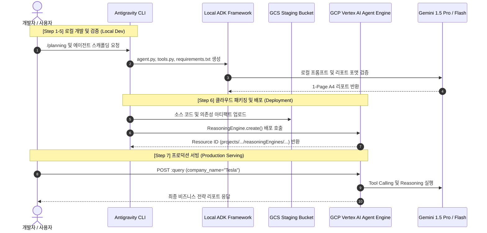

# Antigravity 기반 ADK 비즈니스 전략 에이전트 개발 및 GCP Agent Engine 배포 실습 가이드 (agy_agent)

본 문서는 **Antigravity CLI**를 활용하여 Google Cloud의 **ADK (Agent Development Kit)** 기반으로 특정 기업명을 입력받아 **A4 1장 분량의 비즈니스 전략 리포트**를 생성하는 AI 에이전트를 개발하고, 이를 **GCP Vertex AI Agent Engine (Reasoning Engine)**에 패키징·배포 및 프로덕션 서빙을 검증하는 종합 핸즈온 실습 가이드입니다.

---

## 1. 개요 및 학습 목표

- **ADK 기반 에이전트 구현:** Google Cloud ADK 및 Gemini 모델을 활용하여 기업 분석 및 전략 리포트를 자동 생성하는 지능형 에이전트를 작성합니다.
- **정형화된 보고서 포맷팅:** 시장 동향, 경쟁 분석, SWOT, 전략적 제언을 A4 1장(약 800~1,200 단어) 규격으로 압축 요약하는 프롬프트와 툴을 바인딩합니다.
- **GCP Vertex AI Agent Engine 배포:** 로컬에서 검증된 에이전트 코드를 Vertex AI Reasoning Engine 런타임에 서버리스 형태로 배포합니다.
- **클라우드 인퍼런스 및 관측성(Observability):** 배포된 원격 에이전트에 질의를 전송하고 Cloud Logging을 통해 실행 트레이스를 모니터링합니다.

---

## 2. 비즈니스 시나리오 및 전체 아키텍처

### 2.1 비즈니스 시나리오

사용자가 분석하고자 하는 기업명(예: `Tesla`, `Google`, `Samsung Electronics`)을 입력하면, 에이전트가 내장된 분석 툴과 최신 시장 지식을 바탕으로 경영진 보고용 **A4 1장 비즈니스 전략 리포트**를 마크다운 형식으로 즉시 생성합니다.

### 2.2 전체 시스템 아키텍처



---

## 3. 사전 준비 사항 (Prerequisites)

| 구분                | 요구사항                                                                                                                    | 비고                     |
| :------------------ | :-------------------------------------------------------------------------------------------------------------------------- | :----------------------- |
| **GCP 프로젝트**    | Google Cloud Project ID                                                                                                     | Vertex AI 사용 권한 필요 |
| **GCP 권한**        | Vertex AI Admin, Storage Admin, Cloud Build Editor                                                                          | IAM 권한 확인            |
| **GCS 버킷**        | Staging용 Cloud Storage 버킷                                                                                                | 배포 아티팩트 보관용     |
| **로컬 환경**       | Python 3.10+, Antigravity CLI, `gcloud` CLI                                                                                 | 가상환경 활성화          |
| **활성화 필수 API** | `aiplatform.googleapis.com`<br>`cloudbuild.googleapis.com`<br>`storage.googleapis.com`<br>`artifactregistry.googleapis.com` | Vertex AI & Build API    |

---

## 4. 단계별 실습 가이드 (Hands-on Lab Steps)

### Step 1: GCP 환경 설정 및 인증

터미널에서 Google Cloud 인증을 수행하고 실습에 필요한 GCP 프로젝트와 API를 활성화합니다.

```bash
# 1. Google Cloud 계정 및 ADC(Application Default Credentials) 로그인
gcloud auth login
gcloud auth application-default login

# 2. 실습 대상 GCP 프로젝트 설정 (자신의 프로젝트 ID로 변경)
export GCP_PROJECT_ID="your-project-id"
export GCP_REGION="us-central1"
export GCS_BUCKET_NAME="gs://${GCP_PROJECT_ID}-agent-staging"

gcloud config set project $GCP_PROJECT_ID

# 3. 필수 GCP API 활성화
gcloud services enable \
    aiplatform.googleapis.com \
    cloudbuild.googleapis.com \
    storage.googleapis.com \
    artifactregistry.googleapis.com

# 4. Staging용 Google Cloud Storage 버킷 생성
gcloud storage buckets create $GCS_BUCKET_NAME --location=$GCP_REGION
```

---

### Step 2: 실습 프로젝트 스캐폴딩 및 의존성 구성

실습 전용 디렉터리를 생성하고 가상환경과 필요한 Python 패키지를 설치합니다.

```bash
# 1. 작업 디렉터리 생성 및 이동
mkdir -p ~/antigravity-lab/lab/agy_agent/src
mkdir -p ~/antigravity-lab/lab/agy_agent/tests
cd ~/antigravity-lab/lab/agy_agent

# 2. Python 가상환경 생성 및 활성화
python3 -m venv .venv
source .venv/bin/activate

# 3. 의존성 정의 (requirements.txt)
cat << 'EOF' > requirements.txt
google-adk>=0.1.0
google-cloud-aiplatform>=1.60.0
pydantic>=2.8.2
python-dotenv>=1.0.1
requests>=2.31.0
pytest>=8.0.0
EOF

# 4. 패키지 설치
pip install --upgrade pip
pip install -r requirements.txt
```

---

### Step 3: 비즈니스 전략 툴 구현 (`src/tools.py`)

에이전트가 기업 정보를 수집하고 정량 지표를 파싱할 때 사용할 커스텀 분석 도구를 작성합니다.

```python
# src/tools.py
from typing import Dict, Any

def get_company_overview(company_name: str) -> Dict[str, Any]:
    """
    대상 기업의 기본 산업군, 주요 제품 및 최근 주요 비즈니스 포커스를 조회합니다.
    """
    # 실제 환경에서는 Google Search Tool 또는 기업 정보 API를 연동할 수 있습니다.
    mock_db = {
        "tesla": {
            "industry": "전기차 (EV) 및 에너지 솔루션",
            "key_products": ["Model 3/Y", "Cybertruck", "Full Self-Driving (FSD)", "Megapack"],
            "recent_focus": "자율주행 Robotaxi, 휴머노이드 로봇(Optimus), 차세대 저가형 플랫폼"
        },
        "google": {
            "industry": "인터넷 서비스, 클라우드, 인공지능 (AI)",
            "key_products": ["Google Search", "YouTube", "Google Cloud Platform", "Gemini AI"],
            "recent_focus": "GenAI 인프라 확장, 엔터프라이즈 AI 솔루션, 자율주행(Waymo)"
        },
        "samsung electronics": {
            "industry": "반도체 및 전자제품 제조",
            "key_products": ["HBM/DRAM 메모리", "Galaxy 스마트폰", "파운드리", "디스플레이"],
            "recent_focus": "AI 반도체 HBM3E/HBM4 공급 확대, 온디바이스 AI 스마트폰 생태계 강화"
        }
    }

    key = company_name.strip().lower()
    return mock_db.get(key, {
        "industry": "글로벌 테크 및 제조",
        "key_products": ["주력 제품 및 서비스 라인업"],
        "recent_focus": "AI 디지털 전환 및 글로벌 시장 다변화"
    })
```

---

### Step 4: ADK 에이전트 핵심 클래스 구현 (`src/agent.py`)

A4 1장 규격을 강제하는 System Instruction과 Vertex AI Gemini 모델 연동 로직을 작성합니다.

```python
# src/agent.py
import vertexai
from vertexai.generative_models import GenerativeModel, Tool, FunctionDeclaration
from src.tools import get_company_overview

class BusinessStrategyAgent:
    """기업명을 입력받아 A4 1장 분량의 전략 리포트를 생성하는 ADK 에이전트"""

    def __init__(self, model_name: str = "gemini-1.5-pro-002"):
        self.model_name = model_name
        self.model = None

    def set_up(self):
        """Reasoning Engine 런타임 초기화 시 1회 실행되는 설정 함수"""
        system_instruction = """
당신은 맥킨지/BCG 출신의 수석 비즈니스 전략 컨설턴트입니다.
사용자가 기업명을 입력하면, 아래의 4대 핵심 영역을 포함하는 [A4 1장 비즈니스 전략 리포트]를 작성하세요.

[보고서 작성 필수 가이드라인]
1. 분량: A4 1장 분량 (마크다운 기준 약 800~1,000 단어)으로 압축하여 작성할 것.
2. 서식: 헤더(#, ##), 불릿 포인트, 핵심 강조(볼드체), 표(Table)를 적극 활용할 것.
3. 구성 항목:
   # [기업명] 비즈니스 전략 보고서 (Executive Brief)
   ## 1. Executive Summary (경영 요약 - 핵심 메시지 3줄)
   ## 2. Market & Industry Dynamics (시장 환경 및 기회/위협 요인)
   ## 3. Core Competencies & SWOT Analysis (핵심 역량 및 SWOT 요약 표)
   ## 4. Strategic Recommendations & Action Items (단기/중장기 실행 전략 3가지)
4. 어조: 비즈니스 전문적이고 객관적이며 실행 가능한(Actionable) 제언을 제시할 것.
"""
        # 도구 바인딩 및 모델 초기화
        self.model = GenerativeModel(
            model_name=self.model_name,
            system_instruction=[system_instruction]
        )

    def query(self, company_name: str) -> str:
        """
        Reasoning Engine 서빙 엔드포인트:
        기업명을 입력받아 최종 A4 1장 마크다운 전략 리포트를 반환합니다.
        """
        if not self.model:
            self.set_up()

        overview = get_company_overview(company_name)
        prompt = f"""
분석 대상 기업: {company_name}
기업 기초 컨텍스트:
- 산업군: {overview['industry']}
- 주요 제품: {', '.join(overview['key_products'])}
- 최근 비즈니스 포커스: {overview['recent_focus']}

위 정보를 바탕으로 완성도 높은 A4 1장 비즈니스 전략 리포트를 마크다운으로 작성해주세요.
"""
        response = self.model.generate_content(prompt)
        return response.text
```

---

### Step 5: 로컬 환경 실행 및 리포트 검증 (`tests/test_local.py`)

배포 전 로컬 환경에서 에이전트 인스턴스를 생성하고 리포트 생성 결과를 검증합니다.

```python
# tests/test_local.py
import os
import vertexai
from src.agent import BusinessStrategyAgent

PROJECT_ID = os.getenv("GCP_PROJECT_ID", "your-project-id")
LOCATION = os.getenv("GCP_REGION", "us-central1")

vertexai.init(project=PROJECT_ID, location=LOCATION)

def test_local_agent():
    print("=== [로컬 테스트] BusinessStrategyAgent 초기화 ===")
    agent = BusinessStrategyAgent()
    agent.set_up()

    target_company = "Tesla"
    print(f"\n>> 질의 실행: {target_company}")
    report = agent.query(target_company)

    print("\n" + "="*50)
    print("생성된 A4 1장 비즈니스 전략 리포트:")
    print("="*50)
    print(report)

    assert len(report) > 300, "보고서 내용이 너무 짧습니다."
    assert "SWOT" in report or "Executive Summary" in report, "필수 섹션이 누락되었습니다."
    print("\n✅ 로컬 테스트 성공!")

if __name__ == "__main__":
    test_local_agent()
```

#### 로컬 테스트 실행

```bash
export GCP_PROJECT_ID="your-project-id"
export GCP_REGION="us-central1"
python tests/test_local.py
```

---

### Step 6: GCP Vertex AI Agent Engine (Reasoning Engine) 원격 배포 (`deploy.py`)

Vertex AI SDK의 `ReasoningEngine.create()` 메서드를 사용하여 에이전트를 클라우드에 배포합니다.

```python
# deploy.py
import os
import vertexai
from vertexai.preview import reasoning_engines
from src.agent import BusinessStrategyAgent

PROJECT_ID = os.getenv("GCP_PROJECT_ID", "your-project-id")
LOCATION = os.getenv("GCP_REGION", "us-central1")
STAGING_BUCKET = os.getenv("GCS_BUCKET_NAME", f"gs://{PROJECT_ID}-agent-staging")

print(f"Initializing Vertex AI (Project: {PROJECT_ID}, Location: {LOCATION})...")
vertexai.init(
    project=PROJECT_ID,
    location=LOCATION,
    staging_bucket=STAGING_BUCKET
)

print("🚀 Vertex AI Agent Engine (Reasoning Engine)에 배포를 시작합니다...")

remote_agent = reasoning_engines.ReasoningEngine.create(
    BusinessStrategyAgent(),
    requirements=[
        "google-cloud-aiplatform>=1.60.0",
        "pydantic>=2.8.2",
        "requests>=2.31.0"
    ],
    extra_packages=["src"],
    display_name="business-strategy-agent-v1",
    description="기업명을 입력받아 A4 1장 비즈니스 전략 리포트를 생성하는 ADK 에이전트"
)

print("\n🎉 배포가 성공적으로 완료되었습니다!")
print(f"👉 Resource Name: {remote_agent.resource_name}")

# 배포된 리소스 정보를 파일에 기록
with open("deployed_agent_resource.txt", "w") as f:
    f.write(remote_agent.resource_name)
```

#### 배포 실행

```bash
python deploy.py
```

배포 완료 시 다음과 같은 Resource Name이 생성됩니다:

```text
projects/123456789012/locations/us-central1/reasoningEngines/9876543210987654321
```

---

### Step 7: 프로덕션 원격 인퍼런스 및 Cloud Logging 검증 (`tests/test_remote.py`)

배포된 클라우드 리소스 ID를 통해 원격 질의를 실행하고 응답을 확인합니다.

```python
# tests/test_remote.py
import os
import vertexai
from vertexai.preview import reasoning_engines

PROJECT_ID = os.getenv("GCP_PROJECT_ID", "your-project-id")
LOCATION = os.getenv("GCP_REGION", "us-central1")

vertexai.init(project=PROJECT_ID, location=LOCATION)

# 저장된 Resource Name 로드
with open("deployed_agent_resource.txt", "r") as f:
    resource_name = f.read().strip()

print(f"Connecting to Remote Agent Engine: {resource_name}...")
remote_agent = reasoning_engines.ReasoningEngine(resource_name)

# 원격 질의 실행
query_input = "Samsung Electronics"
print(f"\n>> 원격 질의 전송: '{query_input}'")
response = remote_agent.query(company_name=query_input)

print("\n" + "="*60)
print("원격 Agent Engine에서 수신한 비즈니스 전략 리포트:")
print("="*60)
print(response)
print("\n✅ 원격 인퍼런스 테스트 완료!")
```

#### 원격 테스트 실행

```bash
python tests/test_remote.py
```

---

## 5. 실행 결과 예시 (Sample Execution Output)

원격 Agent Engine이 최종 생성한 A4 1장 마크다운 보고서 예시입니다:

```markdown
# Samsung Electronics 비즈니스 전략 보고서 (Executive Brief)

## 1. Executive Summary

- **글로벌 리더십 유지 및 반도체 슈퍼사이클 대응:** HBM3E/HBM4 중심의 고부가가치 AI 메모리 공급망 주도권 탈환이 최우선 과제임.
- **모바일/가전의 온디바이스 AI 생태계 선점:** Galaxy AI를 통한 프리미엄 라인업 수익성 방어 및 디바이스 간 락인(Lock-in) 극대화 필요.
- **파운드리 수율 및 고객사 다변화:** 첨단 3nm/2nm 공정 안정화를 통한 빅테크 고객 확보가 중장기 밸류에이션 리레이팅의 핵심.

## 2. Market & Industry Dynamics

- **AI 반도체 수요 폭발:** 빅테크의 LLM 투자 지속에 따라 고성능 HBM 및 CXL 기반 메모리 수요가 전년 대비 150% 이상 급증.
- **경쟁 심화:** 엔비디아 공급망 내 SK하이닉스와의 치열한 HBM 점유율 경쟁 및 파운드리 부문 TSMC와의 격차 축소 압박.

## 3. Core Competencies & SWOT Analysis

| 구분                     | 주요 내용                                                                                          |
| :----------------------- | :------------------------------------------------------------------------------------------------- |
| **Strengths (강점)**     | 메모리, 파운드리, 패키징을 원스톱으로 제공하는 유일무이한 종합반도체(IDM) 역량 및 탄탄한 재무 구조 |
| **Weaknesses (약점)**    | HBM 시장 진입 타이밍 지연 및 파운드리 대형 팹리스 고객사 비중 부족                                 |
| **Opportunities (기회)** | 2026 온디바이스 AI 시장 개화, 피지컬 AI 로봇 및 자율주행 반도체 턴키 솔루션 수요 증가              |
| **Threats (위협)**       | 미·중 반도체 기술 패권 갈등 및 글로벌 공급망 지정학적 리스크                                       |

## 4. Strategic Recommendations & Action Items

1. **[단기] HBM4 조기 양산 및 맞춤형(Custom) HBM 전략 강화:** 주요 하이퍼스케일러와 공동 설계 메모리 협력 체계 구축.
2. **[중기] 온디바이스 AI 구독형 비즈니스 모델 발굴:** 단순 하드웨어 판매를 넘어 AI 서비스 플랫폼 수익화 전개.
3. **[장기] AI 턴키 솔루션(Turnkey) 패키지 수주:** 메모리 + 2nm 파운드리 + 2.5D 패키징을 결합한 통합 번들 프로모션 추진.
```

---

## 6. 문제 해결 및 모범 사례 (Troubleshooting)

### Q1. `ReasoningEngine.create()` 실행 시 Cloud Build 에러가 발생합니다.

- **원인:** `requirements`에 명시된 패키지 간의 버전 충돌이거나 GCS Staging 버킷 쓰기 권한이 누락된 경우입니다.
- **해결 방법:**
  1. Cloud Console > Cloud Build > 빌드 기록에서 상세 에러 로그 확인
  2. `requirements` 리스트의 라이브러리 버전을 고정(`==`)하고 기본 지원 버전으로 조정

### Q2. 원격 인퍼런스 호출 시 `PermissionDenied (403)` 오류가 발생합니다.

- **원인:** 현재 실행 주체(사용자 또는 서비스 계정)에 `roles/aiplatform.user` 권한이 부여되지 않았습니다.
- **해결 방법:**
  ```bash
  gcloud projects add-iam-policy-binding $GCP_PROJECT_ID \
      --member="user:your-email@example.com" \
      --role="roles/aiplatform.user"
  ```

---

## 7. 실습 완료 체크리스트

- [ ] GCP 프로젝트 설정 및 Vertex AI / Cloud Build / GCS API 활성화 완료
- [ ] ADK 기반 `BusinessStrategyAgent` 및 `tools.py` 로컬 구현 완료
- [ ] `tests/test_local.py`를 통한 로컬 인스턴스 A4 1장 보고서 생성 검증 완료
- [ ] `deploy.py`를 실행하여 Vertex AI Agent Engine에 Reasoning Engine 리소스 배포 성공
- [ ] `tests/test_remote.py`를 통한 클라우드 원격 질의 및 마크다운 리포트 수신 완료
