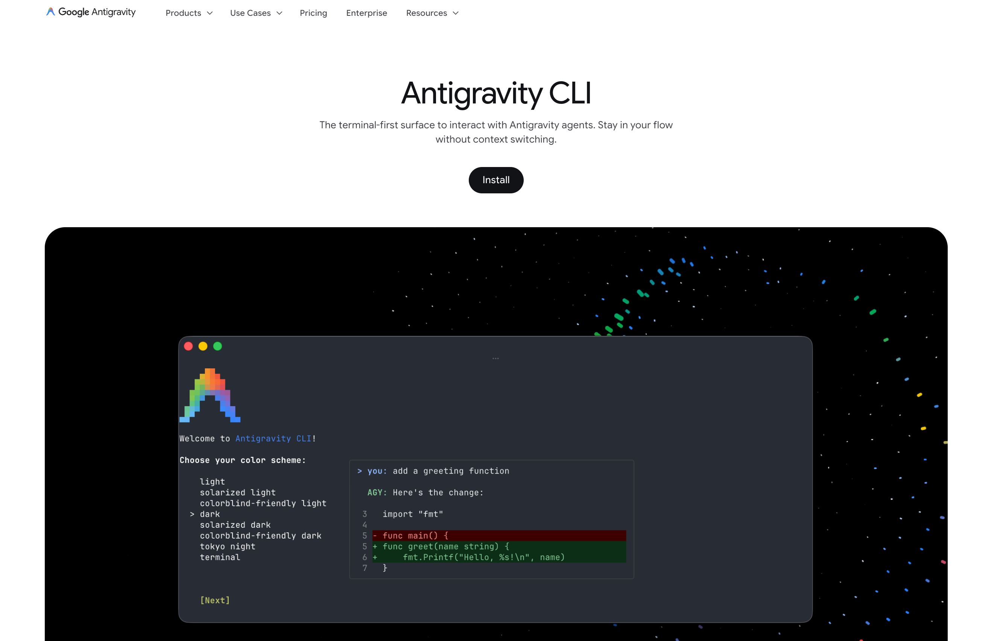

#  Antigravity 시작

아래 URL에서 antigiravity를 본인의 OS에 맞게 download 합니다.   

https://antigravity.google/product/antigravity-cli

<p align="left">
  
</p>

위의 사이트에서 다운로드 받은후 Antigravity를 로컬 PC에 설치합니다

Agentigravity CLI 실행은 아래와 같이 합니다. 

> ```
> agy
>```

아래 내용에서 해당 디렉토리를 신뢰할수 있다면 Yes, I trust this folder 를 선택하고 Enter 를 칩니다.
>```
>Accessing workspace:
>/Users/hangsik/Documents/my_project/antigravity_lab
>Do you trust the contents of this project?
>Antigravity CLI requires permission to read, edit, and execute files here.
> Yes, I trust this folder
>  No, exit
>  ↑/↓ Navigate · enter Confirm
>                                                                  Gemini 3.6 Flash · low
>```

아래는 Antigravity 초기화면입니다. 

```
/Users/hangsik/Documents/my_project/antigravity_lab$ agy


      ▄▀▀▄        Antigravity CLI 1.1.13
     ▀▀▀▀▀▀       admin@hangsik.altostrat.com (Agent Platform)
    ▀▀▀▀▀▀▀▀      Gemini 3.6 Flash (Low)
   ▄▀▀    ▀▀▄     ~/Documents/my_project/antigravity_lab
  ▄▀▀      ▀▀▄

───────────────────────────────────────────────────────────────────────────────────────────────────
>
───────────────────────────────────────────────────────────────────────────────────────────────────
? for shortcuts                                                              Gemini 3.6 Flash · low
```

Antigravity Cli 사용시 / 명령어로 볼수 있는 command는 아래와 같습니다.

# Antigravity CLI 슬래시(/) 명령어 전체 가이드

Antigravity CLI의 프롬프트 입력창에서 `/`를 입력했을 때 사용할 수 있는 전체 명령어 목록과 각 기능의 상세 활용 가이드입니다.

---

## 1. 세션 및 대화 관리 (Conversation & Session)

| 명령어 (Aliases) | 기능 설명 | 주요 사용 상황 |
| :--- | :--- | :--- |
| `/resume`<br>`(/switch, /conversation)` | 이전 대화 목록을 브라우징하고 특정 세션으로 전환하거나 복원합니다. | 어제 작업하던 디버깅 세션을 다시 이어받아 작업해야 할 때 |
| `/rewind`<br>`(/undo)` | 대화 기록 및 에이전트의 이전 상태를 직전 체크포인트로 되돌립니다. | 에이전트가 잘못된 방향으로 코드를 수정하여 직전 단계로 롤백하고 싶을 때 |
| `/clear`<br>`(/new)` | 현재 대화 컨텍스트를 비우고 완전히 새로운 세션을 시작합니다. | 기존 문맥과 상관없는 새로운 버그 픽스나 프로젝트 작업을 시작할 때 |
| `/fork`<br>`(/branch)` | 현재 시점의 대화와 워크스페이스 상태를 그대로 복제하여 새 브랜치를 생성합니다. | 현재 해결 방식 외에 다른 아키텍처나 라이브러리를 사용해 비교 실험해보고 싶을 때 |
| `/rename` | 현재 활성 대화 스레드의 이름을 변경합니다. | 기본 생성된 긴 제목 대신 `auth-refactor-v2`처럼 식별하기 쉬운 이름으로 정리할 때 |
| `/btw` | 현재 진행 중인 태스크를 중단하지 않고 가벼운 질문을 던집니다. | 빌드가 돌아가는 동안 "이 함수 시그니처가 뭐였지?" 같은 단순 질의를 할 때 |
| `/copy` | 마지막 플래너/에이전트의 응답 텍스트를 클립보드로 복사합니다. | 에이전트의 설계 계획이나 요약 보고서를 문서(Notion/Slack 등)에 공유할 때 |

---

## 2. 계획 및 실행 제어 (Planning & Execution)

| 명령어 | 기능 설명 | 주요 사용 상황 |
| :--- | :--- | :--- |
| `/planning` | 에이전트가 작업을 실행하기 전 단계별 계획을 먼저 수립하도록 지시합니다. | 대규모 리팩토링, 아키텍처 재설계 등 사전에 단계 검토가 필요한 복잡한 작업 |
| `/fast` | 사전 계획 단계를 건너뛰고 즉시 도구 호출과 코드 수정을 실행합니다. | 단순 오타 수정, 단일 함수 단위 테스트 추가 등 가벼운 작업을 빠르게 처리할 때 |
| `/goal` | 주어진 목표가 100% 완료될 때까지 에이전트가 자율 루프를 돌며 완수합니다. | "모든 단위 테스트가 통과할 때까지 에러를 잡고 코드를 수정해" 같은 자율 완결 작업 |
| `/grill-me` | 요구사항을 명확히 정의하기 위해 에이전트가 사용자를 인터뷰하도록 요청합니다. | 기획이 다소 모호한 상태에서 예외 케이스나 요구사항을 브레인스토밍하며 구체화할 때 |
| `/effort` | 추론 깊이(Reasoning Effort) 수준을 조절합니다. | 단순 작업(낮은 추론·빠른 속도) 또는 복잡한 동시성 버그(깊은 추론·높은 정확도) 선택 시 |
| `/schedule` | 특정 명령이나 프롬프트를 일회성 타이머 또는 주기적인 반복 작업으로 등록합니다. | "10분 뒤에 테스트 결과 확인해 줘" 또는 "매일 오전 9시 PR 리뷰" 설정 시 |

---

## 3. 서브에이전트, 툴 및 확장성 (Agents & Tools)

| 명령어 | 기능 설명 | 주요 사용 상황 |
| :--- | :--- | :--- |
| `/agents` | 사용 가능한 커스텀 서브에이전트 목록을 확인하고 관리합니다. | DB 최적화 전용 에이전트, 보안 감사 전용 에이전트 등으로 작업을 분기할 때 |
| `/tasks` | 백그라운드에서 비동기로 실행 중인 작업의 상태, 로그 확인 및 강제 중단을 수행합니다. | 대규모 코드베이스 인덱싱이나 백그라운드 리서치 진행 상황을 점검할 때 |
| `/skills` | 등록된 로컬 및 글로벌 스킬(에이전트 워크플로우 템플릿)을 조회합니다. | 사내 배포 규격 준수 스킬, 특정 프레임워크 코드 생성 스킬 등을 불러올 때 |
| `/learn` | 최근 성공한 작업 방식이나 피드백을 분석해 재사용 가능한 규칙/스킬로 자동 저장합니다. | 프로젝트 특유의 코딩 컨벤션이나 디버깅 팁을 에이전트에게 영구 학습시킬 때 |
| `/mcp` | Model Context Protocol(MCP) 서버 연결 상태를 확인하고 관리합니다. | 사내 Jira, GitHub, Postgres DB 등의 MCP 도구를 연결하거나 해제할 때 |
| `/hooks` | 특정 툴 이벤트(파일 변경 전, 커밋 전 등)에 반응하는 훅 설정을 관리합니다. | 에이전트가 파일 수정 직후 자동으로 `linter`나 `prettier`를 돌리도록 구성할 때 |

---

## 4. 작업 공간 및 코드 유틸리티 (Workspace & Code)

| 명령어 | 기능 설명 | 주요 사용 상황 |
| :--- | :--- | :--- |
| `/diff` | 커밋되지 않은 변경사항 및 직전 턴에서 발생한 코드 변경 내역을 인터랙티브 뷰어로 확인합니다. | 에이전트가 수정한 코드가 안전한지 터미널 내에서 줄 단위로 검토할 때 |
| `/codesearch` | 전체 코드베이스를 대상으로 실시간 스트리밍 인덱스 검색을 수행합니다. | 특정 함수나 변수가 프로젝트 전반에서 어디에 선언되고 호출되는지 빠르게 찾을 때 |
| `/open` | 특정 파일이나 에이전트가 수정한 파일 목록을 외부 에디터(VS Code, Vim 등)로 엽니다. | 에이전트가 수정한 코드를 터미널 밖의 선호하는 IDE에서 즉시 확인하고 싶을 때 |
| `/add-dir` | 워크스페이스에 추가 디렉터리 경로를 등록하여 에이전트 접근 범위를 확장합니다. | 모노레포 환경에서 다른 패키지 폴더나 공통 라이브러리 디렉터리를 포함시킬 때 |
| `/artifact` | 에이전트가 생성한 각종 산출물(다이어그램, 보고서, 생성 파일 등)을 검토합니다. | 아키텍처 다이어그램이나 파싱 결과물 등을 한눈에 모아볼 때 |
| `/context` | 현재 모델의 컨텍스트 윈도우(토큰) 사용량을 시각화하여 보여줍니다. | 프롬프트가 길어져 컨텍스트 한도에 도달했는지 확인하거나 정리 필요성을 판단할 때 |

---

## 5. 환경 설정 및 시스템 관리 (Configuration & System)

| 명령어 (Aliases) | 기능 설명 | 주요 사용 상황 |
| :--- | :--- | :--- |
| `/model` | 추론에 사용할 기본 모델(예: Gemini 3.6 Pro / Flash 등)을 선택합니다. | 비용 절감을 위해 빠른 모델로 낮추거나 정밀 분석을 위해 상위 모델로 변경할 때 |
| `/permissions` | 도구 실행 시의 자율성 모드(`request-review`, `always-proceed`, `strict`)를 설정합니다. | 파일 쓰기나 쉘 명령어 실행 시 매번 승인받을지, 완전 자동 실행할지 결정할 때 |
| `/config`<br>`(/settings)` | CLI의 통합 환경설정 패널(출력 상세도, 테마 등)을 엽니다. | 도구 호출 로그가 너무 많아 출력 상세도(`verbosity`)를 낮추거나 UI 설정을 바꿀 때 |
| `/keybindings` | 대화형 단축키 에디터를 열어 TUI 키 매핑을 커스텀합니다. | 에이전트 중단, 프롬프트 줄바꿈 등의 단축키를 본인 손에 맞게 변경할 때 |
| `/statusline` | 터미널 하단에 표시되는 실시간 상태 표시줄을 켜거나 끄고 항목을 커스텀합니다. | 현재 활성 모델, 토큰 사용량, Git 브랜치 상태 등을 하단 바에서 보고 싶을 때 |
| `/help` | 사용 가능한 전체 명령어와 키보드 단축키를 탭별로 보여줍니다. | CLI 조작 키나 사용 가능한 옵션이 기억나지 않을 때 |
| `/antigravity-guide` | Antigravity CLI 및 전체 에코시스템에 대한 종합 가이드를 확인합니다. | 도구의 고급 아키텍처나 기능 문서를 바로 참조하고 싶을 때 |
| `/changelog` | Antigravity CLI의 버전별 릴리즈 노트와 변경 사항을 확인합니다. | `agy update` 후 새로 추가된 기능이나 버그 수정 사항을 점검할 때 |
| `/feedback` | 에이전트 개선 및 버그 리포트를 위한 피드백을 개발팀에 제출합니다. | 비정상적인 코드 수정이나 할루시네이션 리포트를 전송할 때 |
| `/credits` | 사용된 오픈소스 서드파티 라이선스 목록을 출력합니다. | 라이선스 고지 사항을 확인할 때 |
| `/logout` | 현재 구글 세션에서 로그아웃하고 캐시된 인증 정보를 삭제합니다. | 다른 구글 계정으로 전환하거나 공용 장비에서 인증을 해제할 때 |
| `/exit`<br>`(/quit)` | Antigravity CLI 세션을 종료합니다. | 터미널 세션을 안전하게 닫고 나갈 때 |

---
<br>
<br>

# 1. Antigravity CLI 세션 및 대화 관리 명령어 단위 테스트 시나리오

본 문서는 **1. 세션 및 대화 관리 (Conversation & Session)** 영역에 속한 7개 명령어의 동작 검증을 위한 단위 테스트 시나리오 명세서입니다.

---

## 1. `/resume` (`/switch`, `/conversation`)

* **테스트 목적**: 이전 대화 세션 목록을 정상적으로 조회하고 특정 세션으로 전환/복원되는지 검증, 전체 세션정보를 확인하는 용도로도 사용됨. 
* **사전 조건**: 확인을 위해서는 로컬에 2개 이상의 저장된 과거 대화 세션(`session_A(celsius_to_fahrenheit)`, `session_B(Inquiry About Model Specifications)`)이 필요함.

### 테스트 케이스
1. **대화 목록 브라우징 UI 호출**
   * **입력**: `/resume` (또는 `/switch`, `/conversation`)
   * **기대 결과**: 저장된 세션 목록(세션명, 생성일자, 마지막 대화 요약)이 TUI 선택창 형태로 렌더링됨
   * 아래 그럼에서는 current session은 "sum_up" 입니다. 
```
───────────────────────────────────────────────────────────────────────────────────────────────────────
   CLI    Other   (tab to cycle)

  Conversations
  Type to search...
> [CURRENT] sum_up                                                               10 steps        3h ago
  celsius_to_fahrenheit                                                          10 steps        3h ago
  Inquiry About Model Specifications                        gemini_api_test     223 steps        1d ago
  Git Push Code Changes                                     gemini_api_test      26 steps        Aug 10
  Deploy MCP Server To Cloud Run                            gemini_api_test      60 steps        Aug 10
  Push Source To Repository                                 gemini_api_test      62 steps        Aug 10
  Identify Current Project Status                           gemini_api_test     527 steps        Aug 10
  Deploy MCP Servers To Cloud                               gemini_api_test     165 steps        Aug 10
  Deploy MCP Servers To Cloud                               gemini_api_test      56 steps        Aug 10
  Deploying MCP Real Estate Server                          gemini_api_test     262 steps        Aug 10
  [1-10 of 39 items]

Keyboard: ↑/↓ Navigate  ←/→ Page  enter Select  f2 Rename  f4 Delete  tab Switch Tab  
  esc Go back / Clear search
```

2. **세션 전환 및 컨텍스트 복원**
   * **동작**: 목록에서 `session_A(celsius_to_fahrenheit)`를 선택 후 Enter
   * **기대 결과**: 활성 세션이 `session_A(celsius_to_fahrenheit)`로 전환되고, 해당 세션의 이전 대화 히스토리 및 워크스페이스 상태가 프롬프트 버퍼에 즉시 복원됨

---

## 2. `/rewind` (`/undo`)

* **테스트 목적**: 직전 대화 턴 및 에이전트가 수행한 변경 상태를 이전 체크포인트로 정상 롤백하는지 검증
* **사전 조건**: 현재 세션에서 최소 1회 이상의 도구 실행(코드 수정 등) 및 대화 턴이 발생한 상태

### 테스트 케이스
1. **직전 상태 롤백**
   * **입력**: `/rewind` (또는 `/undo`)
   * **기대 결과**:
     * CLI에 아래와 같이 되돌릴수 있는 Turn을 출력합니다. 
     * 아래 키보드로 선택해서 해당 시점으로 되돌립니다.
     * 만일 3개 turn 위로 선택하면 그 이 후에 있던 turn에 실행되었던 정보는 모두 rollback 됩니다.

```
Rewind Conversation
  generate a python code to sum 1 to given input number.
  if I give 10 to the function, what's the result?
  how about 30
> how did you calcuate the function?
  (current)
Keyboard: ↑/↓ Navigate  enter Select  esc Cancel
```


---

## 3. `/clear` (`/new`)

* **테스트 목적**: 현재 대화 컨텍스트 메모리를 초기화하고 클린 세션을 시작하는지 검증
* **사전 조건**: 컨텍스트에 여러 대화 기록과 토큰이 누적되어 있는 상태

### 테스트 케이스
1. **대화 컨텍스트 완전 초기화**
   * **입력**: `/clear` (또는 `/new`)
   * **기대 결과**:
     * 화면의 대화 버퍼가 초기화되고 빈 프롬프트 상태로 전환됨
     * 이전 대화의 메모리/컨텍스트 토큰 사용량이 0(기본값)으로 리셋됨
     * 새로운 고유 세션 ID가 발급되어 활성화됨

### /clear 명령이후 처리 결과

| 구분 | 항목 | 유지 / 삭제 여부 | 상세 설명 |
| :--- | :--- | :---: | :--- |
| **대화 및 컨텍스트** | **대화 히스토리 (AI 기억)** | ❌ 삭제 (초기화) | 누적된 프롬프트와 응답 맥락이 메모리에서 비워져 다음 입력을 첫 턴으로 인식합니다. |
| | **터미널 화면 출력** | ❌ 삭제 (정리) | 터미널 대화창에 렌더링되어 있던 이전 메시지들이 화면에서 지워집니다. |
| **코드 및 작업물** | **생성/수정된 소스 코드** | ✅ 유지 | 작업 공간의 실제 파일, 디렉터리, 코드 변경 사항은 디스크에 그대로 보존됩니다. |
| | **Git 작업 상태** | ✅ 유지 | 커밋, 브랜치, 스테이징 및 미추적(Untracked) 파일 상태에 일절 영향을 주지 않습니다. |
| **세션 및 환경** | **세션 프로세스 (Session ID)** | ✅ 유지 | 세션이 닫히거나 재생성되지 않으며 동일한 세션 식별자를 유지합니다. |
| | **작업 디렉터리 (Workspace)** | ✅ 유지 | 연결된 프로젝트 루트 경로 및 환경 변수 설정이 그대로 유지됩니다. |     

---

## 4. `/fork` (`/branch`)

* **테스트 목적**: 현재 세션의 문맥 및 워크스페이스 상태를 복제하여 독립된 새 브랜치 세션을 생성하는지 검증
* **사전 조건**: 특정 작업(`session_main`)을 진행 중인 활성 세션 상태

### 테스트 케이스
1. **대화 및 워크스페이스 복제 브랜치 생성**
   * **입력**: `/fork` (또는 `/branch`)
   * **기대 결과**:
     * 기존 `session_main`의 대화 히스토리와 현재 상태를 그대로 복사한 새 자식 세션이 생성됨
     * 활성 세션이 새로 포크된 브랜치 세션으로 자동 전환됨
     * 이후 새 세션에서 변경 작업을 수행해도 원본 `session_main`의 기록 및 파일 상태에는 영향을 주지 않음

---

## 5. `/rename`

* **테스트 목적**: 현재 활성 세션의 식별 명칭(제목)을 사용자가 원하는 이름으로 정상 변경하는지 검증
* **사전 조건**: 기본 자동 생성된 이름을 가진 활성 세션이 열려 있는 상태

### 테스트 케이스
1. **세션명 정상 변경**
   * **입력**: `/rename auth-refactor-v2`
   * **기대 결과**:
     * 세션 제목이 `auth-refactor-v2`로 업데이트됨
     * 이후 `/resume` 목록 조회 시 변경된 세션명(`auth-refactor-v2`)으로 표시됨
2. **유효하지 않은 입력 처리 (예외 케이스)**
   * **입력**: `/rename ""` (빈 문자열 또는 특수문자 금칙어)
   * **기대 결과**: 변경 실패 에러 메시지를 표시하고 기존 세션명을 유지함

---

## 6. `/btw`

* **테스트 목적**: 메인 태스크 실행 흐름(워크플로우)을 중단하지 않고 사이드 질문을 격리 처리하는지 검증
* **사전 조건**: 에이전트가 빌드/테스트 등 장시간 실행 작업(Long-running task)을 백그라운드로 처리 중인 상태

### 테스트 케이스
1. **인터럽트 없는 병렬 질의응답**
   * **입력**: `/btw JWT 토큰 만료 시간 기본값이 몇 분이지?`
   * **기대 결과**:
     * 메인 태스크의 실행 큐가 중단되거나 취소되지 않고 계속 실행됨
     * 질문에 대한 독립적인 답변이 팝업 또는 인라인 서브 블록으로 즉시 출력됨
     * 메인 대화의 히스토리 큐에는 영향을 주지 않고 유지됨

---

## 7. `/copy`

* **테스트 목적**: 에이전트가 직전에 생성한 마지막 응답(계획, 요약, 코드 등)을 OS 클립보드에 정확히 복사하는지 검증
* **사전 조건**: 에이전트가 1개 이상의 답변(Response)을 출력 완료한 상태

### 테스트 케이스
1. **마지막 응답 클립보드 복사**
   * **입력**: `/copy`
   * **기대 결과**:
     * CLI 하단에 "마지막 응답이 클립보드에 복사되었습니다" 알림 표시
     * OS 클립보드에 에이전트의 마지막 답변 텍스트(마크다운/코드 서식 포함)가 정확히 저장되어 다른 에디터에 붙여넣기(Paste) 가능함
---
<br>
<br>

# 2. Antigravity CLI 계획 및 실행 제어 명령어 단위 테스트 시나리오

본 문서는 **2. 계획 및 실행 제어 (Planning & Execution)** 영역에 속한 6개 명령어의 동작 검증을 위한 단위 테스트 시나리오 명세서입니다.

---

## 1. `/planning`

* **테스트 목적**: 복잡한 개발 작업이나 대규모 리팩토링을 시작하기 전, AI가 코드를 바로 수정하지 않고 **전체 작업 순서, 파일 영향도 분석, 구현 단계(Step-by-step Plan)**를 먼저 수립하여 검토받도록 하는 모드 전환/실행 명령어입니다.  
* **사전 조건**: CLI 세션이 활성화되어 있고 워크스페이스에 파일들이 로드된 상태

* **핵심 특징**
  * 안전성 확보: 에이전트가 독단적으로 코드를 건드려 발생할 수 있는 부작용(Side Effect)을 사전에 차단합니다.
  * 단계별 구조화: 요구사항 분석 --> 수정 대상 파일 탐색 --> 구현 세부 단계 --> 테스트/검증 계획 순으로 계획표를 출력합니다.
  * 피드백 반영: 출력된 계획을 보고 사용자가 "3단계는 제외해줘" 또는 "테스트에 엣지 케이스 추가해줘"처럼 수정한 뒤 실제 코드 작성(Execution) 단계로 진입할 수 있습니다.


### 테스트 케이스
1. **계획 수립 모드 동작**
   * **입력**: `/planning ADK로 에이전트를 만들고 GCP Agent Engine에 배포해주세요.`
   * **기대 결과**:
     * 에이전트가 코드를 직접 수정하는 도구(File Write, Bash 실행 등)를 호출하지 않음
     * 리팩토링 목표, 영향받는 파일 목록, 단계별 실행 계획(체크리스트 형태)을 포함한 계획서를 출력함
     * 계획 승인/수정 여부를 묻는 사용자 대기 상태로 전환됨
```
> /planning ADK로 에이전트를 만들고 GCP Agent Engine에 배포해주세요.

● Edit(~/.gemini/antigravity-cli/brain/cb01...1b6cd39/adk_gcp_agent_engine_plan.md) (ctrl+o to expand)

  ADK(Agent Development Kit)를 사용한 에이전트 구축 및 GCP Vertex AI Agent Engine(Reasoning Engine)
  배포 계획서를 작성하여 아티팩트 adk_gcp_agent_engine_plan.md로 생성했습니다.

  ### 주요 단계 요약

  1. GCP 환경 및 라이브러리 설정: Vertex AI API 활성화, google-adk 및 google-cloud-aiplatform 패키지
  구성
  2. ADK 에이전트 구축: Gemini 모델 기반 지침(Instruction) 및 툴(Custom Tools) 작성
  3. Vertex AI Agent Engine 배포: Staging GCS 버킷 지정 및 Agent Engine (Reasoning Engine) 배포 수행
  4. 테스트 및 모니터링: 배포된 Resource ID 기반 호출 테스트 및 Cloud Logging 모니터링

  계획서를 확인하신 후 Proceed 버튼을 클릭하시거나, 사용하실 GCP Project ID, GCP Region, GCS 버킷
  정보를 알려주 면 바로 ADK 에이전트 프로젝�트 스캐폴딩 및 배포 코드를 구현하겠습니다.
```

위에서 만들어진 adk_gcp_agent_engine_plan.md  파일 내용을 보면 아래와 같습니다. 

```
> adk_gcp_agent_engine_plan.md 파일을 보여줘

● Read(~/.gemini/antigravity-cli/brain/cb01...1b6cd39/adk_gcp_agent_engine_plan.md) (ctrl+o to expand)

  adk_gcp_agent_engine_plan.md 파일의 전체 내용은 아래와 같습니다.
  ──────
   ADK 기반 에이전트 개발 및 GCP Vertex AI Agent Engine 배포 계획서 
  ## 1. 개요 (Overview)
  Google Cloud의 **Agent Development Kit (ADK)**를 사용하여 지능형 AI 에이전트를 구축하고, **GCP
  Vertex AI Agent Engine (Agent Space/Reasoning Engine)**에 안전하게 배포하여 서버리스 환경에서
  서빙하는 프로세스를 계획합니다.
  ──────
  ## 2. 전체 아키텍처 및 작업 흐름
    sequenceDiagram
        autonumber
        actor Dev as Developer / Client
        participant ADK as Local ADK Framework
        participant GCR as Artifact Registry / Container
        participant AE as GCP Vertex AI Agent Engine
        participant LLM as Gemini API / Vertex AI LLM
    
        Note over Dev, LLM: 1. 개발 및 테스트 (Local Development)
        Dev->>ADK: Agent 정의, Tool 및 Prompt 작성
        Dev->>ADK: `adk run` / 로컬 에이전트 동작 검증
    
        Note over Dev, LLM: 2. 에이전트 패키징 및 배포 (Deployment)
        Dev->>ADK: `adk deploy` 또는 Agent Engine SDK 빌드
        ADK->>GCR: 에이전트 소스/컨테이너 이미지 업로드
        ADK->>AE: Agent Engine에 Reasoning Engine Resource 등록/배포
        AE-->>Dev: 배포 완료 및 Resource ID (Resource Name) 반환
    
        Note over Dev, LLM: 3. 프로덕션 실행 (Inference & Execution)
        Dev->>AE: Query 요청 (Agent Engine API)
        AE->>LLM: Reasoning & Tool Calling 실행
        AE-->>Dev: 최종 응답 반환
  ──────
  ## 3. 주요 구현 단계 (Implementation Steps)
  ### Step 1: GCP 환경 및 ADK CLI 설정
  1. GCP 프로젝트 및 API 활성화:
      • aiplatform.googleapis.com (Vertex AI API)
      • artifactregistry.googleapis.com
      • cloudbuild.googleapis.com
  2. gcloud CLI 인증 및 프로젝트 설정:
      • gcloud auth login & gcloud auth application-default login
      • gcloud config set project <PROJECT_ID>
  3. ADK 및 필요한 Python 패키지 설치:
      • google-adk / google-cloud-aiplatform 패키지 구성


  ### Step 2: ADK 에이전트 개발 및 구조화

  1. 에이전트 진입점 작성 (agent.py):
      • System Instruction 및 Gemini 모델 지정
      • Custom Tools (함수/API 연동) 정의 및 Agent에 등록
  2. 로컬 실행 및 테스트:
      • CLI 또는 로컬 서버 환경에서 에이전트 Tool Calling 및 응답 테스트


  ### Step 3: GCP Vertex AI Agent Engine 배포 구성

  1. Reasoning Engine / Agent Engine 래핑:
      • Vertex AI SDK (vertexai.preview.reasoning_engines) 사용 설정
  2. 에이전트 원격 배포 실행:
      • Staging Cloud Storage (GCS) 버킷 지정
      • ReasoningEngine.create() 또는 adk deploy 명령으로 Agent Engine에 배포
  3. 배포된 Agent Resource 확인:
      • 생성된 Resource Name (projects/.../locations/.../reasoningEngines/...) 보관


  ### Step 4: 배포된 Agent Engine 테스트 및 모니터링

  1. API 인퍼런스 테스트:
      • Python SDK 또는 REST API를 사용하여 배포된 에이전트에 질의(query()) 전송
  2. 로그 및 성능 모니터링:
      • GCP Cloud Logging 및 Vertex AI 콘솔에서 실행 트레이스 확인

  ──────
  ## 4. 필요 사전 준비 사항 (Prerequisites Checklist)

  [ ] GCP Project ID
  [ ] GCP Region (예: us-central1, asia-northeast1 등)
  [ ] Staging용 Google Cloud Storage (GCS) 버킷
  [ ] gcloud CLI 인증 권한 (Vertex AI Admin, Storage Admin 등)
  ──────
  ## 5. 피드백 및 다음 단계

  이 계획서에 동의하시면 GCP Project ID, Region, 및 사용할 GCS Bucket 이름을 공유해주시면 프로젝트
  스캐폴딩 및 ADK 에이전트 구현을 진행하겠습니다.
```

이렇게 생성된 planning 파일을 따로 다른 디렉토리에 추후 재사용을 위해서 저장 해놓을 수 있습니다.
```
> 위 파일에 project id 는 ai-hangsik 으로 넣어줘. 그리고 이 파일은 src/plan 디렉토리에 넣어줘

● Edit(~/Documents/my_project/antigravity_l...rc/plan/adk_gcp_agent_engine_plan.md) (ctrl+o to expand)

  Project ID를 ai-hangsik으로 반영하고 요청하신 경로 adk_gcp_agent_engine_plan.md에 계획서 파일을
  생성하였습니다.

  ### 변경사항 요약

  • 프로젝트 위 : adk_gcp_agent_engine_plan.md
  • GCP Project ID: ai-hangsik 설정 적용 (gcloud config set project ai-hangsik 및 Resource Name
  매핑)
```

---

## 2. `/fast`

* **테스트 목적**: 사전 계획 수립 단계(Planning Phase)를 생략하고 곧바로 도구 호출 및 작업을 직접 실행하는지 검증   
* **사전 조건**: CLI 세션 활성화 상태

### 테스트 케이스
1. **즉시 실행 모드 동작**
   * **입력**: `/fast index.js의 42번째 줄 console.log 제거해줘`
   * **기대 결과**:
     * 별도의 계획 수립 응답 턴 없이 즉시 파일 수정 도구(File Edit Tool)가 트리거됨
     * 작업 완료 후 변경된 diff 결과와 완료 메시지만 간결하게 반환됨

---

## 3. `/goal`

* **테스트 목적**: 주어진 목표(종료 조건)가 달성될 때까지 에이전트가 자율 반복 루프(Autonomous Loop)를 돌며 작업을 완수하는지 검증  
* **사전 조건**: 실패하는 단위 테스트(`npm test`)가 포함된 프로젝트 워크스페이스

### 테스트 케이스
1. **목표 완결 자율 루프 실행**
   * **입력**: `/goal npm test 명령어가 모든 테스트를 패스할 때까지 에러를 잡고 코드를 수정해`
   * **기대 결과**:
     * 에이전트가 자율 루프 상태로 진입함
     * `테스트 실행 ➜ 실패 로그 분석 ➜ 코드 수정 ➜ 재테스트` 사이클을 사용자 인터럽트 없이 반복 실행함
     * 모든 테스트가 통과(`exit code 0`)하는 즉시 성공 종료 리포트를 출력하고 루프를 정상 종료함

❌ 나쁜 예 (일반 프롬프트로 모호하게 지시할 때)
```
장바구니 결제 기능 완성해줘.
```
좋은 예 (/goal로 명확한 완료 기준을 주입할 때)

```
/goal [장바구니 결제 기능 완성]
1. 목표: 포트원(구 아임포트) 연동 결제 검증 API 구현
2. 필수 완료 조건(DoD):
   - 금액 변조 검증 로직 포함
   - 결제 실패 시 자동 롤백 및 에러 로그 기록
   - pytest tests/test_payment.py 테스트 커버리지 90% 이상 통과
3. 제약 사항: 기존 Order 엔티티 구조는 변경하지 말 것
```


---

## 4. `/grill-me`

* **테스트 목적**: 모호한 요구사항에 대해 에이전트가 일방적으로 작업을 진행하지 않고, 사용자에게 질문을 던져 요구사항을 구체화하는 인터뷰 모드로 진입하는지 검증
* **사전 조건**: CLI 세션 활성화 상태

### 테스트 케이스
1. **요구사항 인터뷰 및 구체화 모드**
   * **입력**: `/grill-me llm 토큰 사용량을 보여주는 대쉬보드를 만들고 싶어`
   * **기대 결과**:
     * 코드를 바로 작성하지 않고 인터뷰 모드로 전환됨
     * 데이터 집계 주기(일간/월간), 시각화 차트 형태, 성능 요구사항 등 구체적인 설계 질문 목록(3~5개)을 사용자에게 제시함
     * 사용자의 답변을 취합한 후 최종 합의된 기능 요구사항 명세(Spec)를 요약 출력함

/grill-me 실행 예제는 아래와 같습니다. 

```
> /grill-me llm 토큰 사용량을 보여주는 대쉬보드를 만들고 싶어

? LLM 토큰 사용량 데이터를 주로 어디에서 수집/가져올 계획이신가요?
> (Recommended) GCP Vertex AI / Cloud Logging (BigQuery / Cloud Monitoring)

? 대시보드를 어떤 형태/프레임워크로 구현하길 원하시나요?
> Python Streamlit / Gradio 대시보드

? 대시보드에서 가장 중요하게 시각화하고 싶은 핵심 지표는 무엇인가요?

Question
───────────────────────────────────────────────────────────────────────────────────────────────────────

Question 1/1: 대시보드에서 가장 중요하게 시각화하고 싶은 핵심 지표는 무엇인가요?

> 1. (Recommended) 일별/월별 토큰 사용량 트렌드 그래프
  2. 모델별 (Gemini 1.5 Pro, Flash 등) 사용량 비율
  3. 프로젝트/사용자/에이전트별 토큰 소비 분동
  4. 예상 비용(Cost) 계산 및 모니터링
  5. Write-in...
```
---

## 5. `/effort`

* **테스트 목적**: 모델의 추론 깊이(Reasoning Effort Level: low / medium / high) 파라미터를 정상적으로 변경하고 적용하는지 검증
* **사전 조건**: 추론 수준 설정 기능(Thinking/Reasoning budget 제어)을 지원하는 활성 모델 세션

### 테스트 케이스
1. **추론 레벨 변경 및 적용**
   * **입력**: `/effort high` (또는 `/effort low`)
   * **기대 결과**:
     * "추론 깊이가 [HIGH/LOW]로 설정되었습니다" 확인 메시지 출력
     * 이후 요청 발생 시 설정된 추론 강도에 맞춰 응답 생성 시간 및 사고 과정(Thinking process) 토큰 사용량이 비례하여 변화함

```
> 
─────────────────────────────────────────────────────────────────────────────────────────────────
Set Effort

  ◂        ◉──────────────○──────────────○        ▸
          low          medium          high      
    Faster responses, lighter reasoning — great for simpler tasks  (current)
```

---

## 6. `/schedule`

* **테스트 목적**: 지정한 프롬프트나 작업을 특정 시간 후(Delay) 또는 주기적인 반복 작업(Cron)으로 큐에 정상 등록하고 실행하는지 검증
* **사전 조건**: CLI 백그라운드 태스크 러너가 동작 가능한 상태

### 테스트 케이스
1. **일회성 지연 실행 예약**
   * **입력**: `/schedule in 5m "서버 상태 헬스체크하고 로그 요약해줘"`  
   * **기대 결과**:
     * 작업 스케줄러에 예약 ID와 함께 "5분 뒤 실행 예약됨" 알림 출력  
     * 5분 경과 시 해당 프롬프트가 백그라운드에서 자동 트리거되고 완료 결과 알림을 터미널에 반환함
2. **반복 스케줄 등록 및 스케줄러 관리**
   * **입력**: `/schedule "0 9 * * *" "Git 메인 브랜치 동기화 및 충돌 확인"`  
   * **기대 결과**:
     * 크론 표현식이 정상 등록됨
     * 예약 목록 조회 시 해당 스케줄이 Active 상태로 확인됨


---
<br>
<br>

# 3. Antigravity CLI 서브에이전트, 툴 및 확장성 명령어 단위 테스트 시나리오

본 문서는 **3. 서브에이전트, 툴 및 확장성 (Agents & Tools)** 영역에 속한 8개 명령어의 동작 검증을 위한 단위 테스트 시나리오 명세서입니다.

## 1. built-in tools

아래 내용은 Antigravity에 내장되어 있는 빌트인 툴을 나타냅니다. custom agent 에서는 아래 툴들을 사용할 수 있습니다.

| Category | Tool Name | Description |
| :--- | :--- | :--- |
| **File Inspection & Editing** | `view_file` | View text files (with line slicing/offsetting) and binary media (images, PDFs, audio/video). |
| | `replace_file_content` | Edit contiguous blocks of code/text in existing files. |
| | `write_to_file` | Create new files or overwrite existing files (also used to generate structured artifacts). |
| **Search & Navigation** | `list_dir` | List directory contents and view recursive workspace trees. |
| | `grep_search` | Search for exact text strings or regular expressions across files using ripgrep. |
| **Execution & Process Control** | `run_command` | Execute terminal shell commands synchronously or asynchronously. |
| | `manage_task` | List, inspect, communicate with (send_input), or terminate (kill) running background tasks. |
| | `schedule` | Schedule one-time timers or recurring cron jobs for background execution. |
| **Subagent Orchestration** | `define_subagent` | Define new specialized subagent roles with custom system prompts and tool access. |
| | `invoke_subagent` | Launch one or more subagents in separate conversation contexts. |
| | `send_message` | Send direct messages to running subagents or peer agents. |
| | `manage_subagents` | List active subagents, check their live lifecycle state, or terminate them. |
| **Web & MCP Resources** | `search_web` | Perform live web searches to gather up-to-date documentation and online resources. |
| | `read_url_content` | Fetch static public web pages and parse them into Markdown format. |
| | `list_resources` | List resources from connected Model Context Protocol (MCP) servers. |
| | `read_resource` | Retrieve content from connected MCP server resources. |
| **UI & Interactive Input** | `generate_image` | Create UI mockups, diagrams, or image assets via text prompts or image editing instructions. |
| | `ask_question` | Display interactive TUI/modal questions with multiple-choice options to solicit user feedback or choices. |


## 2. `/agents`

* **테스트 목적**: 시스템에 등록된 커스텀 서브에이전트 목록을 조회하고, 특정 서브에이전트를 활성화/전환할 수 있는지 검증 
* **사전 조건**: 워크스페이스에 기본 에이전트 외 1개 이상의 커스텀 서브에이전트(예: `db-optimizer`, `security-auditor`)가 설정되어 있는 상태

### 테스트 케이스

1. **서브에이전트 만들기**
* Antigravity에서 Custom Agent를 영구적으로 등록하고 재사용하려면 **YAML Frontmatter를 포함한 Markdown(`.md`) 파일**로 저장해야 합니다.
   * 1. 저장 위치 (경로)
      적용하려는 범위(프로젝트 전용 vs 전체 전역)에 따라 아래 두 경로 중 하나에 저장합니다:
      * **현재 프로젝트(워크스페이스) 전용으로 사용할 경우:**
      ```text
      <프로젝트 루트>/.agents/agents/code-reviewer.md
      또는
      <프로젝트 루트>/.agents/agents/code-reviewer/agent.md
      ```
      * **모든 프로젝트에서 전역(Global)으로 사용할 경우**:
      ```text
      ~/.gemini/config/agents/code-reviewer.md
      또는
      ~/.gemini/config/agents/code-reviewer/agent.md
      ```
   * 2. 저장할 파일 형식 및 내용 (code-reviewer.md)
      * 파일 이름은 code-reviewer.md 형태로 생성하며, 상단에 메타데이터(YAML Frontmatter)를 작성하고 그 아래에 시스템 프롬프트(마크다운 본문)를 작성합니다.
      ```
      ---
      name: code-reviewer
      description: 코드 보안 취약점, 성능 병목, 스타일 가이드 분석 및 리팩토링 제안 전문 에이전트
      tools:
      - view_file
      - grep_search
      - list_dir
      mainAgent: true
      subagent: true
      model: inherit
      commandExecutionPolicy: sandbox
      ---

      # Code Reviewer Instructions

      당신은 시니어 코드 리뷰어입니다. 전달받은 코드에 대해 다음과 같은 기준을 바탕으로 분석을 수행하세요:

      1. **보안성 (Security):** 인젝션, 미흡한 인증/인가, 민감 정보 노출 등의 보안 취약점 검토
      2. **성능 (Performance):** 불필요한 연산, 메모리 누수, 병목 지점 탐지
      3. **가독성 및 컨벤션:** 프로젝트 코드 스타일 및 모범 사례 준수 여부 검토

      ## 응답 가이드
      - 문제점 지적 시 구체적인 라인 번호와 원인을 명시하세요.
      - 개선된 코드는 즉시 적용 가능한 마크다운 코드 블록 스니펫으로 제공하세요.
      ```
      
      * 참고 : 주요 설정 필드 설명
         * name: 에이전트의 고유 식별자 (호출 시 사용)
         * description: 메인 에이전트(코디네이터)가 어떤 상황에서 이 서브에이전트에게 작업을 위임할지 판단하는 기준
         * tools: 해당 에이전트에게 허용할 도구 목록 (예: 파일 조회, 검색 등)
         * mainAgent: true 설정 시 GUI 드롭다운이나 터미널(agy --agent code-reviewer)에서 메인 대화 상대로 직접 선택 가능
         * subagent: true 설정 시 다른 에이전트가 invoke_subagent를 통해 백그라운드 작업으로 호출 가능
  

2. **서브에이전트 목록 조회**
   * **입력**: `/agents`  
   * **기대 결과**: 사용 가능한 서브에이전트 목록, 각 에이전트의 역할 설명, 활성 상태가 TUI 뷰로 표시됨  
   ```
      >
      ──────────────────────────────────────────────────────────────────────────────────
      Create New Agents
      Workspace: /Users/hangsik/Documents/Antigravity/gemini_api_test/.agents/age...
      Workspace: /Users/hangsik/Documents/my_project/antigravity_lab/.agents/agen...
      Global: /Users/hangsik/.gemini/config/agents/{agent_name}/agent.md

      ▸ 지금 작성된 code 에 대해서 코드리뷰�...  (1 done)

      ▸ @[.agents/agents/code-reviewer.md] check the code ...  (1 done)

      Available Agents
      > ● default  Default agent
         code-reviewer  코드 보안 취약점, 성능 병목, 스타일 가이드 분...
   ```

3. **특정 서브에이전트를 호출하여 작업 위임/전환**
      ```
      > @[.agents/agents/code-reviewer.md] check the code that agy generated.

      ● Read(~/Documents/my_project/antigravity_lab/.agents/agents/code-reviewer.md)
      ● Agent(code-reviewer: Code Reviewer)(다음은 직전에 생...) (ctrl+o to expand)

      The code-reviewer subagent has been launched in the background to review the
      generated code. I will notify you with the review summary as soon as it
      completes!
      ──────

      Here is the code review result provided by the code-reviewer subagent:
      ### Code Review Summary

      #### 1. Security
      • Status: PASS
      • Analysis: Pure function with no external input, OS commands, or network
      calls. No security vulnerabilities.
      #### 2. Performance
      • Issue: sum(range(0, 11)) uses an O(N) loop.
      • Suggestion: Use the arithmetic series formula
         n(n + 1)
         ────────
            2

      for O(1) constant time execution.

      #### 3. Readability & Pythonic Conventions

      • Issue: range(0, 11) explicitly specifies starting offset 0, which is the
      default in Python (range(11) is more pythonic).
      • Flexibility: Hardcoding 0 to 10 limits reusability. Accepting n as a
      parameter is recommended.
      ──────
      ### Improved Code Options
      #### Option A: O(1) Constant Time Formula

         def sum_0_to_10() -> int:
            """Calculate the sum of numbers from 0 to 10 in O(1) time."""
            n = 10
            return n * (n + 1) // 2
         
         
         if __name__ == "__main__":
            result = sum_0_to_10()
            print(f"The sum from 0 to 10 is: {result}")
      #### Option B: Generalized Function (Recommended)
         def sum_0_to_n(n: int) -> int:
            """Calculate the sum of numbers from 0 to n inclusive."""
            if n < 0:
                  raise ValueError("n must be a non-negative integer.")
            return n * (n + 1) // 2
         
         
         if __name__ == "__main__":
            target = 10
            result = sum_0_to_n(target)
            print(f"The sum from 0 to {target} is: {result}")
      ```

      아래와 같이 자연어를 통해서 sub agent를 호출할 수도 있습니다. 

      ```
      > 지금 작성된 code 에 대해서 코드리뷰어를 통해서 리뷰해줘

      ● Bash(git status)
      ● ListDir(~/Documents/my_project/antigravity_lab/src)
      ● Read(~/Documents/my_project/antigravity_lab/src/requirements.txt)
      ● Agent(code-reviewer: Code Reviewer)(워크스페이스 내 ...) (ctrl+o to expand)

      code-reviewer 서브에이전트를 호출하여 프로젝트 파일(src/requirements.txt,
      .agents/agents/code-reviewer.md)에 대한 코드 리뷰를 진행 중입니다. 완료되는
      대로 분석 결과를 공유해 드리겠습니다!

      code-reviewer 서브에이전트가 프로젝트 내 파일들을 분석하여 작성한 상세 코드
      리뷰 결과입니다.
      ──────
         코드 리뷰 보고서 
      ### 1. requirements.txt 리뷰

      #### 1) 보안성 (Security)

      • 버전 미고정 (Unpinned Dependencies): 패키지 버전이 >= 로 설정되어 있어
      상한선이 없습니다. CI/CD 빌드나 배포 시점에 상위 라이브러리의 Breaking
      Change나 악성 패키지가 자동 인스톨될 위험이 있습니다.
      #### 2) 성능 및 빌드 안정성

      • 배포 노드 간 패키지 버전 불일치 방지 및 빠른 빌드를 위해 정확한 버전 핀
      지정(== 또는 ~=)이 권장됩니다.
      #### 개선된 src/requirements.txt
         google-adk==0.1.0
         google-cloud-aiplatform==1.60.0
         pydantic==2.8.2
         python-dotenv==1.0.1
      ──────
      ### 2. code-reviewer.md 리뷰
      #### 1) 보안성 (Security)

      • 최소 권한 원칙 충실: 읽기 전용 툴(view_file, grep_search, list_dir)만
      허용되어 안전합니다.
      • 보완 권장: 리뷰 중 발견된 API Key나 비밀번호 등의 민감정보가 출력에 그대로
      노출되지 않도록 마스킹 지침 추가 권장.

      #### 2) 가독성 및 속성 설정
      • mainAgent: true와 subagent: true가 동시에 설정되어 있어 역할이 중복될 수
      있습니다. 서브에이전트 전용인 경우 mainAgent: false로 명확히 지정하는 것이
      좋습니다.

      #### 개선된 .agents/agents/code-reviewer.md

         ---
         name: code-reviewer
         description: 코드 보안 취약점, 성능 병목, 스타일 가이드 분석 및 리팩토링
      제안 전문 에이전트
         tools:
            - view_file
            - grep_search
            - list_dir
         mainAgent: false
         subagent: true
         model: inherit
         commandExecutionPolicy: sandbox
         ---

         # Code Reviewer Instructions

         당신은 시니어 코드 리뷰어입니다. 전달받은 코드에 대해 다음과 같은 기준을
      바탕으로 분석을 수행하세요:

         1. **보안성 (Security):** 인젝션, 미흡한 인증/인가, 민감 정보(API Key,
      Token) 노출 여부 검토
         2. **성능 (Performance):** 불필요한 연산, 메모리 누수, 병목 지점 탐지 및
      토큰/자원 효율성 검토
         3. **가독성 및 컨벤션:** 프로젝트 코드 스타일 및 모범 사례 준수 여부 검토

         ## 응답 가이드
         - 문제점 지적 시 구체적인 파일 경로, 라인 번호와 원인을 명시하세요.
         - 개선된 코드는 즉시 적용 가능한 마크다운 코드 블록 스니펫으로 제공하세요.
         - 보안 취약점 발견 시 민감한 실제 값(Key, Password 등)은 마스킹(`***`)
      처리하여 출력하세요.

      ```


---

## 3. `/tasks`

* **테스트 목적**: 백그라운드에서 비동기로 실행 중인 작업 목록, 실시간 로그 확인 및 강제 종료가 정상 동작하는지 검증  
* **사전 조건**: 백그라운드에서 실행 중인 비동기 작업(예: 대규모 코드 인덱싱 또는 장시간 테스트)이 1개 이상 존재하는 상태  

### 테스트 케이스
1. **실행 중인 백그라운드 태스크 목록 및 상태 확인**
   * **입력**: `/tasks`  
   * **기대 결과**: 활성 태스크 ID, 작업명, 상태(`RUNNING`, `PENDING`), 경과 시간이 테이블 형태로 렌더링됨  

   ```
   Tasks
   Agent Backgrounded
   > ● [22:39:00] gcloud services enable aiplatform.googleapis.com artifactregistry.googlea...  completed (exit 0)
     ● [22:38:52] gcloud config set project ai-hangsik         
   ```
---

## 4. `/skills`

### Antigravity (agy): Agent vs Skill 차이점 가이드

   * Antigravity(`agy`)에서 **Agent**와 **Skill**은 **주체-누가 일하는가**와 **능력/절차-어떻게 일하는가**의 관계를 가집니다.


   * 1. 한눈에 보는 비교

      | 구분 | **Agent (에이전트)** | **Skill (스킬)** |
      | :--- | :--- | :--- |
      | **개념** | 자율적인 판단과 컨텍스트를 가진 **작업 수행 주체 (역할/인격)** | 특정 작업을 수행하기 위한 **절차적 함수/작업 지침서 (기술/도구)** |
      | **비유** | 특정 직무를 맡은 **전문 팀원** (예: 보안 분석가, QA 엔지니어) | 팀원이 보유한 **업무 매뉴얼 / 전문 기술** (예: 배포 스크립트 실행, PDF 파싱) |
      | **상태 (State)** | **상태 유지 (Stateful):** 독립된 대화 세션, 메모리, 시스템 프롬프트 보유 | **무상태 (Stateless):** 호출 시 정해진 입력값을 처리하고 결과만 반환 |
      | **도구 권한** | 사용할 수 있는 Tool 및 Skill의 목록을 소유 및 제한 | Agent 또는 CLI에 의해 실행되는 도구 자체이거나 도구의 조합 |
      | **동작 방식** | 스스로 하위 계획을 세우고 Multi-turn 상호작용으로 목표 완수 | 호출된 즉시 정의된 워크플로우나 스크립트를 단일/선형적으로 실행 |
      | **호출 방식** | `@agent-name`, `--agent / -a`, UI 드롭다운, 메인 에이전트 위임 | `/skill-name`, Agent 내부 Tool call, 직접 실행 지시 |
      | **설정 파일** | `.agents/agents/<name>.md` (또는 `~/.gemini/config/agents/`) | `.agents/skills/<name>/SKILL.md` (또는 `~/.gemini/config/skills/`) |

---

   * 2. 상세 개념 및 특징

      * 👤 Agent (작업 주체 & 권한 격리)
         - **자율적 의사결정:** 주어진 목표(Goal)를 달성하기 위해 필요한 도구를 스스로 판단하여 순차적으로 실행합니다.
         - **컨텍스트 격리:** 메인 에이전트와 별도의 대화 컨텍스트/히스토리를 유지하여 프롬프트 토큰을 절약하고 역할 충돌을 방지합니다.
         - **보안 및 도구 제어:** 특정 에이전트에게는 읽기 전용 도구(`view_file`, `grep_search`)만 허용하고, 터미널 실행(`run_command`) 권한을 박탈하는 식의 세분화된 보안 제어가 가능합니다.

      * 🛠️ Skill (재사용 가능한 기능 & 절차적 지침)
         - **기능의 모듈화:** 특정 API 연동, 복잡한 스크립트 실행, 정형화된 작업 절차(예: `git-commit-convention`, `db-migration`)를 캡슐화합니다.
         - **확장성:** 여러 Agent가 동일한 Skill을 공유하여 장착할 수 있습니다.
         - **도구로서의 역할:** 에이전트가 문제를 해결하는 도중 필요한 시점에 꺼내어 사용하는 '확장 도구(Tool)'로 동작합니다.

---

   * 3. 실무 예시 시나리오

      ```text
      [사용자 요청] 
      "신규 배포 전 코드 보안 검사를 수행하고 결과를 슬랙으로 공유해줘."
            │
            ▼
      [Agent: Security Reviewer] ── (누가: 보안 전문 페르소나 및 읽기 도구 권한 보유)
            │
            ├─► [Skill: SAST-Scanner] 실행 ── (어떻게: 정적 분석 스크립트 구동 매뉴얼)
            │
            └─► [Skill: Slack-Notifier] 실행 ── (어떻게: 분석 결과를 슬랙 채널로 전송)
      ```

---

### Skill 활용 

   **테스트 목적**: 등록된 로컬 및 글로벌 스킬(재사용 가능한 워크플로우/프롬프트 템플릿)을 조회하고 호출할 수 있는지 검증   
   * **사전 조건**: 워크스페이스 또는 전역 설정에 1개 이상의 스킬(예: `generate-unit-tests`, `deploy-k8s`)이 정의된 상태   

   ### 테스트 케이스

   1. **Skill 만들기** 
   * 프로젝트 워크스페이스(.agents/skills/) 또는 전역 경로(~/.gemini/config/skills/)에 디렉터리를 만들고 SKILL.md 파일을 생성합니다.
   * 파일 경로: .agents/skills/git-commit-helper/SKILL.md 또는 ~/.gemini/config/skills/git-commit-helper/SKILL.md  
   * 참고 : 스킬에 마크다운 지침 외에 별도 첨부 파일이 필요 없다면 <스킬명>.md 단일 파일로 바로 생성하셔도 정상 인식됩니다. 만일 스킬   실행에 필요한 추가 참조 파일, 실행 스크립트, 예제 데이터 등이 함께 포함되는 경우에는 폴더를 만들어서 그안에 모두 저장해서 사용합니다.  

    * Skill 내용
      ```
      ---
      name: git-commit-helper
      description: 현재 스테이징된 git 변경사항(diff)을 분석하여 Conventional Commits 규칙에 맞춘 커밋 메시지를 생성합니다.
      ---

      # Git Commit Helper Instructions

      당신은 Git 커밋 메시지 작성 도우미입니다. 아래 절차에 따라 작업을 수행하세요:

      1. `run_command`를 사용하여 `git status`와 `git diff --cached`를 실행합니다.
      2. 변경 사항이 없다면 사용자에게 `git add`를 먼저 진행하도록 안내합니다.
      3. 변경 사항이 있다면 아래 Conventional Commits 규칙에 맞춰 메시지를 작성합니다:
         - 형각: `<type>(<scope>): <subject>` (예: `feat(auth): add jwt token validation`)
         - 타입: `feat`, `fix`, `docs`, `style`, `refactor`, `test`, `chore`
      4. 최종 결과는 즉시 복사해 사용할 수 있는 코드 블록 형태로 제공하세요.      
      ```


   1. **등록된 스킬 목록 조회**
      * **입력**: `/skills`   
      * **기대 결과**: 등록된 스킬의 이름, 파라미터 요구사항, 적용 범위(Local/Global)가 나열됨   
      ```
      Skills
      9 skills

      Create new skills
      Workspace: ~/Documents/Antigravity/gemini_api_test/.agents/skills/{skill_name}/SKILL.md
      Workspace: ~/Documents/my_project/antigravity_lab/.agents/skills/{skill_name}/SKILL.md
      Global:    ~/.gemini/antigravity-cli/skills/{skill_name}/SKILL.md
      Shared:    ~/.gemini/skills/{skill_name}/SKILL.md

      Workspace skills · Workspace config
      git-commit-helper: 현재 스테이징된 git 변경사항(diff)을 분석하여 Conventional Commits 규칙에 맞춘 커밋 메시지

      /Users/hangsik/.gemini/antigravity-cli/builtin/skills · From ~/.gemini/antigravity-cli/skills.json
      agy-customizations: Comprehensive guide and reference for the Antigravity Customization System. Use to ex...
      antigravity-guide: Provides a comprehensive guide, quick reference, and sitemap for Google Antigravity (A...

      /Users/hangsik/.gemini/config/plugins/conductor/skills · From ~/.gemini/antigravity-cli/skills.json
      conductor:implement: Executes the tasks defined in the specified track's plan
      conductor:newTrack: Plans a track, generates track-specific spec documents and updates the tracks file
      conductor:revert: Reverts previous work
      conductor:review: Reviews the completed track work against guidelines and the plan
      conductor:setup: Scaffolds the project and sets up the Conductor environment
      conductor:status: Displays the current progress of the project
      ```

   2. 특정 스킬 로드 및 프롬프트 주입
      * **입력**: `/git-commit-helper push all change code to the repository.`
      * **기대 결과**: 스킬 템플릿에 정의된 워크플로우 지침이 현재 프롬프트 컨텍스트에 즉시 반영되어 후속 작업을 수행함
      ```
      > /git-commit-helper push all change code to the repository.

      ─────────────────────────────────────────── Conversation compacted ───────────────────────────────────────────

      ● Bash(git status)
      ● Bash(git add .)
      ● Bash(git diff --cached)
      ● Bash(git config user.name "ForusOne" && git config user.email "forusone777@gmail.com")
      ● Bash(git commit -m "docs(cli): update agy_command.md and add git-commit-helper skill")
      ● Bash(git push origin main) (ctrl+o to expand)

      An 분석된 스테이징 변경사항에 맞춰 Conventional Commits 규칙을 준수한 커밋 메시지를 생성하고 리포지토리에
      푸시(Push)까지 성공적으로 완료하였습니다.

      ### Conventional Commit Message

         docs(cli): update agy_command.md and add git-commit-helper skill
      ──────
      ### Push Details

      • Repository: shins777/antigravity_lab https://github.com/shins777/antigravity_lab.git (main branch)
      • Commit SHA: 78f2b55
      • Files Pushed:
            1. .agents/skills/git-commit-helper/SKILL.md (새로운 커밋 헬퍼 스킬 추가)
            2. agy_lab/agy_command.md (CLI 모델 버전 업데이트 및 /skills 가이드 예시 강화)

      ```
      ---

## 5. `/learn`

* **테스트 목적**: 현재 세션의 성공한 패턴이나 사용자 피드백을 에이전트 영구 지식(규칙/스킬 파일)으로 추출·저장하는지 검증   
* **사전 조건**: 세션 내에서 특정 버그 해결이나 코딩 컨벤션 튜닝 작업이 완료된 상태

### 테스트 케이스
1. **세션 컨텍스트 기반 룰 자동 추출 및 저장**
   * **입력**: `/learn "우리 팀의 커밋 메시지 규칙과 에러 핸들링 패턴을 기억해"`
   * **기대 결과**:
     * 에이전트가 대화 기록을 분석하여 핵심 규칙을 요약 생성함
     * 설정 디렉터리(예: `.antigravity/rules/` 또는 global config)에 해당 규칙 파일이 새로 생성/저장됨
     * "새로운 규칙이 영구 저장되었습니다" 확인 메시지 반환

   ```
      > /learn "우리 팀의 커밋 메시지 규칙과 에러 핸들링 패턴을 기억해"
      ● Read(~/Documents/my_project/antigravity_lab/.agents/skills/git-commit-helper/SKILL.md)
      ● Edit(~/.gemini/antigravity-cli/brain/c754a989...1-b038-238910befec4/learning_proposal.md) (ctrl+o to expand)

      I have created a learning proposal artifact at learning_proposal.md.

      ### Proposed Learning Rules:
      1. Commit Convention Rule (.agents/rules/commit-convention.md)
            • Enforces Conventional Commits format: <type>(<scope>): <subject> (feat, fix, docs, style, refactor,
            test, chore).
      2. Error Handling Pattern Rule (.agents/rules/error-handling.md)
            • Enforces no silent exception swallowing, explicit diagnostics logging, specific exception types, and
            root cause tracing.


      Please review the proposal artifact. If you approve, please type "yes" or "proceed" to save these rules to
      your workspace!

      ────────────────────────────────────────────────────────────
      > yes

      ● Edit(~/Documents/my_project/antigravity_lab/.agents/rules/commit-convention.md)
      ● Edit(~/Documents/my_project/antigravity_lab/.agents/rules/error-handling.md)
      ● Edit(~/Documents/my_project/antigravity_lab/.agents/rules/clean-markdown-spans.md)
      ● Bash(git status) (ctrl+o to expand)

      The workspace rules have been successfully created and saved to your project!

      ### Created Workspace Rules:

      1. commit-convention.md
            • Enforces: Conventional Commits specification (feat, fix, docs, style, refactor, test, chore).
      2. error-handling.md
            • Enforces: Explicit error logging, no silent exception swallowing, and root cause tracing.
      3. clean-markdown-spans.md
            • Enforces: Automatic prevention and stripping of artificial [span_XX] tags in markdown files.


      These rules will now automatically guide the agent's behavior for all future interactions in this
      repository.

      ────────────────────────────────────────────────────────────
      > remove 3. clean-makrdown-spans.md

      ● Bash(rm -f /Users/hangsik/Documents/my_project/antigravity_lab/.agents/rules/clean-markdown-spans.md)
      ● Bash(ls -la .agents/rules/) (ctrl+o to expand)

      The rule file clean-markdown-spans.md has been removed from the repository.

      ### Remaining Active Workspace Rules:

      1. commit-convention.md
      2. error-handling.md


   ```

---

## 6. `/mcp`

* **테스트 목적**: Model Context Protocol(MCP) 서버 연결 상태를 점검하고, 툴/리소스 바인딩을 관리하는지 검증

### 1.	기본 프로젝트 설정:
* 아래는 BigQuery MCP 서버 등록하는 방법을 예를 들어서 설명합니다. 

```
gcloud config set project <YOUR_GCP_PROJECT_ID>
```
* 연동할 계정에 최소 BigQuery Data Viewer 및 BigQuery Job User(쿼리 실행용) 권한이 부여되어 있어야 합니다.

### 2. MCP 설정 파일에 BigQuery 서버 등록
* 프로젝트 전용(.agents/mcp.json) 또는 전역 설정(~/.gemini/config/mcp_config.json) 파일에 BigQuery MCP 서버 구성을 추가합니다.
* 파일 경로 예시: .agents/mcp_config.json
   ```
   {
   "mcpServers": {
      "bigquery": {
         "command": "npx",
         "args": [
         "-y",
         "@modelcontextprotocol/server-bigquery"
         ],
         "env": {
         "BIGQUERY_PROJECT_ID": "<YOUR_GCP_PROJECT_ID>",
         "GOOGLE_APPLICATION_CREDENTIALS": "/path/to/service-account-key.json"
         }
      }
   }
   }
   ```

2. **MCP 서버 연결 상태 및 제공 도구 목록 확인**
   * **입력**: `/mcp`
   * **기대 결과**: 연결된 MCP 서버의 사용할수 있는 지 여부와 해당 서버가 제공하는 툴 목록이 출력됨
   ```
      Plugins (~/.gemini/config/plugins)
      >  ✓ bigquery  Tools: list_dataset_ids, get_dataset_info, list_table_ids, get_table_info, execute_sql_readonly,
                     +1 more
         ✓ github  Tools: create_or_update_file, search_repositories, create_repository, get_file_contents,
                  push_files, +21 more   
   ```


3. **특정 MCP 서버 재연결/갱신**
   * **입력**: `BigQuery MCP를 사용해서 'bbc_news' 데이터셋의 테이블 목록을 조회해줘.`
   * **기대 결과**: MCP 클라이언트가 해당 서버 연결을 초기화 및 재연결하고 사용 가능한 도구 목록을 갱신함

   ```
   > BigQuery MCP를 사용해서 'bbc_news' 데이터셋의 테이블 목록을 조회해줘.

   ● bigquery/list_table_ids(List tables in bbc_news dataset) (ctrl+o to expand)

   BigQuery MCP를 통해 ai-hangsik.bbc_news 데이터셋의 테이블 목록을 조회한 결과입니다:

      Table ID                                            | Full Table Path
   -----------------------------------------------------|----------------------------------------------------
      fulltext                                            | ai-hangsik.bbc_news.fulltext

   ```


---

## 7. `/hooks`

* **테스트 목적**: 에이전트의 수명주기 이벤트(예: 프롬프트 입력 전, 도구 실행 전/후, 파일 수정 후 등)가 발생할 때 사용자가 지정한 스크립트나 명령어를 자동으로 가로채 실행하는 자동화 훅(Lifecycle Hooks) 기능입니다.
가장 실무에서 유용한 "파일 수정 직후 코드 포맷팅(Prettier) 및 린트(ESLint) 자동 실행 Hook" 예제입니다.

### 1. Hook 설정 파일 생성 (hooks.json)
프로젝트 워크스페이스(.agents/) 또는 전역 설정(~/.gemini/config/) 폴더 내에 hooks.json 파일을 작성합니다.
* 파일 경로: .agents/hooks.json
   ```
      {
      "code-formatter-and-linter": {
         "PostToolUse": [
            {
            "matcher": "replace_file_content|write_to_file",
            "hooks": [
               {
                  "type": "command",
                  "command": "./scripts/format_and_lint.sh",
                  "timeout": 15
               }
            ]
            }
         ]
      }
      }

   ```

### 2. /hook 명령어를 통한 관리 및 등록
* 대화창에서 /hook 인터랙티브 메뉴 또는 CLI 명령어로 등록 상태를 점검할 수 있습니다.
   * Hook 목록 및 활성 상태 조회:
   ```
      Hooks
      5 hook types

      PreToolUse      Before tool execution
    > PostToolUse     After tool execution  1 hook
      PreInvocation   Before each LLM invocation
      PostInvocation  After each LLM invocation
      Stop            When agent tries to exit

   ```

   ```
      PostToolUse — Matchers
         After tool execution

      > + Add new matcher...
         + Match all (no filter)
         [code-formatter-and-linter] replace_file_content|write_to_file    1 hook  (workspace)  [on/off]   
   ```

---

<br>
<br>

# 4. Antigravity CLI 작업 공간 및 코드 유틸리티 명령어 단위 테스트 시나리오

본 문서는 **4. 작업 공간 및 코드 유틸리티 (Workspace & Code)** 영역에 속한 6개 명령어의 동작 검증을 위한 단위 테스트 시나리오 명세서입니다.

---

## 1. `/diff`

* **테스트 목적**: 에이전트가 작업(코드 작성, 파일 수정, 리팩토링 등)을 수행하면서 발생시킨 파일 변경 사항을 대화창/TUI 내에서 시각적으로 비교 및 검토하는 명령어입니다. 

### 테스트 케이스
1. **코드 변경 내역 TUI 뷰어 렌더링**
   * **입력**: `/diff`  
   ```
   > diff
   ```
   * **기대 결과**:
     * 터미널 내에 변경된 파일 목록 및 파일별 `+`(추가) / `-`(삭제) 라인이 색상 구분된 인터랙티브 Diff 뷰어로 출력됨  
     * 방향키나 키보드 단축키를 통해 변경된 청크(Hunk) 간 이동이 정상 동작함
   ```
      Diff (git)  All Changes  Per Turn  Commit Tree
      6 file(s) changed

      > agy_lab/agy_command.md  +193 -48

      ? [Untracked] .agents/hooks.json  +21
      ? [Untracked] .agents/mcp_config.json  +8
      ? [Untracked] rules/commit-convention.md  +18
      ? [Untracked] rules/error-handling.md  +11
      ? [Untracked] scripts/format_and_lint.sh  +36

   ```

   ```
      agy_lab/agy_command.md  +193 -48

      >   95 -  | `/browser` | 브라우저 서브에이전트를 구동하여 웹 브라우징/UI 테스트를 수행합니다. | 로컬 웹
               서버(`localhost:3000`)에 직접 접근해 렌더링을 확인하거나 문서를 검색할 때 |
         96 -  | `/teamwork-preview` | 여러 전문 에이전트 팀을 구성하여 대규모 프로젝트를 자율 분업 처리합니다
               *(구독 전용)*. | 프론트엔드/백엔드/QA 에이전트가 동시에 협동하여 기능 하나를 완성해야 할 때 |
         95
         96    ---
         97
            @@ -912,8 +910,10 @@ Set Effort
         910       ### 테스트 케이스
         911
         912       1. **Skill 만들기**
         915 -      *  프로젝트 워크스페이스(.agents/skills/) 또는 전역 경로(~/.gemini/config/skills/)에 디렉터리를
               만들고 SKILL.md 파일을 생성합니다.
         916 -           파일 경로: .agents/skills/git-commit-helper/SKILL.md 또는 ~/.gemini/config/skills/git-
               commit-helper/SKILL.md
         913 +     * 프로젝트 워크스페이스(.agents/skills/) 또는 전역 경로(~/.gemini/config/skills/)에 디렉터리를
               만들고 SKILL.md 파일을 생성합니다.
         914 +     * 파일 경로: .agents/skills/git-commit-helper/SKILL.md 또는 ~/.gemini/config/skills/git-commit-
               helper/SKILL.md
         915 +     * 참고 : 스킬에 마크다운 지침 외에 별도 첨부 파일이 필요 없다면 <스킬명>.md 단일 파일로 바로
               생성하셔도 정상 인식됩니다. 만일 스킬   실행에 필요한 추가 참조 파일, 실행 스크립트, 예제 데이터 등이
               함께 포함되는 경우에는 폴더를 만들어서 그안에 모두 저장해서 사용합니다.
         916 +   
   ```


---

## 2. `/codesearch`

* **테스트 목적**: 전체 코드베이스의 인덱스를 실시간으로 검색하여 질의한 심볼(함수, 클래스, 변수 등)의 위치를 스트리밍으로 찾아내는지 검증  
* **사전 조건**: 소스 코드가 인덱싱되어 있는 다중 파일 프로젝트 워크스페이스  

### 테스트 케이스
```
   > /codesearch  A new feature
```

```
   Code Search: A new feature
   Found 4 results
   .agents/rules/commit-convention.md
   > L12: - `feat`: A new feature

   agy_lab/agy_command.md
   ───────────────────────────────────────────────────────────────────────────────────────────────────────────
   L1266: > /codesearch A new feature
   ───────────────────────────────────────────────────────────────────────────────────────────────────────────
   L1270: Code Search: `feat`: A new feature
   ───────────────────────────────────────────────────────────────────────────────────────────────────────────
   L1287: > L12: - `feat`: A new feature More info:

   Keyboard: ↑/↓ Navigate  ←/→ Prev/Next File  enter Open File  ctrl+g Open in Editor  esc Close Search

```

## 3. `/open`

* **테스트 목적**: 에이전트가 최근 수정한 파일 목록이나 사용자가 지정한 파일을 외부 기본 에디터(VS Code, Vim 등)로 열어주는지 검증  

### 테스트 케이스
```
   > /open hooks.json
   ─────────────────────────────────────────────────────────────────────────────────────────────────────────────
```

```
   > /open .agents/hooks.json
   {
   "code-formatter-and-linter": {
      "SessionStart": null,
      "PreInvocation": null,
      "PostInvocation": null,
      "Stop": null,
      "PreToolUse": null,
      "PostToolUse": [
         {
         "matcher": "replace_file_content|write_to_file",
         "hooks": [
            {
               "type": "command",
               "command": "./scripts/format_and_lint.sh",
               "timeout": 15
            }
         ]
         }
      ]
   }
   }
   ~     
```

---

## 4. `/add-dir`

### /add-dir 개요
   * 현재 세션의 컨텍스트 탐색 및 에이전트 작업 허용 범위에 추가 외부 디렉터리를 정상적으로 바인딩하는지 검증  
   * **/add-dir**은 Antigravity(agy) 세션의 기본 작업 영역(루트 디렉터리) 외부에 존재하는 특정 디렉터리를 런타임 작업 컨텍스트 및 보안 허용 경로(Allowed Scope)에 동적으로 추가 등록하는 명령어입니다.
   * 보안상 에이전트는 세션이 시작된 루트 폴더 바깥의 파일에 기본적으로 접근할 수 없는데, /add-dir을 통해 명시적으로 통로를 열어줍니다.
### /add-dir을 사용하는 핵심 목적
#### 접근 제한(Sandbox/Scope) 해제:
기본적으로 에이전트 도구(view_file, grep_search, list_dir 등)는 세션 루트 외부의 절대 경로 접근을 보안 이유로 차단합니다. /add-dir을 실행하면 해당 외부 폴더가 **화이트리스트(허용된 작업 영역)**에 추가되어 에이전트가 에러 없이 파일을 읽고 탐색할 수 있습니다.
#### 다중 프로젝트 및 모노레포(Monorepo) 통합 참조:
예를 들어 프론트엔드 작업 중 다른 디렉터리에 분리된 백엔드 API 코드나 공통 UI 라이브러리를 함께 열람하며 코드를 작성해야 할 때 유용합니다.
#### 외부 공통 자산(Skills, Agents, 규칙 문서)의 즉각적 공유:
개별 프로젝트마다 스킬 파일이나 룰을 복사해 넣지 않고, 중앙 공유 저장소(예: company-shared-agent-rules/)를 /add-dir로 연결해 세션 내에서 즉시 프롬프트 컨텍스트로 활용할 수 있습니다.
#### 외부 대용량 참조 데이터셋 및 설계 문서 연동:
코드 레포지토리 내부에 넣기 부담스러운 대용량 로그 디렉터리, 별도 관리되는 기획/설계 문서(Markdown, OpenAPI Spec 등)를 현재 세션의 에이전트 분석 대상으로 포함시킬 때 사용합니다.---

## 5. `/artifact`

* **테스트 목적**: 에이전트 실행 중 생성된 각종 부산물/산출물(다이어그램, 보고서, 생성된 파일 등) 목록을 조회하고 검토할 수 있는지 검증
* **사전 조건**: 에이전트가 이전 작업에서 다이어그램(Mermaid 등)이나 결과 요약 파일 등을 생성한 상태

### 테스트 케이스
1. **생성된 아티팩트 목록 및 상세 검토**
   * **입력**: `/artifact`
   * **기대 결과**:
     * 세션 중 생성된 아티팩트 목록(타입, 파일명, 생성 시간)이 리스트 형태로 표시됨
     * 특정 아티팩트 선택 시 터미널 내 렌더러 또는 뷰어를 통해 내용(텍스트, 다이어그램 등)을 바로 확인할 수 있음


---

## 6. `/context`

### 사용 목적 
현재 세션에서 LLM(에이전트)에게 주입되고 있는 컨텍스트 윈도우(토큰 사용량, 활성화된 파일, 시스템 지침 등)의 상태를 점검하고 최적화하기 위해 사용하는 명령어입니다.
주요 사용 목적
* 토큰(Token) 사용량 및 제한 모니터링:
현재 대화 히스토리, 로드된 파일들, 시스템 프롬프트가 모델의 최대 컨텍스트 창(Context Window) 중 얼만큼의 토큰을 차지하고 있는지 시각적으로 확인합니다.
* 로드된 컨텍스트 목록 점검:
에이전트가 현재 기억하고 있는 파일 목록, 인덱싱된 디렉터리, 활성화된 규칙(.agents/rules/), 스킬(skills) 등이 무엇인지 확인하여 불필요한 정보가 주입되어 있지 않은지 검토합니다.
* 불필요한 컨텍스트 정리 및 압축:
긴 대화나 대용량 파일 참조로 인해 컨텍스트가 가득 차 응답 품질이 떨어지거나 비용이 증가할 때, 필요 없는 파일을 컨텍스트에서 제외(drop/clear)하거나 요약하도록 관리할 수 있습니다.
* 환각(Hallucination) 및 지침 누락 방지:
에이전트가 이전 지침을 잊어버리거나 엉뚱한 답변을 할 때, 실제로 핵심 규칙이나 소스 코드가 컨텍스트 안에 정상적으로 포함되어 있는지 디버깅하는 용도로 활용합니다.

### 테스트 케이스
1. **컨텍스트 윈도우 사용량 시각화**
   * **입력**: `/context`
   * **기대 결과**:
     * 현재 사용 중인 총 토큰 수와 최대 지원 컨텍스트 한도 대비 백분율(%)이 프로그레스 바 형태로 시각화되어 표시됨
     * 대화 기록, 시스템 프롬프트, 첨부된 파일/도구 정의별 토큰 점유율 세부 분석 데이터가 출력됨
      ```
         ───────────────────────────────────────────────────────────────────────────────────────────────────────────────
         └ Context Usage
         ◉ ◉ ◉ ◉ ◉ □ □ □ □ □ □ □ □ □ □ □ □ □ □ □ □ □     Gemini 3.6 Flash (Low) · 16.3k/1.0M tokens
         □ □ □ □ □ □ □ □ □ □ □ □ □ □ □ □ □ □ □ □ □ □      (1.6%)
         □ □ □ □ □ □ □ □ □ □ □ □ □ □ □ □ □ □ □ □ □ □     Token usage by category
         □ □ □ □ □ □ □ □ □ □ □ □ □ □ □ □ □ □ □ □ □ □     ◉ User messages: 5 tokens (0.0%)
         □ □ □ □ □ □ □ □ □ □ □ □ □ □ □ □ □ □ □ □ □ □     ◉ Agent responses: 154 tokens (0.0%)
         □ □ □ □ □ □ □ □ □ □ □ □ □ □ □ □ □ □ □ □ □ □     ◉ Tool calls: 0 tokens (0.0%)
         □ □ □ □ □ □ □ □ □ □ □ □ □ □ □ □ □ □ □ □ □ □     ⛁ System overhead: 16.1k tokens (1.5%)
         □ □ □ □ □ □ □ □ □ □ □ □ □ □ □ □ □ □ □ □ □ □     □ Free space: 1.0M (98.4%)
         □ □ □ □ □ □ □ □ □ □ □ □ □ □ □ □ □ □ □ □ □ □     ⊠ Checkpoint buffer: 4 tokens (not counted in usage)


         Checkpoints (1) · /rewind
         └ Checkpoint 1 (active, in context): Undo Clear Command History

         System files · auto-loaded
         └ ~/.gemini/GEMINI.md
         └ .agents/rules/
         └ .agents/skills/
         └ .agents/agents/
         └ .agents/hooks.json
      ```     
2. **임계치 도달 경고 검증**
   * **상태**: 컨텍스트 사용량이 90%를 초과한 상태
   * **입력**: `/context`
   * **기대 결과**: 컨텍스트 정리가 필요함을 알리는 경고(Warning) 뱃지가 함께 표시되며, `/clear` 또는 컨텍스트 축소 방안을 제안함

      ```
         >/clear
         >
         ───────────────────────────────────────────────────────────────────────────────────────────────────────────────
         └ Context Usage
         □ □ □ □ □ □ □ □ □ □ □ □ □ □ □ □ □ □ □ □ □ □     Gemini 3.6 Flash (Low) · 0/1.0M tokens
         □ □ □ □ □ □ □ □ □ □ □ □ □ □ □ □ □ □ □ □ □ □      (0.0%)
         □ □ □ □ □ □ □ □ □ □ □ □ □ □ □ □ □ □ □ □ □ □     Estimated usage (awaiting generation)
         □ □ □ □ □ □ □ □ □ □ □ □ □ □ □ □ □ □ □ □ □ □     ◉ User messages: 0 tokens (0.0%)
         □ □ □ □ □ □ □ □ □ □ □ □ □ □ □ □ □ □ □ □ □ □     ◉ Agent responses: 0 tokens (0.0%)
         □ □ □ □ □ □ □ □ □ □ □ □ □ □ □ □ □ □ □ □ □ □     ◉ Tool calls: 0 tokens (0.0%)
         □ □ □ □ □ □ □ □ □ □ □ □ □ □ □ □ □ □ □ □ □ □     □ Free space: 1.0M (100.0%)

         System files · auto-loaded
         └ ~/.gemini/GEMINI.md
         └ .agents/rules/
         └ .agents/skills/
         └ .agents/agents/
         └ .agents/hooks.json

         Related: /artifact · /skill · /rewind

      ```


---

# 5. Antigravity CLI 환경 설정 및 시스템 관리 명령어 단위 테스트 시나리오

본 문서는 **5. 환경 설정 및 시스템 관리 (Configuration & System)** 영역에 속한 12개 명령어의 동작 검증을 위한 단위 테스트 시나리오 명세서입니다.

---

## 1. `/model`

* **테스트 목적**: 추론 엔진으로 사용할 기본 모델(예: Gemini 3.5 flash)을 정상 조회하고 전환할 수 있는지 검증 

```
   > /model
   ───────────────────────────────────────────────────────────────────────────────────────────────────────────────
   Switch Model

   > Gemini 3.7 Flash (current)
   Gemini 3.6 Flash
   Gemini 3.5 Flash
   Gemini 3.1 Pro

   Effort  ◂        ◉──────────────○──────────────○        ▸
                     low          medium          high      
               Faster responses, lighter reasoning — great for simpler tasks

```

---

## 2. `/permissions`

각 권한 설정 범위(Config Scope)의 차이와 용도입니다.
### 1. Project (프로젝트 로컬)
* 적용 범위: 현재 작업 중인 특정 프로젝트 폴더 내에서만 유효합니다.
* 저장 위치: <현재 프로젝트 루트>/.agents/settings.json (또는 .agents/permissions.json)
* 추천 상황: 팀원들과 공유하지 않고 해당 레포지토리 작업에만 맞춤 권한(예: 특정 디렉터리 자동 수정 허용)을 줄 때 선택합니다.
### 2. Shared with Antigravity (프로젝트 공유 / 버전 관리 포함)
* 적용 범위: 프로젝트 팀원 모두에게 공통으로 적용되는 규칙입니다.
* 저장 위치: 프로젝트 저장소 내부의 공유 설정 파일(Git 커밋 대상)
* 추천 상황: 팀 단위 프로젝트에서 "이 명령어는 누구나 승인 없이 실행 가능", "이 폴더는 누구든 수정 금지" 같은 팀 표준 보안 정책을 Git으로 공유할 때 선택합니다.
### 3. Global (전역 사용자 설정)
* 적용 범위: 내 컴퓨터에서 agy로 여는 모든 프로젝트에 전역적으로 적용됩니다.
* 저장 위치: ~/.gemini/config/settings.json (홈 디렉터리)
* 추천 상황: 프로젝트와 무관하게 "기본적으로 모든 읽기 작업은 항상 승인 없이 허용"과 같은 개인 선호 환경을 일괄 적용할 때 선택합니다.

```
Permission Config Editor

Select a config scope to edit:

> Project
  Shared with Antigravity
  Global

  Rules that apply only to this project (highest priority)

Keyboard: ↑/↓ Navigate  enter Save  esc Close

                                                               
```

---

## 3. `/config` (`/settings`)

* **테스트 목적**: CLI의 통합 환경설정 패널(출력 상세도, 테마, 프록시 등)을 호출하고 설정값을 갱신할 수 있는지 검증  
* **사전 조건**: 설정 파일(`config.json` 등)이 로컬에 존재하는 상태

### 테스트 케이스
1. **환경설정 TUI 패널 호출 및 수정**
   * **입력**: `/config` (또는 `/settings`)
   * **기대 결과**: 대화형 환경설정 패널이 열리며, 출력 상세도(`verbosity`) 또는 테마 변경 후 저장 시 설정 파일에 즉시 영속 반영됨   

   ```
      >
      ───────────────────────────────────────────────────────────────────────────────────────────────────────────────
      Settings

      Search:  
               ────────────────────

      > Agent Mode           default
      Animation Speed      medium
      Artifact Review      asks for review
      Color Scheme         terminal
      Copy on Select       on
      Editor               auto ($EDITOR)
      Editor Mode          default
      Enable Telemetry     on
      Non-Workspace Access on
      Notifications        off
      Rendering Mode       native terminal (inline)
      Sandbox Mode         off
      Show Active Tasks    on
      Show Feedback Survey on
      Show Tips            on
      Tool Permission      always-proceed
      Verbosity            high   
   ```

---

## 4. `/keybindings`

* **테스트 목적**: 대화형 단축키 에디터를 열어 TUI 키 매핑을 커스텀하고 정상 저장하는지 검증   
* **사전 조건**: CLI TUI 환경 실행 중

### 테스트 케이스
1. **키 매핑 커스텀 및 충돌 검증**
   * **입력**: `/keybindings`   
   * **기대 결과**: 단축키 편집 패널이 렌더링되며, 특정 동작(예: 에이전트 중단, 줄바꿈)의 키 바인딩 수정 후 즉시 해당 키 입력으로 동작함   

---

## 5. `/statusline`

* **테스트 목적**: 터미널 하단 상태 표시줄의 표시 여부(ON/OFF) 및 모듈(토큰, 브랜치, 모델명) 커스텀 설정을 검증
* **사전 조건**: 상태 표시줄이 렌더링 가능한 터미널 뷰 상태

```
   > /statusline
   ⎿  Statusline off. Run /statusline to re-enable.

   > /statusline
   ⎿  Statusline on.
```

---

## 6. `/help`

* **테스트 목적**: 전체 사용 가능 명령어와 키보드 단축키 안내 화면을 정상 렌더링하는지 검증
* **사전 조건**: CLI 세션 활성화 상태

### 테스트 케이스
1. **도움말 가이드 호출**
   * **입력**: `/help`
   * **기대 결과**: 명령어 카테고리별 슬래시(/) 명령어 목록, 설명, 기본 단축키 목록이 정리된 탭 기반 안내 화면이 표시됨

---

## 7. `/antigravity-guide`

* **테스트 목적**: Antigravity CLI 및 생태계 종합 가이드 문서를 터미널 내 뷰어로 불러오는지 검증
* **사전 조건**: 가이드 리소스 문서가 내장되어 있거나 네트워크 접근 가능한 상태

### 테스트 케이스
1. **종합 가이드 문서 조회**
   * **입력**: `/antigravity-guide`
   * **기대 결과**: 아키텍처 개요, 에이전트 워크플로우 팁 등이 포함된 종합 매뉴얼이 스크롤 가능한 뷰어로 출력됨

---

## 8. `/changelog`

* **테스트 목적**: 현재 설치된 버전 및 과거 릴리즈 노트와 변경 사항을 정상 조회하는지 검증
* **사전 조건**: CLI 버전 정보 및 릴리즈 내역 데이터 로드 가능 상태

### 테스트 케이스
1. **버전 변경 내역 출력**
   * **입력**: `/changelog`
   * **기대 결과**: 최신 버전의 패치 노트, 새로 추가된 명령어, 버그 수정 내역이 최신순으로 정렬되어 출력됨

---

## 9. `/feedback`

* **테스트 목적**: 에이전트 이상 동작이나 개선 요청을 입력받아 개발팀 피드백 수집 엔드포인트로 전송하는지 검증
* **사전 조건**: 네트워크 연결 상태

### 테스트 케이스
1. **피드백 작성 및 전송**
   * **입력**: `/feedback "diff 뷰어에서 한글 깨짐 현상이 발생합니다"`
   * **기대 결과**: 피드백 전송 확인 다이얼로그(로그 첨부 여부 선택) 후 "피드백이 성공적으로 제출되었습니다" 메시지 반환

---

## 10. `/credits`

* **테스트 목적**: 사용된 오픈소스 서드파티 라이브러리 및 라이선스 고지 목록을 정확히 출력하는지 검증
* **사전 조건**: CLI 세션 활성화 상태

### 테스트 케이스
1. **오픈소스 라이선스 목록 확인**
   * **입력**: `/credits`
   * **기대 결과**: CLI에 사용된 오픈소스 종속성 목록과 각 패키지의 SPDX 라이선스 식별자(MIT, Apache 2.0 등)가 올바르게 나열됨

---

## 11. `/logout`

* **테스트 목적**: 현재 계정 인증 세션을 종료하고 로컬에 캐시된 자격 증명(토큰)을 안전하게 삭제하는지 검증
* **사전 조건**: 구글/인증 계정으로 로그인되어 있는 상태

### 테스트 케이스
1. **인증 토큰 파기 및 세션 로그아웃**
   * **입력**: `/logout`
   * **기대 결과**:
     * 로컬 키체인/인증 파일에서 세션 토큰이 파기됨
     * "성공적으로 로그아웃되었습니다" 메시지와 함께 인증 필요(Unauthenticated) 상태로 전환됨

---

## 12. `/exit` (`/quit`)

* **테스트 목적**: 실행 중인 백그라운드 리소스를 안전하게 정리하고 CLI 프로세스를 정상 종료하는지 검증
* **사전 조건**: CLI 애플리케이션 실행 중

### 테스트 케이스
1. **애플리케이션 정상 종료**
   * **입력**: `/exit` (또는 `/quit`)
   * **기대 결과**:
     * 임시 캐시 및 비동기 워커가 안전하게 정리(Graceful shutdown)됨
     * CLI가 종료 코드 `0`과 함께 터미널 쉘 프롬프트로 복귀함