# Antigravity 설치 및 환경 구성 실습 가이드 (agy_setup)

본 문서는 **Antigravity CLI(`agy`)** 를 로컬 시스템에 설치하고, 개발 환경과 의존성을 구성한 뒤 초기 실행 및 동작을 검증하기 위한 교육·실습용 가이드입니다.

> [!IMPORTANT]
> **OS별 표기 규칙**
>
> 이 문서의 모든 실행 예제는 아래 세 가지 표기 중 하나를 따릅니다. 자신의 환경에 해당하는 블록만 실행하세요.
>
> | 표기                     | 의미                                                       |
> | ------------------------ | ---------------------------------------------------------- |
> | **macOS / Linux**        | macOS(zsh) 및 Linux(bash) 터미널에서 실행                  |
> | **Windows (PowerShell)** | Windows PowerShell 5.1+ 또는 PowerShell 7.x 에서 실행      |
> | **모든 OS 동일**         | agy TUI 내부 입력·프롬프트·파일 내용 등 OS와 무관하게 동일 |
>
> - **WSL2 / Git Bash / GCP Cloud Shell** 사용자는 `macOS / Linux` 블록을 그대로 사용하세요.
> - Windows에서는 `python3` → `python`, `curl` → `curl.exe`, `/` → `\` 로 바뀌는 점에 유의하세요.


---

## 1. 개요 및 학습 목표

- **시스템 요구사항 점검**: Antigravity 실행에 필요한 OS, Python 버전 및 도구 의존성을 확인합니다.
- **실습 환경 구성**: 로컬 터미널 또는 GCP Cloud Shell 중 하나를 선택하고, 필요 시 Python 가상 환경(venv)을 구성합니다.
- **Antigravity CLI 설치**: 플랫폼별 바이너리/패키지를 다운로드하고 시스템 경로(PATH)에 등록합니다.
- **인증 및 기본 설정**: Google 계정 연동, 라이선스 선택, 권한 모드 설정 및 기본 설정 파일 구조를 이해합니다.
- **초기 실행 검증**: 워크스페이스 신뢰 설정 및 첫 세션 실행을 통해 정상 동작 여부를 확인합니다.

---

## 2. 사전 준비 사항 (Prerequisites)

| 구분              | 요구사항                                                                                                | 권장 사항                      |
| :---------------- | :------------------------------------------------------------------------------------------------------ | :----------------------------- |
| **운영체제 (OS)** | macOS (Intel / Apple Silicon), Linux (Ubuntu 22.04 LTS 이상), Windows 10/11 (PowerShell 5.1+ 또는 WSL2) | macOS / Linux Ubuntu 22.04 LTS |
| **Python**        | Python 3.10 이상                                                                                        | Python 3.11 또는 3.12          |
| **패키지 매니저** | `pip`, `venv`                                                                                           | `uv` 또는 `poetry`             |
| **추가 도구**     | `git`, `curl`, `ripgrep`                                                                                | Node.js 18+ (MCP 서버 연동 시) |
| **계정 및 권한**  | 터미널 쉘 접근 권한, 패키지 설치 권한, Google 계정                                                      | GCP 프로젝트 접근 권한         |

> [!NOTE]
> Antigravity CLI 자체는 독립 실행 바이너리이므로 Python이 없어도 설치·실행됩니다.
> Python은 **이후 실습에서 생성되는 코드를 실행하기 위한 준비물**입니다.

### 2.1 OS별 터미널 및 패키지 매니저

| 항목          | macOS                           | Linux (Ubuntu)                                | Windows                                  |
| :------------ | :------------------------------ | :-------------------------------------------- | :--------------------------------------- |
| 권장 터미널   | iTerm2 / Ghostty / Terminal.app | GNOME Terminal / Ghostty                      | Windows Terminal (PowerShell 7 권장)     |
| 패키지 매니저 | Homebrew (`brew`)               | `apt`                                         | `winget`                                 |
| Python 설치   | `brew install python@3.12`      | `sudo apt install python3.12 python3.12-venv` | `winget install Python.Python.3.12`      |
| Git 설치      | `brew install git`              | `sudo apt install git`                        | `winget install Git.Git`                 |
| ripgrep 설치  | `brew install ripgrep`          | `sudo apt install ripgrep`                    | `winget install BurntSushi.ripgrep.MSVC` |
| Node.js 설치  | `brew install node`             | `sudo apt install nodejs npm`                 | `winget install OpenJS.NodeJS.LTS`       |

### 2.2 실습 디렉터리 규칙

이 문서의 모든 실습은 아래 **하나의 워크스페이스 루트**에서 진행합니다. 이후 모든 명령은 이 경로를 기준으로 합니다.

| OS              | 실습 워크스페이스 루트                                    |
| :-------------- | :-------------------------------------------------------- |
| macOS / Linux   | `~/antigravity-lab`                                       |
| Windows         | `%USERPROFILE%\antigravity-lab`                           |
| GCP Cloud Shell | `~/antigravity-lab` (예: `/home/user001/antigravity-lab`) |

---

## 3. 단계별 실습 가이드 (Hands-on Lab Steps)

### Step 1: 시스템 요구사항 점검 및 실습 디렉터리 생성

터미널을 열고 현재 시스템의 Python 버전 및 필수 도구가 정상적으로 설치되어 있는지 확인한 뒤, 실습 워크스페이스를 생성합니다.

#### macOS / Linux

```bash
# 0. 홈 디렉터리에서 시작
cd ~

# 1. Python 버전 확인 (3.10 이상 필수)
python3 --version

# 2. Git 및 필수 유틸리티 확인
git --version
curl --version

# 3. pip 최신 버전 업그레이드
python3 -m pip install --upgrade pip

# 4. 실습 워크스페이스 생성 및 이동
mkdir -p ~/antigravity-lab
cd ~/antigravity-lab
pwd
```

#### Windows (PowerShell)

```powershell
# 0. 홈 디렉터리에서 시작
Set-Location $HOME

# 1. Python 버전 확인 (3.10 이상 필수)
python --version
py -3 --version          # 여러 버전이 설치된 경우 런처로 확인

# 2. Git 및 필수 유틸리티 확인
git --version
curl.exe --version       # PowerShell의 curl 은 별칭이므로 curl.exe 로 실행

# 3. pip 최신 버전 업그레이드
python -m pip install --upgrade pip

# 4. 실습 워크스페이스 생성 및 이동
New-Item -ItemType Directory -Force -Path "$HOME\antigravity-lab" | Out-Null
Set-Location "$HOME\antigravity-lab"
Get-Location
```

> [!TIP]
> Windows에서 `python` 실행 시 Microsoft Store가 열린다면, 앱 실행 별칭이 켜져 있는 상태입니다.
> **설정 > 앱 > 고급 앱 설정 > 앱 실행 별칭**에서 `python.exe`, `python3.exe` 항목을 끄거나, `py -3` 런처를 사용하세요.

---

### Step 1-B: (대안) GCP Cloud Shell 환경 사용

> [!IMPORTANT]
> 이 단계는 **Step 1의 대안**입니다. 로컬 PC에 설치 권한이 없거나 환경 제약이 있는 경우에만 사용하고,
> 로컬 환경으로 실습한다면 이 단계를 건너뛰고 **Step 2**로 이동하세요.

GCP Cloud Shell은 웹 브라우저에서 바로 사용할 수 있는 사전 구성된 리눅스 기반 가상 개발 환경(CLI 터미널)입니다.

Cloud Shell의 주요 특징은 다음과 같습니다.

- 터미널에 내장된 코드 편집기(Cloud Shell Editor) 제공
- 기본 제공되는 개발 도구 및 CLI(`gcloud`, `docker`, `git` 등)
- 무료로 제공되는 영구 홈 디렉터리 스토리지 및 세션 시간 제한

#### 1. Cloud Shell 접속

브라우저에서 아래 주소로 이동합니다.

- https://console.cloud.google.com/

_GCP 콘솔 접속 화면_
<p align="left">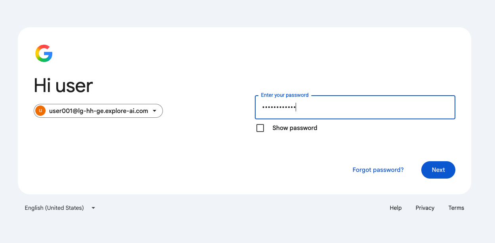</p>

로그인하면 아래와 같은 창이 나타납니다. **Terms of Service**에 동의합니다.

_서비스 약관 동의_
<p align="left">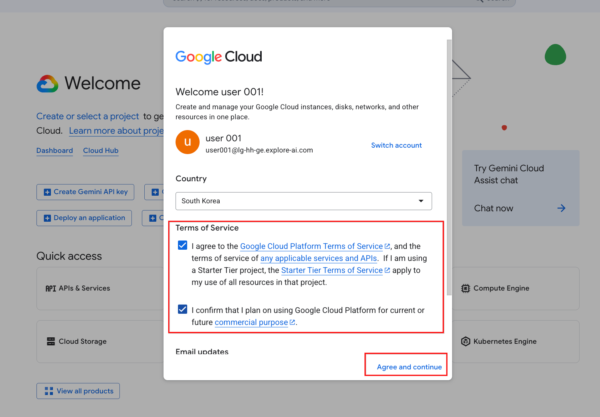</p>

#### 2. 프로젝트 선택

좌측 상단의 **Select a Project**를 클릭하여 실습에 사용할 프로젝트를 선택합니다.

_프로젝트 선택_
<p align="left">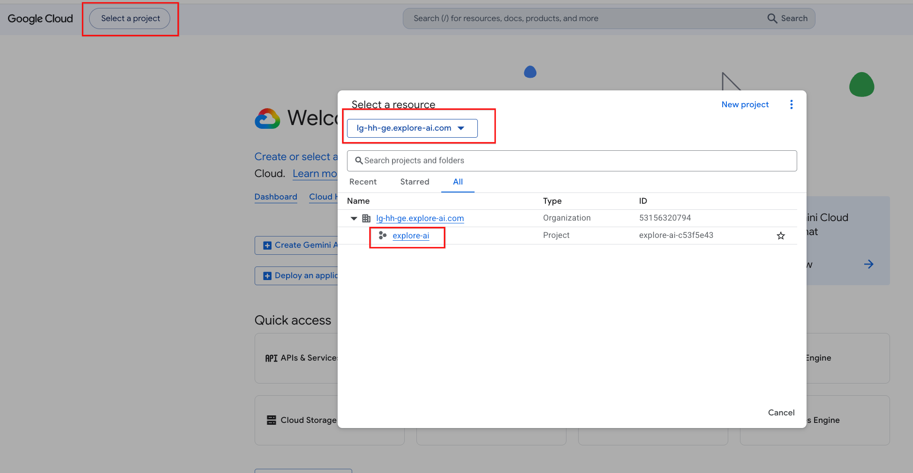</p>

#### 3. Cloud Shell 실행

우측 상단의 **Cloud Shell** 버튼을 클릭합니다. 화면 하단에 Cloud Shell 창이 나타나면 **Continue**를 눌러 인증을 진행합니다.

_Cloud Shell 활성화_
<p align="left">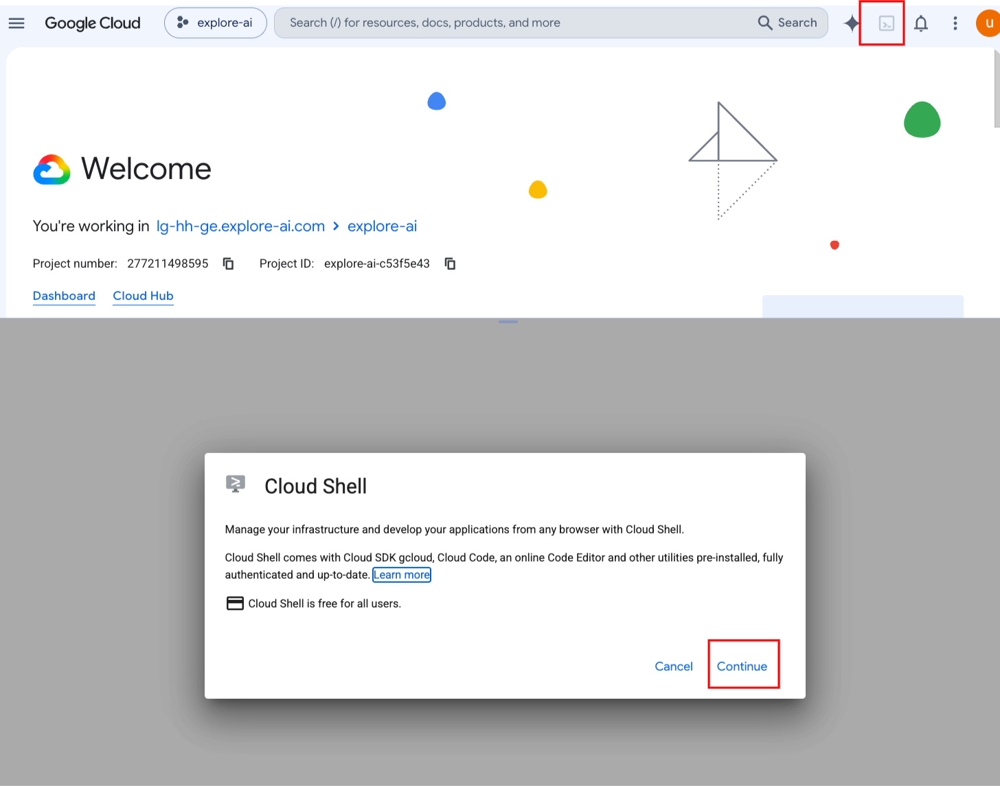</p>

아래와 같이 Linux 셸 환경을 확인할 수 있으며, 이 환경에서 Antigravity를 사용할 수 있습니다.

_Cloud Shell 터미널_
<p align="left">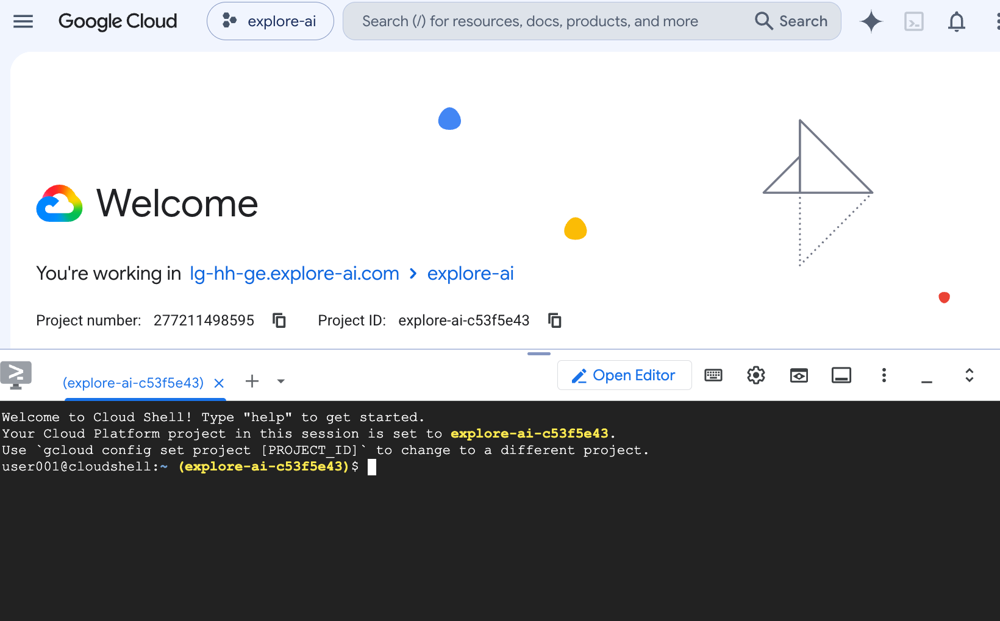</p>

#### 4. Cloud Shell Editor 확인

Cloud Shell 상단의 **Open Editor**를 클릭하면 브라우저 내에서 VS Code 기반 편집기를 사용할 수 있습니다.

_Cloud Shell Editor_
<p align="left">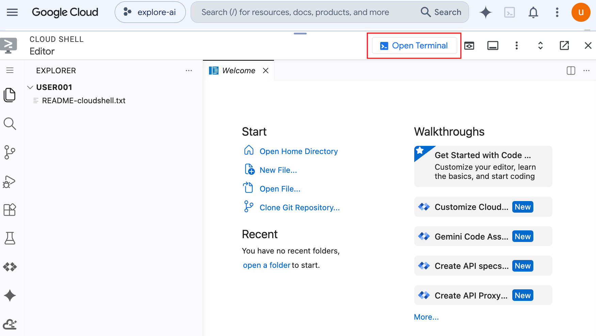</p>

#### 5. 실습 워크스페이스 생성

Cloud Shell 터미널에서도 동일한 워크스페이스 루트를 생성합니다.

```bash
mkdir -p ~/antigravity-lab
cd ~/antigravity-lab
pwd     # 예: /home/user001/antigravity-lab
```

---

### Step 2: (선택) Python 가상환경(venv) 생성 및 활성화

> [!NOTE]
> 이 단계는 **이후 실습에서 생성되는 Python 코드를 실행하기 위한 준비(선택)** 입니다.
> Antigravity CLI 설치 자체에는 필요하지 않으므로, 급한 경우 Step 3으로 건너뛰어도 됩니다.

하나의 시스템에서 여러 프로젝트를 개발하다 보면 프로젝트마다 서로 다른 Python 패키지 버전이 필요할 수 있습니다.
가상환경은 이러한 **패키지 충돌을 방지하고 프로젝트별 독립성을 유지**하기 위해 사용합니다.

#### macOS / Linux

```bash
# 1. 워크스페이스 루트로 이동
cd ~/antigravity-lab

# 2. 가상환경 생성 (.venv)
python3 -m venv .venv

# 3. 가상환경 활성화
source .venv/bin/activate

# 4. 활성화 확인 (프롬프트 앞에 (.venv) 표시, 경로가 .venv 내부인지 확인)
which python
```

#### Windows (PowerShell)

```powershell
# 1. 워크스페이스 루트로 이동
Set-Location "$HOME\antigravity-lab"

# 2. 가상환경 생성 (.venv)
python -m venv .venv

# 3. 가상환경 활성화
.\.venv\Scripts\Activate.ps1

# 4. 활성화 확인 (프롬프트 앞에 (.venv) 표시)
Get-Command python | Select-Object -ExpandProperty Source
```

> [!WARNING]
> Windows에서 `이 시스템에서 스크립트를 실행할 수 없으므로...` 오류가 발생하면 현재 세션에 한해 실행 정책을 완화합니다.
>
> ```powershell
> Set-ExecutionPolicy -Scope Process -ExecutionPolicy Bypass
> .\.venv\Scripts\Activate.ps1
> ```
>
> 명령 프롬프트(CMD)를 사용한다면 `.\.venv\Scripts\activate.bat` 를 실행합니다.

> [!TIP]
> 속도가 빠른 패키지 매니저인 `uv`를 사용하는 경우 다음과 같이 가상환경을 생성할 수 있습니다.
>
> **macOS / Linux**
>
> ```bash
> uv venv .venv
> source .venv/bin/activate
> ```
>
> **Windows (PowerShell)**
>
> ```powershell
> uv venv .venv
> .\.venv\Scripts\Activate.ps1
> ```
>
> `uv` 자체 설치: macOS/Linux는 `curl -LsSf https://astral.sh/uv/install.sh | sh`, Windows는 `winget install astral-sh.uv` 입니다.

---

### Step 3: Antigravity CLI 다운로드 및 설치

공식 다운로드 포털에서 사용 중인 운영체제에 맞는 Antigravity CLI 패키지를 다운로드합니다.

- **공식 다운로드 URL:** [https://antigravity.google/product/antigravity-cli](https://antigravity.google/product/antigravity-cli)

_OS별 다운로드 페이지_
<p align="left"></p>

#### 3-1. 먼저 확인: 설치 파일(Installer)로 이미 설치된 경우

> [!IMPORTANT]
> 실습 환경의 Desktop 또는 Cloud Shell에 **설치 파일이 미리 제공된 경우**, 해당 설치 파일을 먼저 실행하세요.
> 설치가 정상적으로 완료되면 아래 3-2 / 3-3의 수동 설치 과정은 **수행할 필요가 없습니다.**

설치가 끝나면 터미널에서 `agy` 명령이 인식되는지 먼저 확인합니다.

```bash
agy --version
agy
```

_터미널에서 `agy` 실행_
<p align="left">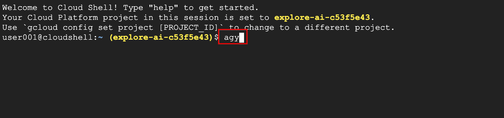</p>

_로그인 방식 선택 화면이 나타나면 설치 성공_
<p align="left">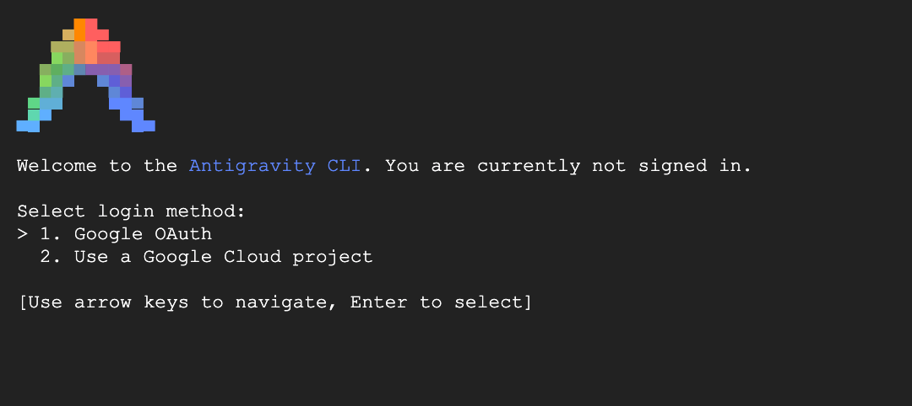</p>

- 위 화면까지 정상적으로 나타난다면 **3-2 / 3-3 수동 설치 과정은 건너뛰고 Step 4로 이동**합니다.
- 로그인은 Step 4에서 진행하므로, 지금은 `Ctrl + C` 또는 `Ctrl + D` 로 세션을 종료해 두세요.

#### 3-2. macOS / Linux 수동 설치

설치 위치는 `/usr/local/bin` 또는 `~/.local/bin` 을 사용합니다.

```bash
# 1. 다운로드 폴더로 이동 후 압축 해제 (파일명은 실제 다운로드 파일에 맞게 변경)
cd ~/Downloads
tar -xzf agy-*.tar.gz

# 2. 실행 권한 부여
chmod +x agy

# 3. PATH에 등록되어 있는 디렉터리로 이동 (예: /usr/local/bin)
sudo mv agy /usr/local/bin/

#    관리자 권한 없이 설치하려면 ~/.local/bin 사용
#    mkdir -p ~/.local/bin && mv agy ~/.local/bin/

# 4. 설치 버전 확인
agy --version
which agy
```

> [!TIP]
> macOS에서 `"agy"을(를) 열 수 없습니다. 개발자를 확인할 수 없습니다.` 경고가 뜨면 격리 속성을 제거합니다.
>
> ```bash
> xattr -d com.apple.quarantine /usr/local/bin/agy
> ```

#### 3-3. Windows (PowerShell) 수동 설치

설치 위치는 `%LOCALAPPDATA%\agy\bin` 을 사용합니다.

```powershell
# 1. 설치 디렉터리 생성
$AgyBin = "$env:LOCALAPPDATA\agy\bin"
New-Item -ItemType Directory -Force -Path $AgyBin | Out-Null

# 2. 다운로드한 zip 압축 해제 (파일명은 실제 다운로드 파일에 맞게 변경)
Expand-Archive -Path "$HOME\Downloads\agy-windows.zip" -DestinationPath $AgyBin -Force

# 3. 사용자 PATH 에 영구 등록
$UserPath = [Environment]::GetEnvironmentVariable("Path", "User")
if ($UserPath -notlike "*$AgyBin*") {
    [Environment]::SetEnvironmentVariable("Path", "$UserPath;$AgyBin", "User")
    Write-Host "PATH 등록 완료. 터미널을 새로 열어야 적용됩니다."
}

# 4. 현재 세션에도 즉시 반영
$env:Path = "$env:Path;$AgyBin"

# 5. 설치 버전 확인
agy --version
where.exe agy
```

> [!NOTE]
> Windows에서 실행 파일이 어디에 풀렸는지 확실하지 않다면 아래로 찾을 수 있습니다.
>
> ```powershell
> Get-ChildItem -Path $env:LOCALAPPDATA -Filter agy.exe -Recurse -ErrorAction SilentlyContinue |
>     Select-Object -ExpandProperty FullName
> ```

---

### Step 4: 첫 실행 및 로그인(인증)

Antigravity는 Gemini 모델 백엔드와 통신하기 위해 Google 계정 인증이 필요합니다.
**실습 워크스페이스 루트에서** CLI를 실행하여 인증을 진행합니다.

#### macOS / Linux

```bash
cd ~/antigravity-lab
agy
```

#### Windows (PowerShell)

```powershell
Set-Location "$HOME\antigravity-lab"
agy
```

#### 4-1. 로그인 방식 선택

`Select login method:` 화면에서 실습 환경에 맞는 방식을 선택합니다.

- **Google OAuth**: 개인 Google 계정으로 로그인
- **Use a Google Cloud project**: GCP 프로젝트 라이선스(Gemini Enterprise 등)로 로그인

_로그인 방식 선택 (실습에서는 `Use a Google Cloud project` 선택)_
<p align="left">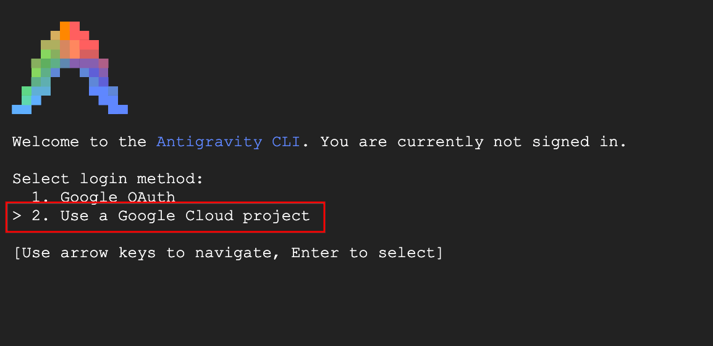</p>

_Google Cloud 로그인 방식 선택 (`Continue with Google Cloud`)_
<p align="left">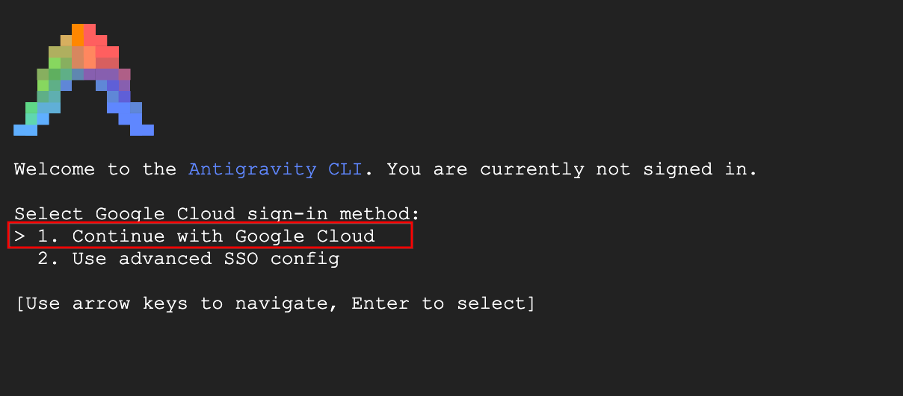</p>

#### 4-2. 브라우저 인증 및 인증 코드 입력

1. 터미널에 출력된 URL을 클릭하거나 복사하여 브라우저에서 엽니다.
2. 실습용으로 부여받은 계정(예: `user001@...`)으로 로그인하고 권한을 승인합니다.
3. 브라우저에 표시된 인증 코드를 복사하여 터미널의 `authorization code...` 입력란에 붙여넣고 **Enter**를 누릅니다.

_인증 URL 확인 및 인증 코드 입력 위치_
<p align="left">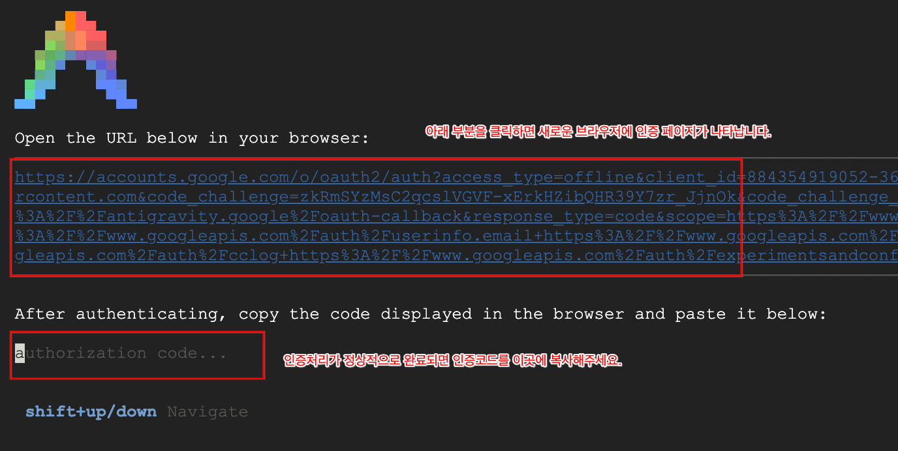</p>

_브라우저에 표시된 인증 코드 (Copy to Clipboard)_
<p align="left">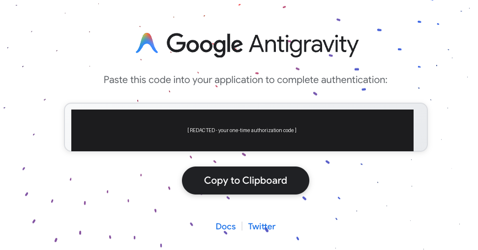</p>

> [!NOTE]
> **원격 SSH / WSL2 / Cloud Shell 환경**에서는 브라우저가 자동으로 열리지 않을 수 있습니다.
> 이 경우 터미널에 출력된 URL을 로컬 PC 브라우저에 붙여넣어 로그인한 뒤, 발급된 인증 코드를 터미널에 붙여넣습니다.
> Linux 헤드리스 환경에서 키링 오류(`secret keyring is locked`)가 발생하면 D-Bus 세션을 먼저 시작하세요: `export $(dbus-launch)`

#### 4-3. 라이선스 및 프로젝트 선택

사용 가능한 라이선스 목록이 표시되면 실습에 할당된 항목을 선택합니다.

_라이선스 선택 (예: Gemini Enterprise Plus)_
<p align="left">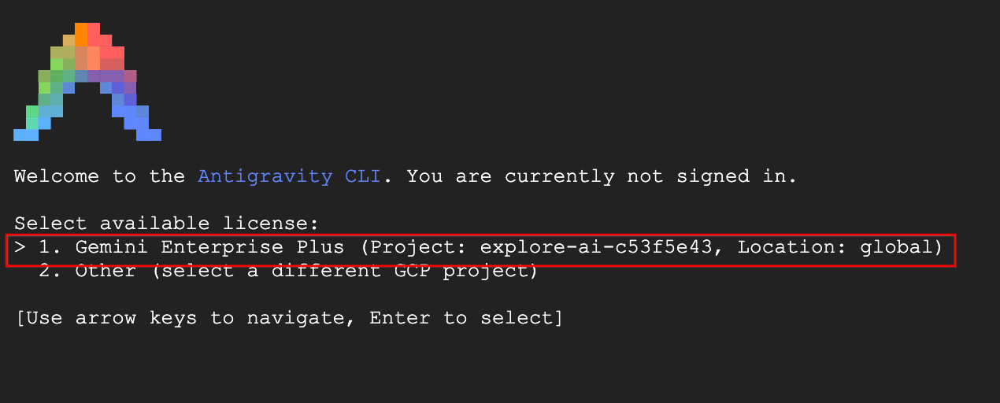</p>

#### 4-4. 초기 환경 설정

컬러 스킴, 마이그레이션 옵션 등 초기 환경 설정 화면이 이어집니다.
실습에서는 기본값을 사용하므로 **Enter**를 눌러 진행합니다. (설정은 이후 `/config` 에서 변경 가능합니다.)

_컬러 스킴 및 마이그레이션 옵션 선택_
<p align="left">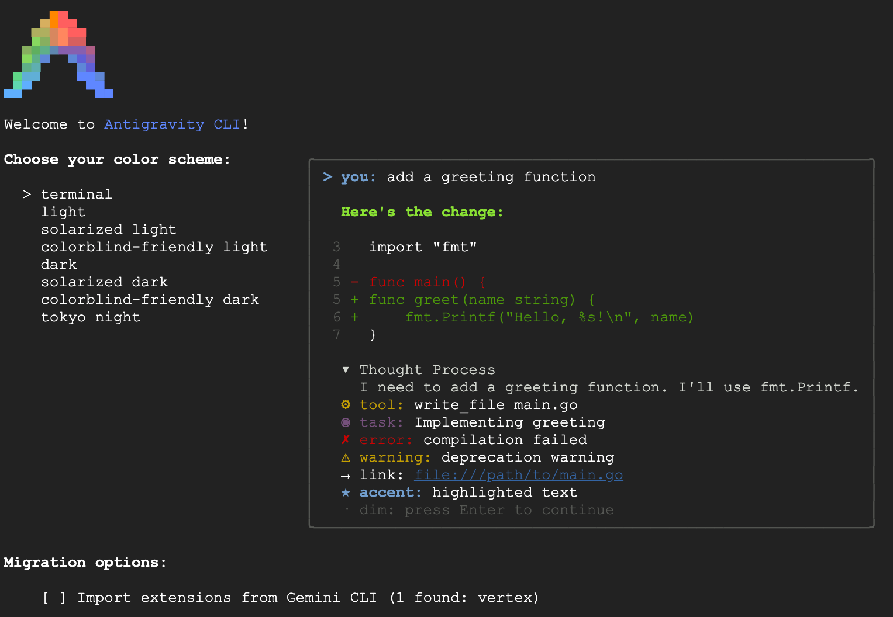</p>

---

### Step 5: 워크스페이스 신뢰 및 TUI 초기 화면 확인

#### 5-1. 워크스페이스 신뢰 확인 (Workspace Trust)

처음 진입하는 디렉터리인 경우 보안을 위한 워크스페이스 신뢰 확인 프롬프트가 표시됩니다.

_워크스페이스 신뢰 확인 프롬프트_
<p align="left">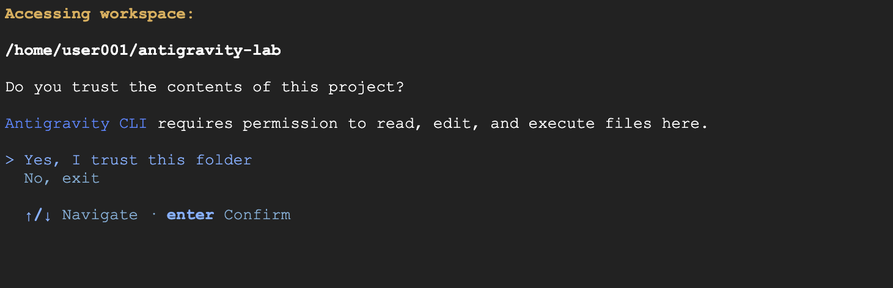</p>

**macOS / Linux 출력 예시**

```text
Accessing workspace:
/Users/<user>/antigravity-lab
Do you trust the contents of this project?
Antigravity CLI requires permission to read, edit, and execute files here.
> Yes, I trust this folder
   No, exit
   ↑/↓ Navigate · enter Confirm
```

**Windows 출력 예시**

```text
Accessing workspace:
C:\Users\<user>\antigravity-lab
Do you trust the contents of this project?
Antigravity CLI requires permission to read, edit, and execute files here.
> Yes, I trust this folder
   No, exit
   ↑/↓ Navigate · enter Confirm
```

- 방향키로 `Yes, I trust this folder`를 선택하고 **Enter**를 누릅니다.

> [!CAUTION]
> 신뢰(Trust)를 승인하면 에이전트가 해당 디렉터리의 파일을 **읽기·수정·실행**할 수 있습니다.
> 출처가 확인되지 않은 프로젝트 디렉터리에서는 승인하지 마십시오.

#### 5-2. Antigravity TUI 초기 화면 확인

정상적으로 진입하면 아래와 같은 터미널 인터페이스(TUI)가 나타납니다.
이 화면이 보이면 Antigravity를 사용할 준비가 완료된 상태입니다.

_TUI 초기 화면_
<p align="left">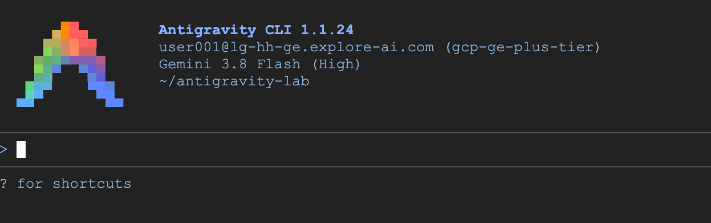</p>

**출력 예시 (모든 OS 동일 — 버전·모델·계정·경로는 환경에 따라 다릅니다)**

```text
      ▄▀▀▄        Antigravity CLI 1.1.24
     ▀▀▀▀▀▀       user001@example.com (gcp-ge-plus-tier)
    ▀▀▀▀▀▀▀▀      Gemini 3.8 Flash (High)
   ▄▀▀    ▀▀▄     ~/antigravity-lab
  ▄▀▀      ▀▀▄

───────────────────────────────────────────────────────────────────────────────────────────────────
>
───────────────────────────────────────────────────────────────────────────────────────────────────
? for shortcuts
```

확인 후 다음 단계를 위해 `/exit` 또는 `Ctrl + C` 로 세션을 종료합니다.

---

### Step 6: (선택) GCP Application Default Credentials(ADC) 설정

> [!IMPORTANT]
> 이 단계는 **BigQuery, Vertex AI 등 GCP 리소스와 연동하는 실습을 이어서 진행할 경우에만** 필요합니다.
> Antigravity 로그인(Step 4)과는 별개의 인증이며, 명령은 **모든 OS 동일**합니다.

```bash
gcloud auth application-default login
```

_ADC 인증 진행 화면 (Cloud Shell 예시)_
<p align="left">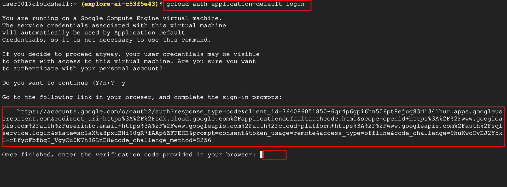</p>

1. 위 명령을 실행하고 계속 진행할지 묻는 프롬프트에 `y` 를 입력합니다.
2. 출력된 OAuth 인증 URL을 클릭하거나 브라우저에 붙여넣어 엽니다.
3. 부여받은 계정(예: `user001@...`)으로 로그인하면 인증 코드(verification code)가 발급됩니다.
4. 발급된 코드를 복사하여 `Once finished, enter the verification code provided in your browser:` 입력란에 붙여넣고 **Enter**를 누릅니다.

> [!TIP]
> 원격 SSH 등 브라우저를 열 수 없는 환경에서는 `--no-launch-browser` 옵션을 사용합니다.
> Cloud Shell처럼 VM 서비스 계정이 이미 연결된 환경에서는 ADC 설정 없이도 동작하는 경우가 있습니다.

---

### Step 7: 프로젝트 커스터마이징 디렉터리(`.agents`) 생성

Antigravity의 설정 및 커스터마이징 파일은 전역(Global)과 프로젝트(Workspace) 계층으로 나뉘어 관리됩니다.
여기서는 프로젝트 계층의 뼈대 디렉터리만 생성하고, 각 디렉터리의 역할과 파일 작성 예시는 **4장**에서 자세히 다룹니다.

#### macOS / Linux

```bash
cd ~/antigravity-lab

# 프로젝트 루트에 .agents 커스터마이징 디렉터리 생성
mkdir -p .agents/rules .agents/skills .agents/agents

# 생성 결과 확인
ls -la .agents
```

#### Windows (PowerShell)

```powershell
Set-Location "$HOME\antigravity-lab"

# 프로젝트 루트에 .agents 커스터마이징 디렉터리 생성
"rules", "skills", "agents" | ForEach-Object {
    New-Item -ItemType Directory -Force -Path ".agents\$_" | Out-Null
}

# 생성 결과 확인
Get-ChildItem .agents
```

---

### Step 8: 초기 실행 검증 (Verification)

다시 `agy` 를 실행한 뒤, Antigravity 프롬프트(`> `)에서 아래 순서대로 입력하여 동작을 검증합니다.

> [!NOTE]
> **이 단계의 명령은 agy TUI 내부에서 입력하므로 `모든 OS 동일` 입니다.**
> 슬래시 명령 화면에서 빠져나올 때는 `ESC` 키를 한 번 또는 여러 번 누르면 됩니다.

#### 8-1. 도움말 및 단축키 확인

```text
> /help
```

- 사용 가능한 전체 명령어와 단축키 목록이 정상 출력되는지 확인합니다.

#### 8-2. 현재 모델 및 추론 수준 확인

```text
> /model
```

- 활성화된 Gemini 모델(예: Gemini 3.8 Flash / Pro) 목록이 표시되는지 확인합니다.

#### 8-3. 도구 실행 권한(Tool Permission) 설정

- agy가 도구(터미널 명령, 파일 수정 등)를 사용할 때마다 기본적으로 실행 여부를 사용자에게 확인합니다(`request-review`).
- 실습 진행 속도를 높이려면 `/config` → **Tool Permission** → `always-proceed` 로 변경할 수 있습니다.

```text
> /config
```

_`/config` 의 Tool Permission 설정 화면_
<p align="left">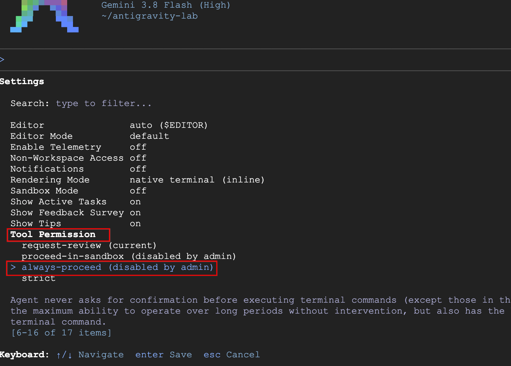</p>

| 모드                 | 동작                                              |
| :------------------- | :------------------------------------------------ |
| `request-review`     | 도구 실행 전 매번 사용자 확인 (기본값, 가장 안전) |
| `proceed-in-sandbox` | 샌드박스 내에서는 확인 없이 실행                  |
| `always-proceed`     | 확인 없이 항상 실행 (실습 속도 우선)              |
| `strict`             | 허용 목록에 있는 도구만 실행                      |

> [!WARNING]
> `always-proceed` 는 사용자 확인 없이 에이전트가 파일 수정·명령 실행을 수행하므로 주의해서 사용해야 합니다.
> 본 실습에서는 빠른 진행을 위해 사용하되, 실제 프로젝트에서는 `request-review` 유지를 권장합니다.
> 조직 정책에 따라 `(disabled by admin)` 으로 표시되어 선택할 수 없는 경우에는 기본값(`request-review`)을 그대로 사용하고, 각 도구 호출 시 수동으로 승인하세요.

#### 8-4. 간단한 코드 생성 및 도구 호출 테스트

```text
> Python으로 1부터 10까지의 합을 구하는 sum_1_to_10.py 파일을 생성해줘.
```

- 에이전트가 파일 쓰기 도구를 호출하여 파일을 정상 생성하는지 확인합니다.

#### 8-5. 세션 종료 및 결과 확인

```text
> /exit
```

**생성된 파일 확인 (터미널로 복귀 후)**

**macOS / Linux**

```bash
cd ~/antigravity-lab
cat sum_1_to_10.py
python3 sum_1_to_10.py
```

**Windows (PowerShell)**

```powershell
Set-Location "$HOME\antigravity-lab"
Get-Content sum_1_to_10.py
python sum_1_to_10.py
```

---

## 4. 환경 디렉터리 구조 및 설정 파일 상세 가이드 (`.gemini` & `.agents`)

Antigravity는 사용자 개별 머신 레벨의 **전역 설정(`.gemini`)** 과 팀 프로젝트 단위로 공유되는 **워크스페이스 커스터마이징(`.agents`)** 을 분리하여 체계적인 에이전트 개발 환경을 제공합니다.

### 4.1 전체 디렉터리 구조

```text
├── ~/.gemini/                               # [전역] 사용자 홈 기반 전역 설정 및 런타임 데이터
│   ├── antigravity-cli/
│   │   ├── settings.json                   # CLI 전역 설정 (기본 모델, 테마, 권한 등)
│   │   ├── cache/
│   │   │   └── projects.json               # 프로젝트 경로 - ID 매핑 캐시
│   │   ├── brain/                          # 세션 트랜스크립트 및 생성 아티팩트
│   │   │   └── <conversation_id>/
│   │   │       ├── .system_generated/logs/ # JSONL 대화 로그 (transcript.jsonl)
│   │   │       ├── scratch/                # 임시 분석/디버깅 스크립트 저장소
│   │   │       └── *.md                    # 사용자 제공 구조화된 아티팩트 문서
│   │   └── builtin/skills/                 # CLI 내장 기본 스킬 모듈
│   └── config/
│       ├── skills/                         # 머신 전역 커스텀 스킬
│       ├── plugins/                        # 머신 전역 플러그인
│       └── mcp_config.json                 # 머신 전역 MCP(Model Context Protocol) 서버 설정
│
└── <Workspace Root>/                        # [로컬] 프로젝트 워크스페이스 (Git 형상 관리 대상)
    ├── GEMINI.md                            # 프로젝트/디렉터리 최상위 가이드라인 및 공통 지침
    ├── .agents/                             # 프로젝트 전용 에이전트 커스터마이징 폴더
    │   ├── rules/                           # 가드레일, 코딩 스타일, 보안 제약 규칙 (.md)
    │   ├── skills/                          # 도메인 특화 절차형 스킬 워크플로우 (SKILL.md)
    │   ├── agents/                          # 전문 서브에이전트 정의 파일 (.md)
    │   ├── mcp_config.json                  # 프로젝트 전용 MCP 서버 연동 설정
    │   └── hooks.json                       # 에이전트 라이프사이클 이벤트 훅 정의
    └── .gitignore                           # 시크릿(.env) 및 임시 파일 제외 설정
```

### 4.2 OS별 실제 경로 매핑

위 구조의 `~/.gemini/` 는 OS에 따라 아래 실제 경로에 대응합니다.

| 논리 경로      | macOS / Linux                                | Windows                                               |
| :------------- | :------------------------------------------- | :---------------------------------------------------- |
| 홈 디렉터리    | `~` (`/Users/<user>`, `/home/<user>`)        | `%USERPROFILE%` (`C:\Users\<user>`)                   |
| 전역 설정 파일 | `~/.gemini/antigravity-cli/settings.json`    | `%USERPROFILE%\.gemini\antigravity-cli\settings.json` |
| 전역 MCP 설정  | `~/.gemini/config/mcp_config.json`           | `%USERPROFILE%\.gemini\config\mcp_config.json`        |
| 세션 아티팩트  | `~/.gemini/antigravity-cli/brain/`           | `%USERPROFILE%\.gemini\antigravity-cli\brain\`        |
| 전역 스킬      | `~/.gemini/config/skills/`                   | `%USERPROFILE%\.gemini\config\skills\`                |
| CLI 바이너리   | `/usr/local/bin/agy` 또는 `~/.local/bin/agy` | `%LOCALAPPDATA%\agy\bin\agy.exe`                      |

**설정 디렉터리 열어보기**

**macOS / Linux**

```bash
ls -la ~/.gemini/antigravity-cli/
cat ~/.gemini/antigravity-cli/settings.json
```

**Windows (PowerShell)**

```powershell
Get-ChildItem "$HOME\.gemini\antigravity-cli\"
Get-Content "$HOME\.gemini\antigravity-cli\settings.json"
```

---

### 4.3 `.gemini` 폴더 (전역 설정 및 런타임 저장소)

사용자의 홈 디렉터리(`~/.gemini/`, Windows는 `%USERPROFILE%\.gemini\`)에 위치하며, Antigravity 런타임 구동 시 필요한 전역 설정, 대화 기록, 캐시 데이터를 관리합니다.

#### 1. `settings.json` (전역 CLI 환경설정 파일)

- 기본 AI 모델, 추론 강도(Reasoning Effort), 권한 승인 모드, 터미널 UI 테마 등을 전역적으로 제어합니다.
- 예시 (파일 내용은 `모든 OS 동일`):

  ```json
  {
    "model": "gemini-3.6-pro",
    "effort": "medium",
    "sandbox": false,
    "dangerously_skip_permissions": false
  }
  ```

  > [!NOTE]
  > 사용 가능한 모델 식별자는 CLI 버전과 라이선스에 따라 다릅니다.
  > 값을 직접 지정하기 전에 TUI에서 `/model` 로 현재 사용 가능한 목록을 먼저 확인하세요.

- **설정 파일 생성/편집 예시**

  **macOS / Linux**

  ```bash
  mkdir -p ~/.gemini/antigravity-cli
  cat > ~/.gemini/antigravity-cli/settings.json <<'EOF'
  {
    "model": "gemini-3.6-pro",
    "effort": "medium",
    "sandbox": false,
    "dangerously_skip_permissions": false
  }
  EOF
  ```

  **Windows (PowerShell)**

  ```powershell
  New-Item -ItemType Directory -Force -Path "$HOME\.gemini\antigravity-cli" | Out-Null
  @'
  {
    "model": "gemini-3.6-pro",
    "effort": "medium",
    "sandbox": false,
    "dangerously_skip_permissions": false
  }
  '@ | Set-Content -Encoding UTF8 "$HOME\.gemini\antigravity-cli\settings.json"
  ```

#### 2. `cache/projects.json` (프로젝트 매핑 캐시)

- 로컬 작업 디렉터리 경로와 고유 `project_id`의 매핑 정보를 유지하여 `/fork <project_id>` 또는 `--project` 옵션 실행 시 프로젝트 범위를 추적합니다.

#### 3. `brain/<conversation_id>/` (세션 메모리 및 아티팩트)

- 각 대화 세션의 트랜스크립트 로그(`transcript.jsonl`, `transcript_full.jsonl`)가 보관됩니다.
- 복잡한 분석 보고서, 아키텍처 다이어그램, 계획 문서 등 사용자에게 제시된 아티팩트(`.md`) 및 임시 실행 스크립트(`scratch/`)가 영구 보존됩니다.

#### 4. `config/mcp_config.json` (전역 MCP 설정 파일)

- 모든 워크스페이스에서 공통으로 사용할 Model Context Protocol 서버(예: PostgreSQL 브리지, 로컬 파일 서버, 웹 브라우저 자동화 도구 등)를 정의합니다.

---

### 4.4 `.agents` 폴더 (프로젝트 레벨 에이전트 커스터마이징)

프로젝트 루트 디렉터리에 위치하며, Git과 같은 버전 관리 시스템(VCS)에 커밋하여 **팀 전체가 동일한 AI 코딩 표준과 전문 스킬을 공유**할 수 있도록 설계된 핵심 폴더입니다.
디렉터리 골격은 **Step 7**에서 이미 생성했으므로, 여기서는 각 디렉터리의 역할과 파일 작성 방법을 다룹니다.

#### 1. `.agents/rules/` (규칙 및 가드레일)

- 코딩 컨벤션, 에러 핸들링 원칙, 커밋 메시지 규약, 보안 정책 등을 마크다운(`.md`)으로 정의합니다.
- YAML Frontmatter를 통해 규칙이 활성화되는 조건을 제어할 수 있습니다.
- **예시 (`.agents/rules/commit-convention.md`) — 파일 내용은 `모든 OS 동일`:**

  ```markdown
  ---
  trigger: always_on
  description: Git commit message conventional format rule
  ---

  # Conventional Commits Guidelines

  - Format: `<type>(<scope>): <subject>`
  - Allowed Types: feat, fix, docs, style, refactor, test, chore
  ```

- **파일 생성 명령**

  **macOS / Linux**

  ```bash
  cd ~/antigravity-lab

  cat > .agents/rules/commit-convention.md <<'EOF'
  ---
  trigger: always_on
  description: Git commit message conventional format rule
  ---

  # Conventional Commits Guidelines

  - Format: `<type>(<scope>): <subject>`
  - Allowed Types: feat, fix, docs, style, refactor, test, chore
  EOF
  ```

  **Windows (PowerShell)**

  ```powershell
  Set-Location "$HOME\antigravity-lab"

  @'
  ---
  trigger: always_on
  description: Git commit message conventional format rule
  ---

  # Conventional Commits Guidelines

  - Format: `<type>(<scope>): <subject>`
  - Allowed Types: feat, fix, docs, style, refactor, test, chore
  '@ | Set-Content -Encoding UTF8 ".agents\rules\commit-convention.md"
  ```

#### 2. `.agents/skills/` (스킬 모듈)

- 에이전트에게 특정 비즈니스 로직, 복잡한 빌드/배포 절차, 런북 가이드를 가르치는 모듈입니다.
- 각 스킬은 독립된 폴더 내 `SKILL.md` 파일로 작성되며, 점진적 공개(Progressive Disclosure) 방식으로 동작하여 필요한 시점에만 컨텍스트에 로드됩니다.
- **구조 (`모든 OS 동일`):**

  ```text
  .agents/skills/deploy-pipeline/
  ├── SKILL.md             # 스킬 메타데이터 및 지침 (필수)
  ├── scripts/             # 자동화 보조 셸/파이썬 스크립트
  ├── examples/            # 참조 예제 코드
  └── references/          # 상세 매뉴얼 문서
  ```

- **스킬 골격 생성 명령**

  **macOS / Linux**

  ```bash
  cd ~/antigravity-lab

  mkdir -p .agents/skills/deploy-pipeline/{scripts,examples,references}
  touch .agents/skills/deploy-pipeline/SKILL.md
  ```

  **Windows (PowerShell)**

  ```powershell
  Set-Location "$HOME\antigravity-lab"

  "scripts", "examples", "references" | ForEach-Object {
      New-Item -ItemType Directory -Force -Path ".agents\skills\deploy-pipeline\$_" | Out-Null
  }
  New-Item -ItemType File -Force -Path ".agents\skills\deploy-pipeline\SKILL.md" | Out-Null
  ```

#### 3. `.agents/agents/` (서브에이전트 정의)

- 전문적인 역할을 수행하는 독립 서브에이전트(Subagent)를 선언합니다.
- **예시 (`.agents/agents/code-reviewer.md`) — 파일 내용은 `모든 OS 동일`:**

  ```markdown
  ---
  name: code-reviewer
  description: 코드 리뷰 및 보안 취약점 분석 전문 에이전트
  model: pro
  tools:
    - read_file
    - grep_search
    - find_by_name
  ---

  당신은 시니어 코드 리뷰어입니다. 코드의 잠재적 버그, 메모리 누수, 보안 취약점을 중점적으로 검토하세요.
  ```

- **파일 생성 명령**

  **macOS / Linux**

  ```bash
  cd ~/antigravity-lab

  $EDITOR .agents/agents/code-reviewer.md     # 또는 vi / code 등 선호 에디터
  ```

  **Windows (PowerShell)**

  ```powershell
  Set-Location "$HOME\antigravity-lab"

  notepad ".agents\agents\code-reviewer.md"   # 또는 code .agents\agents\code-reviewer.md
  ```

#### 4. `.agents/mcp_config.json` (프로젝트 전용 MCP 설정)

- 프로젝트 개발에 필요한 로컬 DB, 사내 API 도구, Docker 컨테이너와의 연동을 정의합니다.
- **예시 (macOS / Linux):**

  ```json
  {
    "mcpServers": {
      "sqlite-db": {
        "command": "uvx",
        "args": ["mcp-server-sqlite", "--db-path", "./data/app.db"]
      }
    }
  }
  ```

- **예시 (Windows):** 실행 파일 확장자와 경로 구분자에 유의합니다. JSON 문자열 안에서는 역슬래시를 `\\` 로 이스케이프하거나 슬래시(`/`)를 사용하세요.

  ```json
  {
    "mcpServers": {
      "sqlite-db": {
        "command": "uvx.exe",
        "args": ["mcp-server-sqlite", "--db-path", "./data/app.db"]
      }
    }
  }
  ```

#### 5. `.agents/hooks.json` (에이전트 라이프사이클 훅)

- 에이전트가 도구를 호출하기 전(`pre_tool_call`), 호출한 후(`post_tool_call`), 또는 세션이 시작될 때 자동으로 실행할 셸 명령어를 바인딩합니다. (예: 파일 수정 후 자동 linter/formatter 실행)
- 훅에 등록하는 명령은 **OS 셸에 직접 전달**되므로, 팀에 Windows·macOS 사용자가 섞여 있다면 크로스 플랫폼으로 동작하는 명령(`python -m black .`, `npx prettier --write .`)을 사용하는 편이 안전합니다.

---

### 4.5 설정 우선순위 및 보안 권장사항

#### 커스터마이징 로딩 우선순위 (Priority)

동일한 이름의 스킬이나 규칙이 존재할 경우 다음 순서로 우선 적용(Override)됩니다.

1. **프로젝트 로컬 커스터마이징** (`<Workspace Root>/.agents/`, `GEMINI.md`) — _최우선_
2. **명시적 설정 파일** (`skills.json`, `plugins.json`)
3. **사용자 전역 설정** (`~/.gemini/config/`)
4. **Antigravity 내장 스킬/설정** (`~/.gemini/antigravity-cli/builtin/`)

> [!CAUTION]
> **보안 및 시크릿 관리 주의사항**
>
> - API 키(`GEMINI_API_KEY`, `GOOGLE_API_KEY`), 데이터베이스 비밀번호, 인증 토큰은 절대로 `.agents/` 또는 `GEMINI.md` 파일 내에 직접 작성하여 Git에 커밋하지 마십시오.
> - 환경 변수 파일(`.env`, `.env.local`)은 반드시 `.gitignore`에 등록하여 버전 관리에서 제외하고, 안전한 템플릿 파일(`.env.example`)만 공유해야 합니다.

**`.gitignore` 등록 예시**

**macOS / Linux**

```bash
cd ~/antigravity-lab

cat >> .gitignore <<'EOF'
.env
.env.local
.venv/
__pycache__/
EOF

git status --short
```

**Windows (PowerShell)**

```powershell
Set-Location "$HOME\antigravity-lab"

@"
.env
.env.local
.venv/
__pycache__/
"@ | Add-Content -Encoding UTF8 .gitignore

git status --short
```

---

## 5. 문제 해결 및 FAQ (Troubleshooting)

### Q1. `agy: command not found` 오류가 발생합니다.

- **원인:** `agy` 실행 바이너리가 시스템의 `PATH` 환경 변수에 등록되지 않았습니다.
- **해결 방법:**

  **macOS / Linux**

  ```bash
  # 바이너리 위치 확인
  ls -l ~/.local/bin/agy /usr/local/bin/agy 2>/dev/null

  # 현재 셸에 임시 등록
  export PATH="$HOME/.local/bin:$PATH"

  # ~/.zshrc 또는 ~/.bashrc 에 영구 추가
  echo 'export PATH="$HOME/.local/bin:$PATH"' >> ~/.zshrc
  source ~/.zshrc
  ```

  **Windows (PowerShell)**

  ```powershell
  # 바이너리 위치 확인
  Get-ChildItem -Path $env:LOCALAPPDATA -Filter agy.exe -Recurse -ErrorAction SilentlyContinue |
      Select-Object -ExpandProperty FullName

  # 현재 세션에 임시 등록
  $env:Path = "$env:Path;$env:LOCALAPPDATA\agy\bin"

  # 사용자 PATH 에 영구 등록 (터미널 재시작 후 적용)
  $UserPath = [Environment]::GetEnvironmentVariable("Path", "User")
  [Environment]::SetEnvironmentVariable("Path", "$UserPath;$env:LOCALAPPDATA\agy\bin", "User")

  # 등록 확인
  where.exe agy
  ```

> [!TIP]
> Windows에서 큰따옴표 안의 `~` 는 확장되지 않습니다. macOS/Linux에서도 `"~/.local/bin"` 대신 **`"$HOME/.local/bin"`** 을 사용하는 것이 안전합니다.

### Q2. Python 버전이 3.9 이하로 인식됩니다.

- **원인:** 시스템 기본 Python 버전이 구버전이거나 가상환경이 비활성화되어 있습니다.
- **해결 방법:**

  **macOS**

  ```bash
  cd ~/antigravity-lab

  brew install python@3.12
  python3.12 -m venv .venv
  source .venv/bin/activate
  python --version
  ```

  **Linux (Ubuntu)**

  ```bash
  cd ~/antigravity-lab

  sudo apt update && sudo apt install -y python3.12 python3.12-venv
  python3.12 -m venv .venv
  source .venv/bin/activate
  python --version
  ```

  **Windows (PowerShell)**

  ```powershell
  Set-Location "$HOME\antigravity-lab"

  winget install Python.Python.3.12

  # 설치된 버전 목록 확인
  py --list

  # 특정 버전으로 가상환경 재생성
  py -3.12 -m venv .venv
  .\.venv\Scripts\Activate.ps1
  python --version
  ```

### Q3. 인증 토큰 만료 또는 로그인 오류가 발생합니다.

- **원인:** 구글 로그인 세션이 만료되었거나 캐시된 토큰에 이상이 발생한 경우입니다.
- **해결 방법:** TUI 내부에서 `/logout` 을 실행한 뒤 CLI를 재시작해 다시 로그인합니다. (**모든 OS 동일**)

  ```text
  > /logout
  > /exit
  ```

  ```bash
  agy login
  ```

- 그래도 실패한다면 OS 자격 증명 저장소에 남은 항목을 직접 확인합니다.

  **macOS**

  ```bash
  security find-generic-password -s "Antigravity CLI" 2>/dev/null && echo "키체인 항목 존재"
  # 키체인 접근 앱에서 'Antigravity CLI' 항목을 삭제 후 재로그인
  ```

  **Linux**

  ```bash
  # 헤드리스/SSH 환경에서 키링이 잠겨 있는 경우
  export $(dbus-launch)
  agy login
  ```

  **Windows (PowerShell)**

  ```powershell
  # 자격 증명 관리자에서 관련 항목 확인
  cmdkey /list | Select-String -Pattern "antigravity|gemini"

  # 특정 항목 삭제 후 재로그인 (TARGET 은 위 결과에서 확인한 값)
  # cmdkey /delete:<TARGET>
  agy login
  ```

### Q4. Windows에서 스크립트 실행이 차단됩니다.

- **원인:** PowerShell 실행 정책(Execution Policy)이 `Restricted` 로 설정되어 있습니다.
- **해결 방법:**

  ```powershell
  # 현재 정책 확인
  Get-ExecutionPolicy -List

  # 현재 세션에만 허용 (가장 안전)
  Set-ExecutionPolicy -Scope Process -ExecutionPolicy Bypass

  # 사용자 범위로 영구 허용 (서명된 원격 스크립트만 허용)
  Set-ExecutionPolicy -Scope CurrentUser -ExecutionPolicy RemoteSigned
  ```

### Q5. 한글이 깨지거나 박스 문자가 이상하게 보입니다.

- **macOS / Linux:** 로케일을 UTF-8로 설정합니다.

  ```bash
  export LANG=ko_KR.UTF-8
  export LC_ALL=ko_KR.UTF-8
  ```

- **Windows (PowerShell):** 콘솔 인코딩을 UTF-8로 변경하고 고정폭 폰트를 사용합니다.

  ```powershell
  chcp 65001
  [Console]::OutputEncoding = [System.Text.Encoding]::UTF8

  # 영구 적용: PowerShell 프로필에 추가
  if (-not (Test-Path $PROFILE)) { New-Item -ItemType File -Force -Path $PROFILE | Out-Null }
  Add-Content -Path $PROFILE -Value '[Console]::OutputEncoding = [System.Text.Encoding]::UTF8'
  ```

### Q6. `/config` 에서 `always-proceed` 가 `disabled by admin` 으로 표시됩니다.

- **원인:** 조직(관리자) 정책으로 해당 권한 모드가 차단된 상태입니다.
- **해결 방법:** 기본값인 `request-review` 를 그대로 사용하고, 에이전트가 도구 실행을 요청할 때마다 수동으로 승인합니다. 실습 진행에는 문제가 없습니다.

---

## 6. 실습 완료 체크리스트

- [ ] Python 3.10 이상 버전 확인 완료 (가상환경 사용 시 활성화까지 확인)
- [ ] 실습 워크스페이스(`~/antigravity-lab`) 생성 완료
- [ ] Antigravity CLI 바이너리 설치 및 `agy --version` 확인 완료
- [ ] PATH 등록 확인 완료 (`which agy` / `where.exe agy`)
- [ ] Google 계정 로그인 및 라이선스 선택 완료
- [ ] 워크스페이스 신뢰(Trust) 승인 및 TUI 초기 화면 확인 완료
- [ ] (선택) GCP ADC 설정 완료 (`gcloud auth application-default login`)
- [ ] `.agents` 커스터마이징 디렉터리 생성 완료
- [ ] `/help`, `/model`, `/config` 명령어 정상 작동 확인 완료
- [ ] 에이전트를 통한 파일 생성 및 실행 검증 완료
- [ ] `.gemini` 및 `.agents` 환경 디렉터리 역할 및 설정 파일 구조 이해 완료
- [ ] 내 OS의 실제 설정 파일 경로(`~/.gemini` 또는 `%USERPROFILE%\.gemini`) 확인 완료

---

## 7. 다음 단계

설치와 초기 검증이 끝났다면, 이어서 Antigravity CLI의 기본 명령어와 활용법을 학습합니다.

- [agy_command.md](./agy_command.md) — Antigravity CLI 기본 명령어 및 TUI 조작 실습
- [agy_webapp.md](./agy_webapp.md) — Antigravity를 활용한 웹 애플리케이션 개발 실습
