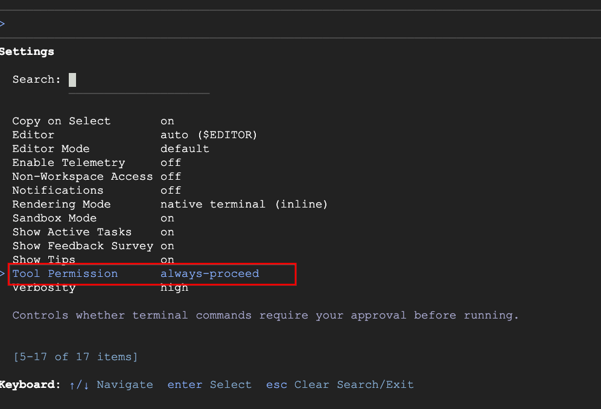

# Antigravity 웹앱 핸즈온 랩 (agy_webapp)

> **대상:** Antigravity CLI(`agy`) 설치 및 로그인을 마친 개발자
> **목표:** `agy` 에이전트와 함께 **로컬에서 바로 뜨는 웹 애플리케이션 2개**를 완성한다.
> **전제 조건:** [agy_setup.md](./agy_setup.md) 의 설치·로그인 단계를 완료한 상태

| Lab   | 만드는 것                                             | 스택                            | 포트 |
| ----- | ----------------------------------------------------- | ------------------------------- | ---- |
| **A** | 내 PC의 OS에 맞는 **실시간 시스템 모니터링 대시보드** | Python · FastAPI · psutil · SSE | 8000 |
| **B** | 브라우저에서 바로 즐기는 **테트리스 게임**            | Node.js · Express · Canvas      | 3000 |

> [!IMPORTANT]
> **OS별 표기 규칙**
>
> 이 문서의 모든 실행 예제는 아래 세 가지 표기 중 하나를 따릅니다. 자신의 환경에 해당하는 블록만 실행하세요.
>
> | 표기                     | 의미                                                       |
> | ------------------------ | ---------------------------------------------------------- |
> | **macOS / Linux**        | macOS(zsh) 및 Linux(bash) 터미널에서 실행                  |
> | **Windows (PowerShell)** | Windows PowerShell 5.1+ 또는 PowerShell 7.x 에서 실행      |
> | **모든 OS 동일**         | agy TUI 내부 입력·프롬프트·파일 내용 등 OS와 무관하게 동일 |
>
> - **WSL2 / Git Bash / GCP Cloud Shell** 사용자는 `macOS / Linux` 블록을 그대로 사용하세요.
> - Windows에서는 `python3` → `python`, `curl` → `curl.exe`, `/` → `\` 로 바뀌는 점에 유의하세요.

> [!NOTE]
> **Windows 실행 정책** — `.\run.ps1` 을 처음 실행할 때 `이 시스템에서 스크립트를 실행할 수 없으므로...` 오류가 나면
> 현재 세션에 한해 정책을 완화한 뒤 다시 실행하세요. 이 문서에서는 이후 `.\run.ps1` 형태로만 표기합니다.
>
> ```powershell
> Set-ExecutionPolicy -Scope Process -ExecutionPolicy Bypass
> ```

---

## 1. 실습 준비

### 1-1. 작업공간 생성

[agy_setup.md](./agy_setup.md) 에서 사용한 워크스페이스 루트(`~/antigravity-lab`) 아래에 이번 랩 전용 폴더를 만듭니다.

**macOS / Linux**

```bash
mkdir -p ~/antigravity-lab/agy_webapp
cd ~/antigravity-lab/agy_webapp
pwd
```

**Windows (PowerShell)**

```powershell
New-Item -ItemType Directory -Force -Path "$HOME\antigravity-lab\agy_webapp" | Out-Null
Set-Location "$HOME\antigravity-lab\agy_webapp"
Get-Location
```

> [!NOTE]
> 이 폴더 안에 Lab A(`sysinfo_dashboard/`)와 Lab B(`tetris_game/`) 두 프로젝트가 생성됩니다.

### 1-2. 환경 확인

**macOS / Linux**

```bash
python3 --version    # 3.10 이상
node --version       # 18 이상
curl --version
```

**Windows (PowerShell)**

```powershell
python --version     # 3.10 이상 (없으면 winget install Python.Python.3.12)
node --version       # 18 이상 (없으면 winget install OpenJS.NodeJS.LTS)
curl.exe --version   # Windows 10 1803+ 기본 포함
```

> [!NOTE]
> Windows에서는 `python3`가 아니라 **`python`** 입니다. PowerShell의 `curl`은 `Invoke-WebRequest`의 별칭이므로, 이 문서에서는 반드시 **`curl.exe`** 로 명시해 실제 curl을 사용합니다.

### 1-3. 프로젝트 규칙 파일(`AGENTS.md`) 작성

에이전트가 **매번 같은 규칙으로 코드를 쓰도록** 룰 파일을 먼저 둡니다. 이 한 파일이 결과 품질의 절반을 좌우합니다.

> [!NOTE]
> 아래 두 블록은 **동일한 내용**을 각 OS의 방식으로 생성합니다. 파일 내용 자체는 `모든 OS 동일` 입니다.

<details open>
<summary><b>macOS / Linux</b> — 클릭해서 접기/펼치기</summary>

```bash
cat > AGENTS.md <<'MDEOF'
# agy_webapp 실습 규칙

## 공통
- 로컬 개발 전용 예제다. 배포 설정(Docker, k8s, CI)은 만들지 않는다.
- 비밀키·토큰·API 키를 코드에 하드코딩하지 않는다.
- 포트는 Lab A=8000, Lab B=3000 으로 고정한다.
- 프런트엔드는 CDN·외부 프레임워크 없이 순수 HTML/CSS/JS 로만 작성한다.

## 실행 스크립트 (필수)
- 각 프로젝트 루트에 아래 6개 스크립트를 반드시 만든다.
  - run.sh / run.ps1       : 의존성 설치 + 포트 정리 + 서버 실행까지 한 번에
  - verify.sh / verify.ps1 : 주요 엔드포인트를 점검하고 ✅/❌ 로 결과 출력
  - stop.sh / stop.ps1     : 해당 포트를 쓰는 프로세스 종료
- 셸 스크립트(*.sh)에는 `chmod +x` 로 실행 권한을 부여한다.
- 스크립트는 어느 경로에서 실행해도 동작하도록 자기 위치로 이동한 뒤 작업한다.
- 실패 시 원인을 한글로 알려주고 0 이 아닌 코드로 종료한다.

## Lab A (Python)
- FastAPI + uvicorn + psutil 사용. 타입 힌트와 Pydantic 모델을 반드시 쓴다.
- 의존성은 가상환경(.venv) 안에만 설치한다. 전역 pip install 금지.
- 크로스 플랫폼(macOS/Linux/Windows)을 전제로 작성한다.
  현재 OS 에서 지원하지 않는 지표는 예외를 삼키지 말고
  {"supported": false, "reason": "..."} 형태로 명시해 반환한다.
- 테스트는 pytest 로 작성한다.

## Lab B (Node.js)
- Express 사용. CommonJS(require) 문법으로 작성한다.
- 외부 의존성은 express 하나만. 나머지는 Node 내장 모듈로 해결한다.

## 오류 처리
- 예외를 빈 블록으로 삼키지 않는다 (`except Exception: pass`, 빈 `catch {}` 금지).
- 오류 응답은 상태 코드와 이유를 JSON 으로 명확히 반환한다.
- 구체적인 예외 타입(ValueError, PermissionError 등)을 사용한다.

## 검증
- 코드 작성 후 반드시 서버를 실행하고 검증 스크립트로 확인한 뒤 결과를 보고한다.
MDEOF
```

</details>

<details>
<summary><b>Windows (PowerShell)</b> — 클릭해서 접기/펼치기</summary>

```powershell
@'
# agy_webapp 실습 규칙

## 공통
- 로컬 개발 전용 예제다. 배포 설정(Docker, k8s, CI)은 만들지 않는다.
- 비밀키·토큰·API 키를 코드에 하드코딩하지 않는다.
- 포트는 Lab A=8000, Lab B=3000 으로 고정한다.
- 프런트엔드는 CDN·외부 프레임워크 없이 순수 HTML/CSS/JS 로만 작성한다.

## 실행 스크립트 (필수)
- 각 프로젝트 루트에 아래 6개 스크립트를 반드시 만든다.
  - run.sh / run.ps1       : 의존성 설치 + 포트 정리 + 서버 실행까지 한 번에
  - verify.sh / verify.ps1 : 주요 엔드포인트를 점검하고 ✅/❌ 로 결과 출력
  - stop.sh / stop.ps1     : 해당 포트를 쓰는 프로세스 종료
- 셸 스크립트(*.sh)에는 `chmod +x` 로 실행 권한을 부여한다.
- 스크립트는 어느 경로에서 실행해도 동작하도록 자기 위치로 이동한 뒤 작업한다.
- 실패 시 원인을 한글로 알려주고 0 이 아닌 코드로 종료한다.

## Lab A (Python)
- FastAPI + uvicorn + psutil 사용. 타입 힌트와 Pydantic 모델을 반드시 쓴다.
- 의존성은 가상환경(.venv) 안에만 설치한다. 전역 pip install 금지.
- 크로스 플랫폼(macOS/Linux/Windows)을 전제로 작성한다.
  현재 OS 에서 지원하지 않는 지표는 예외를 삼키지 말고
  {"supported": false, "reason": "..."} 형태로 명시해 반환한다.
- 테스트는 pytest 로 작성한다.

## Lab B (Node.js)
- Express 사용. CommonJS(require) 문법으로 작성한다.
- 외부 의존성은 express 하나만. 나머지는 Node 내장 모듈로 해결한다.

## 오류 처리
- 예외를 빈 블록으로 삼키지 않는다 (`except Exception: pass`, 빈 `catch {}` 금지).
- 오류 응답은 상태 코드와 이유를 JSON 으로 명확히 반환한다.
- 구체적인 예외 타입(ValueError, PermissionError 등)을 사용한다.

## 검증
- 코드 작성 후 반드시 서버를 실행하고 검증 스크립트로 확인한 뒤 결과를 보고한다.
'@ | Set-Content -Encoding UTF8 AGENTS.md
```

</details>

### 1-4. CLI 실행 및 확인

**모든 OS 동일**

```bash
agy
```

처음 진입하는 디렉터리이므로 워크스페이스 신뢰 확인 프롬프트가 나타나면 `Yes, I trust this folder` 를 선택합니다.

**Tool Permission 설정**

기본값(`request-review`)에서는 에이전트가 파일을 쓰거나 명령을 실행할 때마다 승인을 요청합니다.
이 랩은 생성할 파일이 많으므로 **실습 동안만** 자동 진행으로 바꿔 둡니다.

1. agy 프롬프트에서 `/config` 를 입력합니다.
2. 목록에서 **Tool Permission** 항목으로 이동합니다.
3. **`always-proceed`** 를 선택하고 **Enter** 로 저장합니다.

_`/config` 의 Tool Permission 설정 화면_
<p align="left"></p>

> [!WARNING]
> `always-proceed` 는 사용자 확인 없이 파일 수정·명령 실행을 수행합니다. **실습용 설정**으로만 사용하고,
> 실제 프로젝트에서는 기본값 `request-review` 유지를 권장합니다.
> 조직 정책에 따라 `(disabled by admin)` 으로 표시되어 선택할 수 없다면 기본값을 그대로 두고
> 각 도구 호출 시 수동으로 승인하면 됩니다. 실습 진행에는 문제가 없습니다.

✅ **확인**

- [ ] 헤더에 로그인된 계정과 현재 경로(`~/antigravity-lab/agy_webapp`)가 보인다.
- [ ] 프롬프트에서 `!ls`(Windows PowerShell은 `!dir`)를 입력하면 `AGENTS.md` 가 보인다.

---

## 2. 이 랩에서 쓰는 명령어

> [!NOTE]
> 여기서는 **이번 랩을 진행하는 데 실제로 필요한 명령만** 추렸습니다.
> 각 슬래시 명령의 상세 동작·옵션·출력 예시는 [agy_command.md](./agy_command.md) 를 참고하세요.

### 2-1. 입력 단축키

**모든 OS 동일** _(macOS와 Windows 터미널 모두 동일하게 Ctrl 키를 사용합니다)_

| 단축키        | 동작                  | 언제 쓰나                          |
| ------------- | --------------------- | ---------------------------------- |
| `@`           | 파일 경로 자동완성    | 특정 파일을 콕 집어 수정 요청할 때 |
| `!`           | 셸 명령 즉시 실행     | `!ls`, `!git status` 확인할 때     |
| `Shift+Enter` | 줄바꿈                | 요구사항을 여러 줄로 쓸 때         |
| `Esc`         | 진행 중인 턴 중단     | 엉뚱한 방향으로 갈 때 **즉시**     |
| `Ctrl+R`      | 아티팩트 리뷰 패널    | 생성된 코드를 승인/거절할 때       |
| `Ctrl+O`      | 도구 추론 로그 펼치기 | 에이전트가 뭘 읽는지 볼 때         |

**리뷰 패널(`Ctrl+R`) 키**

| 키        | 동작           |
| --------- | -------------- |
| `↑` / `↓` | 파일 이동      |
| `y`       | 승인           |
| `n`       | 거절           |
| `A`       | 전체 일괄 승인 |
| `Esc`     | 패널 닫기      |

### 2-2. 슬래시 명령

이번 랩에서 사용하는 명령은 아래 6개입니다.

| 명령        | 한 줄 설명                             | 이 랩에서의 사용처             |
| ----------- | -------------------------------------- | ------------------------------ |
| `/planning` | 코드를 쓰기 전에 **계획서부터** 받는다 | Lab A·B 시작 시                |
| `/diff`     | 지금까지 **뭐가 바뀌었는지** 본다      | 각 Lab 마무리, 5-1             |
| `/tasks`    | **백그라운드로 돌린 작업**을 관리한다  | 서버를 띄운 채 작업할 때       |
| `/btw`      | **잠깐 딴 질문**을 한다 (맥락 유지)    | "psutil로 배터리 어떻게 읽지?" |
| `/context`  | 대화가 **얼마나 찼는지** 본다          | 세션이 길어질 때               |
| `/clear`    | **대화를 새로 시작**한다               | Lab A → Lab B 전환 시 (4-1)    |

필요하면 아래 명령도 함께 씁니다.

| 명령           | 한 줄 설명                            | 언제                  |
| -------------- | ------------------------------------- | --------------------- |
| `/fast`        | 계획 없이 **바로 고친다**             | 오타·문구 수정        |
| `/open <path>` | 파일을 **에디터로 연다**              | 생성된 코드 직접 확인 |
| `/rewind`      | **이전 상태로 되돌린다**              | 잘못된 수정 취소      |
| `/copy`        | 마지막 답변을 **클립보드에 복사**한다 | 결과를 문서에 옮길 때 |
| `/skills`      | 등록된 스킬 목록을 본다               | 5-2 스킬 등록 확인    |

> [!TIP]
> `/planning` 은 **방향이 틀렸을 때 코드 작성 전에 바로잡을 수 있어** 큰 작업에서 시간을 가장 많이 아껴 줍니다.
> 반대로 `/fast` 는 복잡한 작업에 쓰면 품질이 떨어지므로 단순 수정에만 사용하세요.

### 2-3. 미니 실습

아래를 순서대로 직접 입력해 보세요. **모든 OS 동일** 입니다.

```text
!ls -la
```

> Windows PowerShell 환경이면 `!dir` 를 사용합니다.

```text
@AGENTS.md 이 규칙 파일을 읽고, 이번 실습에서 지켜야 할 핵심 제약 3가지만 불릿으로 요약해줘.
```

```text
/btw 내 PC의 OS와 CPU 코어 수를 셸 명령으로 확인하는 방법을 한 줄로 알려줘.
```

```text
/context
```

✅ **확인**

- [ ] `!`로 셸 명령을 실행했다.
- [ ] `@`로 파일을 참조해 답변을 받았다.
- [ ] `/btw`가 메인 대화 흐름을 끊지 않는 것을 확인했다.

---

## 3. Lab A. 내 PC 실시간 시스템 대시보드

🎯 **목표:** 지금 쓰는 PC의 **운영체제에 맞는 정보를 최대한 많이** 수집해, 브라우저에서 실시간으로 갱신되는 대시보드를 만든다.

> [!TIP]
> 이 Lab의 진짜 학습 포인트는 **"OS마다 지원 여부가 다른 지표를 어떻게 다룰 것인가"** 입니다. macOS에는 CPU 온도 API가 없고, Windows에는 load average가 없습니다. 에이전트에게 _"지원 안 하면 조용히 넘기지 말고 명시적으로 표시하라"_ 고 요구하는 것이 핵심입니다.

### 3-1. 완성 후 모습

**모든 OS 동일**

```text
~/antigravity-lab/agy_webapp/sysinfo_dashboard/
├── .venv/                  # 가상환경 (커밋 대상 아님)
├── app/
│   ├── __init__.py
│   ├── main.py             # FastAPI 앱 · 라우터 · SSE
│   ├── models.py           # Pydantic 응답 모델
│   └── collectors.py       # psutil 기반 수집기 (OS 분기 처리)
├── static/
│   ├── index.html          # 대시보드 UI
│   ├── app.js              # EventSource 구독 · 렌더링
│   └── style.css
├── tests/
│   └── test_api.py         # pytest
├── run.sh / run.ps1        # ⭐ 설치 + 실행 한 번에
├── verify.sh / verify.ps1  # ⭐ 엔드포인트 자동 점검
├── stop.sh / stop.ps1      # ⭐ 서버 종료
├── requirements.txt
└── README.md
```

**수집 대상 (OS별 지원 여부 포함)**

| 카테고리 | 항목                                                        | macOS       | Linux       | Windows       |
| -------- | ----------------------------------------------------------- | ----------- | ----------- | ------------- |
| 시스템   | OS 이름/버전/커널, 호스트명, 아키텍처, 부팅 시각, 가동 시간 | ✅          | ✅          | ✅            |
| CPU      | 논리/물리 코어, 코어별 사용률, 전체 사용률, 주파수          | ✅          | ✅          | ✅            |
| CPU      | Load Average (1/5/15분)                                     | ✅          | ✅          | ⚠️ 에뮬레이트 |
| 메모리   | 총량/사용량/가용량/사용률, 스왑                             | ✅          | ✅          | ✅            |
| 디스크   | 파티션 목록, 마운트별 용량/사용률, 읽기·쓰기 I/O            | ✅          | ✅          | ✅            |
| 네트워크 | 인터페이스별 IP/MAC, 송수신 바이트·패킷, 초당 처리량        | ✅          | ✅          | ✅            |
| 프로세스 | 총 개수, CPU/메모리 상위 10개                               | ✅          | ✅          | ✅            |
| 전원     | 배터리 잔량·충전 여부·남은 시간                             | ✅ (노트북) | ✅ (노트북) | ✅ (노트북)   |
| 센서     | CPU 온도, 팬 속도                                           | ❌ 미지원   | ✅          | ❌ 미지원     |
| 사용자   | 로그인 세션 목록                                            | ✅          | ✅          | ✅            |

**엔드포인트**

| 메서드 | 경로                               | 설명                                              |
| ------ | ---------------------------------- | ------------------------------------------------- |
| `GET`  | `/`                                | 대시보드 UI                                       |
| `GET`  | `/api/system`                      | 변하지 않는 정적 정보 (OS, CPU 모델, 파티션 목록) |
| `GET`  | `/api/metrics`                     | 현재 스냅샷 1회                                   |
| `GET`  | `/api/processes?sort=cpu&limit=10` | 프로세스 상위 목록                                |
| `GET`  | `/api/stream`                      | **SSE** 2초 간격 실시간 스트리밍                  |
| `GET`  | `/health`                          | 헬스 체크                                         |

### 3-2. Step 1 — 계획 요청

`agy` 프롬프트에 **아래를 그대로 복사해 붙여넣으세요.**

**모든 OS 동일**

```text
/planning
sysinfo_dashboard/ 에 내 PC의 실시간 시스템 정보를 보여주는
FastAPI 웹 대시보드를 만들려고 해. 지금 이 PC의 운영체제를 먼저 확인하고,
그 OS에서 얻을 수 있는 정보를 최대한 많이 수집하는 구조로 설계해줘.

[수집 항목]
1. 시스템: OS 이름/릴리스/버전, 커널, 호스트명, 아키텍처, CPU 모델명,
   Python 버전, 부팅 시각, 가동 시간(사람이 읽는 형식)
2. CPU: 논리/물리 코어 수, 전체 사용률, 코어별 사용률 배열,
   현재/최소/최대 주파수, load average(1/5/15분)
3. 메모리: total/used/available/percent, 스왑 total/used/percent
4. 디스크: 파티션별 device/mountpoint/fstype/total/used/percent,
   전체 읽기·쓰기 바이트와 IOPS
5. 네트워크: 인터페이스별 IPv4/IPv6/MAC, 송수신 바이트·패킷·에러,
   직전 샘플과 비교한 초당 송수신 속도(KB/s)
6. 프로세스: 전체 개수, 상태별 개수, CPU 상위 10개, 메모리 상위 10개
   (pid, name, cpu_percent, memory_percent, username)
7. 전원: 배터리 퍼센트, 충전 여부, 남은 시간
8. 센서: CPU 온도, 팬 속도
9. 사용자: 로그인 세션(name, terminal, host, started)

[중요한 설계 요구사항]
- psutil 을 사용하되, 현재 OS 에서 지원하지 않는 항목은 예외를 삼키지 말고
  {"supported": false, "reason": "macOS does not expose CPU temperature"} 처럼
  사유를 담아 반환한다. UI 에서는 해당 카드에 "미지원" 배지를 표시한다.
- PermissionError 등 권한 문제는 supported:false 와 구분되게
  {"error": "permission denied"} 로 표시한다.
- 값이 없다고 0 이나 빈 문자열로 대충 채우지 않는다.

[엔드포인트]
- GET /                 : static/index.html
- GET /api/system       : 정적 정보 (기동 시 1회 계산해 캐시)
- GET /api/metrics      : 현재 스냅샷
- GET /api/processes?sort=cpu|memory&limit=N
- GET /api/stream       : SSE, 2초 간격. 클라이언트 종료 시 태스크 정리 필수
- GET /health           : {"status":"ok"}

[UI 요구사항 — static/index.html + app.js + style.css]
- 다크 테마 카드 그리드 레이아웃
- CPU 코어별 사용률을 가로 막대로 (코어 수만큼 자동 생성)
- 메모리/스왑/디스크는 퍼센트 게이지, 80% 초과 시 빨강 / 60~80% 주황 / 그 이하 초록
- 네트워크 송수신 속도는 최근 60개 값을 div 막대 스파크라인으로
- 프로세스 표는 CPU/메모리 정렬 토글 버튼 제공
- 상단에 OS 배지(macOS/Linux/Windows)와 마지막 갱신 시각 표시
- EventSource 로 /api/stream 구독, 연결 끊기면 "재연결 중..." 후 자동 재연결
- 외부 CDN·프레임워크 금지

[실행 스크립트 — 반드시 6개 모두]
- run.sh / run.ps1 : .venv 생성 → requirements.txt 설치 → 8000 포트 정리 →
  uvicorn --reload 실행. 실행 전 "http://localhost:8000" 안내 출력.
- verify.sh / verify.ps1 : 서버가 떠 있는 상태에서 아래를 점검하고
  항목별 ✅/❌ 와 최종 요약을 출력. 하나라도 실패하면 exit 1.
    · GET /health            → 200
    · GET /api/system        → 200
    · GET /api/metrics       → 200
    · GET /api/processes?sort=cpu&limit=5 → 200
    · GET /api/processes?sort=banana      → 400
    · GET /api/nope          → 404
  추가로 /api/metrics 응답에서 supported:false 인 항목 목록을 출력한다.
- stop.sh / stop.ps1 : 8000 포트를 점유한 프로세스를 종료.
- 셸 스크립트는 자기 위치로 cd 한 뒤 동작하고, 실행 권한(chmod +x)을 준다.
- PowerShell 스크립트는 python3 대신 python, .venv\Scripts\python.exe 를 사용한다.

[테스트]
- tests/test_api.py : /health, /api/system, /api/metrics 응답 스키마 검증,
  /api/processes 의 limit 파라미터 동작, 잘못된 sort 값에 400 반환

아직 코드는 쓰지 말고, 파일 구조·모듈 책임·데이터 스키마·OS 분기 전략을
담은 계획을 먼저 아티팩트로 작성해줘.
```

**`Ctrl+R`** 로 계획을 열어 확인한 뒤 `y` 로 승인합니다.
리뷰 패널을 열지 않고 프롬프트에 **`승인합니다`** 라고 입력해도 됩니다.

> [!TIP]
> 계획이 과하다 싶으면 줄이세요. 예: `센서와 사용자 세션은 빼고 CPU/메모리/디스크/네트워크/프로세스만 먼저 만들어줘. 나머지는 나중에 추가할게.`

### 3-3. Step 2 — 구현 요청

**모든 OS 동일**

```text
계획대로 구현해줘. 순서는:
1) requirements.txt (fastapi, uvicorn, psutil, pytest, httpx)
2) app/models.py, app/collectors.py, app/main.py
3) static/index.html, static/app.js, static/style.css
4) tests/test_api.py
5) run.sh / run.ps1 / verify.sh / verify.ps1 / stop.sh / stop.ps1

스크립트까지 만든 뒤, 내 OS를 확인해서 알맞은 방법으로 설치와 테스트를 실행해줘.
- macOS/Linux 라면: chmod +x *.sh 후 .venv 생성 및 의존성 설치, ./.venv/bin/python -m pytest -q
- Windows 라면: python -m venv .venv 후 .\.venv\Scripts\python -m pip install -r requirements.txt,
  .\.venv\Scripts\python -m pytest -q

전역 pip install 은 절대 쓰지 마. 테스트가 실패하면 통과할 때까지 수정해줘.
```

생성되는 파일마다 `Ctrl+R` → 내용 확인 → `y` 승인. 파일이 많으면 `A`로 일괄 승인해도 됩니다.

### 3-4. Step 3 — 서버 실행

> [!NOTE]
> 여기서부터 터미널을 **3개** 사용합니다. ① `agy` 세션 ② 서버 실행 ③ 검증.
> `agy` 세션이 떠 있는 터미널은 그대로 두고, **새 터미널**을 열어 진행하세요.

**macOS / Linux** — 터미널 ②

```bash
cd ~/antigravity-lab/agy_webapp/sysinfo_dashboard
chmod +x *.sh          # 최초 1회
./run.sh
```

**Windows (PowerShell)** — 터미널 ②

```powershell
Set-Location "$HOME\antigravity-lab\agy_webapp\sysinfo_dashboard"
.\run.ps1
```

실행 예시 (**모든 OS 동일**)

```text
▶ 가상환경 확인/생성...
▶ 의존성 설치...
▶ http://localhost:8000 에서 실행합니다 (중지: Ctrl+C)
INFO:     Uvicorn running on http://127.0.0.1:8000
```

**브라우저로 직접 보기**

| OS      | 명령                                    |
| ------- | --------------------------------------- |
| macOS   | `open http://localhost:8000`            |
| Linux   | `xdg-open http://localhost:8000`        |
| Windows | `Start-Process "http://localhost:8000"` |

API 문서(FastAPI 자동 생성)는 `/docs` 경로입니다.

### 3-5. Step 4 — 검증

**macOS / Linux** — 터미널 ③

```bash
cd ~/antigravity-lab/agy_webapp/sysinfo_dashboard
./verify.sh
```

**Windows (PowerShell)** — 터미널 ③

```powershell
Set-Location "$HOME\antigravity-lab\agy_webapp\sysinfo_dashboard"
.\verify.ps1
```

출력 예시 (**모든 OS 동일**)

```text
▶ 엔드포인트 점검 (http://localhost:8000)
  ✅ health                     200
  ✅ system info                200
  ✅ metrics                    200
  ✅ processes (limit=5)        200
  ✅ invalid sort → 400         400
  ✅ not found → 404            404

▶ 이 PC에서 미지원으로 표시된 항목
  - sensors.temperature : macOS does not expose CPU temperature
  - sensors.fans        : psutil.sensors_fans() is unavailable on this platform

✅ 전체 통과
```

**부하를 줘서 그래프가 반응하는지 확인**

**macOS / Linux**

```bash
for i in 1 2 3 4; do (yes > /dev/null &); done; sleep 10; killall yes
```

**Windows (PowerShell)**

```powershell
1..4 | ForEach-Object { Start-Job { while ($true) { 1 } } }
Start-Sleep 10
Get-Job | Stop-Job; Get-Job | Remove-Job
```

**서버 종료**

| OS                   | 명령                                             |
| -------------------- | ------------------------------------------------ |
| macOS / Linux        | `./stop.sh` (또는 실행 중인 터미널에서 `Ctrl+C`) |
| Windows (PowerShell) | `.\stop.ps1` (또는 `Ctrl+C`)                     |

### 3-6. Step 5 — 개선 요청

하나 골라 실행해 보세요. **오류가 나면 터미널/브라우저 콘솔 로그를 그대로 붙여넣는 것**이 가장 빠른 수정 방법입니다.

**모든 OS 동일**

```text
@app/collectors.py 지금 내 OS에서 supported:false 로 나오는 항목들을 확인하고,
대체 수집 방법이 있으면 적용해줘. 예를 들어 macOS 온도는 psutil 로 불가능하지만
`sysctl -n machdep.xcpm.cpu_thermal_level` 같은 대안이 있는지 확인해서,
가능하면 fallback 으로 쓰고 불가능하면 이유를 더 구체적으로 적어줘.
```

```text
@static/app.js 메모리 사용률이 85%를 넘으면 브라우저 알림(Notification API)을 띄우고,
해당 카드를 깜빡이게 해줘. 알림 권한이 거부된 경우는 콘솔 경고만 남기고 UI는 정상 동작해야 해.
```

```text
@app/main.py 최근 5분간의 CPU/메모리 사용률을 메모리에 링버퍼로 저장하고,
GET /api/history?minutes=5 로 조회할 수 있게 해줘.
대시보드 상단에 이 데이터로 5분 추이 그래프를 추가하고,
verify.sh 와 verify.ps1 에도 /api/history 점검 항목을 추가해줘.
```

```text
@app/collectors.py 디스크 카드에 마운트별 "남은 용량이 10% 미만"인 파티션을
경고 목록으로 별도 반환하는 필드를 추가하고, UI 최상단에 경고 배너로 표시해줘.
```

### 3-7. Lab A 트러블슈팅

| 증상                                          | OS        | 원인                    | 해결                                                                   |
| --------------------------------------------- | --------- | ----------------------- | ---------------------------------------------------------------------- |
| `Address already in use` / `EADDRINUSE`       | 공통      | 8000 포트 사용 중       | `./stop.sh` 또는 `.\stop.ps1` 실행                                     |
| `Permission denied: ./run.sh`                 | mac/Linux | 실행 권한 없음          | `chmod +x *.sh`                                                        |
| `이 시스템에서 스크립트를 실행할 수 없으므로` | Windows   | PowerShell 실행 정책    | `Set-ExecutionPolicy -Scope Process -ExecutionPolicy Bypass` 후 재실행 |
| `python3: command not found`                  | Windows   | Windows는 `python`      | `run.ps1` 사용 (내부에서 `python` 호출)                                |
| `ModuleNotFoundError: psutil`                 | 공통      | 가상환경 밖에서 실행    | `run.sh` / `run.ps1` 로 실행                                           |
| 코어별 사용률이 전부 0                        | 공통      | 첫 호출은 기준점이라 0  | 직전 샘플 대비 계산하도록 수정 요청                                    |
| 온도/팬이 항상 미지원                         | mac/Win   | psutil 미지원           | 정상 동작. 배지로 표시되는지 확인                                      |
| 일부 프로세스에서 `AccessDenied`              | 공통      | 권한 없는 프로세스 조회 | 해당 항목만 `error` 표기하고 계속 처리하도록 요청                      |
| 네트워크 속도가 항상 0                        | 공통      | 직전 샘플 미보관        | 이전 카운터와 경과 시간으로 나누도록 요청                              |
| 브라우저에 값이 1회만 표시                    | 공통      | SSE 헤더 누락           | `text/event-stream`, `Cache-Control: no-cache` 확인                    |

> [!TIP]
> 서버가 안 뜰 때는 agy 세션에서 `/tasks` 를 실행해 백그라운드 작업의 **원인 로그**를 확인하세요. 포트 충돌 같은 원인이 바로 보입니다.

✅ **Lab A 확인**

- [ ] `./run.sh` (또는 `.\run.ps1`) **한 줄**로 서버가 뜬다.
- [ ] `./verify.sh` (또는 `.\verify.ps1`) 가 전체 통과를 출력한다.
- [ ] 브라우저 대시보드가 2초마다 갱신된다.
- [ ] CPU 부하를 주면 코어별 막대가 즉시 반응한다.
- [ ] 미지원 항목이 **조용히 0으로 채워지지 않고** "미지원 + 사유"로 표시된다.

---

## 4. Lab B. 웹 테트리스 게임

🎯 **목표:** 브라우저에서 바로 플레이할 수 있는 테트리스를 만들고, 점수를 서버에 저장해 랭킹으로 본다.

### 4-1. 세션 정리

Lab A 컨텍스트를 비우고 시작합니다. (파일은 그대로 남습니다)

**모든 OS 동일**

```text
/clear
```

### 4-2. 완성 후 모습

**모든 OS 동일**

```text
~/antigravity-lab/agy_webapp/tetris_game/
├── node_modules/           # 커밋 대상 아님
├── public/
│   ├── index.html          # 게임 화면
│   ├── tetris.js           # 게임 로직 (보드·조각·충돌·회전·점수)
│   └── style.css
├── data/
│   └── scores.json         # 랭킹 저장 (자동 생성)
├── server.js               # Express 정적 서빙 + 점수 API
├── run.sh / run.ps1        # ⭐ 설치 + 실행 + 브라우저 자동 열기
├── verify.sh / verify.ps1  # ⭐ 점수 API 자동 점검
├── stop.sh / stop.ps1      # ⭐ 서버 종료
├── package.json
└── README.md
```

**게임 사양**

| 항목 | 내용                                                                                               |
| ---- | -------------------------------------------------------------------------------------------------- |
| 보드 | 10칸 × 20줄, Canvas 렌더링                                                                         |
| 조각 | I, O, T, S, Z, J, L 7종 (표준 색상)                                                                |
| 조작 | `←` `→` 이동 · `↑` 회전 · `↓` 소프트드롭 · `Space` 하드드롭 · `C` 홀드 · `P` 일시정지 · `R` 재시작 |
| 표시 | 다음 조각 3개 미리보기, 홀드 슬롯, 점수/레벨/지운 줄                                               |
| 점수 | 1줄 100 · 2줄 300 · 3줄 500 · 4줄(테트리스) 800, 레벨 배수 적용                                    |
| 레벨 | 10줄마다 상승, 낙하 속도 증가                                                                      |
| 보조 | 고스트 피스(착지 위치 미리보기)                                                                    |

**엔드포인트**

| 메서드 | 경로                   | 설명                                           |
| ------ | ---------------------- | ---------------------------------------------- |
| `GET`  | `/`                    | 게임 화면                                      |
| `GET`  | `/api/scores?limit=10` | 랭킹 조회 (점수 내림차순)                      |
| `POST` | `/api/scores`          | 점수 등록 (`{"name","score","lines","level"}`) |
| `GET`  | `/health`              | 헬스 체크                                      |

### 4-3. Step 1 — 계획 + 구현 요청

**모든 OS 동일**

```text
/planning
tetris_game/ 에 브라우저에서 플레이하는 테트리스 게임을 만들어줘.

[서버 — server.js, 포트 3000]
- 외부 의존성은 express 하나만. 나머지는 Node 내장 모듈(fs, path)만 사용.
- GET  /                    : public/ 정적 파일 서빙
- GET  /api/scores?limit=10 : data/scores.json 에서 점수 내림차순 정렬 후 반환
- POST /api/scores          : {name, score, lines, level} 저장
    · name 은 1~12자, 공백만 있으면 400
    · score/lines/level 은 0 이상 정수가 아니면 400 과 이유를 JSON 으로 반환
    · 저장은 원자적으로 (임시 파일 쓰고 rename)
    · 상위 100개만 유지
    · 서버 기동 시 data/ 디렉터리를 recursive 로 생성
- GET  /health              : {"status":"ok"}
- 파일 읽기/쓰기 오류를 빈 catch 로 삼키지 말고 500 과 사유를 반환하고 로그에 남길 것.

[게임 — public/tetris.js, Canvas 기반]
- 보드 10x20, 셀 크기는 상수로 분리
- 7종 테트로미노(I,O,T,S,Z,J,L)와 표준 색상, 회전은 4방향 상태 배열 방식
- 벽/바닥/기존 블록 충돌 판정, 회전 시 벽에 막히면 좌우로 밀어내는 간단한 wall kick
- 7-bag 랜덤: 7종을 섞어 하나씩 소진하는 방식으로 조각 생성
- 조작: ArrowLeft/Right 이동, ArrowUp 회전, ArrowDown 소프트드롭,
        Space 하드드롭, C 홀드(한 턴에 1회), P 일시정지, R 재시작
- Space 가 페이지를 스크롤하지 않도록 preventDefault 처리
- 고스트 피스: 현재 조각이 떨어질 위치를 반투명으로 표시
- 줄 삭제 점수: 1줄 100 / 2줄 300 / 3줄 500 / 4줄 800, (레벨+1) 배수
- 10줄마다 레벨업, 낙하 간격 감소 (최소 100ms)
- 게임 오버 시 오버레이 + 이름 입력 → POST /api/scores → 랭킹 갱신
- requestAnimationFrame 기반 루프, 탭이 백그라운드로 가면 자동 일시정지

[UI — public/index.html + style.css]
- 다크 테마. 좌측: 홀드 슬롯, 중앙: 게임 보드, 우측: 다음 조각 3개 + 점수/레벨/줄 수
- 하단에 조작키 안내
- 우측 하단에 서버 랭킹 TOP 10 표 (게임 오버 후 자동 새로고침)
- 외부 CDN·프레임워크·이미지 파일 금지. 순수 HTML/CSS/JS 로만.

[실행 스크립트 — 반드시 6개 모두]
- run.sh / run.ps1 : node_modules 가 없으면 npm install →
  3000 포트 정리 → 서버 실행 → 1초 뒤 브라우저 자동 열기
  (macOS: open, Linux: xdg-open, Windows: Start-Process)
- verify.sh / verify.ps1 : 아래를 점검하고 항목별 ✅/❌ 와 요약 출력, 실패 시 exit 1
    · GET  /health                         → 200
    · POST /api/scores (정상 데이터)        → 200 또는 201
    · POST /api/scores {"name":"   ",...}  → 400
    · POST /api/scores (score 가 음수)      → 400
    · GET  /api/scores?limit=10            → 200, 배열 반환
    · GET  /nope                           → 404
- stop.sh / stop.ps1 : 3000 포트를 점유한 프로세스를 종료
- 셸 스크립트는 자기 위치로 cd 한 뒤 동작하고 실행 권한(chmod +x)을 준다.

계획을 먼저 아티팩트로 보여주고, 승인하면 구현해줘.
구현 후 내 OS에 맞게 npm install 까지 실행해줘.
```

**`Ctrl+R`** 로 계획을 열어 확인한 뒤 `y` 로 승인합니다.
리뷰 패널을 열지 않고 프롬프트에 **`승인합니다`** 라고 입력해도 됩니다.
승인하면 구현이 시작되고, 생성되는 파일마다 다시 승인(`y`, 일괄 승인은 `A`)하면 됩니다.

> [!TIP]
> 한 번에 다 만들면 디버깅이 어렵습니다. **먼저 "이동·회전·줄삭제·점수"만** 만들고 동작을 확인한 뒤 홀드·고스트·랭킹을 추가하세요.
> `일단 홀드와 고스트 피스는 빼고 기본 게임만 먼저 완성해줘. 동작 확인하고 추가할게.`

### 4-4. Step 2 — 실행과 플레이

**macOS / Linux** — 터미널 ②

```bash
cd ~/antigravity-lab/agy_webapp/tetris_game
chmod +x *.sh          # 최초 1회
./run.sh
```

**Windows (PowerShell)** — 터미널 ②

```powershell
Set-Location "$HOME\antigravity-lab\agy_webapp\tetris_game"
.\run.ps1
```

실행 예시 (**모든 OS 동일**)

```text
▶ 의존성 확인...
▶ http://localhost:3000 에서 게임을 실행합니다 (중지: Ctrl+C)
▶ 브라우저를 엽니다...
tetris server listening on http://localhost:3000
```

브라우저가 자동으로 열리지 않으면 직접 접속하세요.

| OS      | 명령                                    |
| ------- | --------------------------------------- |
| macOS   | `open http://localhost:3000`            |
| Linux   | `xdg-open http://localhost:3000`        |
| Windows | `Start-Process "http://localhost:3000"` |

**플레이 체크포인트**

1. 조각이 자동으로 떨어지는가
2. `←` `→` 이동, `↑` 회전이 벽에서 막히지 않고 자연스러운가
3. `Space` 하드드롭이 즉시 착지하는가 (페이지가 스크롤되지 않아야 함)
4. 한 줄을 채우면 삭제되고 점수가 오르는가
5. 4줄을 동시에 지우면 800×배수 점수가 들어오는가
6. 10줄을 지우면 레벨이 오르고 낙하 속도가 빨라지는가
7. 게임 오버 후 이름을 넣으면 랭킹에 반영되는가

### 4-5. Step 3 — 검증

**macOS / Linux** — 터미널 ③

```bash
cd ~/antigravity-lab/agy_webapp/tetris_game
./verify.sh
```

**Windows (PowerShell)** — 터미널 ③

```powershell
Set-Location "$HOME\antigravity-lab\agy_webapp\tetris_game"
.\verify.ps1
```

출력 예시 (**모든 OS 동일**)

```text
▶ 엔드포인트 점검 (http://localhost:3000)
  ✅ health                        200
  ✅ 점수 등록 (정상)               201
  ✅ 이름이 공백 → 400              400
  ✅ 점수가 음수 → 400              400
  ✅ 랭킹 조회                      200 (3건)
  ✅ 없는 경로 → 404                404

✅ 전체 통과
```

**저장된 랭킹 직접 확인**

| OS                   | 명령                           |
| -------------------- | ------------------------------ |
| macOS / Linux        | `cat data/scores.json`         |
| Windows (PowerShell) | `Get-Content data\scores.json` |

**서버 종료**

| OS                   | 명령                         |
| -------------------- | ---------------------------- |
| macOS / Linux        | `./stop.sh` (또는 `Ctrl+C`)  |
| Windows (PowerShell) | `.\stop.ps1` (또는 `Ctrl+C`) |

### 4-6. Step 4 — 개선 요청

**모든 OS 동일**

```text
@public/tetris.js 줄이 삭제될 때 해당 줄이 흰색으로 반짝였다가 사라지는
150ms 애니메이션을 추가해줘. 애니메이션 중에는 입력을 무시해야 해.
```

```text
@public/index.html 모바일에서도 플레이할 수 있게 화면 하단에
◀ ▶ ▼ 회전 드롭 터치 버튼을 추가해줘. 데스크톱에서는 숨기고,
화면 폭 768px 이하에서만 보이게 해줘.
```

```text
@public/tetris.js T-스핀을 감지해서 보너스 점수(싱글 800, 더블 1200, 트리플 1600)를
주고, 감지되면 보드 위에 "T-SPIN!" 텍스트를 1초간 표시해줘.
```

```text
@server.js 같은 이름으로 더 높은 점수를 제출하면 기존 기록을 갱신하고,
낮은 점수면 저장하지 않고 {"updated": false} 를 반환하도록 바꿔줘.
verify.sh 와 verify.ps1 에 이 동작을 확인하는 항목도 추가해줘.
```

### 4-7. Lab B 트러블슈팅

| 증상                           | OS        | 원인                  | 해결                                                                   |
| ------------------------------ | --------- | --------------------- | ---------------------------------------------------------------------- |
| `EADDRINUSE :::3000`           | 공통      | 3000 포트 사용 중     | `./stop.sh` 또는 `.\stop.ps1`                                          |
| `Permission denied: ./run.sh`  | mac/Linux | 실행 권한 없음        | `chmod +x *.sh`                                                        |
| 스크립트 실행 차단             | Windows   | PowerShell 실행 정책  | `Set-ExecutionPolicy -Scope Process -ExecutionPolicy Bypass` 후 재실행 |
| `Cannot find module 'express'` | 공통      | 설치 누락             | `npm install` 또는 `run` 스크립트 재실행                               |
| 조각이 안 움직임               | 공통      | 키 이벤트 미바인딩    | 브라우저 콘솔 오류를 그대로 붙여넣어 수정 요청                         |
| 회전 시 블록이 겹침            | 공통      | 충돌 판정 순서 오류   | "회전 후 충돌이면 회전을 취소하도록" 명시해 재요청                     |
| 스페이스바가 페이지를 스크롤   | 공통      | 기본 동작 미차단      | `e.preventDefault()` 추가 요청                                         |
| 점수 저장 시 500               | 공통      | `data/` 디렉터리 없음 | 기동 시 `fs.mkdirSync(..., {recursive:true})` 요청                     |
| 게임이 점점 느려짐             | 공통      | 루프 중복 등록        | 재시작 시 기존 루프 취소 여부 확인 요청                                |

✅ **Lab B 확인**

- [ ] `./run.sh` (또는 `.\run.ps1`) 한 줄로 서버가 뜨고 브라우저가 열린다.
- [ ] 브라우저에서 실제로 테트리스를 플레이할 수 있다.
- [ ] 줄 삭제·점수·레벨업이 정상 동작한다.
- [ ] `./verify.sh` (또는 `.\verify.ps1`) 가 전체 통과를 출력한다.
- [ ] `data/scores.json` 에 기록이 남아 있다.

---

## 5. 마무리

### 5-1. 전체 변경 검토

**모든 OS 동일**

```text
/diff
```

턴/파일 단위로 무엇이 만들어졌는지 훑어봅니다.

### 5-2. 오늘 작업을 스킬로 만들기

같은 작업을 반복할 수 있게 **스킬로 저장**합니다.

> [!IMPORTANT]
> 스킬은 `.agents/skills/<스킬명>/SKILL.md` 구조로 만드는 것이 표준입니다.
> (참조 파일이나 스크립트가 없는 단순 스킬은 `.agents/skills/<스킬명>.md` 단일 파일도 인식되지만,
> 이 실습에서는 확장 가능한 표준 구조를 사용합니다.)

**macOS / Linux**

```bash
SKILL_DIR=~/antigravity-lab/.agents/skills/serve-check
mkdir -p "$SKILL_DIR"

cat > "$SKILL_DIR/SKILL.md" <<'MDEOF'
---
name: serve-check
description: 현재 프로젝트의 run/verify/stop 스크립트를 이용해 서버를 띄우고 점검한 뒤 종료한다
---

# Serve Check Instructions

1. 프로젝트 루트에서 실행 스크립트를 찾는다 (run.sh/run.ps1, verify.sh/verify.ps1, stop.sh/stop.ps1).
2. 스크립트가 없으면 현재 OS에 맞게 새로 만들고 실행 권한을 부여한다.
3. 현재 OS를 판별해 알맞은 스크립트로 서버를 백그라운드 실행하고
   기동될 때까지 최대 15초 대기한다.
4. verify 스크립트를 실행해 결과를 수집한다.
5. 결과를 | 엔드포인트 | 기대 | 실제 | 판정 | 형식의 표로 보고한다.
6. 점검이 끝나면 stop 스크립트로 서버를 반드시 종료한다.
7. 실패 항목이 있으면 원인 추정과 수정 방안을 함께 제시한다.
MDEOF
```

**Windows (PowerShell)**

```powershell
$SkillDir = "$HOME\antigravity-lab\.agents\skills\serve-check"
New-Item -ItemType Directory -Force -Path $SkillDir | Out-Null

@'
---
name: serve-check
description: 현재 프로젝트의 run/verify/stop 스크립트를 이용해 서버를 띄우고 점검한 뒤 종료한다
---

# Serve Check Instructions

1. 프로젝트 루트에서 실행 스크립트를 찾는다 (run.sh/run.ps1, verify.sh/verify.ps1, stop.sh/stop.ps1).
2. 스크립트가 없으면 현재 OS에 맞게 새로 만들고 실행 권한을 부여한다.
3. 현재 OS를 판별해 알맞은 스크립트로 서버를 백그라운드 실행하고
   기동될 때까지 최대 15초 대기한다.
4. verify 스크립트를 실행해 결과를 수집한다.
5. 결과를 | 엔드포인트 | 기대 | 실제 | 판정 | 형식의 표로 보고한다.
6. 점검이 끝나면 stop 스크립트로 서버를 반드시 종료한다.
7. 실패 항목이 있으면 원인 추정과 수정 방안을 함께 제시한다.
'@ | Set-Content -Encoding UTF8 "$SkillDir\SKILL.md"
```

CLI를 재시작한 뒤 확인하고 실행합니다. (**모든 OS 동일**)

```text
/skills                              # serve-check 가 목록에 있는지 확인
/serve-check sysinfo_dashboard 를 점검해줘
```

### 5-3. 정리 및 서버 종료

**macOS / Linux**

```bash
cd ~/antigravity-lab/agy_webapp
(cd sysinfo_dashboard && ./stop.sh) 2>/dev/null
(cd tetris_game && ./stop.sh) 2>/dev/null

find . -maxdepth 2 -not -path '*/node_modules*' -not -path '*/.venv*' -not -path '*/.git*'
```

**Windows (PowerShell)**

```powershell
Set-Location "$HOME\antigravity-lab\agy_webapp"
.\sysinfo_dashboard\stop.ps1
.\tetris_game\stop.ps1

Get-ChildItem -Depth 1 -Exclude node_modules,.venv,.git
```

**커밋 전 확인** (선택)

**macOS / Linux**

```bash
cat >> .gitignore <<'MDEOF'
.venv/
node_modules/
__pycache__/
*.pyc
data/scores.json
MDEOF

git status --short
```

**Windows (PowerShell)**

```powershell
@'
.venv/
node_modules/
__pycache__/
*.pyc
data/scores.json
'@ | Add-Content -Encoding UTF8 .gitignore

git status --short
```

> [!CAUTION]
> 커밋 전 `git status`와 스테이징된 diff를 반드시 확인하세요. `.venv/`, `node_modules/`, 로컬 데이터 파일(`data/scores.json`)은 커밋 대상이 아닙니다.

### 5-4. 최종 체크리스트

- [ ] Lab A: 내 PC OS에 맞는 시스템 정보가 실시간으로 갱신된다
- [ ] Lab A: 미지원 지표가 "미지원 + 사유"로 정직하게 표시된다
- [ ] Lab B: 브라우저에서 테트리스를 플레이하고 랭킹에 점수가 남는다
- [ ] 두 Lab 모두 `run` / `verify` / `stop` 스크립트 **한 줄**로 조작된다
- [ ] `@`, `!`, `Ctrl+R`, `/planning`, `/diff`를 자연스럽게 사용했다
- [ ] 오류 발생 시 **로그를 그대로 붙여넣어** 수정받는 흐름을 경험했다
- [ ] 실행 중인 서버를 모두 종료했다

---

## 부록 A. 좋은 프롬프트 패턴

**모든 OS 동일**

| 패턴                 | 나쁜 예                  | 좋은 예                                                                    |
| -------------------- | ------------------------ | -------------------------------------------------------------------------- |
| **검증 수단 제공**   | "테스트해줘"             | "`./verify.sh` 를 실행해서 전부 통과할 때까지 수정해줘"                    |
| **파일 지정**        | "대시보드 고쳐줘"        | "`@app/collectors.py` 의 네트워크 수집 함수에서..."                        |
| **제약 명시**        | "UI 만들어줘"            | "순수 HTML/CSS/JS 로, CDN·프레임워크·이미지 파일 없이"                     |
| **OS 명시**          | "실행 스크립트 만들어줘" | "run.sh(macOS/Linux)와 run.ps1(Windows) 둘 다 만들어줘"                    |
| **미지원 처리 명시** | "정보 다 보여줘"         | "지원 안 하는 지표는 0으로 채우지 말고 supported:false 와 사유를 반환해줘" |
| **출력 형식 지정**   | "결과 알려줘"            | "엔드포인트/기대/실제/판정 4열 표로 보고해줘"                              |
| **오류 전달**        | "에러 나는데?"           | (터미널·브라우저 콘솔 로그 전체를 그대로 붙여넣기)                         |
| **범위 제한**        | "리팩터링 해줘"          | "`collectors.py` 만 수정하고 다른 파일은 건드리지 마"                      |
| **단계 분할**        | "테트리스 다 만들어줘"   | "일단 이동·회전·줄삭제만. 동작 확인하고 홀드·랭킹 추가할게"                |

> [!TIP]
> 가장 효과가 큰 한 가지: **에이전트에게 스스로 확인할 수단을 함께 주는 것.**
> 이 랩에서 `verify.sh` / `verify.ps1` 을 먼저 만드는 이유가 바로 이것입니다. 에이전트가 수정 → 검증 → 재수정을 혼자 반복할 수 있게 됩니다.

---

## 부록 B. 다음 단계

- [agy_setup.md](./agy_setup.md) — Antigravity CLI 설치 및 환경 구성
- [agy_command.md](./agy_command.md) — 슬래시 명령어 전체 가이드 및 단축키 치트시트 (`/planning`, `/diff`, `/tasks`, `/skills`, `/mcp`, `/hooks` 등 상세)
