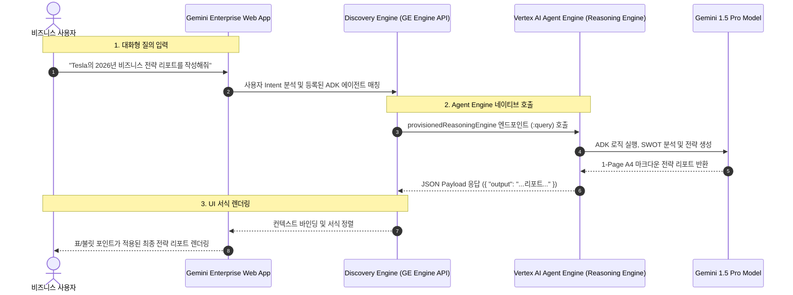

# Antigravity 기반 Agent Engine과 Gemini Enterprise (GE) 공식 등록 실습 가이드 (agy_ge)

본 문서는 **Antigravity CLI** 및 `agy_agent` 실습을 통해 **GCP Vertex AI Agent Engine (Reasoning Engine)**에 배포된 **비즈니스 전략 분석 에이전트**를 Google Cloud 공식 문서에 명시된 **Gemini Enterprise (Discovery Engine API / Console)**의 `adkAgentDefinition` 규격을 사용하여 네이티브 커스텀 에이전트로 등록하고, 사내 비즈니스 사용자가 Gemini Enterprise 웹 앱에서 직접 호출하여 A4 1장 전략 리포트를 생성할 수 있도록 연계하는 핸즈온 실습 가이드입니다.

> 💡 **참조 공식 문서:** [Google Cloud - Agent Runtime에서 호스팅되는 ADK 에이전트 등록 및 관리](https://docs.cloud.google.com/gemini/enterprise/docs/register-and-manage-an-adk-agent?hl=ko#register_adk_agent-drest)

---

## 1. 개요 및 학습 목표

- **Gemini Enterprise 공식 에이전트 연계 구조 이해:** Vertex AI Agent Engine에 배포된 Reasoning Engine 리소스를 Gemini Enterprise 백엔드(Discovery Engine)의 `provisionedReasoningEngine`으로 직접 바인딩하는 표준 방식을 이해합니다.
- **Discovery Engine REST API를 통한 등록 자동화:** `v1alpha` Discovery Engine API를 사용하여 에이전트 표시 이름(`displayName`), 설명(`description`), 아이콘(`icon`), 리소스 경로를 포함한 JSON 페이로드를 전달하여 등록합니다.
- **Google Cloud 콘솔(GUI)을 통한 등록 절차 습득:** 콘솔의 Gemini Enterprise 관리 화면에서 'Agent Runtime 커스텀 에이전트'를 손쉽게 추가하는 워크플로우를 익힙니다.
- **엔터프라이즈 사용자 공유 및 E2E 대화형 테스트:** 사내 사용자에게 에이전트 권한을 공유하고, Gemini Enterprise 대화창에서 실제 기업 전략 리포트를 출력하여 서식을 검증합니다.

---

## 2. 연동 아키텍처 및 메커니즘



---

## 3. 사전 준비 사항 (Prerequisites)

| 구분                     | 요구사항                                                        | 비고                               |
| :----------------------- | :-------------------------------------------------------------- | :--------------------------------- |
| **배포된 에이전트**      | Vertex AI Reasoning Engine Resource Name                        | `agy_agent` 실습에서 배포된 리소스 |
| **Gemini Enterprise 앱** | Discovery Engine App ID (`APP_ID`)                              | Google Cloud Console에서 생성된 앱 |
| **필수 GCP API**         | `discoveryengine.googleapis.com`<br>`aiplatform.googleapis.com` | API 활성화 필요                    |
| **GCP 권한**             | Discovery Engine Admin/Editor, Vertex AI User                   | IAM 역할 바인딩                    |
| **도구 및 환경**         | Antigravity CLI, `gcloud` CLI, `curl`, `jq`                     | 터미널 접근 권한                   |

---

## 4. 단계별 실습 가이드 (Hands-on Lab Steps)

### Step 1: 환경 변수 설정 및 Discovery Engine API 활성화

Gemini Enterprise 연동에 필요한 GCP 환경 변수를 설정하고 Discovery Engine API를 활성화합니다.

```bash
# 1. 작업 디렉터리 생성 및 이동
mkdir -p ~/antigravity-lab/lab/agy_ge/scripts
mkdir -p ~/antigravity-lab/lab/agy_ge/config
cd ~/antigravity-lab/lab/agy_ge

# 2. GCP 기본 변수 설정
export GCP_PROJECT_ID="your-project-id"
export GCP_PROJECT_NUMBER=$(gcloud projects describe $GCP_PROJECT_ID --format="value(projectNumber)")
export GCP_REGION="us-central1"

# 3. Discovery Engine API 엔드포인트 위치 설정 (global, us, 또는 eu)
export ENDPOINT_LOCATION="global"

# 4. Gemini Enterprise 앱 ID 및 배포된 Reasoning Engine 리소스 ID 설정
export APP_ID="your-gemini-enterprise-app-id"
export REASONING_ENGINE_ID="9876543210987654321"  # agy_agent 실습에서 생성된 ID

# 5. Discovery Engine API 활성화
gcloud services enable discoveryengine.googleapis.com --project=$GCP_PROJECT_ID
```

---

### Step 2: (선택사항) OAuth 승인(Authorization) 리소스 생성

에이전트가 사용자를 대신하여 Google Drive, BigQuery 등 특정 Google Cloud 리소스에 접근해야 하는 경우 승인 리소스를 등록합니다. (단순 기업 분석의 경우 건너뛸 수 있습니다.)

```bash
# OAuth 승인 리소스 등록 예시 (필요한 경우만 실행)
export AUTH_ID="auth-business-strategy"
export OAUTH_CLIENT_ID="your-oauth-client-id.apps.googleusercontent.com"
export OAUTH_CLIENT_SECRET="your-oauth-client-secret"
export OAUTH_AUTH_URI="https://accounts.google.com/o/oauth2/v2/auth?client_id=${OAUTH_CLIENT_ID}&redirect_uri=https%3A%2F%2Fvertexaisearch.cloud.google.com%2Fstatic%2Foauth%2Foauth.html&scope=https%3A%2F%2Fwww.googleapis.com%2Fauth%2Fcloud-platform&include_granted_scopes=true&response_type=code&access_type=offline&prompt=consent"
export OAUTH_TOKEN_URI="https://oauth2.googleapis.com/token"

curl -X POST \
   -H "Authorization: Bearer $(gcloud auth print-access-token)" \
   -H "Content-Type: application/json" \
   -H "X-Goog-User-Project: ${GCP_PROJECT_ID}" \
   "https://${ENDPOINT_LOCATION}-discoveryengine.googleapis.com/v1alpha/projects/${GCP_PROJECT_NUMBER}/locations/global/authorizations?authorizationId=${AUTH_ID}" \
   -d '{
      "name": "projects/'"${GCP_PROJECT_NUMBER}"'/locations/global/authorizations/'"${AUTH_ID}"'",
      "serverSideOauth2": {
         "clientId": "'"${OAUTH_CLIENT_ID}"'",
         "clientSecret": "'"${OAUTH_CLIENT_SECRET}"'",
         "authorizationUri": "'"${OAUTH_AUTH_URI}"'",
         "tokenUri": "'"${OAUTH_TOKEN_URI}"'"
      }
   }'
```

---

### Step 3: Discovery Engine REST API를 통한 ADK 에이전트 등록 (`scripts/register_adk_agent.sh`)

Google Cloud 공식 규격인 `adkAgentDefinition.provisionedReasoningEngine`을 사용하여 Agent Engine을 Gemini Enterprise에 등록합니다.

```bash
# scripts/register_adk_agent.sh 스크립트 작성
cat << 'EOF' > scripts/register_adk_agent.sh
#!/bin/bash
set -e

echo "=== Gemini Enterprise에 ADK Agent Engine 등록 시작 ==="

ACCESS_TOKEN=$(gcloud auth print-access-token)
API_URL="https://${ENDPOINT_LOCATION}-discoveryengine.googleapis.com/v1alpha/projects/${GCP_PROJECT_ID}/locations/global/collections/default_collection/engines/${APP_ID}/assistants/default_assistant/agents"
RESOURCE_PATH="projects/${GCP_PROJECT_ID}/locations/${GCP_REGION}/reasoningEngines/${REASONING_ENGINE_ID}"

echo ">> 대상 API URL: $API_URL"
echo ">> 바인딩할 Agent Engine 리소스: $RESOURCE_PATH"

PAYLOAD=$(cat << INNER_EOF
{
  "displayName": "Business Strategy Analyst",
  "description": "특정 기업명을 입력받아 시장 동향, 핵심 역량, SWOT 분석 및 단기/중장기 전략 제언이 포함된 A4 1장 비즈니스 전략 리포트를 작성하는 전문 AI 에이전트",
  "icon": {
    "uri": "https://fonts.gstatic.com/s/i/short-term/release/googlex/gemini_sparkle/default/24px.svg"
  },
  "adkAgentDefinition": {
    "provisionedReasoningEngine": {
      "reasoningEngine": "${RESOURCE_PATH}"
    }
  }
}
INNER_EOF
)

response=$(curl -s -w "\nHTTP_STATUS:%{http_code}" -X POST \
  -H "Authorization: Bearer ${ACCESS_TOKEN}" \
  -H "Content-Type: application/json" \
  -H "X-Goog-User-Project: ${GCP_PROJECT_ID}" \
  "$API_URL" \
  -d "$PAYLOAD")

http_status=$(echo "$response" | grep "HTTP_STATUS" | cut -d':' -f2)
body=$(echo "$response" | sed '/HTTP_STATUS/d')

echo ">> 응답 HTTP 상태 코드: $http_status"

if [ "$http_status" -eq 200 ] || [ "$http_status" -eq 201 ]; then
  echo "🎉 에이전트가 성공적으로 Gemini Enterprise에 등록되었습니다!"
  echo "$body" | jq .
else
  echo "❌ 에이전트 등록 실패:"
  echo "$body"
  exit 1
fi
EOF

chmod +x scripts/register_adk_agent.sh
```

#### 스크립트 실행

```bash
./scripts/register_adk_agent.sh
```

---

### Step 4: Google Cloud 콘솔(GUI)을 통한 등록 방법

콘솔을 선호하는 경우 아래 절차를 통해 GUI 환경에서 동일하게 등록할 수 있습니다:

1. [Google Cloud Console - Gemini Enterprise](https://console.cloud.google.com/gemini-enterprise/?hl=ko) 페이지로 이동합니다.
2. 에이전트를 등록할 **앱(App)**의 이름을 클릭합니다.
3. 좌측 메뉴에서 **에이전트(Agents)**를 클릭합니다.
4. 상단의 **+ 에이전트 추가(+ Add Agent)** 버튼을 클릭합니다.
5. **Agent Runtime을 통한 커스텀 에이전트 (Custom Agent via Agent Runtime)** 옵션의 **추가**를 클릭합니다.
6. **에이전트 구성** 입력:
   - **에이전트 이름 (Display Name):** `Business Strategy Analyst`
   - **에이전트 설명 (Description):** `특정 기업에 대한 A4 1장 비즈니스 전략 리포트 생성 에이전트`
   - **Agent Runtime 리소스 경로:**
     ```text
     projects/{GCP_PROJECT_ID}/locations/{GCP_REGION}/reasoningEngines/{REASONING_ENGINE_ID}
     ```
7. **만들기(Create)**를 클릭하여 등록을 완료합니다.

---

### Step 5: 등록된 에이전트 목록 조회 및 상태 확인 (`scripts/list_agents.sh`)

현재 Gemini Enterprise 앱에 연결된 모든 커스텀 에이전트 목록을 조회하여 정상 활성화되었는지 확인합니다.

```bash
# scripts/list_agents.sh 스크립트 작성
cat << 'EOF' > scripts/list_agents.sh
#!/bin/bash
ACCESS_TOKEN=$(gcloud auth print-access-token)
API_URL="https://${ENDPOINT_LOCATION}-discoveryengine.googleapis.com/v1alpha/projects/${GCP_PROJECT_ID}/locations/global/collections/default_collection/engines/${APP_ID}/assistants/default_assistant/agents"

curl -s -X GET \
  -H "Authorization: Bearer ${ACCESS_TOKEN}" \
  -H "X-Goog-User-Project: ${GCP_PROJECT_ID}" \
  "$API_URL" | jq .
EOF

chmod +x scripts/list_agents.sh
./scripts/list_agents.sh
```

---

### Step 6: 사내 사용자와 에이전트 공유 및 대화형 E2E 실습

등록된 에이전트를 사내 조직 단위에 공유하고 웹 앱에서 실제 질의를 수행합니다.

#### 1. 에이전트 공유 설정

- Google Cloud 콘솔 > Gemini Enterprise > **에이전트** > `Business Strategy Analyst` 선택 > **공유(Share)** 클릭
- 사내 사용자 또는 '전략기획팀' 그룹 이메일을 추가하고 권한을 부여합니다.

#### 2. Gemini Enterprise 웹 앱에서 질의 테스트

1. 브라우저에서 Gemini Enterprise 웹 앱(`https://gemini.google.com/enterprise`)에 접속합니다.
2. 대화창에 아래와 같이 질의를 입력합니다:

```text
Tesla의 2026년 비즈니스 전략 리포트를 작성해줘.
```

#### 3. 최종 출력 결과 (Gemini Enterprise 웹 화면 렌더링)

```markdown
# Tesla 비즈니스 전략 보고서 (Executive Brief)

## 1. Executive Summary

- **EV 캐즘 극복 및 AI/로보틱스 테크 기업으로의 포지셔닝 전환:** FSD(Full Self-Driving) 완전 자율주행 상용화 및 Robotaxi 생태계 확장이 기업 가치 리레이팅의 핵심 동력임.
- **에너지(ESS) 사업부의 급격한 수익 기여도 확대:** Megapack 중심의 그리드 솔루션 매출이 분기별 최고치를 경신하며 전기차 마진 둔화를 성공적으로 상쇄.
- **차세대 보급형 플랫폼(2만 5천 달러 대) 조기 양산 필수:** 글로벌 볼륨 마켓 점유율 수성을 위해 저가형 신모델 출시 일정 준수가 결정적.

## 2. Market & Industry Dynamics

- **글로벌 EV 시장 가격 경쟁:** 중국 BYD 및 신흥 완성차 브랜드의 공세에 대응하여 제조 원가 절감(Unboxed Process) 필수.
- **피지컬 AI(Physical AI) 로보틱스 트렌드:** Optimus 휴머노이드 로봇의 기가팩토리 실증 투입으로 제조 단가 혁신 추진.

## 3. Core Competencies & SWOT Analysis

| 구분                     | 주요 내용                                                                                         |
| :----------------------- | :------------------------------------------------------------------------------------------------ |
| **Strengths (강점)**     | 기가캐스팅 기반 단일 플랫폼 원가 경쟁력, 10억 마일 이상의 실도로 FSD 주행 데이터, 슈퍼차저 인프라 |
| **Weaknesses (약점)**    | 사이버트럭 초기 양산 안정화 비용 및 신차 출시 주기 지연                                           |
| **Opportunities (기회)** | 사이버캡(Cybercab) 기반 모빌리티 서비스 구독 모델 안착, 글로벌 분산 에너지망 장악                 |
| **Threats (위협)**       | 주요국 친환경 보조금 축소 정책 및 자율주행 안전 규제 불확실성                                     |

## 4. Strategic Recommendations & Action Items

1. **[단기] FSD 라이선싱 확대 및 구독형 서비스 전환:** 타 완성차 OEM과의 FSD 소프트웨어 공급 계약 체결 추진.
2. **[중기] 에너지 스토리지(Megapack) 생산 라인 증설:** 전력망 인프라 병목 국가(미국, 호주, 유럽) 대상 B2B 영업력 집중.
3. **[장기] 피지컬 AI 팩토리 풀 오토메이션:** Optimus 기반 완전 무인 조립 공정 구축으로 생산 단가 30% 절감.
```

---

## 5. 문제 해결 및 모범 사례 (Troubleshooting)

### Q1. 에이전트 등록 시 `404 NotFound (Engine not found)` 오류가 발생합니다.

- **원인:** `APP_ID` 또는 `ENDPOINT_LOCATION`이 실제 생성된 Gemini Enterprise 앱의 위치와 일치하지 않습니다.
- **해결 방법:**
  - Google Cloud 콘솔 > Gemini Enterprise에서 정확한 앱 ID와 리전(global/us/eu)을 확인한 후 환경 변수를 재설정합니다.

### Q2. `400 Invalid argument (reasoningEngine not found)` 오류가 발생합니다.

- **원인:** `adkAgentDefinition.provisionedReasoningEngine.reasoningEngine` 필드의 경로 형식에 오타가 있거나 다른 리전/프로젝트에 배포된 리소스입니다.
- **해결 방법:**
  - `projects/<PROJECT_ID>/locations/<LOCATION>/reasoningEngines/<RESOURCE_ID>` 형식과 `gcloud ai reasoning-engines list` 결과가 일치하는지 확인합니다.

---

## 6. 실습 완료 체크리스트

- [ ] Gemini Enterprise App ID (`APP_ID`) 및 Reasoning Engine Resource ID 확인 완료
- [ ] Discovery Engine API 활성화 및 `roles/discoveryengine.admin` 권한 확인 완료
- [ ] `scripts/register_adk_agent.sh`를 실행하여 Discovery Engine에 ADK 에이전트 등록 성공
- [ ] `scripts/list_agents.sh`를 통해 등록된 `Business Strategy Analyst` 에이전트 확인 완료
- [ ] Gemini Enterprise 웹 앱에서 대화형 질의를 통해 A4 1장 비즈니스 전략 보고서 렌더링 검증 완료
