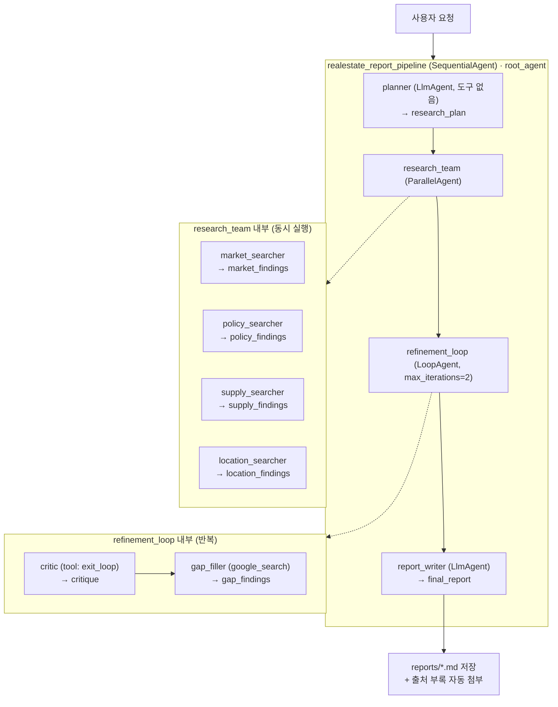
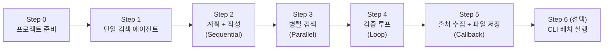
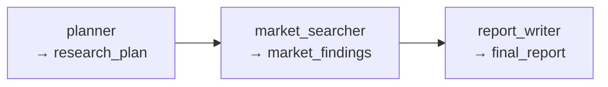
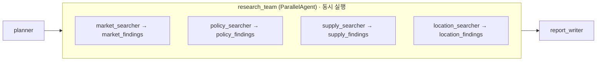
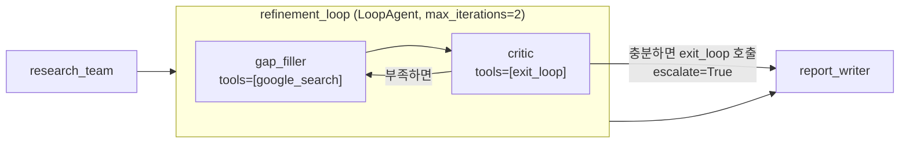

# Antigravity + ADK 로컬 멀티 에이전트 개발 실습 가이드 (local_agent)

본 문서는 **Antigravity CLI(`agy`)** 와 **Google ADK(Agent Development Kit, Python)** 를 사용하여,
로컬에서 동작하는 **부동산 리포트 생성 멀티 에이전트**를 단계적으로 완성하는 핸즈온 실습 가이드입니다.

> [!IMPORTANT]
> **OS별 표기 규칙**
>
> 이 문서의 모든 실행 예제는 아래 세 가지 표기 중 하나를 따릅니다. 자신의 환경에 해당하는 블록만 실행하세요.
>
> | 표기                     | 의미                                                       |
> | ------------------------ | ---------------------------------------------------------- |
> | **macOS / Linux**        | macOS(zsh) 및 Linux(bash) 터미널에서 실행                  |
> | **Windows (PowerShell)** | Windows PowerShell 5.1+ 또는 PowerShell 7.x 에서 실행      |
> | **모든 OS 동일**         | agy TUI 내부 입력·프롬프트·파일 내용 등 OS와 무관하게 동일 |
>
> - **WSL2 / Git Bash / GCP Cloud Shell** 사용자는 `macOS / Linux` 블록을 그대로 사용하세요.
> - Windows에서는 `python3` → `python`, `curl` → `curl.exe`, `/` → `\` 로 바뀌는 점에 유의하세요.

> **전제 조건:** [agy_setup.md](../agy_basic/agy_setup.md) 의 Antigravity CLI 설치·로그인 및 **GCP ADC 설정(Step 6)** 완료

---

## 1. 개요 및 학습 목표

### 1.1 무엇을 만드나

사용자가 `"서울 강남구 개포동 전용 84㎡ 매매 리포트 써줘"` 라고 입력하면,
여러 에이전트가 **역할을 나눠** 조사·검증한 뒤 **출처가 붙은 Markdown 리포트 파일**을 생성합니다.

| 학습 목표         | 내용                                                                  |
| :---------------- | :-------------------------------------------------------------------- |
| ADK 기본기        | `LlmAgent`, 도구(`google_search`), `adk web` 디버깅                   |
| 워크플로 에이전트 | `SequentialAgent`(순차) · `ParallelAgent`(병렬) · `LoopAgent`(반복)   |
| 상태 공유         | `output_key` 로 쓰고 instruction 안에서 `{key}` 로 읽는 session state |
| 콜백 활용         | 날짜 주입, grounding 출처 자동 수집, 리포트 파일 저장                 |
| Antigravity 활용  | `/planning` 으로 설계 → 코드 생성 → 오류 로그 붙여넣어 디버깅         |

### 1.2 최종 아키텍처



### 1.3 단계적 빌드업 로드맵

한 번에 전부 만들지 않습니다. **Step마다 `adk web` 으로 동작을 확인하고 다음으로 넘어갑니다.**



| Step | 추가되는 것                              | 새로 배우는 ADK 개념                           |
| :--- | :--------------------------------------- | :--------------------------------------------- |
| 0    | 가상환경 · ADK 설치 · 인증 · 패키지 뼈대 | `root_agent` 규칙, `adk web`                   |
| 1    | 검색 에이전트 1개                        | `LlmAgent`, `google_search`, `thinking_level`  |
| 2    | 계획 → 작성 2단계 파이프라인             | `SequentialAgent`, `output_key`, `{state}`     |
| 3    | 검색 에이전트 4개 동시 실행              | `ParallelAgent`                                |
| 4    | 검수 → 보완 반복                         | `LoopAgent`, function tool, `escalate`         |
| 5    | 출처 자동 수집 + 파일 저장               | `after_model_callback`, `after_agent_callback` |
| 6    | 터미널에서 한 줄 실행                    | `Runner`, `SessionService`                     |

---

## 2. 사전 준비 사항 (Prerequisites)

### 2.1 요구사항

| 구분            | 요구사항                                                     | 비고                                      |
| :-------------- | :----------------------------------------------------------- | :---------------------------------------- |
| **운영체제**    | macOS, Linux, Windows 10/11 (PowerShell 5.1+ 또는 WSL2)      |                                           |
| **Python**      | 3.10 이상                                                    | 3.11 / 3.12 권장                          |
| **Antigravity** | `agy` 설치 및 로그인 완료                                    | [agy_setup.md](../agy_basic/agy_setup.md) |
| **인증 (기본)** | GCP 프로젝트 + ADC (`gcloud auth application-default login`) | Vertex AI 사용                            |
| **인증 (대안)** | Google AI Studio API 키                                      | GCP 프로젝트 없이 실습할 때               |
| **필수 패키지** | `google-adk`, `google-genai`, `python-dotenv`                | Step 0에서 설치                           |
| **브라우저**    | Chrome 등 최신 브라우저                                      | `adk web` UI 확인용                       |

### 2.2 5분 개념 정리

실습 전에 이 6개만 알면 충분합니다.

| 개념                  | 한 줄 설명                                                                                      |
| :-------------------- | :---------------------------------------------------------------------------------------------- |
| **`LlmAgent`**        | LLM 하나 + 지시문(instruction) + 도구(tools) 로 이루어진 **기본 일꾼**                          |
| **`root_agent`**      | ADK가 패키지 폴더에서 찾는 **진입점 변수 이름**. 반드시 이 이름이어야 함                        |
| **`output_key`**      | 에이전트의 최종 답변을 **session state** 의 해당 키에 저장                                      |
| **`{key}`**           | instruction 안에서 state 값을 **치환**. 없어도 되는 값은 `{key?}`                               |
| **워크플로 에이전트** | `SequentialAgent`(차례로) / `ParallelAgent`(동시에) / `LoopAgent`(반복). **순서를 코드로 고정** |
| **콜백(callback)**    | 에이전트 실행 전후·모델 응답 후에 끼어드는 **내 파이썬 함수**                                   |

> [!IMPORTANT]
> **이 실습에서 반드시 지킬 3가지 규칙** (어기면 바로 오류가 납니다)
>
> 1. **`google_search` 를 가진 에이전트는 다른 도구를 갖지 않는다.**
>    섞으면 `400 INVALID_ARGUMENT (Multiple tools are supported only when they are all search tools)` 가 발생합니다.
> 2. **`gemini-3.8-flash` 에는 `temperature` / `top_p` / `top_k` 를 설정하지 않는다.**
>    추론량은 `thinking_level` (`LOW` / `MEDIUM` / `HIGH`) 로 제어합니다. **`MINIMAL` 은 검증 오류**가 납니다.
> 3. **`ParallelAgent` 의 하위 에이전트는 서로 다른 `output_key` 를 쓴다.** 같은 키면 덮어쓰기 경합이 발생합니다.

---

## 3. Step 0: 프로젝트 준비

### 3.1 작업 디렉터리 생성

[agy_setup.md](../agy_basic/agy_setup.md) 에서 만든 워크스페이스 루트(`~/antigravity-lab`) 아래에 이번 실습 폴더를 만듭니다.

**macOS / Linux**

```bash
mkdir -p ~/antigravity-lab/local_agent
cd ~/antigravity-lab/local_agent
pwd
```

**Windows (PowerShell)**

```powershell
New-Item -ItemType Directory -Force -Path "$HOME\antigravity-lab\local_agent" | Out-Null
Set-Location "$HOME\antigravity-lab\local_agent"
Get-Location
```

### 3.2 가상환경 생성 및 ADK 설치

**macOS / Linux**

```bash
python3 -m venv .venv
source .venv/bin/activate

python -m pip install -U pip
pip install -U google-adk google-genai python-dotenv

adk --version
```

**Windows (PowerShell)**

```powershell
python -m venv .venv
.\.venv\Scripts\Activate.ps1

python -m pip install -U pip
pip install -U google-adk google-genai python-dotenv

adk --version
```

> [!WARNING]
> Windows에서 `이 시스템에서 스크립트를 실행할 수 없으므로...` 오류가 나면 현재 세션만 정책을 완화합니다.
>
> ```powershell
> Set-ExecutionPolicy -Scope Process -ExecutionPolicy Bypass
> .\.venv\Scripts\Activate.ps1
> ```

> [!NOTE]
> 프롬프트 앞에 `(.venv)` 가 보여야 정상입니다. **이후 모든 명령은 가상환경이 활성화된 상태**에서 실행하세요.
> 터미널을 새로 열면 활성화 명령을 다시 실행해야 합니다.

### 3.3 패키지 뼈대 생성

ADK는 **패키지 폴더 안의 `root_agent`** 를 찾습니다. 아래 구조를 먼저 만듭니다.

```text
~/antigravity-lab/local_agent/          ← 여기서 adk web 을 실행 (프로젝트 루트)
├── .venv/
├── realestate_agent/                   ← 에이전트 패키지
│   ├── __init__.py
│   ├── agent.py                        ← root_agent 정의
│   ├── prompts.py                      ← 긴 instruction 분리 (Step 2부터)
│   └── .env                            ← 인증 정보 (Git 커밋 금지)
├── reports/                            ← 리포트 저장 위치 (Step 5에서 자동 생성)
└── .gitignore
```

**macOS / Linux**

```bash
mkdir -p realestate_agent
printf 'from . import agent\n' > realestate_agent/__init__.py
ls -la realestate_agent
```

**Windows (PowerShell)**

```powershell
New-Item -ItemType Directory -Force -Path "realestate_agent" | Out-Null
Set-Content -Encoding ascii -Path "realestate_agent\__init__.py" -Value "from . import agent"
Get-ChildItem realestate_agent
```

> [!IMPORTANT]
> `__init__.py` 의 `from . import agent` 한 줄이 없으면 `adk web` 목록에 에이전트가 나타나지 않습니다.

### 3.4 인증 설정 (`.env`)

**방법 A — Vertex AI (기본, 권장)**

[agy_setup.md](../agy_basic/agy_setup.md) Step 6에서 ADC를 설정했다면 별도 API 키 없이 바로 연결됩니다.

**macOS / Linux**

```bash
cat > realestate_agent/.env <<'EOF'
GOOGLE_GENAI_USE_VERTEXAI=TRUE
GOOGLE_CLOUD_PROJECT=<YOUR_PROJECT_ID>
GOOGLE_CLOUD_LOCATION=global
REPORT_MODEL=gemini-3.8-flash
EOF

cat realestate_agent/.env
```

**Windows (PowerShell)**

```powershell
@"
GOOGLE_GENAI_USE_VERTEXAI=TRUE
GOOGLE_CLOUD_PROJECT=<YOUR_PROJECT_ID>
GOOGLE_CLOUD_LOCATION=global
REPORT_MODEL=gemini-3.8-flash
"@ | Set-Content -Encoding ascii realestate_agent\.env

Get-Content realestate_agent\.env
```

`<YOUR_PROJECT_ID>` 를 자신의 GCP 프로젝트 ID로 바꾸고, ADC가 설정되어 있는지 확인합니다.

```bash
gcloud config get-value project
gcloud auth application-default print-access-token > /dev/null && echo "ADC OK"
```

ADC가 없다면 (**모든 OS 동일**):

```bash
gcloud auth application-default login
```

---

**방법 B — Google AI Studio API 키 (대안)**

GCP 프로젝트가 없거나 더 간단히 시작하고 싶을 때 사용합니다.
키는 [https://aistudio.google.com/apikey](https://aistudio.google.com/apikey) 에서 발급합니다.

**macOS / Linux**

```bash
cat > realestate_agent/.env <<'EOF'
GOOGLE_GENAI_USE_VERTEXAI=FALSE
GOOGLE_API_KEY=your-api-key-here
REPORT_MODEL=gemini-3.8-flash
EOF
```

**Windows (PowerShell)**

```powershell
@"
GOOGLE_GENAI_USE_VERTEXAI=FALSE
GOOGLE_API_KEY=your-api-key-here
REPORT_MODEL=gemini-3.8-flash
"@ | Set-Content -Encoding ascii realestate_agent\.env
```

> [!NOTE]
> PowerShell에서 `Set-Content -Encoding UTF8` 을 쓰면 PowerShell 5.1은 파일 앞에 **BOM**을 넣어 `.env` 첫 줄 파싱이 깨질 수 있습니다.
> `.env` 는 ASCII 문자만 쓰므로 위처럼 **`-Encoding ascii`** 를 사용하는 것이 안전합니다.

### 3.5 시크릿 안전장치 (`.gitignore`)

> [!CAUTION]
> `.env` 에는 프로젝트 ID나 API 키가 들어갑니다. **절대 Git에 커밋하지 마세요.**
> 공유가 필요하면 값을 비운 `.env.example` 만 커밋합니다.

**macOS / Linux**

```bash
cat > .gitignore <<'EOF'
.venv/
__pycache__/
*.pyc
.env
**/.env
reports/
EOF

cat > realestate_agent/.env.example <<'EOF'
GOOGLE_GENAI_USE_VERTEXAI=TRUE
GOOGLE_CLOUD_PROJECT=<YOUR_PROJECT_ID>
GOOGLE_CLOUD_LOCATION=global
REPORT_MODEL=gemini-3.8-flash
EOF
```

**Windows (PowerShell)**

```powershell
@"
.venv/
__pycache__/
*.pyc
.env
**/.env
reports/
"@ | Set-Content -Encoding ascii .gitignore

@"
GOOGLE_GENAI_USE_VERTEXAI=TRUE
GOOGLE_CLOUD_PROJECT=<YOUR_PROJECT_ID>
GOOGLE_CLOUD_LOCATION=global
REPORT_MODEL=gemini-3.8-flash
"@ | Set-Content -Encoding ascii realestate_agent\.env.example
```

### 3.6 Antigravity CLI 실행

**모든 OS 동일**

```bash
agy
```

워크스페이스 신뢰 프롬프트가 나오면 `Yes, I trust this folder` 를 선택합니다.

에이전트가 이 실습의 규칙을 따르도록 `AGENTS.md` 를 먼저 만들어 둡니다.
`agy` 프롬프트에 아래를 그대로 붙여넣으세요. (**모든 OS 동일**)

```text
/fast
이 프로젝트 루트에 AGENTS.md 파일을 만들어줘. 내용은 아래 그대로:

# ADK 로컬 에이전트 실습 규칙

## 모델 설정 (필수)
- 모델 ID는 gemini-3.8-flash 를 os.getenv("REPORT_MODEL", "gemini-3.8-flash") 로 읽는다.
- temperature, top_p, top_k, candidate_count 를 절대 설정하지 않는다.
- 추론량은 thinking_budget 이 아니라 types.ThinkingConfig(thinking_level=...) 로 제어한다.
- thinking_level 값은 LOW / MEDIUM / HIGH 만 사용한다. MINIMAL 은 금지.

## ADK 설계 규칙
- google_search 를 가진 에이전트는 tools=[google_search] 하나만 갖는다. 다른 도구와 섞지 않는다.
- 흐름 제어는 LlmAgent 라우팅 대신 SequentialAgent / ParallelAgent / LoopAgent 로 고정한다.
- 모든 LlmAgent 에 고유한 output_key 를 준다. ParallelAgent 하위 에이전트는 키가 겹치면 안 된다.
- instruction 에서 state 는 {key}, 없어도 되는 값은 {key?} 로 읽는다. 리터럴 중괄호는 쓰지 않는다.
- 긴 instruction 은 prompts.py 로 분리한다.

## 오류 처리
- 예외를 빈 블록으로 삼키지 않는다 (except Exception: pass 금지).
- 구체적인 예외 타입을 쓰고, 실패 원인을 로그로 남긴다.

## 보안
- API 키, 프로젝트 ID 를 코드에 하드코딩하지 않는다. 반드시 .env 와 os.getenv 를 쓴다.
- .env 파일을 Git 에 커밋하지 않는다.
```

✅ **Step 0 확인**

- [ ] `(.venv)` 가 프롬프트에 보인다.
- [ ] `adk --version` 이 정상 출력된다.
- [ ] `realestate_agent/__init__.py` 에 `from . import agent` 가 있다.
- [ ] `realestate_agent/.env` 가 생성되었고, `.gitignore` 에 `.env` 가 포함되어 있다.
- [ ] 프로젝트 루트에 `AGENTS.md` 가 생성되었다.

---

## 4. Step 1: 단일 검색 에이전트 만들기

🎯 **목표:** `google_search` 도구 하나를 가진 가장 단순한 에이전트를 만들고 `adk web` 으로 동작을 확인한다.

### 4.1 agy에게 시킬 프롬프트

**모든 OS 동일**

```text
@AGENTS.md 규칙을 지켜서 realestate_agent/agent.py 를 만들어줘.

- google_search 도구 하나만 가진 LlmAgent 를 root_agent 라는 이름으로 정의한다.
- 이름은 market_searcher, 역할은 한국 부동산 시세·거래 동향 검색.
- 모델은 .env 의 REPORT_MODEL 을 읽고, 기본값은 gemini-3.8-flash.
- generate_content_config 는 ThinkingConfig(thinking_level="MEDIUM") 만 설정한다.
- instruction 에는 다음 규칙을 넣는다:
  · google_search 를 최소 3회, 서로 다른 키워드로 사용할 것
  · 모든 수치에 [기준일, 출처 기관·매체명] 을 붙일 것
  · 실거래가와 호가를 구분해 (실거래) / (호가) 로 표기할 것
  · 확인하지 못한 것은 "확인 불가" 로 남기고 추측하지 말 것
  · 출력은 불릿 25줄 이내

코드만 만들고 실행은 아직 하지 마.
```

### 4.2 생성될 코드 (검증용)

`realestate_agent/agent.py` — **모든 OS 동일**

```python
import os

from google.adk.agents import LlmAgent
from google.adk.tools import google_search
from google.genai import types

MODEL = os.getenv("REPORT_MODEL", "gemini-3.8-flash")

MARKET_INSTRUCTION = """
당신은 한국 부동산 시세·거래 동향 조사 담당자다.

규칙:
- 반드시 google_search를 여러 번(최소 3회, 서로 다른 키워드) 사용한다.
- 모든 수치에는 [기준일/기간, 출처 기관·매체명]을 붙인다. 출처 없는 수치는 쓰지 않는다.
- 실거래가와 호가(매물가)를 절대 섞지 않는다. 구분 표기: (실거래) / (호가).
- 실거래가는 신고 기한(계약 후 30일) 때문에 최근 1개월 데이터가 불완전함을 감안한다.
- 우선 출처: 국토교통부 실거래가 공개시스템, 한국부동산원(R-ONE), KB부동산,
  한국은행, 국토교통부·지자체 보도자료, 주요 언론. 블로그·카페 글은 보조로만.
- 확인 못 한 것은 "확인 불가"로 남긴다. 추측으로 메우지 않는다.
- 출력: 불릿 요약(최대 25줄) + 각 불릿 끝에 출처 표기.
"""

root_agent = LlmAgent(
    name="market_searcher",
    model=MODEL,
    description="한국 부동산 시세·거래 동향을 검색해 정리하는 에이전트",
    instruction=MARKET_INSTRUCTION,
    tools=[google_search],  # 검색 도구 단독 (다른 도구와 섞지 않는다)
    generate_content_config=types.GenerateContentConfig(
        thinking_config=types.ThinkingConfig(thinking_level="MEDIUM")
    ),
)
```

### 4.3 실행 및 확인

> [!IMPORTANT]
> `adk web` 은 **패키지 폴더의 부모**(= `~/antigravity-lab/local_agent`)에서 실행해야 합니다.
> `realestate_agent` 폴더 안에서 실행하면 에이전트를 찾지 못합니다.

**macOS / Linux** — 새 터미널 ②

```bash
cd ~/antigravity-lab/local_agent
source .venv/bin/activate
adk web
```

**Windows (PowerShell)** — 새 터미널 ②

```powershell
Set-Location "$HOME\antigravity-lab\local_agent"
.\.venv\Scripts\Activate.ps1
adk web
```

출력 예시 (**모든 OS 동일**)

```text
INFO:     Started server process [12345]
INFO:     Uvicorn running on http://127.0.0.1:8000 (Press CTRL+C to quit)
```

> [!NOTE]
> 8000 포트가 이미 사용 중이면 `adk web --port 8080` 처럼 다른 포트를 지정하세요.
> ([agy_webapp.md](../agy_basic/agy_webapp.md) Lab A가 8000 포트를 사용합니다.)

브라우저에서 `http://localhost:8000` 을 열고:

1. 좌측 상단 드롭다운에서 **`realestate_agent`** 를 선택합니다.
2. 입력창에 아래를 넣고 전송합니다.

```text
서울 강남구 개포동 전용 84㎡ 아파트의 최근 실거래가와 호가 동향을 조사해줘.
```

✅ **Step 1 확인**

- [ ] 드롭다운에 `realestate_agent` 가 보인다.
- [ ] 답변이 생성된다.
- [ ] **Events 탭**에서 `google_search` 도구 호출이 **3회 이상** 보인다.
- [ ] 각 수치 뒤에 기준일·출처가 붙어 있다.

> [!TIP]
> **핵심 포인트 — 왜 검색 도구를 격리하나?**
> Gemini의 내장 검색은 다른 function tool과 한 에이전트에 섞이면
> `Multiple tools are supported only when they are all search tools` 오류가 납니다.
> 그래서 이 실습 내내 **"검색 에이전트는 `tools=[google_search]` 만"** 규칙을 지킵니다.

---

## 5. Step 2: 계획 → 작성 파이프라인 (SequentialAgent)

🎯 **목표:** 조사 계획을 세우는 `planner` 와 리포트를 쓰는 `report_writer` 를 추가하고,
**`output_key` → `{key}`** 로 데이터를 넘기는 방법을 익힌다.



### 5.1 agy에게 시킬 프롬프트

**모든 OS 동일**

```text
@AGENTS.md 규칙을 지켜서 다음과 같이 확장해줘.

1) realestate_agent/prompts.py 를 새로 만들고, 아래 3개의 프롬프트 상수를 정의한다.
   - PLANNER : 조사 계획만 세우는 총괄. 검색은 하지 않는다. {today} 를 사용.
     출력 형식은 "## 대상 / ## 핵심 질문 (3~6개) / ## 영역별 검색 키워드 / ## 조사 기간".
   - MARKET  : 지금 agent.py 에 있는 시세 검색 지시문을 옮기되,
     맨 앞에 "오늘 날짜: {today}" 와 "조사 계획:\n{research_plan}" 을 넣는다.
   - WRITER  : {today}, {research_plan}, {market_findings} 를 받아 한국어 Markdown 리포트를 쓴다.
     새로운 수치를 창작하지 말고 근거 자료에 있는 내용만 사용한다.
     URL 은 쓰지 않는다.

2) realestate_agent/agent.py 를 수정한다.
   - prompts 모듈을 import 한다.
   - gen_cfg(level) 헬퍼 함수를 만들어 ThinkingConfig 를 생성한다.
   - before_agent_callback 으로 state["today"] 에 오늘 날짜(ISO 형식)를 넣는 init_state 함수를 만든다.
   - planner(LlmAgent, 도구 없음, output_key="research_plan", thinking_level HIGH)
   - market_searcher(google_search 단독, output_key="market_findings", thinking_level MEDIUM)
   - report_writer(LlmAgent, 도구 없음, output_key="final_report", thinking_level HIGH)
   - root_agent 를 SequentialAgent 로 바꾸고 위 3개를 순서대로 sub_agents 에 넣는다.
     이름은 realestate_report_pipeline, before_agent_callback=init_state.
```

### 5.2 생성될 코드 (검증용)

`realestate_agent/prompts.py` — **모든 OS 동일**

```python
PLANNER = """
당신은 한국 부동산 리서치 총괄이다. 오늘 날짜: {today}

사용자 요청을 분석해 아래 형식의 조사 계획만 출력하라. 검색은 하지 않는다.

## 대상
- 지역/단지명/평형(전용㎡)/용도(매매·전세·월세·재건축 투자 등): 요청에서 명시된 것만.
  불명확하면 "미지정"이라 적고 합리적 가정을 [가정]으로 표시.
## 핵심 질문 (3~6개)
## 영역별 검색 키워드 (한국어, 각 3~5개)
- 시세/거래: ...
- 정책/금리/규제: ...
- 공급/개발/정비사업: ...
- 입지(교통·학군·생활인프라): ...
## 조사 기간
- 기본: 최근 12개월 + 최근 3개월 집중
"""

SEARCHER_COMMON = """
오늘 날짜: {today}
조사 계획:
{research_plan}

규칙:
- 반드시 google_search를 여러 번(최소 3회, 다른 키워드) 사용한다.
- 모든 수치에는 [기준일/기간, 출처 기관·매체명]을 붙인다. 출처 없는 수치는 쓰지 않는다.
- 실거래가와 호가(매물가)를 절대 섞지 않는다. 구분 표기: (실거래) / (호가).
- 실거래가는 신고 기한(계약 후 30일) 때문에 최근 1개월 데이터가 불완전함을 감안한다.
- 우선 출처: 국토교통부 실거래가 공개시스템, 한국부동산원(R-ONE), KB부동산, 한국은행,
  국토교통부·지자체 보도자료, 주요 언론. 블로그·카페 글은 보조로만.
- 상충되는 수치는 둘 다 기록하고 차이를 명시한다.
- 확인 못 한 것은 "확인 불가"로 남긴다. 추측으로 메우지 않는다.
- 출력: 불릿 요약(최대 25줄) + 각 불릿 끝에 출처 표기.
"""

MARKET = SEARCHER_COMMON + """
담당 영역: 시세·거래 동향.
대상 단지/인근 비교 단지의 최근 실거래(가격, 층, 전용면적, 계약월), 호가 범위,
전세가율, 거래량 추이, 지역 매매가격지수 변동률.
"""

WRITER = """
당신은 한국어 부동산 리서치 리포트 작성자다. 오늘 날짜: {today}

조사 계획:
{research_plan}

근거 자료(이 자료에 있는 내용만 사용, 새 수치 창작 금지):
[시세] {market_findings}

아래 구조의 Markdown 리포트를 작성하라.

# <대상> 부동산 리포트 (작성일: {today})
## 1. 핵심 요약 — 결론 3줄 + 핵심 수치 표
## 2. 대상 개요
## 3. 시세·거래 동향 — 실거래/호가 구분 표, 전세가율, 거래량
## 4. 리스크 요인 — 최소 3개, 발생 조건과 영향 방향
## 5. 데이터 한계 — "확인 불가" 항목, 상충 수치
## 6. 고지 — 본 리포트는 공개 자료 기반 분석이며 투자 권유나 법률·세무 자문이 아님

작성 규칙:
- 모든 수치 옆에 (기준일, 출처)를 괄호로 유지한다.
- 1평 = 3.3058㎡. 면적은 전용㎡ 기준, 필요 시 평 환산 병기.
- 금액은 "억 원" 단위, 소수 첫째 자리까지.
- URL은 쓰지 마라(출처 부록은 시스템이 자동 첨부한다).
"""
```

`realestate_agent/agent.py` — **모든 OS 동일**

```python
import os
from datetime import date

from google.adk.agents import LlmAgent, SequentialAgent
from google.adk.agents.callback_context import CallbackContext
from google.adk.tools import google_search
from google.genai import types

from . import prompts

MODEL = os.getenv("REPORT_MODEL", "gemini-3.8-flash")


def gen_cfg(level: str) -> types.GenerateContentConfig:
    """Gemini 3.8 Flash: temperature/top_p/top_k 설정 금지, thinking_level 사용."""
    return types.GenerateContentConfig(
        thinking_config=types.ThinkingConfig(thinking_level=level)
    )


def init_state(callback_context: CallbackContext):
    """파이프라인 시작 시 오늘 날짜를 state에 주입한다."""
    callback_context.state["today"] = date.today().isoformat()
    return None


planner = LlmAgent(
    name="planner",
    model=MODEL,
    description="사용자 요청을 분석해 조사 계획을 세운다",
    instruction=prompts.PLANNER,
    generate_content_config=gen_cfg("HIGH"),
    output_key="research_plan",
)

market_searcher = LlmAgent(
    name="market_searcher",
    model=MODEL,
    description="시세·거래 동향 수집용 검색 에이전트",
    instruction=prompts.MARKET,
    tools=[google_search],
    generate_content_config=gen_cfg("MEDIUM"),
    output_key="market_findings",
)

report_writer = LlmAgent(
    name="report_writer",
    model=MODEL,
    description="수집 자료를 바탕으로 최종 리포트를 작성한다",
    instruction=prompts.WRITER,
    generate_content_config=gen_cfg("HIGH"),
    output_key="final_report",
)

root_agent = SequentialAgent(
    name="realestate_report_pipeline",
    description="부동산 리포트를 조사·작성하는 파이프라인",
    sub_agents=[planner, market_searcher, report_writer],
    before_agent_callback=init_state,
)
```

### 5.3 실행 및 확인

터미널 ②에서 `adk web` 을 **재시작**합니다. (`Ctrl+C` 후 다시 `adk web`)

브라우저에서 같은 질문을 넣고, **State 탭**을 확인합니다.

✅ **Step 2 확인**

- [ ] State 탭에 `today` → `research_plan` → `market_findings` → `final_report` 가 **순서대로** 채워진다.
- [ ] Events 탭에서 `planner` → `market_searcher` → `report_writer` 순으로 실행된다.
- [ ] 최종 답변이 Markdown 리포트 형식이다.

> [!TIP]
> **핵심 포인트 — state 데이터 흐름**
> `planner` 가 `output_key="research_plan"` 으로 결과를 저장하면,
> 다음 에이전트의 instruction 안에 있는 `{research_plan}` 이 그 값으로 **치환**됩니다.
> instruction에 **리터럴 중괄호 `{}` 를 쓰면 안 됩니다.** 치환 대상으로 오해받아 오류가 납니다.

---

## 6. Step 3: 병렬 검색 (ParallelAgent)

🎯 **목표:** 검색 에이전트를 4개로 늘려 **동시에** 조사하게 한다. 전체 소요 시간이 크게 줄어듭니다.



### 6.1 agy에게 시킬 프롬프트

**모든 OS 동일**

```text
@realestate_agent/prompts.py @realestate_agent/agent.py 를 다음과 같이 확장해줘.

1) prompts.py 에 SEARCHER_COMMON 을 재사용하는 프롬프트 3개를 추가한다.
   - POLICY   : 기준금리/주담대 금리 추이, 대출 규제(DSR 등), 규제지역·토지거래허가구역 여부,
                세제(취득세·양도세·종부세) 변경, 최근 정부 부동산 대책
   - SUPPLY   : 향후 2~3년 입주 물량, 분양 일정, 재건축·재개발 진행 단계,
                교통·개발 호재의 확정 여부(계획/착공/개통 단계 구분)
   - LOCATION : 지하철역·도로 접근성(도보 분), 학군, 생활 인프라,
                주변 혐오·위험 시설, 단지 특성(세대수, 준공연도, 시공사, 주차)

2) WRITER 프롬프트의 근거 자료 부분에 [정책] {policy_findings}, [공급] {supply_findings},
   [입지] {location_findings} 를 추가하고, 리포트 목차에 "정책·금리 환경", "수급", "입지 분석",
   "시나리오" 섹션을 추가한다.

3) agent.py 에 make_searcher(name, instruction, output_key) 헬퍼 함수를 만들어
   검색 에이전트 생성을 공통화한다.

4) 검색 에이전트 4개를 ParallelAgent(name="research_team") 로 묶고,
   root_agent 의 sub_agents 를 [planner, research_team, report_writer] 로 바꾼다.

주의: ParallelAgent 하위 에이전트의 output_key 는 절대 겹치면 안 된다.
```

### 6.2 생성될 코드 (변경 부분)

`prompts.py` 에 추가 — **모든 OS 동일**

```python
POLICY = SEARCHER_COMMON + """
담당 영역: 정책·금리·규제.
기준금리/주담대 금리 추이, 대출 규제(DSR 등), 규제지역·토지거래허가구역 여부,
세제(취득세·양도세·종부세) 변경, 최근 정부 부동산 대책.
"""

SUPPLY = SEARCHER_COMMON + """
담당 영역: 공급·개발.
대상 지역 향후 2~3년 입주 물량, 분양 일정, 재건축·재개발 진행 단계,
교통·개발 호재의 확정 여부(계획/착공/개통 단계 구분).
"""

LOCATION = SEARCHER_COMMON + """
담당 영역: 입지.
지하철역·도로 접근성(도보 분), 학군(배정 학교, 학원가), 생활 인프라,
주변 혐오·위험 시설, 단지 자체 특성(세대수, 준공연도, 시공사, 주차).
"""
```

`agent.py` 의 검색 에이전트 부분을 아래로 교체 — **모든 OS 동일**

```python
from google.adk.agents import LlmAgent, SequentialAgent, ParallelAgent


def make_searcher(name: str, instruction: str, output_key: str) -> LlmAgent:
    """google_search 단독 검색 에이전트를 생성한다."""
    return LlmAgent(
        name=name,
        model=MODEL,
        description=f"{output_key} 수집용 검색 에이전트",
        instruction=instruction,
        tools=[google_search],  # 검색 도구 단독
        generate_content_config=gen_cfg("MEDIUM"),
        output_key=output_key,
    )


research_team = ParallelAgent(
    name="research_team",
    description="4개 영역을 동시에 조사하는 리서치 팀",
    sub_agents=[
        make_searcher("market_searcher", prompts.MARKET, "market_findings"),
        make_searcher("policy_searcher", prompts.POLICY, "policy_findings"),
        make_searcher("supply_searcher", prompts.SUPPLY, "supply_findings"),
        make_searcher("location_searcher", prompts.LOCATION, "location_findings"),
    ],
)

root_agent = SequentialAgent(
    name="realestate_report_pipeline",
    description="부동산 리포트를 조사·작성하는 파이프라인",
    sub_agents=[planner, research_team, report_writer],
    before_agent_callback=init_state,
)
```

### 6.3 실행 및 확인

`adk web` 을 재시작하고 같은 질문을 넣습니다.

✅ **Step 3 확인**

- [ ] State 탭에 `market_findings`, `policy_findings`, `supply_findings`, `location_findings` **4개가 모두** 채워진다.
- [ ] Events 탭에서 4개 검색 에이전트가 **거의 동시에** 시작된다.
- [ ] 최종 리포트에 정책·공급·입지 섹션이 포함된다.

> [!WARNING]
> 4개 에이전트가 동시에 검색하므로 **API 호출량이 4배**가 됩니다.
> 쿼터 오류(`429 RESOURCE_EXHAUSTED`)가 나면 검색 에이전트를 2개로 줄이거나
> `thinking_level` 을 `"LOW"` 로 낮추세요.

---

## 7. Step 4: 검증 루프 (LoopAgent)

🎯 **목표:** 수집한 자료가 부족하면 **자동으로 보완 검색**을 돌리고, 충분하면 즉시 빠져나오게 한다.



### 7.1 agy에게 시킬 프롬프트

**모든 OS 동일**

```text
@realestate_agent/prompts.py @realestate_agent/agent.py 에 검증 루프를 추가해줘.

1) prompts.py 에 CRITIC, GAP_FILLER 프롬프트를 추가한다.
   - CRITIC: {today}, {research_plan}, 4개 findings, 그리고 선택값 {gap_findings?} 를 받아
     아래 4가지 기준으로 평가한다.
       1. 조사 계획의 핵심 질문에 모두 답할 근거가 있는가
       2. 핵심 수치(최근 실거래가, 전세가율, 금리, 입주 물량)에 기준일과 출처가 있는가
       3. 6개월 이상 지난 데이터가 "최신"처럼 쓰이지 않았는가
       4. 수치 간 모순이 해결되었는가
     충분하면 exit_loop 도구를 호출하고 아무것도 출력하지 않는다.
     부족하면 exit_loop 를 호출하지 말고 보완 항목 최대 5개를
     "무엇이 부족한지 + 추천 검색어" 형식으로 출력한다.
   - GAP_FILLER: {today}, {critique}, {gap_findings?} 를 받아
     보완 요청 항목만 google_search 로 조사하고, 이전 결과에 이어붙여 출력한다.

2) agent.py 에 exit_loop function tool 을 추가한다.
   - tool_context.actions.escalate = True 와 skip_summarization = True 를 설정하고 {} 를 반환한다.
   - docstring 은 "수집 자료가 리포트 작성에 충분할 때 호출하여 보완 루프를 종료한다" 로 쓴다.
     (LLM 이 이 docstring 을 보고 호출 시점을 판단하므로 중요하다)

3) critic 은 tools=[exit_loop] 만 갖는 LlmAgent (output_key="critique", thinking_level HIGH).
   gap_filler 는 make_searcher 로 만들고 output_key="gap_findings".
   두 에이전트를 LoopAgent(name="refinement_loop", max_iterations=2) 로 묶는다.

4) root_agent 의 sub_agents 를 [planner, research_team, refinement_loop, report_writer] 로 바꾼다.
5) WRITER 프롬프트 근거 자료에 [보완] {gap_findings?} 를 추가한다.

주의: critic 은 google_search 를 갖지 않는다. 검색 도구와 function tool 을 섞으면 안 된다.
```

### 7.2 생성될 코드 (변경 부분)

`prompts.py` 에 추가 — **모든 OS 동일**

```python
CRITIC = """
당신은 까다로운 부동산 리포트 검수자다. 오늘 날짜: {today}

조사 계획:
{research_plan}

수집 자료:
[시세] {market_findings}
[정책] {policy_findings}
[공급] {supply_findings}
[입지] {location_findings}
[보완] {gap_findings?}

평가 기준:
1. 조사 계획의 핵심 질문에 모두 답할 근거가 있는가
2. 핵심 수치(최근 실거래가, 전세가율, 금리, 입주 물량)에 기준일과 출처가 있는가
3. 6개월 이상 지난 데이터가 "최신"처럼 쓰이지 않았는가
4. 수치 간 모순이 해결되었는가

판단:
- 충분하면 exit_loop 도구를 호출하고 아무것도 출력하지 마라.
- 부족하면 exit_loop를 호출하지 말고, 보완이 필요한 항목을 최대 5개,
  각각 "무엇이 부족한지 + 추천 검색어"로 출력하라.
"""

GAP_FILLER = """
오늘 날짜: {today}
검수자의 보완 요청:
{critique}

이전 보완 결과(있다면 유지하고 추가하라):
{gap_findings?}

google_search로 보완 요청 항목만 조사하라.
SEARCHER 규칙과 동일하게 모든 수치에 기준일·출처를 붙인다.
출력: 이전 보완 결과 + 이번에 새로 확인한 내용을 합친 불릿 목록.
"""
```

`agent.py` 에 추가 — **모든 OS 동일**

```python
from google.adk.agents import LlmAgent, SequentialAgent, ParallelAgent, LoopAgent
from google.adk.tools import google_search, ToolContext


def exit_loop(tool_context: ToolContext) -> dict:
    """수집 자료가 리포트 작성에 충분할 때 호출하여 보완 루프를 종료한다."""
    tool_context.actions.escalate = True
    tool_context.actions.skip_summarization = True
    return {}


critic = LlmAgent(
    name="critic",
    model=MODEL,
    description="수집 자료의 충분성을 검수한다",
    instruction=prompts.CRITIC,
    tools=[exit_loop],  # function tool 단독 (검색과 분리)
    generate_content_config=gen_cfg("HIGH"),
    output_key="critique",
)

gap_filler = make_searcher("gap_filler", prompts.GAP_FILLER, "gap_findings")

refinement_loop = LoopAgent(
    name="refinement_loop",
    description="부족한 자료를 보완하는 검증 루프",
    sub_agents=[critic, gap_filler],
    max_iterations=2,  # 비용 상한. 3 이상은 효용 대비 비쌈
)

root_agent = SequentialAgent(
    name="realestate_report_pipeline",
    description="부동산 리포트를 조사·검증·작성하는 파이프라인",
    sub_agents=[planner, research_team, refinement_loop, report_writer],
    before_agent_callback=init_state,
)
```

### 7.3 실행 및 확인

✅ **Step 4 확인**

- [ ] Events 탭에 `critic` 이 나타난다.
- [ ] `critic` 이 **`exit_loop` 를 호출**했거나, 보완 항목을 출력하고 **`gap_filler` 가 실행**된다.
- [ ] 루프가 **최대 2회**에서 반드시 멈춘다.

> [!TIP]
> **핵심 포인트 — `exit_loop` 는 어떻게 동작하나?**
> `tool_context.actions.escalate = True` 를 설정하면 ADK가 **현재 루프를 즉시 종료**합니다.
> LLM은 함수의 **docstring** 을 보고 호출 시점을 판단하므로, docstring을 명확히 쓰는 것이 중요합니다.
>
> 루프가 항상 2회 다 돈다면 `critic` 의 평가 기준이 너무 엄격한 것입니다.
> 필수 항목을 "핵심 수치 4종"으로 완화해 보세요.

---

## 8. Step 5: 출처 자동 수집 + 파일 저장 (Callback)

🎯 **목표:** LLM이 URL을 지어내지 못하게 하고, **실제 검색 결과(grounding metadata)** 에서 출처를 코드로 수집한다.
완성된 리포트는 `reports/` 폴더에 파일로 저장한다.

### 8.1 agy에게 시킬 프롬프트

**모든 OS 동일**

```text
@realestate_agent/agent.py 에 출처 수집과 파일 저장 기능을 추가해줘.

1) collect_sources(callback_context, llm_response) 함수를 만든다.
   - llm_response.grounding_metadata.grounding_chunks 를 읽어
     web.title 과 web.uri 를 {"title": ..., "uri": ...} 형태로 모은다.
   - state 키는 f"sources_{callback_context.agent_name}" 로 에이전트별로 분리한다.
   - 이미 있는 uri 는 중복 추가하지 않는다.
   - grounding_metadata 가 없으면 아무것도 하지 않고 None 을 반환한다.
   - 응답 자체는 수정하지 않으므로 항상 None 을 반환한다.

2) make_searcher 에 after_model_callback=collect_sources 를 추가한다.

3) save_report(callback_context) 함수를 만든다.
   - state 에서 final_report 를 읽고, 없으면 아무것도 하지 않는다.
   - "sources_" 로 시작하는 모든 state 키를 모아 중복 uri 를 제거하고
     "## 부록: 검색 출처 (자동 수집)" 섹션을 만들어 리포트 뒤에 붙인다.
   - 리포트 첫 줄(제목)에서 파일명을 만들되, 한글과 영숫자만 남기고 60자로 자른다.
   - 저장 위치는 os.getenv("REPORT_DIR", "reports") 이고, 없으면 만든다.
   - 파일명은 <slug>_<YYYYMMDD_HHMM>.md, 인코딩은 utf-8.
   - 저장 경로를 state["report_path"] 에 넣는다.

4) report_writer 에 after_agent_callback=save_report 를 추가한다.
```

### 8.2 생성될 코드 (변경 부분)

`agent.py` 상단 import 및 상수 — **모든 OS 동일**

```python
import os
import re
import pathlib
from datetime import date, datetime

from google.adk.models import LlmResponse

REPORT_DIR = pathlib.Path(os.getenv("REPORT_DIR", "reports"))
```

콜백 함수 추가 — **모든 OS 동일**

```python
def collect_sources(callback_context: CallbackContext, llm_response: LlmResponse):
    """google_search grounding 결과에서 출처를 수집해 에이전트별 state 키에 누적."""
    gm = getattr(llm_response, "grounding_metadata", None)
    if not gm or not gm.grounding_chunks:
        return None

    key = f"sources_{callback_context.agent_name}"
    sources = list(callback_context.state.get(key, []))
    for chunk in gm.grounding_chunks:
        web = getattr(chunk, "web", None)
        if web and web.uri:
            item = {"title": web.title or "", "uri": web.uri}
            if item not in sources:
                sources.append(item)
    callback_context.state[key] = sources
    return None  # 응답은 수정하지 않음


def save_report(callback_context: CallbackContext):
    """최종 리포트 + 출처 부록을 reports/ 에 저장."""
    state = callback_context.state.to_dict()
    report = state.get("final_report", "")
    if not report:
        return None

    lines, seen = [], set()
    for k, v in state.items():
        if k.startswith("sources_"):
            for s in v:
                if s["uri"] not in seen:
                    seen.add(s["uri"])
                    lines.append(f"- [{k.removeprefix('sources_')}] {s['title']} — {s['uri']}")
    appendix = "\n\n---\n## 부록: 검색 출처 (자동 수집)\n" + ("\n".join(lines) or "- 없음")

    title = report.splitlines()[0].lstrip("# ").strip() or "report"
    slug = re.sub(r"[^\w가-힣]+", "_", title)[:60]
    REPORT_DIR.mkdir(parents=True, exist_ok=True)
    path = REPORT_DIR / f"{slug}_{datetime.now():%Y%m%d_%H%M}.md"
    path.write_text(report + appendix, encoding="utf-8")
    callback_context.state["report_path"] = str(path)
    return None
```

`make_searcher` 와 `report_writer` 에 콜백 연결 — **모든 OS 동일**

```python
def make_searcher(name: str, instruction: str, output_key: str) -> LlmAgent:
    return LlmAgent(
        name=name,
        model=MODEL,
        description=f"{output_key} 수집용 검색 에이전트",
        instruction=instruction,
        tools=[google_search],
        generate_content_config=gen_cfg("MEDIUM"),
        after_model_callback=collect_sources,   # ← 추가
        output_key=output_key,
    )


report_writer = LlmAgent(
    name="report_writer",
    model=MODEL,
    description="수집 자료를 바탕으로 최종 리포트를 작성한다",
    instruction=prompts.WRITER,
    generate_content_config=gen_cfg("HIGH"),
    output_key="final_report",
    after_agent_callback=save_report,           # ← 추가
)
```

### 8.3 실행 및 확인

`adk web` 재시작 후 질문을 넣고, 완료되면 파일을 확인합니다.

**macOS / Linux** — 터미널 ③

```bash
cd ~/antigravity-lab/local_agent
ls -la reports/
cat "$(ls -t reports/*.md | head -1)"
```

**Windows (PowerShell)** — 터미널 ③

```powershell
Set-Location "$HOME\antigravity-lab\local_agent"
Get-ChildItem reports\
Get-Content (Get-ChildItem reports\*.md | Sort-Object LastWriteTime -Descending | Select-Object -First 1)
```

✅ **Step 5 확인**

- [ ] State 탭에 `sources_market_searcher` 같은 키가 쌓여 있다.
- [ ] State 탭에 `report_path` 가 있다.
- [ ] `reports/` 폴더에 `.md` 파일이 생성되었다.
- [ ] 파일 맨 아래에 **"부록: 검색 출처 (자동 수집)"** 목록이 있다.

> [!TIP]
> **핵심 포인트 — 왜 출처를 콜백으로 수집하나?**
> LLM에게 "URL을 적어라"고 하면 **없는 주소를 지어내는(hallucination)** 경우가 많습니다.
> `grounding_metadata` 는 모델이 **실제로 참조한 검색 결과**이므로 신뢰할 수 있습니다.
> 그래서 WRITER 프롬프트에는 `URL은 쓰지 마라` 를 넣고, 출처는 시스템이 붙입니다.
>
> grounding URI가 `vertexaisearch.cloud.google.com/...` 형태의 **리다이렉트 URL** 로 보이는 것은 정상입니다.

---

## 9. Step 6: (선택) 터미널에서 한 줄로 실행

🎯 **목표:** `adk web` 없이 스크립트로 리포트를 생성한다. 배치 작업이나 자동화에 유용합니다.

### 9.1 agy에게 시킬 프롬프트

**모든 OS 동일**

```text
프로젝트 루트에 run_local.py 를 만들어줘.

- dotenv 로 realestate_agent/.env 를 로드한다.
- google.adk.runners.Runner 와 InMemorySessionService 를 사용한다.
- 명령행 인자를 합쳐 질의로 쓰고, 인자가 없으면 기본 질의를 사용한다.
- runner.run_async 로 이벤트를 순회하며 최종 응답만 [에이전트명] 접두어와 함께 앞 400자를 출력한다.
- 끝나면 세션 state 에서 report_path 를 읽어 저장 위치를 출력한다.
```

### 9.2 생성될 코드 (검증용)

`run_local.py` — **모든 OS 동일**

```python
import asyncio
import sys

from dotenv import load_dotenv

load_dotenv("realestate_agent/.env")

from google.adk.runners import Runner
from google.adk.sessions import InMemorySessionService
from google.genai import types

from realestate_agent.agent import root_agent

APP = "realestate_report"


async def main(query: str) -> None:
    svc = InMemorySessionService()
    runner = Runner(agent=root_agent, app_name=APP, session_service=svc)
    session = await svc.create_session(app_name=APP, user_id="local")
    msg = types.Content(role="user", parts=[types.Part(text=query)])

    async for ev in runner.run_async(
        user_id="local", session_id=session.id, new_message=msg
    ):
        if ev.is_final_response() and ev.content and ev.content.parts:
            text = ev.content.parts[0].text or ""
            print(f"\n[{ev.author}] {text[:400]}")

    final = await svc.get_session(app_name=APP, user_id="local", session_id=session.id)
    print("\n저장 위치:", final.state.get("report_path"))


if __name__ == "__main__":
    asyncio.run(
        main(
            " ".join(sys.argv[1:])
            or "서울 강남구 개포동 대단지 아파트 전용 84㎡ 매매 시장 리포트"
        )
    )
```

### 9.3 실행

**macOS / Linux**

```bash
cd ~/antigravity-lab/local_agent
source .venv/bin/activate
python run_local.py "마포구 아현동 재개발 구역 투자 리포트"
```

**Windows (PowerShell)**

```powershell
Set-Location "$HOME\antigravity-lab\local_agent"
.\.venv\Scripts\Activate.ps1
python run_local.py "마포구 아현동 재개발 구역 투자 리포트"
```

✅ **Step 6 확인**

- [ ] 각 에이전트의 응답이 순서대로 출력된다.
- [ ] 마지막에 `저장 위치: reports/....md` 가 출력된다.

---

## 10. 문제 해결 (Troubleshooting)

### 10.1 ADK · 모델 관련

| 증상                                                               | 원인 / 조치                                                                                                      |
| :----------------------------------------------------------------- | :--------------------------------------------------------------------------------------------------------------- |
| `Multiple tools are supported only when they are all search tools` | `google_search` 와 다른 도구가 한 에이전트에 있음. **검색 에이전트를 분리**하고, 흐름은 워크플로 에이전트로 고정 |
| `thinking_level` 검증 오류                                         | `MINIMAL` 사용 금지 (`LOW`/`MEDIUM`/`HIGH`만). 그래도 안 되면 `pip install -U google-genai google-adk`           |
| instruction에 `{market_findings}` 가 그대로 남음                   | 앞선 에이전트가 아직 그 키를 쓰지 않음. 실행 **순서 확인**, 선택 값은 `{key?}` 로 변경                           |
| `KeyError` 발생                                                    | instruction 안의 **리터럴 중괄호** 때문. 중괄호는 state 키 치환에만 사용                                         |
| 출처 부록이 비어 있음                                              | 모델이 검색을 안 함 → instruction의 "최소 3회 검색" 강제 확인. grounding URI가 리다이렉트 형태인 것은 정상       |
| 리포트에 근거 없는 수치                                            | WRITER의 "근거 자료에 있는 내용만" 규칙 강화, CRITIC 기준에 "출처 없는 수치 목록화" 추가                         |
| 루프가 항상 2회 다 돔                                              | `critic` 기준이 너무 엄격. 핵심 수치 4종만 필수로 완화                                                           |
| `429 RESOURCE_EXHAUSTED`                                           | 병렬 검색 4개로 호출량 급증. 검색 에이전트 수를 줄이거나 `thinking_level` 을 `"LOW"` 로 조정                     |

### 10.2 실행 환경 관련 (OS별)

| 증상                                          | OS            | 원인 / 조치                                                                                         |
| :-------------------------------------------- | :------------ | :-------------------------------------------------------------------------------------------------- |
| `adk web` 목록에 에이전트가 안 보임           | 공통          | `__init__.py` 의 `from . import agent` 누락, 또는 **패키지 폴더 안에서 실행**함. 부모 폴더에서 실행 |
| `adk: command not found`                      | macOS / Linux | 가상환경 미활성화. `source .venv/bin/activate`                                                      |
| `adk : 용어가 cmdlet ... 인식되지 않습니다`   | Windows       | 가상환경 미활성화. `.\.venv\Scripts\Activate.ps1`                                                   |
| `이 시스템에서 스크립트를 실행할 수 없으므로` | Windows       | `Set-ExecutionPolicy -Scope Process -ExecutionPolicy Bypass` 후 재시도                              |
| `.env` 의 첫 줄이 인식되지 않음               | Windows       | `Set-Content -Encoding UTF8` 이 넣은 **BOM** 문제. `-Encoding ascii` 로 다시 생성                   |
| `Address already in use` (8000 포트)          | 공통          | `adk web --port 8080` 으로 포트 변경                                                                |
| `DefaultCredentialsError` / `401`             | 공통          | ADC 미설정. `gcloud auth application-default login` 실행                                            |
| `403 PERMISSION_DENIED (aiplatform)`          | 공통          | 프로젝트에 Vertex AI API 미활성화. `gcloud services enable aiplatform.googleapis.com`               |
| `ModuleNotFoundError: google.adk`             | 공통          | 가상환경 밖에서 실행. 활성화 후 `pip install -U google-adk`                                         |
| 한글이 깨짐                                   | Windows       | `chcp 65001` 및 `[Console]::OutputEncoding = [System.Text.Encoding]::UTF8`                          |

> [!TIP]
> **가장 빠른 디버깅 방법**
> 오류 메시지(스택 트레이스 전체)를 복사해 `agy` 프롬프트에 **그대로 붙여넣고** 수정을 요청하세요.
> 파일을 지정하면 더 정확합니다: `@realestate_agent/agent.py 아래 오류를 고쳐줘. <오류 전문>`

---

## 11. 실습 완료 체크리스트

**환경**

- [ ] `~/antigravity-lab/local_agent` 에 가상환경과 ADK가 설치되었다
- [ ] `realestate_agent/.env` 를 만들었고 `.gitignore` 로 보호했다
- [ ] `adk web` 에서 에이전트가 정상적으로 보인다

**설계 규칙**

- [ ] 모델 ID는 `gemini-3.8-flash`, `temperature`/`top_p`/`top_k` 를 설정하지 않았다
- [ ] `google_search` 를 가진 에이전트는 그 도구 하나만 갖는다
- [ ] 모든 `LlmAgent` 에 고유 `output_key` 가 있고, `ParallelAgent` 하위 키가 중복되지 않는다
- [ ] `today` 를 state에 주입해 검색·작성이 날짜를 인식한다
- [ ] `LoopAgent` 에 `max_iterations` 상한을 설정했다

**동작**

- [ ] Step 2: `research_plan` → `market_findings` → `final_report` 순서로 state가 채워진다
- [ ] Step 3: 4개 검색 에이전트가 동시에 실행되고 각자 다른 키에 저장한다
- [ ] Step 4: `critic` 이 `exit_loop` 를 호출하거나 `max_iterations` 로 종료된다
- [ ] Step 5: `reports/*.md` 파일이 생성되고 출처 부록이 붙는다
- [ ] 리포트에 기준일·출처·데이터 한계·고지 섹션이 포함된다

---

## 12. 다음 단계

로컬에서 검증이 끝났다면, 같은 에이전트를 클라우드에 배포해 봅니다.

- [remote_agent.md](./remote_agent.md) — ADK 에이전트를 **GCP Vertex AI Agent Engine** 에 배포하고 원격 서빙 검증
- [agy_command.md](../agy_basic/agy_command.md) — `/planning`, `/diff`, `/tasks` 등 Antigravity 명령어 상세
- [agy_webapp.md](../agy_basic/agy_webapp.md) — Antigravity로 웹 애플리케이션 만들기

---

## 부록 A. 최종 전체 코드

Step 5까지 완료한 상태의 전체 코드입니다. 중간에 꼬였다면 이 내용으로 덮어쓰세요.

<details>
<summary><b>realestate_agent/prompts.py</b> (클릭해서 펼치기)</summary>

```python
PLANNER = """
당신은 한국 부동산 리서치 총괄이다. 오늘 날짜: {today}

사용자 요청을 분석해 아래 형식의 조사 계획만 출력하라. 검색은 하지 않는다.

## 대상
- 지역/단지명/평형(전용㎡)/용도(매매·전세·월세·재건축 투자 등): 요청에서 명시된 것만.
  불명확하면 "미지정"이라 적고 합리적 가정을 [가정]으로 표시.
## 핵심 질문 (3~6개)
## 영역별 검색 키워드 (한국어, 각 3~5개)
- 시세/거래: ...
- 정책/금리/규제: ...
- 공급/개발/정비사업: ...
- 입지(교통·학군·생활인프라): ...
## 조사 기간
- 기본: 최근 12개월 + 최근 3개월 집중
"""

SEARCHER_COMMON = """
오늘 날짜: {today}
조사 계획:
{research_plan}

규칙:
- 반드시 google_search를 여러 번(최소 3회, 다른 키워드) 사용한다.
- 모든 수치에는 [기준일/기간, 출처 기관·매체명]을 붙인다. 출처 없는 수치는 쓰지 않는다.
- 실거래가와 호가(매물가)를 절대 섞지 않는다. 구분 표기: (실거래) / (호가).
- 실거래가는 신고 기한(계약 후 30일) 때문에 최근 1개월 데이터가 불완전함을 감안한다.
- 우선 출처: 국토교통부 실거래가 공개시스템, 한국부동산원(R-ONE), KB부동산, 한국은행,
  국토교통부·지자체 보도자료, 주요 언론. 블로그·카페 글은 보조로만.
- 상충되는 수치는 둘 다 기록하고 차이를 명시한다.
- 확인 못 한 것은 "확인 불가"로 남긴다. 추측으로 메우지 않는다.
- 출력: 불릿 요약(최대 25줄) + 각 불릿 끝에 출처 표기.
"""

MARKET = SEARCHER_COMMON + """
담당 영역: 시세·거래 동향.
대상 단지/인근 비교 단지의 최근 실거래(가격, 층, 전용면적, 계약월), 호가 범위,
전세가율, 거래량 추이, 지역 매매가격지수 변동률.
"""

POLICY = SEARCHER_COMMON + """
담당 영역: 정책·금리·규제.
기준금리/주담대 금리 추이, 대출 규제(DSR 등), 규제지역·토지거래허가구역 여부,
세제(취득세·양도세·종부세) 변경, 최근 정부 부동산 대책.
"""

SUPPLY = SEARCHER_COMMON + """
담당 영역: 공급·개발.
대상 지역 향후 2~3년 입주 물량, 분양 일정, 재건축·재개발 진행 단계,
교통·개발 호재의 확정 여부(계획/착공/개통 단계 구분).
"""

LOCATION = SEARCHER_COMMON + """
담당 영역: 입지.
지하철역·도로 접근성(도보 분), 학군(배정 학교, 학원가), 생활 인프라,
주변 혐오·위험 시설, 단지 자체 특성(세대수, 준공연도, 시공사, 주차).
"""

CRITIC = """
당신은 까다로운 부동산 리포트 검수자다. 오늘 날짜: {today}

조사 계획:
{research_plan}

수집 자료:
[시세] {market_findings}
[정책] {policy_findings}
[공급] {supply_findings}
[입지] {location_findings}
[보완] {gap_findings?}

평가 기준:
1. 조사 계획의 핵심 질문에 모두 답할 근거가 있는가
2. 핵심 수치(최근 실거래가, 전세가율, 금리, 입주 물량)에 기준일과 출처가 있는가
3. 6개월 이상 지난 데이터가 "최신"처럼 쓰이지 않았는가
4. 수치 간 모순이 해결되었는가

판단:
- 충분하면 exit_loop 도구를 호출하고 아무것도 출력하지 마라.
- 부족하면 exit_loop를 호출하지 말고, 보완이 필요한 항목을 최대 5개,
  각각 "무엇이 부족한지 + 추천 검색어"로 출력하라.
"""

GAP_FILLER = """
오늘 날짜: {today}
검수자의 보완 요청:
{critique}

이전 보완 결과(있다면 유지하고 추가하라):
{gap_findings?}

google_search로 보완 요청 항목만 조사하라.
SEARCHER 규칙과 동일하게 모든 수치에 기준일·출처를 붙인다.
출력: 이전 보완 결과 + 이번에 새로 확인한 내용을 합친 불릿 목록.
"""

WRITER = """
당신은 한국어 부동산 리서치 리포트 작성자다. 오늘 날짜: {today}

조사 계획:
{research_plan}

근거 자료(이 자료에 있는 내용만 사용, 새 수치 창작 금지):
[시세] {market_findings}
[정책] {policy_findings}
[공급] {supply_findings}
[입지] {location_findings}
[보완] {gap_findings?}

아래 구조의 Markdown 리포트를 작성하라.

# <대상> 부동산 리포트 (작성일: {today})
## 1. 핵심 요약 — 결론 3줄 + 핵심 수치 표
## 2. 대상 개요 — 단지/지역 기본 정보
## 3. 시세·거래 동향 — 실거래/호가 구분 표, 전세가율, 거래량
## 4. 정책·금리 환경
## 5. 수급 — 입주 물량, 정비사업, 개발 호재(단계 표기)
## 6. 입지 분석
## 7. 리스크 요인 — 최소 3개, 발생 조건과 영향 방향
## 8. 시나리오 — 강세/기본/약세, 각 시나리오의 전제 조건
## 9. 데이터 한계 — "확인 불가" 항목, 상충 수치
## 10. 고지 — 본 리포트는 공개 자료 기반 분석이며 투자 권유나 법률·세무 자문이 아님

작성 규칙:
- 모든 수치 옆에 (기준일, 출처)를 괄호로 유지한다.
- 1평 = 3.3058㎡. 면적은 전용㎡ 기준, 필요 시 평 환산 병기.
- 금액은 "억 원" 단위, 소수 첫째 자리까지.
- 결론은 근거에서 도출 가능한 만큼만 단정적으로 쓰고, 근거가 약하면 그렇다고 밝힌다.
- URL은 쓰지 마라(출처 부록은 시스템이 자동 첨부한다).
"""
```

</details>

<details>
<summary><b>realestate_agent/agent.py</b> (클릭해서 펼치기)</summary>

```python
import os
import re
import pathlib
from datetime import date, datetime

from google.adk.agents import LlmAgent, SequentialAgent, ParallelAgent, LoopAgent
from google.adk.agents.callback_context import CallbackContext
from google.adk.models import LlmResponse
from google.adk.tools import google_search, ToolContext
from google.genai import types

from . import prompts

MODEL = os.getenv("REPORT_MODEL", "gemini-3.8-flash")
REPORT_DIR = pathlib.Path(os.getenv("REPORT_DIR", "reports"))


def gen_cfg(level: str) -> types.GenerateContentConfig:
    """Gemini 3.8 Flash: temperature/top_p/top_k 설정 금지, thinking_level 사용."""
    return types.GenerateContentConfig(
        thinking_config=types.ThinkingConfig(thinking_level=level)
    )


# ---------- callbacks ----------
def init_state(callback_context: CallbackContext):
    """파이프라인 시작 시 오늘 날짜를 state에 주입한다."""
    callback_context.state["today"] = date.today().isoformat()
    return None


def collect_sources(callback_context: CallbackContext, llm_response: LlmResponse):
    """google_search grounding 결과에서 출처를 수집해 에이전트별 state 키에 누적."""
    gm = getattr(llm_response, "grounding_metadata", None)
    if not gm or not gm.grounding_chunks:
        return None

    key = f"sources_{callback_context.agent_name}"
    sources = list(callback_context.state.get(key, []))
    for chunk in gm.grounding_chunks:
        web = getattr(chunk, "web", None)
        if web and web.uri:
            item = {"title": web.title or "", "uri": web.uri}
            if item not in sources:
                sources.append(item)
    callback_context.state[key] = sources
    return None  # 응답은 수정하지 않음


def save_report(callback_context: CallbackContext):
    """최종 리포트 + 출처 부록을 reports/ 에 저장."""
    state = callback_context.state.to_dict()
    report = state.get("final_report", "")
    if not report:
        return None

    lines, seen = [], set()
    for k, v in state.items():
        if k.startswith("sources_"):
            for s in v:
                if s["uri"] not in seen:
                    seen.add(s["uri"])
                    lines.append(f"- [{k.removeprefix('sources_')}] {s['title']} — {s['uri']}")
    appendix = "\n\n---\n## 부록: 검색 출처 (자동 수집)\n" + ("\n".join(lines) or "- 없음")

    title = report.splitlines()[0].lstrip("# ").strip() or "report"
    slug = re.sub(r"[^\w가-힣]+", "_", title)[:60]
    REPORT_DIR.mkdir(parents=True, exist_ok=True)
    path = REPORT_DIR / f"{slug}_{datetime.now():%Y%m%d_%H%M}.md"
    path.write_text(report + appendix, encoding="utf-8")
    callback_context.state["report_path"] = str(path)
    return None


# ---------- tools ----------
def exit_loop(tool_context: ToolContext) -> dict:
    """수집 자료가 리포트 작성에 충분할 때 호출하여 보완 루프를 종료한다."""
    tool_context.actions.escalate = True
    tool_context.actions.skip_summarization = True
    return {}


# ---------- agents ----------
def make_searcher(name: str, instruction: str, output_key: str) -> LlmAgent:
    """google_search 단독 검색 에이전트를 생성한다."""
    return LlmAgent(
        name=name,
        model=MODEL,
        description=f"{output_key} 수집용 검색 에이전트",
        instruction=instruction,
        tools=[google_search],  # 검색 도구 단독
        generate_content_config=gen_cfg("MEDIUM"),
        after_model_callback=collect_sources,
        output_key=output_key,
    )


planner = LlmAgent(
    name="planner",
    model=MODEL,
    description="사용자 요청을 분석해 조사 계획을 세운다",
    instruction=prompts.PLANNER,
    generate_content_config=gen_cfg("HIGH"),
    output_key="research_plan",
)

research_team = ParallelAgent(
    name="research_team",
    description="4개 영역을 동시에 조사하는 리서치 팀",
    sub_agents=[
        make_searcher("market_searcher", prompts.MARKET, "market_findings"),
        make_searcher("policy_searcher", prompts.POLICY, "policy_findings"),
        make_searcher("supply_searcher", prompts.SUPPLY, "supply_findings"),
        make_searcher("location_searcher", prompts.LOCATION, "location_findings"),
    ],
)

critic = LlmAgent(
    name="critic",
    model=MODEL,
    description="수집 자료의 충분성을 검수한다",
    instruction=prompts.CRITIC,
    tools=[exit_loop],  # function tool 단독 (검색과 분리)
    generate_content_config=gen_cfg("HIGH"),
    output_key="critique",
)

gap_filler = make_searcher("gap_filler", prompts.GAP_FILLER, "gap_findings")

refinement_loop = LoopAgent(
    name="refinement_loop",
    description="부족한 자료를 보완하는 검증 루프",
    sub_agents=[critic, gap_filler],
    max_iterations=2,  # 비용 상한. 3 이상은 효용 대비 비쌈
)

report_writer = LlmAgent(
    name="report_writer",
    model=MODEL,
    description="수집 자료를 바탕으로 최종 리포트를 작성한다",
    instruction=prompts.WRITER,
    generate_content_config=gen_cfg("HIGH"),
    output_key="final_report",
    after_agent_callback=save_report,
)

root_agent = SequentialAgent(
    name="realestate_report_pipeline",
    description="부동산 리포트를 조사·검증·작성하는 파이프라인",
    sub_agents=[planner, research_team, refinement_loop, report_writer],
    before_agent_callback=init_state,
)
```

</details>

---

## 부록 B. 확장 패턴 (필요할 때만)

| 필요                                         | 방법                                                                                                                                                                        |
| :------------------------------------------- | :-------------------------------------------------------------------------------------------------------------------------------------------------------------------------- |
| 한 에이전트에서 검색 + 계산 도구를 같이 쓰기 | 검색 에이전트를 `AgentTool(agent=search_agent)` 로 감싸 `tools=[AgentTool(...), calc_fn]` 으로 사용. 또는 ADK ≥ 1.16 에서 `GoogleSearchTool(bypass_multi_tools_limit=True)` |
| 공공데이터 API(국토부 실거래가 등) 연동      | 별도 function tool 에이전트로 만들어 `ParallelAgent` 에 추가. 결과는 고유 `output_key` 에 저장. API 키는 `.env` 에 보관                                                     |
| 리포트 생성 후 대화형 Q&A                    | 바깥에 `LlmAgent` 를 두고 `AgentTool(agent=root_agent)` 로 파이프라인을 호출. **`sub_agents` 라우팅으로 연결하지 말 것**                                                    |
| 여러 단지 비교 리포트                        | searcher를 동적 생성하기보다, 한 searcher에 "비교 표 형식" 지시를 주는 편이 안정적                                                                                          |
| 비용 절감                                    | searcher를 `"LOW"` 로, writer만 `"HIGH"` 로. 또는 `refinement_loop` 제거                                                                                                    |
| 세션 영속화 (대화 이어가기)                  | `InMemorySessionService` → `DatabaseSessionService(db_url="sqlite:///sessions.db")`                                                                                         |
| 다른 도메인으로 바꾸기                       | `prompts.py` 의 영역별 프롬프트 4개와 WRITER 목차만 교체하면 구조는 그대로 재사용 가능 (예: 채용 시장 리포트, 경쟁사 분석 리포트)                                           |
