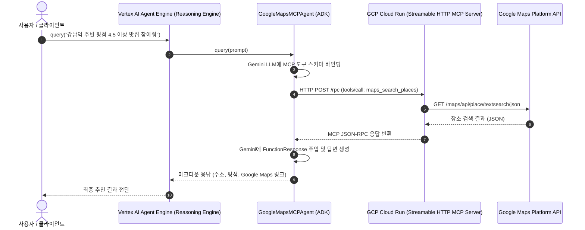

# Google Maps Streamable HTTP MCP Agent & Cloud Run / Vertex AI Agent Engine

Google Maps Platform의 장소 검색, 지오코딩, 상세 정보, 거리 계산 기능을 **Model Context Protocol (MCP)** 의 **Streamable HTTP (SSE & JSON-RPC)** 표준으로 구현하고, **GCP Cloud Run** 및 **Vertex AI Agent Engine (Reasoning Engine)** 에 배포할 수 있는 엔터프라이즈급 AI 에이전트 패키지입니다.

`GOOGLE_MAPS_API_KEY`는 `.env` 파일을 통해 안전하게 관리되며, Cloud Run 환경 변수 및 Secret Manager와 연동됩니다.

---

## 1. 아키텍처 및 작업 흐름 (Architecture)



---

## 2. 지원하는 MCP 도구 목록 (Available MCP Tools)

| 도구명                 | 설명                                                | 주요 입력 매개변수                                     |
| :--------------------- | :-------------------------------------------------- | :----------------------------------------------------- |
| `maps_search_places`   | 키워드/지역 기반 장소, 맛집, 랜드마크 텍스트 검색   | `query` (필수), `location` (선택), `radius` (선택)     |
| `maps_geocode`         | 자연어 주소 및 지명을 위경도 좌표로 변환            | `address` (필수)                                       |
| `maps_place_details`   | 특정 장소의 전화번호, 영업시간, 웹사이트, 리뷰 조회 | `place_id` (필수)                                      |
| `maps_distance_matrix` | 출발지와 목적지 간 거리 및 이동 소요 시간 계산      | `origins` (필수), `destinations` (필수), `mode` (선택) |

---

## 3. 디렉터리 구성 (Directory Structure)

```text
lab/agy_command/google_maps_mcp_agent/
├── __init__.py                  # 패키지 진입점
├── agent.py                     # ADK / Vertex AI Reasoning Engine 에이전트 클래스
├── http_mcp_server.py           # Streamable HTTP (FastAPI + SSE + JSON-RPC) MCP 서버
├── http_mcp_client.py           # Remote HTTP / SSE MCP 클라이언트
├── mcp_server.py                # Standalone Stdio MCP 서버 & Core Maps 서비스 로직
├── mcp_client.py                # Local Stdio MCP 클라이언트
├── main.py                      # CLI 실행기 (로컬 테스트 및 대화 모드)
├── deploy_cloud_run.sh          # Cloud Run 배포 스크립트
├── deploy_agent_engine.py       # Vertex AI Agent Engine 배포 스크립트
├── test_remote_agent_engine.py  # 배포된 Agent Engine 원격 추론 테스트 스크립트
├── Dockerfile                   # Cloud Run 컨테이너 빌드 파일
├── mcp_config.json              # Antigravity .agents/mcp_config.json 설정 템플릿
├── requirements.txt             # 패키지 의존성
├── .env.example                 # 환경 변수 템플릿
├── README.md                    # 사용 및 배포 가이드
└── tests/
    └── test_mcp_agent.py        # 서버/클라이언트/HTTP 엔드포인트 단위 테스트
```

---

## 4. 환경 변수 설정 (Secret Management)

1. **템플릿 복사하여 `.env` 파일 생성**:

   ```bash
   cp lab/agy_command/google_maps_mcp_agent/.env.example lab/agy_command/google_maps_mcp_agent/.env
   ```

2. **`.env` 파일에 Google Maps API Key 및 GCP 프로젝트 설정**:
   ```env
   # Google Maps Platform API Key
   GOOGLE_MAPS_API_KEY=AIzaSyYourActualGoogleMapsApiKeyHere

   # Google Cloud Settings
   GCP_PROJECT_ID=ai-hangsik
   GCP_LOCATION=us-central1
   GCS_STAGING_BUCKET=gs://ai-hangsik-staging
   MODEL_NAME=gemini-1.5-pro-002

   # Cloud Run 배포 후 할당된 MCP Server URL
   MCP_SERVER_URL=https://google-maps-mcp-server-xxxx-uc.a.run.app
   ```

---

## 5. 단계별 배포 및 실행 가이드

### Step 1: 단위 테스트 및 로컬 검증

```bash
# 1) 단위 테스트 전체 실행 (Stdio, HTTP RPC, Health check)
python -m unittest lab/agy_command/google_maps_mcp_agent/tests/test_mcp_agent.py

# 2) 로컬 MCP 서버 독립 진단
python lab/agy_command/google_maps_mcp_agent/main.py --test-mcp
```

### Step 2: GCP Cloud Run에 Streamable HTTP MCP Server 배포

```bash
# Cloud Run 배포 스크립트 실행
./lab/agy_command/google_maps_mcp_agent/deploy_cloud_run.sh
```

배포 완료 시 출력되는 Cloud Run URL (예: `https://google-maps-mcp-server-xxxx-uc.a.run.app`)을 확인하고 `.env`의 `MCP_SERVER_URL`에 저장합니다.

### Step 3: GCP Vertex AI Agent Engine (Reasoning Engine)에 에이전트 배포

```bash
python lab/agy_command/google_maps_mcp_agent/deploy_agent_engine.py
```

배포 성공 시 다음과 같은 리소스 이름이 발급됩니다:

```text
Resource Name: projects/123456789/locations/us-central1/reasoningEngines/987654321
```

### Step 4: 원격 배포된 Agent Engine 테스트

```bash
python lab/agy_command/google_maps_mcp_agent/test_remote_agent_engine.py \
  --resource="projects/<PROJECT_ID>/locations/us-central1/reasoningEngines/<ENGINE_ID>" \
  "서울역에서 여의도까지 대중교통 이동 방법 및 소요 시간 알려줘"
```

---

## 6. Antigravity IDE / CLI에서 원격 Cloud Run MCP 연동

`.agents/mcp_config.json`에 Cloud Run URL을 직접 지정하여 팀 전체가 공유할 수 있습니다:

```json
{
  "mcpServers": {
    "google-maps-cloud": {
      "serverUrl": "https://google-maps-mcp-server-xxxx-uc.a.run.app/sse",
      "authProviderType": "google_credentials"
    }
  }
}
```
