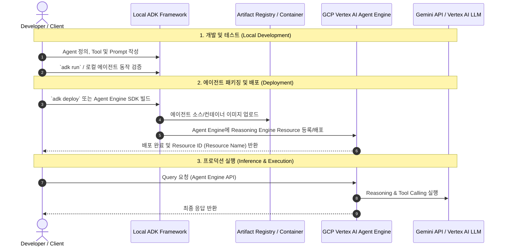

# ADK 기반 에이전트 개발 및 GCP Vertex AI Agent Engine 배포 계획서

## 1. 개요 (Overview)
Google Cloud의 **Agent Development Kit (ADK)**를 사용하여 지능형 AI 에이전트를 구축하고, **GCP Vertex AI Agent Engine (Agent Space/Reasoning Engine)**에 안전하게 배포하여 서버리스 환경에서 서빙하는 프로세스를 계획합니다.

- **GCP Project ID**: `ai-hangsik`

---

## 2. 전체 아키텍처 및 작업 흐름

---

## 3. 주요 구현 단계 (Implementation Steps)

### Step 1: GCP 환경 및 ADK CLI 설정
1. **GCP 프로젝트 및 API 활성화**:
   - `aiplatform.googleapis.com` (Vertex AI API)
   - `artifactregistry.googleapis.com`
   - `cloudbuild.googleapis.com`
2. **gcloud CLI 인증 및 프로젝트 설정**:
   - `gcloud auth login` & `gcloud auth application-default login`
   - `gcloud config set project ai-hangsik`
3. **ADK 및 필요한 Python 패키지 설치**:
   - `google-adk` / `google-cloud-aiplatform` 패키지 구성

### Step 2: ADK 에이전트 개발 및 구조화
1. **에이전트 진입점 작성 (`agent.py`)**:
   - System Instruction 및 Gemini 모델 지정
   - Custom Tools (함수/API 연동) 정의 및 Agent에 등록
2. **로컬 실행 및 테스트**:
   - CLI 또는 로컬 서버 환경에서 에이전트 Tool Calling 및 응답 테스트

### Step 3: GCP Vertex AI Agent Engine 배포 구성
1. **Reasoning Engine / Agent Engine 래핑**:
   - Vertex AI SDK (`vertexai.preview.reasoning_engines`) 사용 설정
2. **에이전트 원격 배포 실행**:
   - Staging Cloud Storage (GCS) 버킷 지정 (`gs://ai-hangsik-agent-staging` 등)
   - `ReasoningEngine.create()` 또는 `adk deploy` 명령으로 Agent Engine에 배포
3. **배포된 Agent Resource 확인**:
   - 생성된 Resource Name (`projects/ai-hangsik/locations/.../reasoningEngines/...`) 보관

### Step 4: 배포된 Agent Engine 테스트 및 모니터링
1. **API 인퍼런스 테스트**:
   - Python SDK 또는 REST API를 사용하여 배포된 에이전트에 질의(`query()`) 전송
2. **로그 및 성능 모니터링**:
   - GCP Cloud Logging 및 Vertex AI 콘솔에서 실행 트레이스 확인

---

## 4. 필요 사전 준비 사항 (Prerequisites Checklist)
- [x] GCP Project ID: `ai-hangsik`
- [ ] GCP Region (예: `us-central1`, `asia-northeast1` 등)
- [ ] Staging용 Google Cloud Storage (GCS) 버킷 (예: `ai-hangsik-staging`)
- [ ] gcloud CLI 인증 권한 (Vertex AI Admin, Storage Admin 등)

---

## 5. 피드백 및 다음 단계
이 계획서에 동의하시면 지정된 `ai-hangsik` 프로젝트 설정을 기반으로 **Region** 및 **GCS Bucket**을 확인한 뒤, ADK 에이전트 프로젝트 스캐폴딩 및 배포 코드를 구현하겠습니다.
