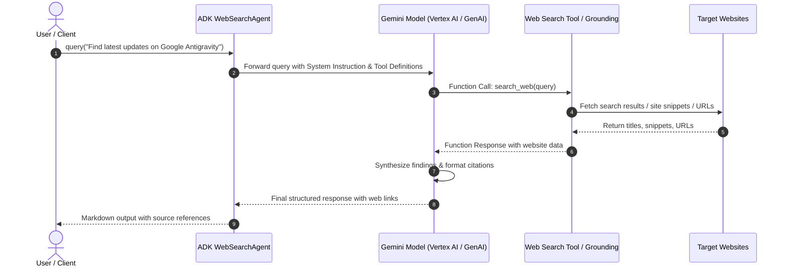

# Implementation Plan - ADK Web Search Agent

This document outlines the technical design and step-by-step plan to implement an **ADK (Agent Development Kit)** agent in Python that searches the web when given a user input/query and returns synthesized answers with website links and references.

---

## 1. Goal Description

Develop a production-ready AI Agent using Google's **Agent Development Kit (ADK)** / **Vertex AI Reasoning Engine** framework capable of:

1. Receiving any search topic, question, or keyword from the user.
2. Dynamically planning and invoking a web search tool (Google Search Grounding or custom Web Search function).
3. Analyzing and synthesizing search snippets, web page titles, and URLs.
4. Returning a structured, cited markdown response with direct website links.

---

## 2. Architecture & Workflow



---

## 3. Location & File Structure

Target directory: `/Users/hangsik/Documents/my_project/antigravity_lab/lab/agy_command/adk_search_agent/`

```text
lab/agy_command/adk_search_agent/
├── __init__.py
├── agent.py               # Core ADK WebSearchAgent class (set_up, query)
├── tools.py               # Web search tool definitions & helpers
├── main.py                # Local CLI test script to run search queries
├── requirements.txt       # Dependencies
└── README.md              # Usage instructions and documentation
```

---

## 4. Proposed File Details

#### `lab/agy_command/adk_search_agent/requirements.txt`

- `google-cloud-aiplatform>=1.60.0`
- `pydantic>=2.0.0`
- `python-dotenv>=1.0.0`

---

#### `lab/agy_command/adk_search_agent/tools.py`

Defines search tool schemas and functions:

```python
from typing import List, Dict, Any
from pydantic import BaseModel, Field

class SearchResultItem(BaseModel):
    title: str = Field(description="Title of the web page")
    url: str = Field(description="Direct URL to the website")
    snippet: str = Field(description="Key summary or excerpt from the page")
```

---

#### `lab/agy_command/adk_search_agent/agent.py`

ADK-compliant Agent class compatible with Vertex AI Reasoning Engine:

```python
import vertexai
from vertexai.generative_models import GenerativeModel, Tool, ground_with_google_search

class WebSearchAgent:
    """ADK Agent that searches websites and synthesizes results."""

    def __init__(self, model_name: str = "gemini-1.5-pro-002", project_id: str = "ai-hangsik", location: str = "us-central1"):
        self.model_name = model_name
        self.project_id = project_id
        self.location = location

    def set_up(self):
        """Initializes Vertex AI Gemini model with Google Search Grounding tool."""
        vertexai.init(project=self.project_id, location=self.location)
        self.search_tool = Tool.from_google_search_retrieval(ground_with_google_search)

        self.model = GenerativeModel(
            model_name=self.model_name,
            tools=[self.search_tool],
            system_instruction=[
                "You are an expert Web Search & Research Agent.",
                "When given a query or request, use search tools to find relevant websites and live information.",
                "Always provide clickable markdown links and clear citations in your response.",
                "Structure your answers with an Executive Summary, Key Findings, and Sources."
            ]
        )

    def query(self, prompt: str) -> str:
        """Executes search and returns the synthesized response."""
        response = self.model.generate_content(prompt)
        return response.text
```

---

#### `lab/agy_command/adk_search_agent/main.py`

CLI runner for querying the ADK Web Search Agent:

```python
import os
import sys
from dotenv import load_dotenv
from agent import WebSearchAgent

def main():
    load_dotenv()
    agent = WebSearchAgent(
        model_name="gemini-1.5-pro-002",
        project_id=os.getenv("GCP_PROJECT_ID", "ai-hangsik"),
        location=os.getenv("GCP_LOCATION", "us-central1")
    )
    agent.set_up()

    query = sys.argv[1] if len(sys.argv) > 1 else "Google Antigravity latest features"
    print(f"[*] Querying: {query}\n")
    result = agent.query(query)
    print(result)

if __name__ == "__main__":
    main()
```

---

## 5. Verification Plan

### Automated & Unit Tests

1. **Dependency Check**: Ensure dependencies in `requirements.txt` are installed.
2. **Execution Test**: Execute `python lab/agy_command/adk_search_agent/main.py "Python 3.12 new features"` and verify:
   - Live website grounding is triggered.
   - Output contains formatted text, citations, and source URLs.

### Manual Verification

- Test interactive input prompts and verify error handling when network or credentials are not configured.
