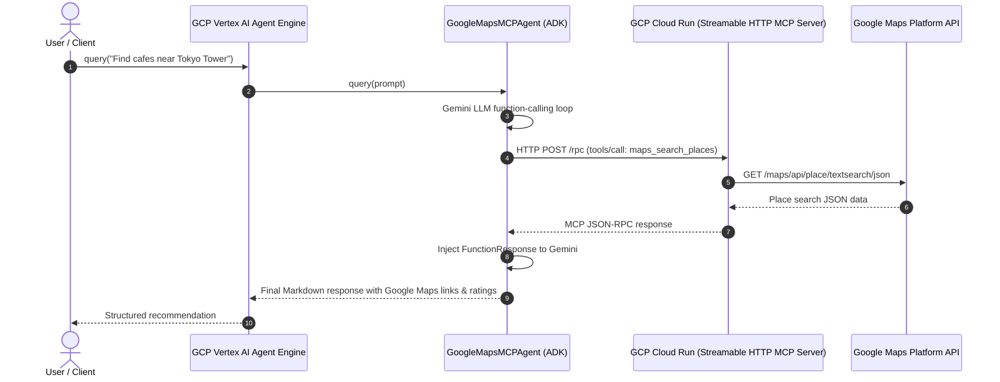

# Implementation Plan - Google Maps Streamable HTTP MCP Agent & Cloud Run / Agent Engine Deployment

This document details the architecture, design, and deployment steps for the **Google Maps Streamable HTTP MCP Agent** on **GCP Cloud Run** and **Vertex AI Agent Engine (Reasoning Engine)**.

---

## 1. Goal Description & Scope

1. **Streamable HTTP MCP Server**:
   - Implement MCP server using FastAPI, Server-Sent Events (SSE `/sse`), and JSON-RPC 2.0 endpoints (`/rpc`, `/messages`, `/health`).
   - Support 4 core Google Maps Platform tools: `maps_search_places`, `maps_geocode`, `maps_place_details`, `maps_distance_matrix`.
   - Manage `GOOGLE_MAPS_API_KEY` via `.env` and environment variables.
2. **GCP Cloud Run Deployment**:
   - Containerize server using production Dockerfile (`Dockerfile`).
   - Automated deployment script (`deploy_cloud_run.sh`) using Cloud Build and Cloud Run.
3. **ADK Agent & GCP Vertex AI Agent Engine Deployment**:
   - Develop ADK-compatible agent class (`GoogleMapsMCPAgent`) that connects to the deployed Cloud Run MCP server URL over HTTP.
   - Deploy onto Vertex AI Agent Engine using `vertexai.preview.reasoning_engines.ReasoningEngine.create()`.
   - Provide remote testing client (`test_remote_agent_engine.py`).

---

## 2. Architecture Diagram



---

## 3. Directory Layout

```text
src/agy_command/google_maps_mcp_agent/
├── __init__.py                  # Package exports
├── agent.py                     # Vertex AI Reasoning Engine Agent class
├── http_mcp_server.py           # Streamable HTTP MCP Server (FastAPI + SSE + JSON-RPC)
├── http_mcp_client.py           # Remote HTTP / SSE MCP client
├── mcp_server.py                # Core Google Maps API service & Stdio server
├── mcp_client.py                # Local Stdio MCP client
├── main.py                      # Local runner & diagnostics
├── deploy_cloud_run.sh          # Cloud Run deployment script
├── deploy_agent_engine.py       # Vertex AI Agent Engine deployment script
├── test_remote_agent_engine.py  # Remote inference test script
├── Dockerfile                   # Cloud Run container image specification
├── mcp_config.json              # Antigravity .agents/mcp_config.json config
├── requirements.txt             # Dependencies
├── .env.example                 # Safe environment variables template
├── README.md                    # Detailed guide
└── tests/
    └── test_mcp_agent.py        # Automated test suite (8 tests)
```

---

## 4. Deployment Workflow

1. **Run Tests Locally**:
   ```bash
   python3 -m unittest src/agy_command/google_maps_mcp_agent/tests/test_mcp_agent.py
   ```
2. **Deploy MCP Server to Cloud Run**:
   ```bash
   ./src/agy_command/google_maps_mcp_agent/deploy_cloud_run.sh
   ```
3. **Deploy ADK Agent to Vertex AI Agent Engine**:
   ```bash
   python3 src/agy_command/google_maps_mcp_agent/deploy_agent_engine.py
   ```
4. **Test Remote Inference**:
   ```bash
   python3 src/agy_command/google_maps_mcp_agent/test_remote_agent_engine.py --resource="<RESOURCE_NAME>"
   ```
